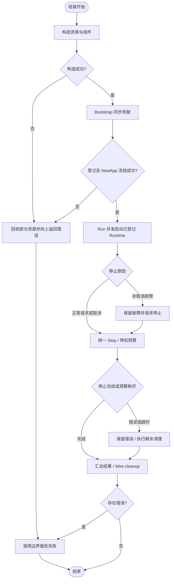
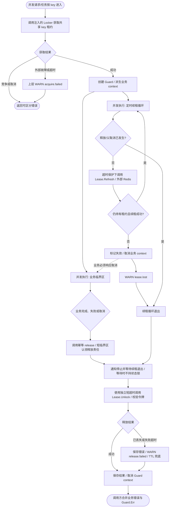
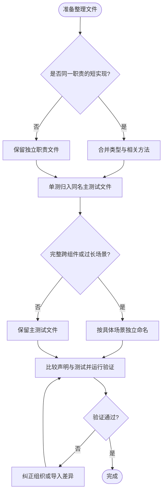

# 包开发模式指南

本指南配合[包分类索引](README.md)使用。现状说明以当前源码为准；带“建议”“示意”的结构和 API 是未来开发模板，不代表已经实现。现有代码不必为了符合模板而批量重构；根目录 [AGENTS.md](../AGENTS.md) 仍是工程约束。

除 `bootstrap` 组装包外，每个领域包应能独立说明自身构成、构造依赖和停止/cleanup 所有权；整个应用的组件选择和组装阶段集中在组装层。

默认先在领域包内按文件组织，公开构造函数接收依赖并返回资源及 cleanup。不要为了隐藏实现建立纯转发层；非导出标识符即可承担同包封装。文件通常 150–300 行，超过 400 行检查职责是否可分离；完整操作可以例外，不按固定行数切片。

## 先选择模式

先确定能力的所属领域，再选择生命周期模式。同一个领域可以包含多种模式，但不需要把下面每一种文件都建出来。

| 模式 | 适用问题 | 推荐入口形态（示意） | 参考 |
| --- | --- | --- | --- |
| M1 工具/值对象 | 输入转输出，或保存少量局部配置 | `Do(input) (output, error)` / `New(config)` | compress、gormscope、totp |
| M2 公共契约 | 多个实现需要共享语义 | 小接口、值类型、稳定错误 | lock |
| M3 资源服务 | 创建、管理或借出连接/输出/provider | `New(deps) (value, func(), error)`；无资源则省略 cleanup | config、redis、client、kafka |
| M4 操作级组件 | 给一次请求/任务附加行为，或包裹另一能力 | `New(dep, config)`，必要时 `Acquire(ctx) (handle, release, error)` | queue Dispatcher、job guard |
| M5 应用 Runtime | 需要由应用统一启动和停止执行循环 | `New(deps)` + `Start(ctx)` / `Stop(ctx)` | queue Worker、job manager |
| M6 Bootstrap | 把已有对象贡献给应用装配 | `NewXXXBootstrap(spec, component) (XXXBootstrap, error)` | bootstrap |
| M7 应用核心 | 多种 Runtime 共同需要的生命周期规则 | Spec、冻结、监督、停机协调 | app |
| M8 第三方适配 | 用具体技术实现公共契约 | `contrib/<domain>/<driver>.New(deps)` | contrib/lock/redis |
| M9 具体业务 | 处理订单、支付等业务不变量 | 业务项目中的 UseCase/Service/Task/Handler | 当前 pkg 无此类包 |

“基础包”是复用范围：配置、日志等多采用 M3，环境与错误多采用 M1；“核心包”描述编排责任，不应成为新能力默认归属。

## M1：工具与值对象

**使用条件**：没有常驻资源，不负责应用装配。工具可以依赖第三方类型，也可以读取时间/环境；不要把“工具”等同于“纯函数”。

- **目录**：`pkg/<能力>/<能力>.go`、`<能力>_test.go`、`README.md`。实现较少时不建 internal。
- **API**：优先普通函数和具体类型。依赖时间的能力可提供显式时间参数的方法，参考 `totp.CodeAt`；错误模型用清晰值类型，不为每个函数增加接口。
- **依赖/配置**：不读取全局业务配置，不通过服务定位器找依赖；参数直接传入。`env` 是读取进程环境的明确专用入口。
- **生命周期**：通常不需要 cleanup、Spec、Bootstrap、Manager 或 Runtime。
- **错误/观测**：将非法输入、转换失败返回调用方，不在普通工具中重复打印日志。
- **验收**：表驱动覆盖正常、空值、边界、非法输入；时间相关测试用显式时间；仅有性能目标时补基准测试。

**示例选择**：加一个编码转换函数，按 `compress` 的单包结构开发，不复制 `server` 的目录。

## M2：公共契约

**使用条件**：调用方确实需要替换实现，或跨领域共享协议语义。只有一个实现时也可能需要隔离外部系统，但不能只为 Mock 预设庞大接口。

- **目录**：`pkg/<能力>/contract.go` 或 `<能力>.go`，必要时拆 `errors.go`。仅接口和错误无需再包一层 facade/internal。
- **API**：小接口 + 必要值类型 + 调用方需要区分的稳定错误。明确取消、重试、所有权、并发安全、超时和释放语义。
- **依赖**：优先标准库和已有公共值类型；不依赖具体 contrib、第三方客户端或 `app` 装配。
- **接口归属**：默认由使用方定义；`pkg/lock` 这种已被多个消费者和驱动共享的能力可以集中定义。领域私有接口留在领域内。
- **生命周期**：契约可以描述 Lease/Release，但接口包本身不启动循环、不创建连接、不注册驱动。
- **验收**：验证稳定错误等实际行为；驱动各自证明其契约行为。不要为只有类型声明的文件制造无意义测试逻辑。

**现有示例**：[`lock/lock.go`](lock/lock.go) 中 `Locker.Lock/TryLock` 返回 `Lease`；`Lease` 提供 `TTL/Refresh/Unlock`。接口没有承诺自动续租，也没有暴露 fencing token。

## M3：资源 Provider、Manager 与 Factory

**使用条件**：需要创建连接、输出、SDK provider、配置监听，或为调用方创建/租用这些资源。名称根据所有权选择。

| 形态 | 责任 | 当前示例 |
| --- | --- | --- |
| Provider | 提供一种能力及其资源生命周期 | metrics/tracing Provider |
| Manager | 持有并复用一组资源，统一释放 | redis/database/oss Manager |
| Factory | 创建资源；必须另外说明产物所有权 | kafka.ClientFactory 产物归调用方；client.Factory 持有共享资源并发放调用租约 |

- **目录**：在领域包内使用 `provider.go` / `manager.go` / `factory.go` 放资源入口，`config.go` 放配置处理，按具体操作或生命周期继续拆文件。只有职责独立且依赖单向的子能力才使用 internal。
- **API**：通常构造返回 `(value, func(), error)`。只保存配置、不持有可释放资源的 Factory 不强加空 cleanup。借来的 client 不由组件关闭。
- **配置**：构造时校验；区分固定配置与可热更新配置，并说明非法更新、订阅终止和旧资源退役行为。不要默认所有配置都支持热更新。
- **生命周期**：构造失败回收已创建资源；成功后的 cleanup 幂等。新设计优先通过 Wire-style cleanup 交接释放责任；资源订阅可随构造开始，不必伪装成应用 Runtime。
- **错误/观测**：构造/获取失败返回错误；`func()` 无返回通道，cleanup 的关闭错误必须通过明确的日志或已有错误处理机制报告。
- **验收**：部分构造失败、重复 cleanup、关闭后访问、借用资源不被误关；有共享缓存/租约时验证并发获取、释放和热更新，执行竞态检测。

**Registry 例外**：只有“多份具名资源、可使用不同实现、按 driver 配置选择、Manager 拥有生命周期”四项同时成立，才考虑注册表。当前 database/oss 使用此模式；`init` 只登记无状态 factory，不能执行 I/O 或启动 goroutine。其他能力优先显式注入。

## M4：操作级组件与行为装饰

**使用条件**：为一次操作添加重试、观测、协调、续租等行为；或者装饰一个已有能力。可以有局部状态或 goroutine，但生命周期归请求、任务或所属对象。

- **目录**：留在所属领域，如 `pkg/queue/dispatcher.go`、`pkg/job/coordinator.go`；需要公共复用且具有清晰子能力时可新增公共子包，如建议的 `pkg/lock/watchdog`。
- **API**：构造显式接收被装饰能力和配置；普通调用 `Do(ctx, ...)`。需要持有句柄时，获取方法返回句柄与 release，明确一对一所有权。
- **依赖**：依赖行为接口，不依赖业务的 Wire、全局 Manager 或具体驱动；具体后端在组装层选择。
- **生命周期**：构造通常不启动任务；实际 Acquire/调用成功后才启动局部循环。操作结束停止循环并释放资源；不要给每个句柄注册一个应用 Runtime。
- **错误/观测**：定义失败是返回、取消所属操作还是重试。正常竞争与系统故障分开；避免底层和调用方重复记录相同错误。
- **验收**：底层失败透传、上下文取消、重复释放、释放与循环交错、无 goroutine 泄漏、借用依赖不被关闭。

**现有示例**：Job 的 ExecutionGuard 在取得租约后启动 watch；`Release` 停止并等待 watch，再释放租约。这属于 M4，虽然持有它的 Job Manager 属于 M5。

## M5：应用 Runtime

**使用条件**：组件有独立的长期执行任务，需要应用统一启动、监督失败和停止。仅有连接或 SDK 内部 goroutine 不足以采用此模式。

- **目录**：`pkg/<domain>/runtime.go`；声明复杂时增加 `client_spec.go`；执行循环、投递、取消或停止逻辑较多时按职责拆成同包文件。Spec/Builder 仅在需要声明多条任务、路由或组合规则时增加。
- **API**：满足现有 `app.Runtime` 的 `Start(context.Context) error`、`Stop(context.Context) error`，由 Bootstrap 或业务组装层显式登记。
- **构造/启动**：构造校验依赖但不开始消费/调度；启动执行工作。长循环在 `Start` 内运行并返回终止错误；若底层 `Start` 返回后仍后台工作，必须另外设计故障上报，不能假设应用自动看见后台异常。
- **停止**：响应取消和 Stop，明确是否等待在途任务，遵守停机预算，定义重复调用和未启动即停止的行为。运行中出现非取消错误，现有监督层会请求应用停止；不自动重启 Runtime。
- **所有权**：Stop 停止工作，构造 cleanup 释放资源/订阅；防止重复关闭。具体 SDK 的 stop 可能同时关闭资源，应注明唯一所有者。
- **并发**：各 Runtime 并发启动，不保证注册顺序就是就绪顺序。存在前置依赖时，在设计中明确就绪协调，不能仅靠排列 Bootstrap。
- **验收**：构造不执行任务、启动错误、循环中错误、取消、Stop 超时、重复 Stop、Start/Stop 交错、停机后不再接收新工作；覆盖应用监督集成路径。

**两个命名陷阱**：`job.Manager` 本身是 Runtime；`server.Runtime` 本身是容器，实际登记的是其 HTTP/gRPC server。应检查方法和注册代码，不能用类型名替代判断。

## M6：Bootstrap 装配贡献

**使用条件**：一个已有对象需要登记到 App Spec，或同步贡献身份、日志字段、上下文等装配信息。Bootstrap 统一属于 `pkg/bootstrap` 组装层；领域包只声明真实依赖并提供普通 Go 构造函数。

- **目录/API**：`pkg/bootstrap/<domain>.go`，暴露 `XXXBootstrap` 标记类型及 `NewXXXBootstrap(...)`。一般返回 `(XXXBootstrap, error)`；存在可恢复的构造期副作用时返回 cleanup。
- **依赖**：接收 `*app.Spec` 或明确的贡献目标及已构造组件；具体签名按需要，例如 TracingBootstrap 通过 log 全局方法登记追踪字段。
- **行为**：只同步登记，不启动业务循环、不偷偷创建连接。Runtime 和 Context 贡献按登记顺序追加，不使用名称去重，冻结后登记应失败；禁用能力的行为需明确定义。
- **Wire**：ProviderSet 与 injector 由业务组装层维护，领域包不导入 Wire。组装层按 `bootstrap.InfrastructureBootstrap → bootstrap.Bootstrap（用户 provider）→ bootstrap.StartupReady → bootstrap.NewKratosApp` 分阶段；用户 provider 显式接收基础设施阶段标记。`app.NewApp` 只消费依赖，不参与阶段组织；只把 Provider 放进 set，并不能保证 Wire 执行它。
- **验收**：贡献确实存在、无启动副作用、重复登记、冻结后登记、禁用分支和注册错误；有 cleanup 时验证副作用恢复。

**现有示例**：MetricsBootstrap 只注入上下文；ServerBootstrap 登记运行时；LogBootstrap 还返回全局 Logger 恢复函数。queue 没有统一 Bootstrap，按 Worker 实例由业务显式登记。

## M7：应用核心编排

**使用条件**：需求是所有运行时共同需要的装配/生命周期机制，例如冻结、统一停止、故障传播、注册中心协调。增加 watchdog 或数据库驱动通常不需要修改核心。

- **目录**：`pkg/app` 同时承载契约和实现；`client_spec.go` 登记与冻结，`app.go` 构造应用，`lifecycle.go` 管理钩子和停机状态，`runtime.go` 监督运行时，`registrar.go` 协调注册与注销。
- **API/依赖**：只引入必要的通用契约；不向 App 添加 Kafka/Redis/watchdog 等专用字段，不反向依赖具体组件包。
- **状态/所有权**：明确 Spec 构造期与冻结期、启动与停止状态、失败收敛和 Hook 行为；应用监督 Runtime，Wire 释放构造资源。
- **错误/观测**：遵循现有首个真实故障保留和停机错误汇总机制，避免取消噪声覆盖根因。
- **验收**：同时验证多个 Runtime、启动前失败、启动中失败、父 context 取消、停机预算、Hook 错误和 Registrar 补偿；只围绕改变的核心契约扩大测试。

共同生命周期模型如下；图中的“上层报告”表示责任边界，不表示新增了某个具体日志事件。



## M8：第三方适配

**使用条件**：将 Redis、Kafka、Consul、数据库或云厂商 SDK 转换为已有公共能力。

- **目录**：`contrib/<domain>/<driver>`，例如 `contrib/lock/redis`。配置、错误转换和 SDK 操作放在适配层，复杂度不足时不再拆 internal。
- **API**：显式接收客户端/Manager 和驱动专用配置。返回公共契约的实现；内部实现类型无需为了模板而导出。
- **依赖**：可以依赖对应 `pkg` 契约、基础客户端和第三方 SDK；公共领域逻辑不能反向依赖该 adapter。
- **所有权**：借用 Manager 的 client 不关闭；adapter 自行创建的 client 通过构造 cleanup 交还释放责任。
- **Registry**：仅 database/oss 等满足四项条件的场景使用现有注册机制；queue/lock/job 继续显式组装。
- **验收**：外部错误映射、超时/取消、契约一致性、共享客户端不被误关；用可控替身或隔离的集成环境验证 SDK 语义。

**现有示例**：`contrib/lock/redis.New` 借用 Redis Manager 的连接，实现 `lock.Locker`。`contrib/job/redis` 是便利组装层，把 Redis Locker 接到通用 Job Coordinator。

## M9：具体业务

**使用条件**：需求包含特定产品的数据规则、状态转移或业务流程，例如扣减库存、订单超时取消。当前 Foundation 的 queue/job/server 提供执行机制，具体 Handler/Task 在业务项目实现。

- **目录**：采用业务项目已有的领域/用例/数据访问布局；不在 Foundation 的 `pkg` 新建 order/payment 以承载某个项目的业务。
- **API/依赖**：用例暴露业务行为，依赖所需的小型 Repository、Locker、Producer 等接口；在业务 Wire 层注入实现。
- **生命周期**：业务服务通常不是 Runtime；请求由 server 驱动，持久化任务 Handler 由 queue Worker 驱动，Kafka 消息 Handler 由 kafka ConsumerRuntime 驱动，Task 由 job 驱动。只有独立执行循环才采用 M5。
- **事务/错误**：用例决定事务、幂等和失败补偿边界；日志在能够决定重试、回退或响应的边界记录。
- **验收**：业务不变量、重复请求、部分失败、取消和事务回滚；不通过复制一份调度器/消息循环来编排业务。

## watchdog 开发示例

这里的 watchdog 指“取得分布式租约后，定期续租，失去租约时通知持有者停止工作”。进程健康检查/重启型看门狗属于另一种需求，应重新判断是否采用 M5。

### 现有能力与开发选择

| 当前代码 | 已有责任 | 新需求如何利用 |
| --- | --- | --- |
| [`lock/lock.go`](lock/lock.go) | Locker、Lease、Refresh、Unlock、稳定错误 | 保持底层契约可单独使用 |
| [`contrib/lock/redis`](../contrib/lock/redis/locker.go) | 带租约所有者校验的 Redis 实现 | 显式注入，不复制 Redis 加锁/解锁逻辑 |
| [`job/coordinator.go`](job/coordinator.go) | Acquire/TryAcquire、自动续租、失败取消、幂等 Release | 仅 Job 场景直接使用公开 `job.NewLockCoordinator` |
| [`contrib/job/redis`](../contrib/job/redis/README.md) | Redis Locker 与 Job Coordinator 的便利组装 | Job + Redis 场景已有现成入口 |

当前 Job 协调器默认 LeaseTTL 为 30 秒，RefreshInterval 为 TTL 的三分之一；首次有效刷新失败即携带 `ErrCoordinationLost` 取消任务上下文。Release 会先停止并等待 watch，再使用独立超时上下文解锁。这是现有行为说明，不代表通用 watchdog 已存在。

**建议选择**：

1. 仅用于 Job：直接复用现有协调器，不新增包。
2. Job、请求、消费者都要用：新增公共子包 `pkg/lock/watchdog`，采用 **M4 操作级组件 + M2 lock 契约 + M8 Redis adapter**。
3. 确实要集中管理全进程租约：才评估 M5。必须额外定义注册/注销、关闭时禁止新租约、排空、就绪依赖，以及租约失败是只取消所属任务还是停止应用。

推荐的第二种模式不需要 `app.Spec`、`Bootstrap` 或 Driver Registry。公共子包以锁续租命名归属明确；不要把它塞进 `pkg/app` 或意义宽泛的根 `pkg/runtime`。

### 建议的最小目录与 API

以下路径尚未创建：

```text
pkg/lock/watchdog/
    watchdog.go       构造、获取租约、Guard、续租和释放
    watchdog_test.go  对公共行为的确定性测试
    README.md         用法、所有权、失败语义及流程图
```

单包足够时不增加 internal。以后 Job 复用时，由 `pkg/job` 将通用 Guard 转换成 `job.ExecutionGuard` 并映射错误，watchdog 不导入 job。

建议的 API 草图，不是可直接调用的现有代码：

```go
// 构造不获取锁、不启动 goroutine；logger 用于清理错误等处理边界。
New(locker lock.Locker, config Config, logger log.Logger) (*Locker, error)

// 成功后才启动这一份租约的续租；release 采用 Wire-style func()。
(*Locker).Acquire(ctx context.Context, key string) (*Guard, func(), error)
(*Locker).TryAcquire(ctx context.Context, key string) (*Guard, func(), error)

// 派生的执行上下文在父上下文取消、租约失效或主动释放时结束。
(*Guard).Context() context.Context
// 汇总租约丢失/释放失败；调用方可在 release 后取得最终结果。
(*Guard).Err() error
```

这里返回的 `*Locker` 是 watchdog 的具体类型，提供带 Guard 的 API；不强行实现现有 `lock.Locker`，因为后者没有用于通知租约丢失的执行上下文。先保持原有接口语义稳定。

`Config` 先保留 `LeaseTTL`、`RefreshInterval`、`OperationTimeout`；不要默认加入插件、动态注册、全局 Manager、按锁名持久缓存或热更新。业务 key/环境前缀由既定组装边界确定。

### 生命周期与并发契约

- **保护对象**：同一逻辑 key 对应的业务临界区；分布式租约保护跨进程竞争。每个 Guard 内部还要协调续租、取消和 release 的并发，但不应让所有 key 共用串行临界区。
- **所有者**：业务调用拥有 Guard/release；Guard 拥有一个续租循环；Redis Manager 拥有连接。构造不加锁，获取失败不启动循环。
- **释放顺序**：业务结束后停止并等待续租，再按所有者令牌解锁。release 必须幂等；共享状态同步只包围短小状态操作，不持锁执行 Redis I/O。
- **时间预算**：要求正 TTL，`RefreshInterval + OperationTimeout < LeaseTTL`，并留出调度/网络余量；所有外部操作受超时控制。该不等式不等于分布式互斥保证。
- **失效**：建议沿用当前 Job 的保守行为，第一次续租失败就将 Guard 标记为失效并取消业务上下文；不要静默无限重试或重新抢锁后继续原临界区。
- **取消/解锁**：上下文取消要停止续租，但业务仍必须调用 release。解锁不能直接使用已取消的请求 context，应保留必要值、去除原取消并设置短超时；解锁失败由 TTL 最终回收。
- **错误**：区分锁竞争、获取取消/超时、续租失败/租约丢失、释放失败。`func()` 的关闭错误通过 Guard.Err 和指定日志边界报告，不能吞掉；Job 适配时再转换成 Job 错误。
- **性能**：每个活跃 Guard 一个定时循环和周期性续租请求。只有实际规模/测量表明成本过高，再考虑集中调度；集中调度仍不自动意味着需要应用 Runtime。

以下是**建议流程**。图中事件均为拟新增日志，当前代码不保证存在这些事件；实现时事件字段至少包含函数、操作、耗时或错误，不能记录租约令牌。



看门狗续租不是强一致性的业务写入屏障。进程暂停、网络分区或业务忽略取消时，旧持有者仍可能继续写入。要求拒绝过期持有者写入的场景，需要资源端验证 fencing token；重复业务还应按具体需求设计幂等/事务。当前 `lock.Lease` 没有 fencing token，不能将其描述为已有保证。参见 [Redis 官方分布式锁文档](https://redis.io/docs/latest/develop/clients/patterns/distributed-locks/)。

### 开发顺序与验收

1. 先确定复用范围；若只有 Job，使用现有入口即可。需要通用包时，固定 Guard、release、失效通知及错误语义。
2. 用小型 Locker/Lease 替身验证组件行为，再接现有 Redis adapter；测试时使用可控的内部计时设施，不为测试增加公共选项。
3. 验证：获取失败不启动 watch、正常续租、续租失去所有权、网络失败、父取消、未释放前不会关闭共享 client、重复 release、release 与 Refresh 交错、解锁超时和退出无泄漏。
4. 验证：两个调用者竞争同一 key 不会错误共享 Guard，不同 key 不互相串行阻塞；已失效 Guard 不会因后续成功操作“复活”。
5. 如将现有 Job 改为复用 watchdog，保持 `ErrExecutionInProgress`、`ErrCoordinationLost`、默认配置和 Job 策略语义，再运行 Job 与锁相关回归及竞态测试。
6. 只有选择 M5 才补应用注册、启动失败、停止排空和多 Runtime 并发关闭的测试。本次指南不引入新锁或改动现有并发策略。

## 可复制的包开发说明模板

每个新包的 README 可按以下字段写，不必机械创建同名代码文件。

```markdown
# <包名>

## 定位
- 职责：解决什么问题；是否包含业务规则。
- 模式：M1–M9 中哪些适用，主要模式是什么。
- 选择依据：为什么需要工具、契约、资源、组件或 Runtime。

## 公共 API 与使用示例
- 构造依赖、返回值、错误语义和最小调用示例。
- 哪些类型是契约，哪些是具体实现。

## 目录与依赖
- 公共入口、私有实现、可选 contrib。
- 谁注入实现；是否需要 Wire、Bootstrap、Spec。

## 配置
- 必填、默认值、校验、超时、固定/热更新边界。

## 生命周期与所有权
- 谁创建、谁借用、谁启动、谁停止、谁 cleanup。
- 构造失败、重复释放、取消、停止超时的行为。
- 有 goroutine 时：创建时机、退出条件、等待方式和错误去向。

## 流程图与可观测性
- Mermaid 标注外部调用、共享资源、失败/超时和日志处理边界。
- 有并发时标注获取、释放及同步粒度。
- 无执行流程的纯契约说明“不适用”，不虚构日志事件。

## 验证
- 正常/失败/边界/取消/并发/所有权场景。
- 单元测试、必要集成测试、静态检查与竞态检测命令。
```

实际开发时，先阅读 Makefile 的目标定义。本仓库已有 `make test`、`make vet`、`make race`、`make lint`；`make verify` 聚合 test/vet/race。修改生成源时才运行对应生成入口。纯文档改动核对源码、路径、示例和流程即可，不用为分类文档运行全仓 Go 测试。

## 文件与测试的职责组织

以职责而非函数数量拆文件。构造与其小型辅助方法、类型与紧密关联的方法放在一起；配置、资源池、协议适配等独立职责仍可分开。150–300 行只是阅读提示，不是必须拆分的配额。

单元测试默认与主要被测实现同名；同一行为的新边界/回归直接补入已有测试文件，避免不断增加 `extra`、`paths`、`additional` 文件。跨模块完整场景和性能测试允许独立文件。已有测试过长时按明确场景拆分，不强行一对一。

例如客户端包：

```text
factory.go                         factory_test.go
cleanup.go                         cleanup_test.go
pool.go                            pool_test.go
reconnect.go                       reconnect_test.go
                                   reconnect_http_integration_test.go
                                   reconnect_grpc_integration_test.go
                                   test_helpers_test.go
```

内部与外部测试使用不同 package 时保持分开；共享 helper 留在测试文件，不转移到生产代码。文件整理保持实现逻辑、接口、同步策略和测试语义不变；涉及堆栈文件名等路径断言时，同步更新改名后的路径。


