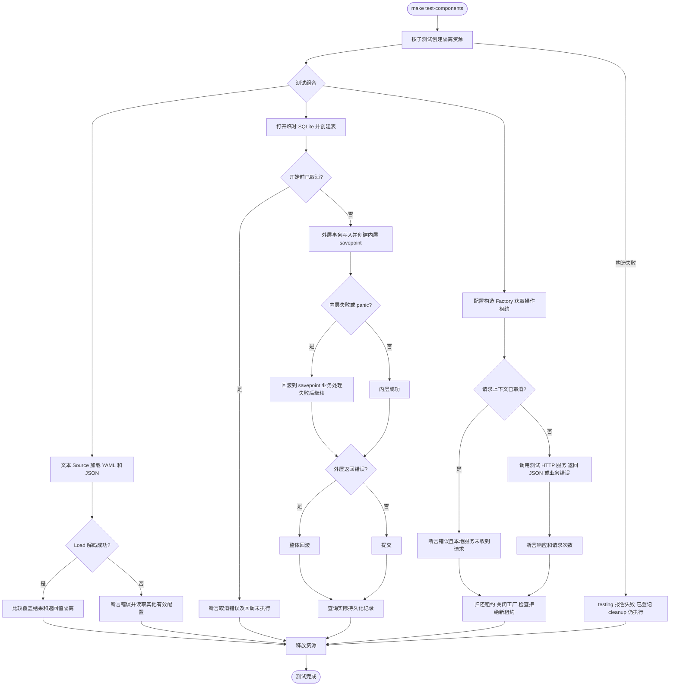
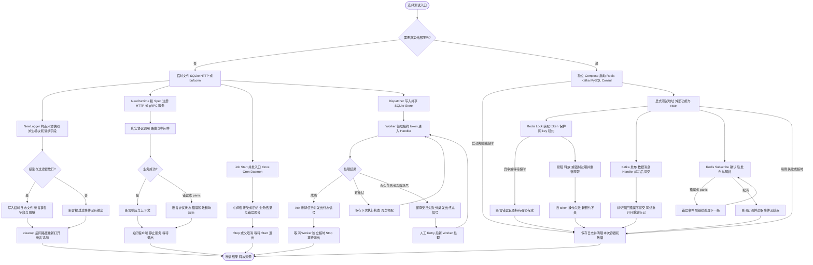

# 核心组件集成用例

从仓库根目录执行 `make test-components`。该入口强制重新执行下表的自包含场景并启用竞态检测，每包超时为 2 分钟。需要当前 `go.mod` 对应的 Go 工具链、SQLite 驱动所需的 CGO/C 编译环境及本机临时端口绑定权限；无需 Docker、账号或已有数据库。SQLite 与日志文件由 `t.TempDir()` 隔离并清理，HTTP 服务由测试创建并关闭，gRPC 使用 bufconn 内存连接。真实 Kafka/Redis/锁场景另运行 `make test-components-external`，运行条件见下文。

这些自包含集成用例按仓库规范合入所属测试文件，以 `TestIntegration` 前缀单独筛选，也会随普通包测试执行。测试名称表示验证场景，不代表每个模块的全部能力已被覆盖。

| 组合与入口 | 场景 | 检查结果 |
| --- | --- | --- |
| [`config` + `contrib/config/text`](config/manager_load_test.go)，`TestIntegrationConfigSources` | YAML 基础配置叠加 JSON；map 递归合并；显式 false/0；slice 替换与清空；省略字段；类型解码失败后继续读取 | 精确比较完整配置；修改返回 map/slice 后重新读取不受污染；调用方默认值不变；其他配置仍可读取，共 6 场景 |
| [`database` + SQLite](database/transaction_test.go)，`TestIntegrationTransactionSavepoints` | 内外提交；内层回滚后继续；外层回滚包含已成功内层；两层回滚；唯一约束失败；捕获内层 panic 后继续；开始前取消 | 比较最终有序主键集合；验证错误链、panic 值及取消时回调不执行，共 7 场景 |
| [`config` + `client` + HTTP](client/factory_test.go)，`TestIntegrationConfiguredHTTPFactory` | 主服务、具名服务、查询转义、中文 JSON POST、422 业务拒绝、404、已取消请求 | 比较实际到达服务、方法、查询及正文；检查错误 code/reason；已取消请求不发送；每个其他请求只发送一次；重复 release 与 cleanup 后拒绝新租约，共 7 场景 |

## 阅读和复用

配置组使用真实文本 Source 和公共 `NewManager`，按“基础配置在前，部署覆盖在后”组装。配置返回值与默认值的所有权通过断言验证，不要求调用方理解内部快照实现。

数据库组为精准验证事务边界，在同包 fixture 中将真实 SQLite GORM 连接注入 Manager，随后通过 `Manager.Transaction` 和 `Connection` 操作；该 fixture 不是业务构造示例。真实公共构造、具名数据库、Wire cleanup 的用法见现有 [`business_test.go`](bootstrap/testdata/wireassembly/business_test.go) 和 [数据库文档](database/README.md)。嵌套场景使用 GORM 默认 savepoint 行为；不适用于关闭嵌套事务的配置，也不能推导出跨库原子事务保证。

客户端组使用真实 JSON 配置、公共 `NewFactory` 和两个独立 HTTP 服务，复用已有测试日志及可观测性 Provider。每次成功 Acquire 后立即登记 release，响应读取结束后归还租约，然后执行工厂 cleanup。测试只使用直接 HTTP 目标；TLS、服务发现和 gRPC 请阅读所属包已有用例。

## 执行与释放路径

以上是测试执行图，断言失败由 `testing` 报告；不新增业务日志。HTTP handler 可能由标准库并发调用，共享请求计数使用原子操作；测试主协程读取计数，不引入业务锁。每次 HTTP 操作有 3 秒上下文预算，整体测试有 2 分钟上限；cleanup 顺序为操作租约、Factory、Provider、配置 Manager、HTTP 服务，SQLite 在连接池关闭后删除临时目录。

## 扩大验证范围

- `make test-business`：现有 Wire 生成与 HTTP/SQLite 业务闭环，以及生成客户端契约；其中检查 health/ready/metrics、提交与回滚、具名连接、非法配置和停止后的资源边界。
- `make test`：全模块测试与手写函数覆盖门禁；`make vet`：全模块静态检查。
- `make test-external`：已有真实外部服务测试入口，会启动隔离 Docker 服务，运行前阅读根 Makefile、脚本和 [`testdata/external/README.md`](../testdata/external/README.md)。本页新增用例不替代 MySQL、Redis、Kafka 的真实服务验证。

## 扩展模块与常见边界

以下场景与基础配置、数据库和客户端用例使用同一命名及断言规范。Job 的原 Cron 集成用例归并到 `manager_test.go`，其余场景扩展现有覆盖。Queue 与 Lock 通过实际适配器验证，测试放在对应 contrib 包，避免领域包导入自己的适配器形成循环依赖。

| 模块与可运行入口 | 常见用法与边界 | 测试环境 |
| --- | --- | --- |
| [job](job/manager_test.go)，`TestIntegrationJob*` | Cron + Spec + 中间件；批量 Once 错误聚合仍执行健康任务；Once/Cron/Daemon 混合，Stop 和父上下文取消；中间件短路拒绝。断言结果、上下文和停止完成 | 真实 Manager/调度器，synctest 控制时间；5 场景 |
| [queue](../contrib/queue/database/gorm/repo_test.go)，`TestIntegrationQueuePersistentWorker` | Dispatcher → SQLite Repo → Worker；成功、暂时失败恢复、耗尽重试、永久失败、panic、未知类型；失败人工重放。每组验证重复 ID、输入与处理器修改隔离、失败分类不含原始错误、Ack 删除、完成后重放 ErrNotFound | 真实 SQLite 与 Store，通知包装只在真实持久化后发信号；6 场景 |
| [log](log/logger_test.go)，`TestIntegrationLogger*` | 模块继承/提高/降低级别、输出级别最终过滤、禁用模块不影响根日志；全局/模块/局部/输出过滤；请求字段覆盖去重及 Valuer；环境构造快照；释放后同路径重新打开追加 | 真实临时日志文件；7 场景 |
| [server HTTP](server/http_test.go)，`TestIntegrationHTTPRoutes` | JSON POST、空对象、中间件上下文、业务错误及响应头、未知错误脱敏、panic 恢复、坏 JSON、405、前缀和 slash 重定向 | 正式 NewRuntime/Spec/HTTP handler，httptest 临时监听；9 场景 |
| [server gRPC](server/grpc_test.go)，`TestIntegrationGRPC*` | 注册服务正常调用、服务未就绪、未知服务、已取消调用 | 正式 gRPC server，bufconn 内存连接；4 场景 |
| [kafka](kafka/driver_test.go)，`TestExternalIntegrationKafkaRoundTrip` | 原始显式 ID、派生 ID、二进制、空载荷、Managed 批量与自动元数据；非法批次不发送；空批次；调用方元数据不变；同组恢复只重放未提交标记；所有消费会话结束后幂等 cleanup | 真实单 Broker；7 场景 |
| [redis 命令](redis/manager_test.go)，`TestExternalIntegrationRedisCommands` | 文本配置 → 公共 Manager；中文/空值与缺失键、具名 DB 隔离、pipeline 结果、事务命令失败不回滚其他成功命令、WATCH 冲突、SetNX/TTL/立即到期、取消写不落库 | 真实 Redis，DB 11/12 与随机测试键；7 场景 |
| [redis 订阅](redis/subscribe_test.go)，`TestExternalIntegrationRedisSubscriptionRecovery` | 确认订阅后发布；正常消息、解析错误、解析 panic 后继续；取消关闭事件流；无缓冲及缓冲事件流 | 真实 Redis，独立频道；2 场景 |
| [lock](../contrib/lock/redis/locker_test.go)，`TestExternalLockLeaseUsage` | 获取/续租/释放/重复释放；竞争和再次获取；逻辑键、前缀隔离；主动到期与替换持有者；等待超时；无效续租保持原租约；取消不创建键 | 真实 Redis 适配器及 Lua；8 场景 |

重要用法边界：

- Job 的 Once 错误聚合不等于整批原子执行；混合运行时需由调用方 Stop 或取消并等待 Start 返回。测试不改变任何生产并发策略。
- Queue 的持久化和失败归档使用真实 Repo；重试是至少一次处理，不能推导外部业务副作用恰好一次。此处 SQLite 闭环固定使用 SQLite，不会被 MySQL 环境变量切换；原 Repo MySQL 用例仍由外部入口运行。
- Log 输出文件级别仍会过滤模块已经放行的日志；环境在每次构造时读取，修改环境不会改变旧 Logger。派生 Logger 的输出资源归根 Logger cleanup 所有。
- Server 配置 `path_prefix=/configured` 与原生 `PathPrefix(/v1)` 叠加得到 `/configured/v1`。gRPC bufconn 需显式 Endpoint，自定义健康服务需使用 `CustomHealth()` 避免重复注册。手写原生 Route handler 需显式调用 `ctx.Middleware(...)`，与生成 handler 保持一致。空 JSON 能否通过由业务校验决定，测试没有虚构自动必填校验。
- Redis `MULTI/EXEC` 中某条命令的运行错误不会回滚其他已执行命令；WATCH 冲突返回 `redis.TxFailedErr`，是否重试由业务决定。这里不增加自动重试策略。
- Kafka Producer cleanup 后禁止继续发布；本次真实测试观察到释放后的 Publish 可阻塞，即使传入 Context 已超时也不能依赖它退出。用例只在所有使用者退出后释放，不承诺关闭后调用会返回错误。
- Kafka 提交检查依赖本地 fixture 单分区和 `MaxPollRecords=1`：前置业务消息处理成功并同步提交，末尾标记主动返回测试哨兵错误，不确认标记；同组下一次只读到标记。不能将结果推广为多分区全局顺序或恰好一次语义。
- Lock 旧 token 不得删除或续期新持有者的租约；测试通过 Redis `PEXPIRE 0` 确定性触发到期，不依赖等待 TTL。租约不自动提供业务资源的 fencing 保证。

## 真实外部组件入口

在根目录执行 `make test-components-external`，复用 [`scripts/test-external.sh`](../scripts/test-external.sh) 的 `--functional-only` 模式。它启动独立 Docker Compose 项目，执行所有现有外部功能用例（包含上述新增 Kafka/Redis/Lock）及 GORM MySQL 仓储用例，启用竞态检测；省略批量 benchmark、pprof 和容器 stats 采集。原 `make test-external` 仍保留完整流程。

需要 Docker Engine、Compose v2 和可用本机端口 MySQL 13306、Redis 16379、Kafka 19092、Consul 18500；镜像固定于 [compose.yaml](../testdata/external/compose.yaml)。不要同时运行两个外部入口。只清理本次生成的项目，测试 Redis 只删除自身随机键，不执行 FLUSHDB；Kafka topic 随隔离容器清理。没有显式测试地址时普通 Go 测试跳过外部用例；跳过不能算真实服务验证通过。

图中仅描述测试同步与实际资源状态。Queue 终态信号是测试包装 channel，容量为 1；Worker 使用既有租约与重试实现。Kafka Handler 与提交串行，Redis 订阅由组件拥有消费 goroutine，取消后必须关闭事件流。错误和 panic 场景由 `testing` 断言；具体业务日志沿用各模块既有实现，测试不新增生产日志节点。
