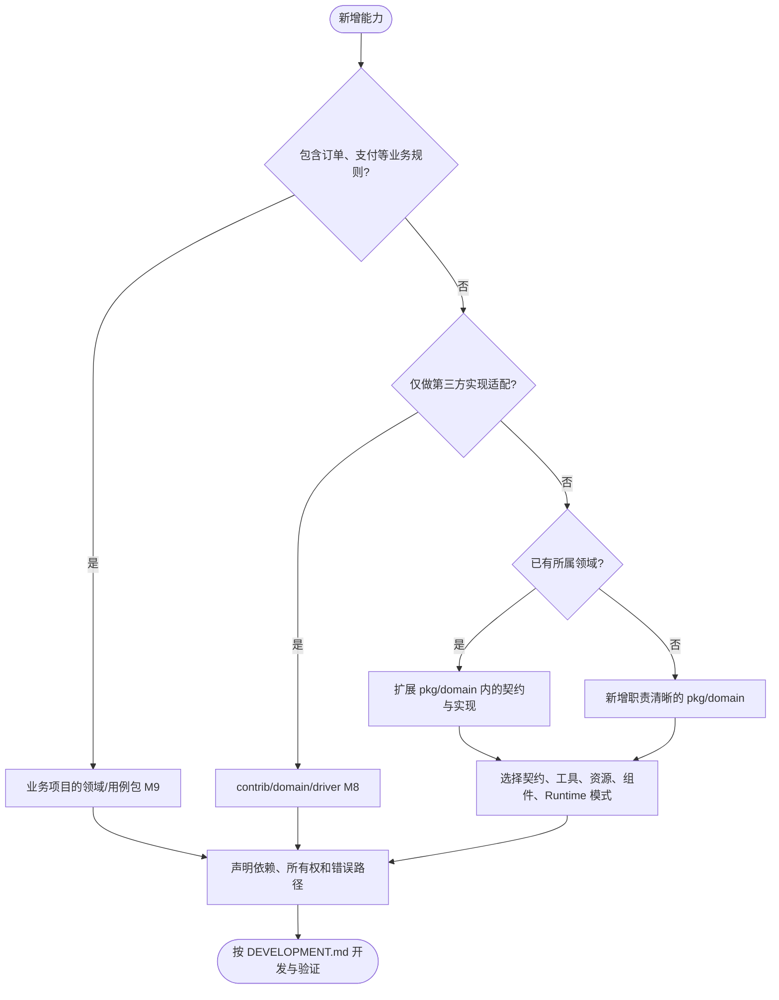

# pkg 包分类与开发入口

本索引按当前工作树的公共 API 和资源所有权分类，不调整现有 import 路径。新增能力时，先查本页，再使用[包开发模式指南](DEVELOPMENT.md)。

组件组合使用与可运行测试见[核心组件集成用例](INTEGRATION_TESTS.md)。根目录 `make test-components` 验证配置、事务、客户端、Job、Queue、Log 和 Server；`make test-components-external` 验证隔离 Docker 中的真实 Kafka、Redis 和锁等功能。

## 分类方法

使用两个维度描述一个包：**职责是什么，生命周期由谁管理**。

- **基础能力**：环境、错误、配置、日志、身份和可观测性等跨领域能力。
- **核心编排**：负责整个应用的装配、启动、故障传播和停止，当前是 `app`。
- **工具方法**：一次调用完成计算或转换，不拥有连接和常驻执行循环。
- **公共抽象**：定义可替换实现之间的契约，例如 `lock.Locker`。
- **技术领域组件**：客户端、存储、消息、调度、传输等可复用能力。
- **具体业务包**：订单、支付、库存等业务规则；当前 `pkg` 没有这一类，通常放在使用 Foundation 的业务项目中。

这些职责并非完全互斥。例如 `config` 是基础能力，同时包含 Source 抽象和有资源的 Manager；`queue` 同时包含任务契约、投递入口和 Worker Runtime。不能只看包名、是否有接口或是否有 goroutine 来归类。

## 全量分类

模式编号对应[开发指南](DEVELOPMENT.md)中的 M1–M9。“非 Runtime”表示不通过 `app.Spec.RegisterRuntime` 交给应用监督，不表示没有后台工作。

| 包 | 主要职责 | 开发模式 | 生命周期与关键边界 |
| --- | --- | --- | --- |
| [`app`](app/README.md) | 应用核心编排 | M7 核心 + M2 契约 | 定义 `app.Runtime`，冻结 Spec，监督启动与停止；不导入具体 Server/Job 实现 |
| [`bootstrap`](bootstrap/README.md) | 应用组装 | M6 Bootstrap | 集中组件登记与完成标记；提供 Base/Consul 默认集合及独立自定义入口 |
| [`config`](config/README.md) | 基础配置服务 + Source 抽象 | M3 资源 + M2 契约 | Manager 构造时加载并监听；cleanup 关闭监听和源；非 Runtime |
| [`env`](env/README.md) | 基础环境工具 | M1 工具 | 按调用读取环境；依赖进程环境，不是纯函数；无 cleanup |
| [`errors`](errors/README.md) | 基础错误模型与协议转换 | M1 值对象/工具 | 无常驻资源；包含 Kratos、HTTP/gRPC 等语义，不是仅含接口的抽象包 |
| [`request`](request/README.md) | 应用级请求状态 | M1 值对象/工具 | Context 保存 debug；传输层按配置跨服务传播，无 cleanup |
| [`log`](log/README.md) | 基础日志服务 | M3 资源 | 每次 NewLogger 拥有独立输出及 cleanup；配置热更新共享过滤与输出策略，支持文件资源切换，包级 With 方法返回派生实例；组装层 cleanup 恢复全局 Logger 绑定；输出保留 module，缺失时 unknown；非 Runtime |
| [`appinfo`](appinfo/README.md) | 应用身份与元数据 | M1 值对象 | 同步采集身份，组装层贡献 AppInfo 和日志字段；非 Runtime |
| [`metrics`](metrics/README.md) | 指标服务 | M3 Provider | Provider cleanup 关闭资源；组装层注入 ContextDecorator，不启动 Runtime |
| [`tracing`](tracing/README.md) | 链路追踪服务 | M3 Provider | Provider 管理 exporter/sampler 等资源；组装层贡献日志字段；非 Runtime |
| [`compress`](compress/readme.md) | 压缩工具 | M1 工具 | 单次调用完成；校验输入及解压限制 |
| [`crypto`](crypto/README.md) | 密码学工具集合 | M1 工具 | `aes`、`ecc`、`password`、`rsa`、`schnorr` 分包；具体算法边界见各实现 |
| [`totp`](totp/README.md) | 一次性验证码工具 | M1 工具 | Authenticator 是配置对象，`Current` 等依赖时间；不需要 Manager/Runtime |
| [`gormscope`](gormscope/README.md) | GORM 查询辅助 | M1 工具 | 依赖 GORM，但不拥有数据库连接或事务 |
| [`lock`](lock/lock.go) | 分布式锁/租约公共抽象 | M2 契约 | 定义 `Locker`、`Lease` 和稳定错误，提供可选 `WithMetrics` 包装；底层实现由 contrib 提供 |
| [`redis`](redis/README.md) | Redis 连接资源 | M3 Manager | Manager 拥有共享 client，调用方借用；Subscribe 的操作生命周期另行释放 |
| [`registry`](registry/README.md) | 具名注册与发现实例 | M3 Factory + M2 驱动契约 | 驱动提供 Registrar 与 Discovery；Factory 拥有实例，使用者借用 |
| [`database`](database/README.md) | 数据库连接与事务能力 | M3 Manager + M2 驱动契约 | Manager 管理具名连接；具体驱动在 contrib；符合 Driver Registry 条件 |
| [`oss`](oss/README.md) | 对象存储资源与操作契约 | M3 Manager + M2 契约 | Manager 延迟创建并缓存 bucket；具体驱动在 contrib；符合 Driver Registry 条件 |
| [`client`](client/README.md) | HTTP/gRPC 客户端工厂与共享租用 | M3 Factory + M4 调用租约 | Factory cleanup 管理整体资源；每次 `AcquireClient` 还要调用自己的 release |
| [`kafka`](kafka/README.md) | Kafka 客户端、消息生产和消费 | M3 Factory + M4 组件 + M5 Runtime | `NewClientFactory` 创建客户端工厂；`NewProducer`、`NewConsumer` 显式构造，`ConsumerRuntime` 管理消费生命周期 |
| [`queue`](queue/README.md) | 持久化任务、延迟和重试 | M2 契约 + M4 组件 + M5 Runtime | `Dispatcher` 投递任务；`Worker` 实现 `Start/Stop`；Redis Store 或业务 Database Repo 显式注入，资源由组装层释放 |
| [`job`](job/README.md) | 任务声明、调度和并发协调 | M5 Runtime + M4 Guard | `job.Manager` 是 Runtime；每次任务的 ExecutionGuard 是操作级组件，已有自动续租 |
| [`server`](server/README.md) | HTTP/gRPC 服务装配 | M5 Runtime | `server.Runtime` 是聚合对象；组装层登记 `Servers()` 返回的 HTTP/gRPC 运行时，并非登记聚合对象本身 |

`pkg/lock` 的使用边界见 [`lock/README.md`](lock/README.md)。

## Runtime、组件与 Bootstrap

| 概念 | 识别依据 | 示例 |
| --- | --- | --- |
| 运行时组件 | 被请求、任务、Runtime 或资源所有者调用；生命周期可长可短 | Producer 装饰器、ExecutionGuard、watchdog、客户端租约 |
| 应用 Runtime | 具有 `Start(context.Context) error` / `Stop(context.Context) error`，并实际登记到 `app.Spec` | Job Manager、Queue ConsumerRuntime、HTTP/gRPC server |
| Bootstrap | 构造期同步贡献配置、身份、上下文或 Runtime 登记 | `bootstrap.NewMetricsBootstrap`、`bootstrap.NewRuntimeBootstrap` |
| 资源 Provider/Manager/Factory | 创建、借出或持有资源，并明确释放责任 | Redis Manager、Kafka ClientFactory |

Runtime 是组件的一种生命周期角色。是否作为 Runtime 取决于生命周期契约和实际登记方式，与文件名无关。

## 目录与依赖

保留按能力命名的 `pkg/<domain>`；不新增 `pkg/base`、`pkg/core`、`pkg/utils`、`pkg/abstract` 等分类目录。分类通过文档表达，避免迁移 import 路径和形成含义模糊的大包。

这是包定位决策图，不执行 I/O、状态变更或日志。代码依赖遵循：

- 业务/Wire 可以导入 `pkg` 和 `contrib`，不能导入 Foundation 的任何 `internal`。
- `contrib` 依赖公共契约和客户端能力；通用领域逻辑不导入具体 `contrib`。
- 同一领域默认同包，用非导出标识符隐藏实现，用职责明确的文件组织代码。
- 只将独立子能力拆成 `internal/<capability>`；该 internal 不反向导入所属领域包，也不导入其他领域的嵌套 internal。
- 根 `internal` 仅承载至少两个独立领域直接复用的私有能力及测试设施。
- 不保留仅做类型别名或构造转发的公共壳层；目录和接口只在实际边界需要时增加。
- 实现文件通常 150–300 行，超过 400 行检查职责；按配置、构造、操作或生命周期合理拆文件，不按行数拆包。

## 当前实现组织

| 领域 | 同包文件职责 | 保留的私有子能力 |
| --- | --- | --- |
| app | Spec 登记与冻结、应用构造、生命周期、Runtime 监督、Registrar、停机策略 | 无 |
| appinfo | 进程快照、身份值对象 | 无 |
| consul / kafka / redis | 配置、客户端构造、安全选项、资源管理 | 无 |
| database / oss | 驱动契约、注册表、资源缓存、事务或对象操作 | 无 |
| client | Factory、连接构造、配置、版本租约池 | circuitbreaker 中间件 |
| log | Logger、共享状态、配置热更新、派生缓存、请求 debug | output 输出端 |
| metrics / tracing | Provider、配置、Exporter/Sampler、上下文 | 无 |
| queue | 任务契约、持久化投递、Worker生命周期和执行 | telemetry |
| kafka | 连接工厂、消息生产、消费运行时、offset提交和恢复 | telemetry |
| job | Spec、调度、Manager 生命周期、并发策略、锁租约 | 无 |
| server | HTTP/gRPC、WebSocket、配置与中间件策略、Runtime | validator / ratelimit 中间件 |
| config | Manager 与公开配置契约 | decoder / snapshot / source / subscription |
| 工具包 | 按计算、转换或算法职责组织 | crypto 按独立算法提供公共子包 |

## 新增 watchdog 时从哪里开始

只用于定时任务时，先复用 [`job.NewLockCoordinator`](job/coordinator.go)。需要跨 Job、请求、消费者复用时，建议新增公共 `pkg/lock/watchdog`，依赖现有 `lock.Locker/Lease`，按 **M4 操作级组件**开发。

完整的选择依据、建议 API、并发边界、释放流程和测试场景见[watchdog 开发示例](DEVELOPMENT.md#watchdog-开发示例)。

## 驱动组装入口

应用通过 `spec.Configuration` 声明额外来源，由 `bootstrap.NewConfigManager` 构造默认包含官方 env source 的配置源链，使用 `registry.NewFactory` 管理具名注册与发现实例，由 `bootstrap.BaseProviderSet` 完成组装。注册与发现仅提供驱动入口。详见[驱动组装与迁移](registry/README.md)。
