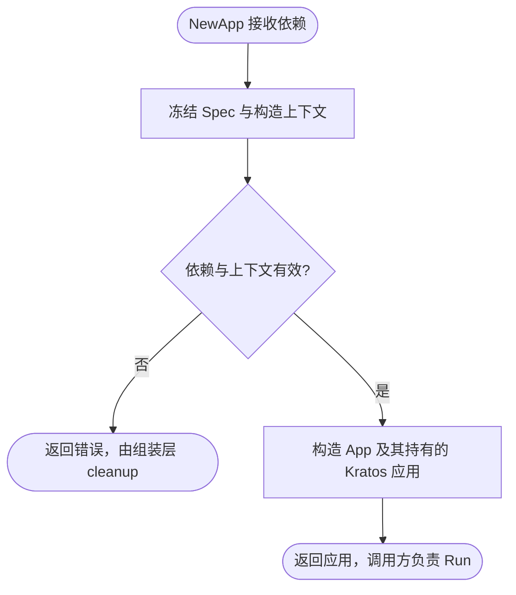
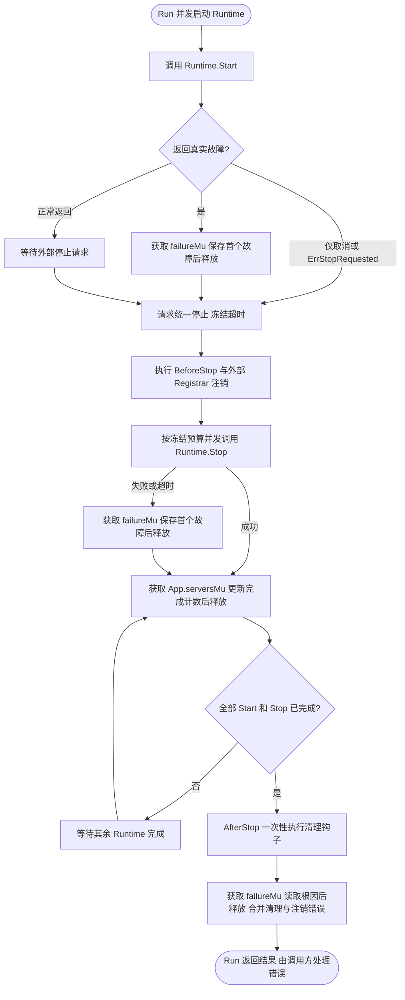
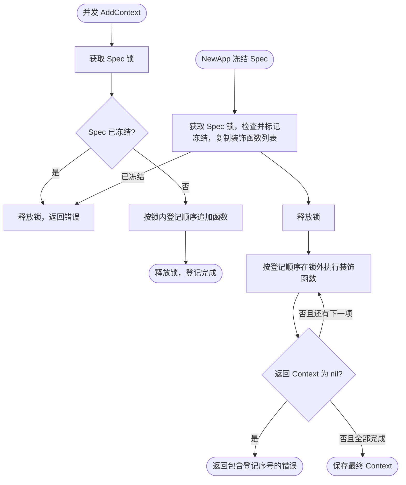
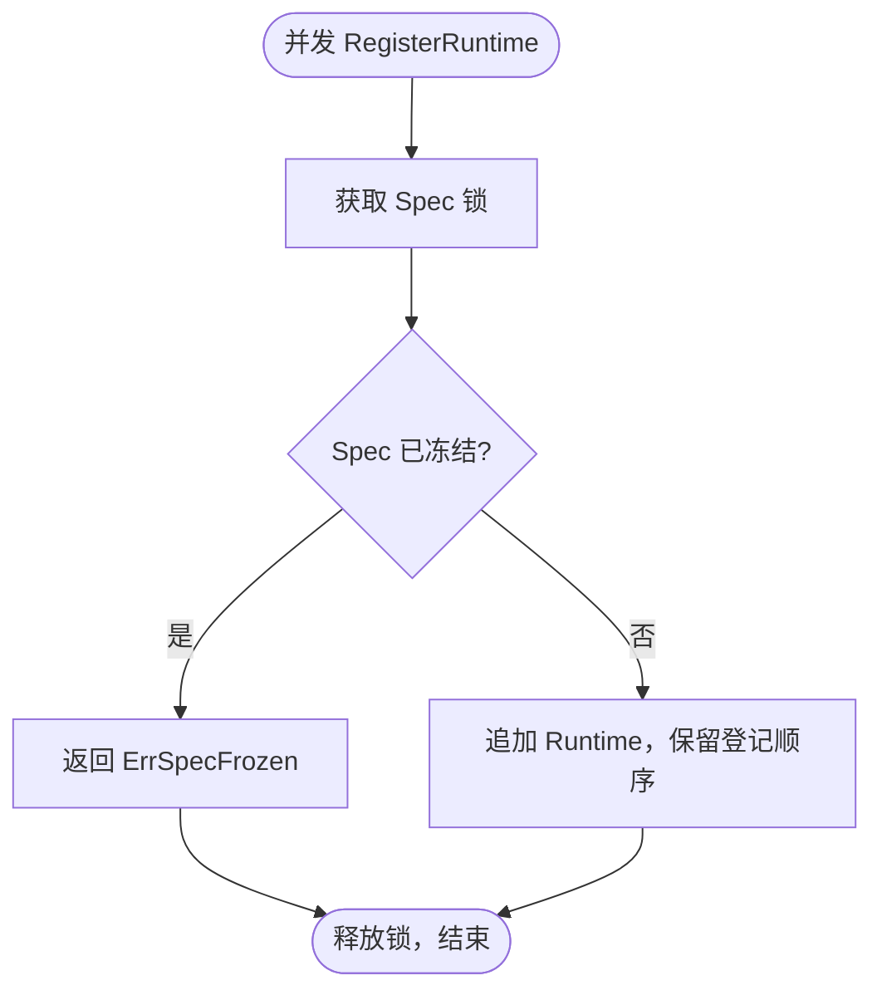
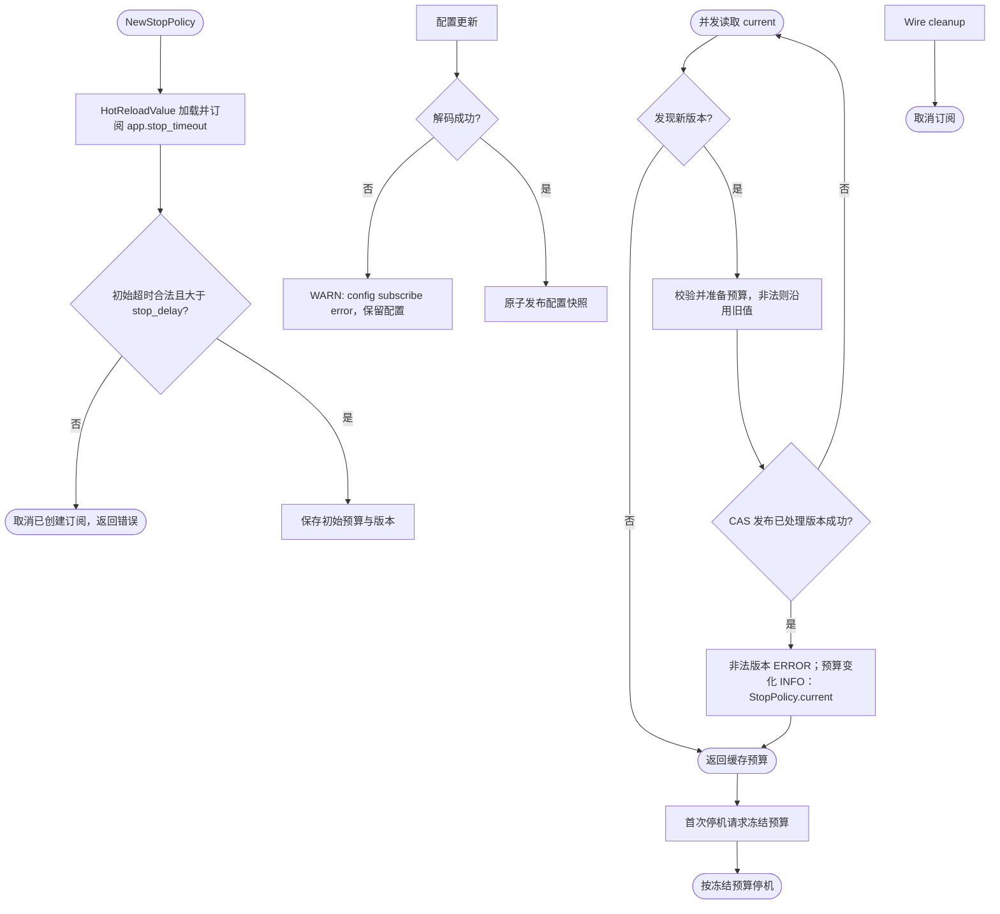
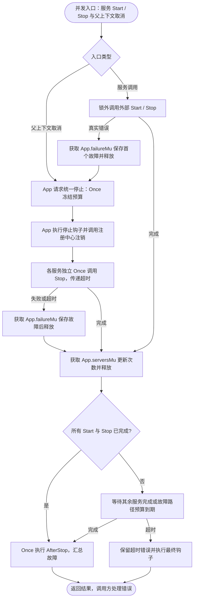
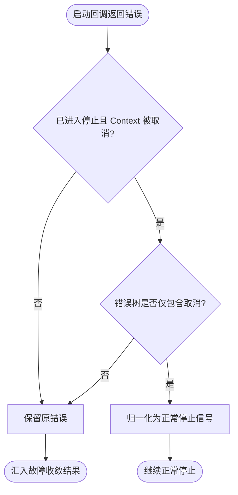
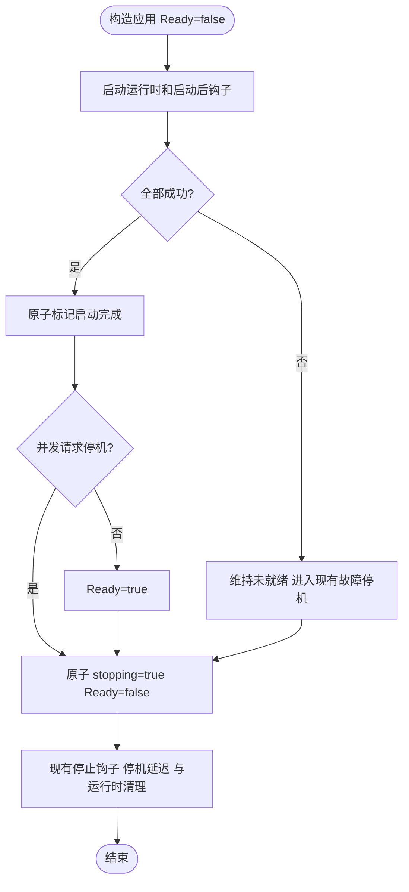

# app

`pkg/app` 定义应用依赖、配置与构造函数。它保存构造期的 `Spec`、启动期固定的 `Config`、可热更新的 `StopPolicy`，并构造受监督的 Kratos 应用。业务 Wire 层显式选择启用哪些组件；`pkg/app` 不自动发现组件，也不依赖具体的 AppInfo、日志、Tracing、Metrics、Server 或 Job 包。

`App` 直接持有启动钩子、停止状态、首个故障、服务完成计数和父上下文监听状态；没有独立的 lifecycle runner 或 runtime tracker。`NewApp` 返回 `*app.App`，嵌入的 `*kratos.App` 提供 Run、Stop 和应用信息；组装层通过 `NewKratosApp` 返回底层 Kratos 应用。

- `app.go`：App 状态、依赖与构造函数。
- `hooks.go`：App 的钩子执行和错误保存方法。
- `runtime.go`：Server 适配、完成计数、退出等待、父 Context 监听及故障收敛，保留服务 Endpoint。
- `spec.go`、`config.go`、`stop_policy.go`：应用描述、配置和停机策略。
- `registrar.go`：注册中心协议适配，停止协调只依赖所属 App。

`Runtime` 仅保留为现有 `Start/Stop` 登记接口，避免改变组件调用契约；它不再对应一套独立管理对象。

## 构造边界

本包描述应用所需依赖并提供 `NewApp(ctx, spec, config, stopPolicy, registrar)`，不选择领域组件、不聚合 Bootstrap，也不决定整个应用的组装阶段。所有阶段标记（包括用户提供的 `bootstrap.Bootstrap`）均定义在组装包。

应用组装与 Wire 示例见 [`bootstrap`](../bootstrap/README.md)。`NewApp` 消费已登记的 Spec 并冻结它；直接调用时由调用方保证贡献已全部完成。

## 贡献和所有权

- `bootstrap.NewAppInfoBootstrap` 登记 AppInfo，并通过 `log.WithKV` 加入进程共享的 service ID、name、version 字段。
- `bootstrap.NewTracingBootstrap` 通过 `log.WithKV` 加入进程共享的 `trace.id` 和 `span.id` 动态字段。
- `bootstrap.NewMetricsBootstrap` 追加 ContextDecorator，把 Meter 注入由 `NewApp` 基于调用方 Context 组装的 App Context。
- `bootstrap.NewLogBootstrap` 登记应用 Logger、替换全局 Logger，并返回恢复先前全局 Logger 的 cleanup。
- `bootstrap.NewServerBootstrap` 登记启用的业务 HTTP/gRPC Runtime 和独立管理监听；`bootstrap.NewJobBootstrap` 仅在 Manager 有任务时登记 Job Runtime。
- 可选 `registry.Registrar` 由业务/Wire 通过 `NewApp`（或 `bootstrap.NewKratosApp`）的构造参数注入；传入 nil 表示禁用服务注册，具体实现可使用 `contrib/registry/consul.NewRegistry`。

构造函数拥有资源创建，Wire 接收并逆序调用其 cleanup。Bootstrap 本身通常没有 cleanup；例外是 `bootstrap.NewLogBootstrap` 的全局 Logger 恢复函数。Runtime 的 `Start`/`Stop`、Hook、Registrar 补偿和停机预算由 App 直接管理。

## Spec 约束

`RegisterRuntime(runtime)` 无需名称，按登记顺序保留全部 Runtime，不对同一实例去重；调用方应保证 Runtime 实例非 nil，登记时不作 nil 校验，冻结后的登记会返回错误。重复登记可能导致重复启动，同一实例应只登记一次。`AddContext(decorate)` 无需名称，按登记顺序执行全部 ContextDecorator，重复登记也会重复执行；调用方应保证装饰函数非 nil，冻结后的新贡献会返回错误。装饰函数返回 nil Context 时，错误包含从 1 开始的登记序号。AppInfo 和 Logger 是单例贡献；Registrar 是独立的构造依赖，不保存在 Spec 中。组装层通过最终 `bootstrap.StartupReady` 屏障调用 `NewKratosApp`，后者调用 `app.NewApp` 冻结 Spec；之后不能再注册 Runtime、Context、元数据、端点、信号或 Hook。

## 运行时故障与停止结果

`application.Run()` 保留运行时的真实故障，包括与 `context.Canceled` 合并的错误。只有错误树中的全部原因都是取消时才沿用正常停止语义。App 在 `failureMu` 临界区保存首个真实故障；运行时 `Stop` 的失败也在完成跟踪之前记录，最终 `AfterStop` 汇总根因、停止钩子和注销错误。`Stop` 和停止钩子仍只执行一次，错误由调用方处理，底层不重复记录日志。

### Context 登记与应用

错误由调用方处理，此处不重复记录日志；锁不覆盖装饰函数调用。

### Runtime 登记

登记不调用 Runtime，也不启动后台工作；错误交给调用方处理，不在此重复记录日志。冻结时在同一锁内复制 Runtime 列表，后续生命周期消费该快照。

### 停机超时热更新

`NewStopPolicy` 使用 `config.HotReloadValue[durationpb.Duration]` 订阅 `app.stop_timeout`，只校验该字段的合法 Duration、正数和严格大于 `server.stop_delay` 的约束；其他 app 字段不会阻止该字段更新。字段删除后恢复配置默认值 30s，仍须满足停机约束。启动期完整配置校验仍由 `NewConfig` 负责。

每次读取只在版本变化时校验，并用 CAS 保存读取时校验通过的预算；非法版本保留此前已校验的值，同一版本不重复记录错误。连续更新可能只读取最新版本。订阅解码失败由 HotReloadValue 记录 WARN 并保留原配置，合法更新和校验失败分别记录 `StopPolicy.current` INFO / ERROR。首次请求停机时冻结所读预算，后续更新不影响本次停机。Wire cleanup 幂等取消订阅。

### App 的同步边界

App 的 `serversMu` 仅保护 Start/Stop 完成计数，`failureMu` 保护首个真实故障，`contextMu` 保护停止上下文。首次停止和前后停止钩子继续分别使用 Once；每个服务的停止回调保留独立 Once 和结果。外部服务调用和用户钩子均在锁外执行；这些边界不因状态归属合并而扩大。

本包返回错误，不重复记录日志；流程图不新增日志事件。

### 启动回调错误分类

在停止期间，启动钩子或注册回调可能同时返回取消与真实错误。只有错误树全部叶子都是 `context.Canceled` 时才归一化为正常停止；`errors.Join(context.Canceled, err)` 中的业务错误仍参与最终返回。本路径返回错误，不新增日志。

## 就绪状态与退出期限

`Spec.Ready()` 可并发读取：构造前、启动钩子尚未全部完成或启动失败时为 false；全部启动后钩子
成功且未请求停机时为 true；收到停机请求立即为 false。ServerBootstrap 将它绑定到 `/readyz`，
不会等 stop_delay 或资源 cleanup 才撤销就绪。状态通过原子变量读取，不在探针路径获取生命周期锁。

Context 是取消通知，不能强杀 goroutine。不响应它的依赖或业务代码可能使请求超时后继续执行、
后台任务迟迟不退出、Wire cleanup 阻塞，或者在资源关闭后继续访问资源。应修复实际调用链：传递
Context，使用支持取消的数据库/网络 API，为连接和读写配置超时，在循环中检查取消。对没有取消
能力的阻塞 SDK，应使用其受支持的关闭机制或进程隔离；不要通过额外 goroutine 超时返回来冒充
任务已经停止。AfterStop 与无参数 Wire cleanup 不能视为整个进程的硬退出期限。
最终进程期限由部署平台执行；强制终止可能打断未完成工作，因此业务需支持幂等与恢复。
