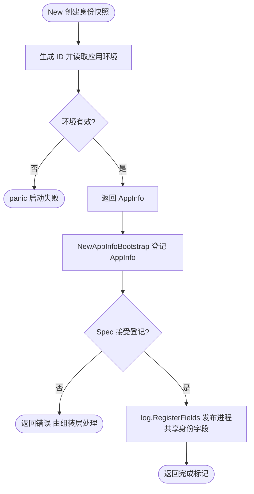

# appinfo

`appinfo` 在应用启动时生成不可变的进程身份，供日志、Tracing、Metrics 和服务注册复用。

```go
info := appinfo.New(version)
```

业务和 Wire 只依赖公开的 `AppInfo` 与 `New`。主机名、可执行文件名及其回退逻辑位于同包的 `appinfo.go`，通过非导出标识符保留启动时快照。

`ID()` 在每次 `New` 时生成，格式为主机名与 UUID 的组合；`Name()` 是可执行文件的 basename，`Version()` 是调用方传入的版本。`Metadata()` 返回含 `env` 和 `hostname` 的独立 map，修改它不影响原对象。环境在构造时按 [env 的优先级](../env/README.md)读取，非法环境会 panic。

主机名与可执行文件名在包初始化时采集：主机名读取失败使用 `unknown-host`；可执行文件路径读取失败时使用 `os.Args[0]` 的 basename，无参数时使用 `unknown-executable`。后续环境变化不会改变已有 AppInfo；应用应构造一次并共享同一实例。

组装时，`bootstrap.NewAppInfoBootstrap(appSpec, info)` 会同步向 `app.Spec` 登记唯一 AppInfo，并通过包级 `log.RegisterFields` 添加 `service.id`、`service.name` 与 `service.version` 字段。以下片段放在返回 error 的业务 provider 内，`appSpec` 由组装层提供：

```go
contribution, err := bootstrap.NewAppInfoBootstrap(appSpec, info)
if err != nil {
    return err
}
```

该 Bootstrap 不创建资源也不返回 cleanup；进程身份由 `New` 创建后一直由调用方/Wire 持有。



登记本身不记录业务日志；后续 Logger 写入才求值并输出这些字段。全局设置由日志包的 CAS 发布机制管理，详见 [日志共享设置](../log/README.md#组件日志字段)。
