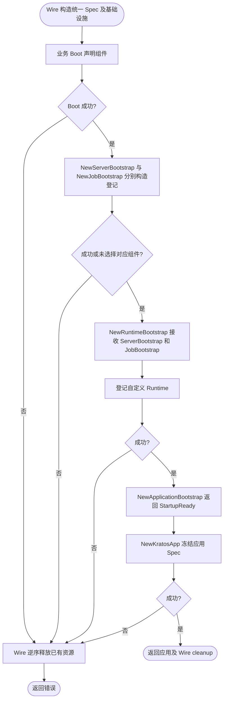
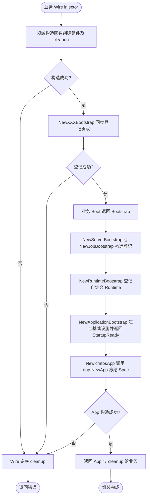
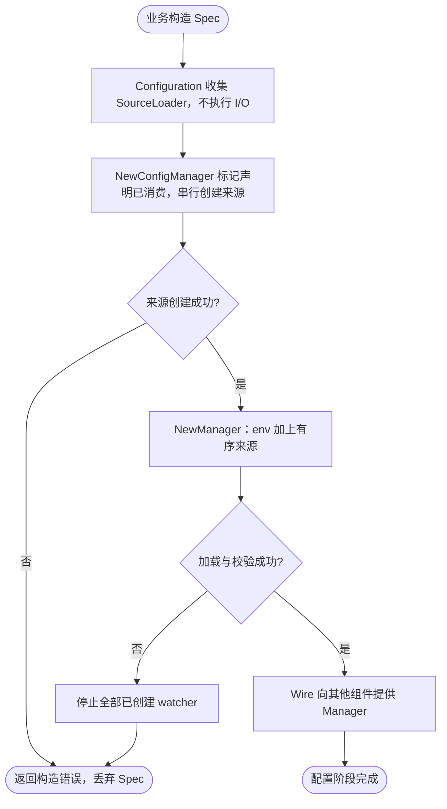

# bootstrap

日志 Bootstrap 安装 Kratos 模块适配器并借用实例输出；cleanup 恢复之前完整的全局绑定。配置源选择日志归属各 contrib 包。

`pkg/bootstrap` 负责跨组件集成与应用登记。领域包只声明自身依赖，提供普通 Go 构造函数；不导入 `app`、`bootstrap` 或 Wire 来参与应用组装。组件内部创建自身 SDK、配置解析与资源管理仍留在领域包中。

## 按应用选择组件（推荐）

`internal` 保存 service、biz、data、job 和 consumer 的实现；`cmd/<app>` 是唯一的应用组件组装点。
Wire 构造当前 provider 实际依赖的实现，业务 Boot provider 接收并填充 `*bootstrap.Spec`，无需提供 `*server.Spec` 或 `*job.Spec`。

```go
// cmd/api/bootstrap.go：只选择 HTTP，未选择的 gRPC 即使配置默认开启也不会创建。
func Boot(_ bootstrap.InfrastructureBootstrap, spec *bootstrap.Spec, service *service.AuthService) (bootstrap.Bootstrap, error) {
    spec.Http().Register(func(srv server.HTTPServer) error {
        auth_service_pb.RegisterAuthServiceHTTPServer(srv, service)
        return nil
    })
    return bootstrap.Bootstrap{}, nil
}
```

worker 的 provider 则可以选择任务和消费者：

```go
func Boot(_ bootstrap.InfrastructureBootstrap, spec *bootstrap.Spec, task *jobimpl.Reconcile, worker *queue.Worker) (bootstrap.Bootstrap, error) {
    spec.Job().RegisterCron("reconcile", "@every 1m", task)
    spec.RegisterRuntime(worker)
    return bootstrap.Bootstrap{}, nil
}
```

以上业务类型由消费项目定义。Queue Worker 由 Wire 调用 queue.NewWorker 构造，Kafka 消息消费则使用 kafka.NewConsumerRuntime，
与自定义 worker 一样通过 spec.RegisterRuntime(runtime) 登记；Spec 不再提供专用 Consumer 方法。
未调用 Http() 或 Grpc() 时不会创建服务器。
`Http()`、`Grpc()` 仅选择协议，默认仍遵循配置的 disable；显式 `.Enable()` 可以覆盖配置。
未调用 `Http()`、`Grpc()` 的 worker 不构造服务器，也不读取服务器配置；未调用 `Job()` 不构造任务管理器。
空 Spec 可用于不需要这些组件的应用；基础设施仍由 Wire 显式选择，本入口不会自动创建数据库、Redis 或消息客户端。

Wire 使用 `bootstrap.NewSpec, bootstrap.ApplicationSpec, Boot, bootstrap.NewServerBootstrap, bootstrap.NewJobBootstrap, bootstrap.NewRuntimeBootstrap, bootstrap.NewApplicationBootstrap`。
bootstrap.NewSpec 创建组件声明及其持有的 app.Spec；ApplicationSpec 向基础设施 provider 暴露同一实例。
统一模式不要再提供 app.NewSpec，避免生成第二份状态或出现重复 provider。
Boot 返回 `Bootstrap`，NewServerBootstrap 和 NewJobBootstrap 都依赖该标记，保证先声明后构造；NewRuntimeBootstrap 再依赖 ServerBootstrap 和 JobBootstrap。
NewApplicationBootstrap 等待组件登记完成并返回 `StartupReady`，随后 NewKratosApp 才能冻结应用；这是唯一的 StartupReady 构造入口。
Boot 不得依赖 ServerBootstrap、JobBootstrap 或 RuntimeBootstrap，否则形成循环；Boot 只接收 *bootstrap.Spec，直接调用 BeforeStart 等方法登记应用贡献。
停机策略直接使用 `app.NewStopPolicy(config, manager, logger)`，不依赖组件标记或服务器等待时间。建议总停机预算为服务器等待和资源清理预留足够时间，不做跨组件硬校验。
业务无需提供 time.Duration 适配函数；各 provider 的 cleanup 由 Wire 按实际依赖逆序释放。
不要为同一组件同时使用统一入口与独立 Bootstrap，否则会重复登记。

`bootstrap.Spec` 在构造期串行填充，只能组装一次；组装开始后不可再修改 Spec 或保留的 Builder。
`NewRuntimeBootstrap(spec, serverBootstrap, jobBootstrap)` 仅登记自定义 Runtime，返回 `(RuntimeBootstrap, error)`，不再返回空 cleanup。服务器资源由 NewServerBootstrap 的 cleanup 释放；后续组装失败时 Wire 会逆序回滚，失败的 app.Spec 应丢弃。
底层数据库、消息客户端和消费者资源的 cleanup 仍归各自 provider；运行时 Start/Stop 由 app 生命周期管理。
bootstrap.Spec 按模块提供 Http()、Grpc()、Job()；业务无需接收第二个 Spec。
生命周期方法直接挂在 spec 上；日志运行期策略来自 log 配置热更新，代码通过返回派生实例的 WithLevel 等方法定制，不提供 spec.Log()。
最终 app.NewApp 冻结的正是这份由私有字段持有的状态；冻结后直接调用 BeforeStart、AddMetadata 等方法会返回 app.ErrSpecFrozen。
请使用 bootstrap.NewSpec 创建统一声明，不能使用其零值；app 包仍然不依赖 server、job、queue。



基础组装使用 `BaseProviderSet`，具体后端由具名驱动配置选择。

采用 local 文件、其他环境 Consul 的默认约定时，额外提供 [`contrib/bootstrap/consul.NewSpec`](../../contrib/bootstrap/consul/README.md)。使用该包的 `ProviderSet` 时，应用只需传入 `AppInfo` 和 `localConfigPath bootstrap.LocalConfigPath`；默认提供八层远程路径。自定义路径时单独使用 `NewSpec` 并提供 `bootstrap.RemoteConfigPathsProvider`。该可选约定不包含在 BaseProviderSet 中。

| 构造函数 | 返回标记 | 组装职责 |
| --- | --- | --- |
| `NewAppInfoBootstrap(spec, info)` | `AppInfoBootstrap` | 登记身份并设置日志服务字段 |
| `NewLogBootstrap(spec, manager, logger)` | `LogBootstrap` | 订阅 log 配置、登记 Logger，安装全局 Logger；cleanup 取消订阅并恢复绑定 |
| `NewTracingBootstrap()` | `TracingBootstrap` | 设置日志中的 trace/span 动态字段 |
| `NewMetricsBootstrap(spec, meter)` | `MetricsBootstrap` | 将默认 Meter 注入 App Context |
| `NewServerBootstrap(spec, manager, logger, metrics, tracing, boot)` | `ServerBootstrap` | 按统一 Spec 构造和登记服务器，返回 cleanup |
| `NewJobBootstrap(spec, coordinator, logger, metrics, tracing, boot)` | `JobBootstrap` | 按统一 Spec 构造、登记任务管理器并适配任务完成结果 |

构造参数统一按 Spec、配置依赖、组件专属依赖、观测依赖（Logger、Metrics、Tracing）、阶段完成标记排列；不存在的类别直接省略。纯阶段聚合函数按阶段顺序接收标记。参数位置只用于阅读，Wire 仍按类型解析依赖；组装顺序由完成标记建立，见下方流程图。

这些构造函数都返回 error，登记失败时保留错误链；LogBootstrap 和 ServerBootstrap 额外返回 `func()` cleanup。其他资源的 cleanup 来自领域构造函数，由 Wire 在构造失败或调用方退出时逆序执行。Bootstrap 不启动 Runtime。ServerBootstrap 由 NewServerBootstrap 在业务 Boot 后构造并登记服务器，再注入 NewRuntimeBootstrap 作为前置依赖；服务器 cleanup 独立归 Wire 所有。

`NewInfrastructureBootstrap` 汇合 AppInfo、Log、Tracing 和 Metrics 的贡献标记。业务 provider 接收 `InfrastructureBootstrap` 和业务依赖，返回 `Bootstrap`。随后 NewServerBootstrap 与 NewJobBootstrap 分别构造和登记服务器、任务，`NewRuntimeBootstrap` 等待二者完成后登记自定义 Runtime，`NewApplicationBootstrap` 汇合基础设施和 Runtime 标记，最后 `NewKratosApp` 调用 `app.NewApp` 冻结 Spec。所有入口共享 `bootstrap.NewSpec` 持有的应用 Spec，已独立登记的组件不要再通过统一入口重复选择。

Wire 只执行最终返回值的依赖链。仅把构造函数放进 set 不保证执行；业务必须让每项贡献被最终标记引用。阶段内只保留实际依赖：仅在最终业务 provider 接收基础设施标记，不会推迟其所有参数的构造。



构造错误由调用方处理，登记函数本身不重复记录日志。NewLogBootstrap 安装共享同一输出的全局派生 Logger；App Spec 另行派生带 `module=kratos` 的 Logger 传给 Kratos App，
不会给全局或其他组件日志附加该模块。全局派生 Logger 保留独立的 cleanup 身份，不增加固定 caller 跳过层数；默认模式由日志包统一识别 Kratos 全局函数及 Context/Helper 包装。深度统一按过滤包装后的调用点计数，详见 [日志 caller 规则](../log/README.md#caller-depth)。
日志全局安装沿用单应用、逆序释放的约定；多个应用并发安装或交错释放全局 Logger 不受本包保障。优先将实例 Logger 显式注入组件。

`JobBootstrap` 的适配只转换 Manager 返回的独立 `job.ErrCompleted`，任务失败保持原样。Job 包不依赖 App 的错误契约。Queue 的 `ConsumerRuntime` 通过 Go 方法集隐式满足 `app.Runtime`；由 Wire 调用 `queue.NewConsumerRuntime` 构造，再通过 `spec.RegisterRuntime` 登记；统一入口不代为构造消费者。


真实 Wire 生成、逆序 cleanup 与失败回滚由 `wire_integration_test.go` 在临时模块验证，不提交或手改生成副本。
该 fixture 还启动 HTTP 订单服务并访问临时 SQLite，检查事务提交、回滚、具名连接隔离和旧配置拒绝；
通过根目录 `make test-business` 运行，验收范围及发布检查见 [v2 迁移清单](../../MIGRATION_V2.md)。

## 可选依赖由 Wire 构造注入

`registry.Registrar` 直接注入 `NewKratosApp(spec, config, stopPolicy, registrar, ready)`；
`job.ConcurrencyCoordinator` 注入 `NewJobBootstrap(spec, coordinator, logger, metrics, tracing, boot)`，
再传给 `job.NewManager`。它们不属于 Spec 声明，不需要 Boot 登记。

下面是完整的最小 Wire 示例，两个文件放在消费项目的同一个组装包中，并执行该项目的 Wire 生成命令。
示例将其余依赖作为 injector 输入：调用 `initializeApp` 前须完成基础设施/业务 Bootstrap 聚合，
取得同一份 `app.Spec` 和 `StartupReady`；调用 `initializeJobs` 前须声明好任务。
实际应用也可将这两个 nil provider 放进已有的完整 `wire.Build`，由现有 provider 构造其余依赖。

`wire.go`（普通源码，生成后的应用也需要编译这些 provider）：

```go
package assembly

import (
    "github.com/go-kratos/kratos/v2/registry"
    "github.com/jaggerzhuang1994/kratos-foundation/v2/pkg/job"
)

func noRegistrar() registry.Registrar { return nil }
func noCoordinator() job.ConcurrencyCoordinator { return nil }
```

`wire.go`：

```go
//go:build wireinject

package assembly

import (
    "github.com/go-kratos/kratos/v2"
    "github.com/google/wire"
    "github.com/jaggerzhuang1994/kratos-foundation/v2/pkg/app"
    "github.com/jaggerzhuang1994/kratos-foundation/v2/pkg/bootstrap"
    "github.com/jaggerzhuang1994/kratos-foundation/v2/pkg/job"
    "github.com/jaggerzhuang1994/kratos-foundation/v2/pkg/log"
    "github.com/jaggerzhuang1994/kratos-foundation/v2/pkg/metrics"
    "github.com/jaggerzhuang1994/kratos-foundation/v2/pkg/tracing"
)

func initializeApp(spec *app.Spec, ready bootstrap.StartupReady,
    config app.Config, stopPolicy *app.StopPolicy) (*kratos.App, error) {
    wire.Build(noRegistrar, bootstrap.NewKratosApp)
    return nil, nil
}

func initializeJobs(logger log.Logger, spec *job.Spec, tracingProvider tracing.Provider,
    metricsProvider metrics.Provider) (*job.Manager, error) {
    wire.Build(noCoordinator, job.NewManager)
    return nil, nil
}
```

nil provider 应返回真正的 nil interface，不能返回装入接口的 nil 具体指针。
nil Registrar 禁用服务注册；nil Coordinator 允许普通 Cron、Once、Daemon，但带分布式并发策略的 Cron 会在 `NewManager` 构造时失败。
注入协调器本身不会启用分布式策略，仍须显式选择 `SkipIfDistributedRunning` 或 `DelayIfDistributedRunning`。Delay 默认限制每任务每进程的进入数量，可通过 `spec.Job().RegisterCron(..., job.WithDelayOverflowHandler(handler))` 接入满额通知；容量、回调与超额跳过语义见 [Job 文档](../job/README.md#delay-容量)。
这些依赖在构造时确定，不支持通过事后修改 Spec 切换。

应用组装使用 `app.NewRegistrar` 和 `registry.NewFactory`，由 `app.registry` 选择实例（省略或为空使用 default），驱动禁用时跳过注册；上例的 nil Registrar 仅说明 App 底层接口语义。
启用 Redis 协调时，将 `noCoordinator` 替换为 [Job 文档中的 `newJobCoordinator`](../job/README.md)，由业务 provider 固定连接名及协调参数。
每个接口只保留一个 provider；无需额外 `wire.Bind`，这些 provider 已返回目标接口。
共享客户端仍由其构造函数返回的 cleanup 管理；先停止应用，再由 Wire 逆序释放依赖。


以上构造路径返回错误，不额外记录日志；运行时服务注册及租约获取、续租、释放流程见对应领域和 contrib 文档。

## 配置订阅与监控端点

Manager 已采用官方配置语义，不再提供 ConfigObservability collector；配置错误通过官方日志排查，业务是否应用更新应从对应组件观察。

NewServerBootstrap 同时登记业务监听与 `Runtime.ManagementServers()` 返回的独立监控监听；管理端口不加入业务服务发现。地址复用规则见 [server 监控监听配置](../server/README.md#监控端点监听地址)。

业务 Spec 显式开放组件声明、AddContext、AddMetadata、AddEndpoints、AddSignals 和四个生命周期钩子。
app.Spec 由私有字段持有，不再通过匿名嵌入暴露 RegisterAppInfo、RegisterLogger 或 Ready；
运行时使用 RegisterRuntime() 声明。ApplicationSpec 仅作为 Wire 组装桥接函数供 Foundation provider 使用，业务 Boot 不应调用它。

日志 Wire provider 使用 log.NewLogger 创建输出；NewLogBootstrap 注入 config.Manager 订阅 log，日志包校验并原子发布完整策略。策略优先级与 API 边界见 [日志文档](../log/README.md#三层策略与公共-api)。

## 驱动组装

使用 `BaseProviderSet`，业务提供已声明 Configuration 的 `*bootstrap.Spec`、`appinfo.AppInfo` 和 Boot。需要自定义 Job Coordinator 时改用 `BaseProviderSetWithCustomJobCoordinator`，并提供 `job.ConcurrencyCoordinator`；两个集合二选一。

```go
// wireinject 文件中的业务 provider：Boot 已声明应用组件。
func wireApp(info appinfo.AppInfo, spec *bootstrap.Spec) (*kratos.App, func(), error) {
    wire.Build(bootstrap.BaseProviderSet, Boot)
    return nil, nil, nil
}
```

业务通过普通导入调用配置源添加函数，通过空导入选择注册驱动。源链及优先级在 Configuration 中显式声明，不再按环境自动选择本地/远程，也不自动拼接远程目录。main 检查构造错误，成功后 `defer cleanup()`，再调用 `application.Run()` 并处理错误。完整示例与生命周期见[具名驱动文档](../registry/README.md)。


默认资源 provider 只在 Wire 依赖图需要时构造。具体数据库、OSS、配置源和注册驱动由业务显式导入。`NewKratosApp` 继续接收 Registrar 接口，App 不访问驱动工厂。

根 `make test-business` 在临时模块生成并运行 Wire，验证完整驱动依赖图、失败回滚及 cleanup。已删除旧基础/Consul 组合集合和环境路径组装入口，不提供兼容别名。

## Configuration 配置阶段

业务提供 Spec 的构造函数应先完成配置声明，不能在依赖基础设施或业务服务的 Boot 中添加来源，避免配置依赖循环：

```go
func newSpec() (*bootstrap.Spec, error) {
    spec := bootstrap.NewSpec()
    if err := spec.Configuration(
        file.AddConfigSource("configs/app.yaml"),
        consul.AddConfigSource("configs/production/app.yaml"),
    ); err != nil { return nil, err }
    return spec, nil
}
```

以上使用普通导入的 `contrib/config/file` 和 `contrib/config/consul`。`AddConfigSource` 复制路径并返回 `config.SourceLoader`，声明时不执行 I/O。Wire 使用 `newSpec` 提供唯一 Spec，`BaseProviderSet` 内的 `NewConfigManager` 先按声明顺序创建来源，再构造包含官方 env source 的 Manager；配置完整后才提供给其他组件。该 provider set 不再包含 `NewSpec`，不要重复提供它。

不使用 provider set 时，可显式组合 `newSpec`、`bootstrap.NewConfigManager`、`bootstrap.ApplicationSpec` 与所需组件。没有额外来源时由 `bootstrap.NewSpec` 提供空声明即可。来源集合在构造阶段确定，运行中监听来源内容；没有全局配置源注册表，也不提供运行时增删来源接口。Configuration 消费后拒绝追加或重复构造，失败后应丢弃 Spec。返回 cleanup 由 Wire 逆序调用，取消 Manager 轮询并停止 watcher；不等待已开始的订阅回调，共享 Consul 客户端不释放。



可执行示例见 `examples/minimal/cmd/api/bootstrap.go`，对应生成入口为仓库根目录执行 `make -C examples/minimal generate`。
