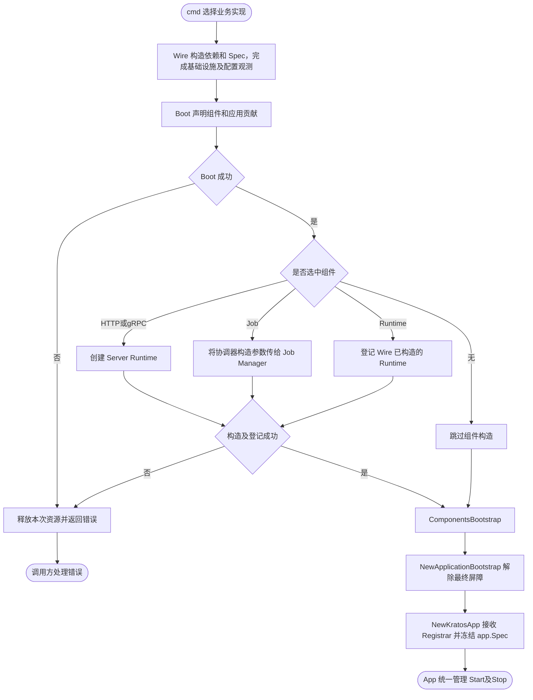
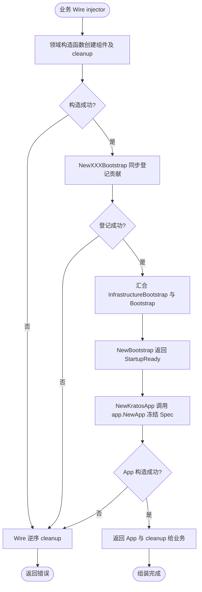
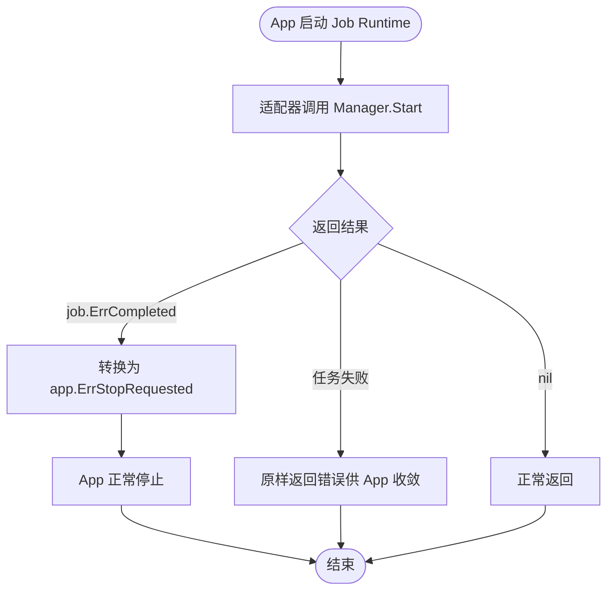
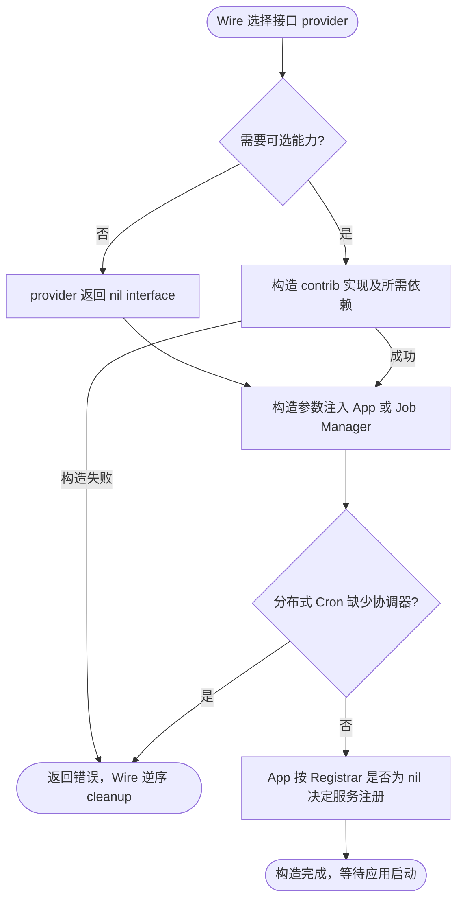
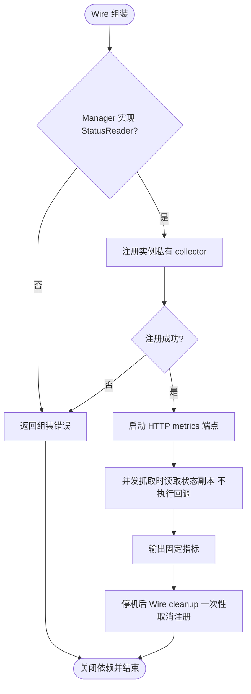
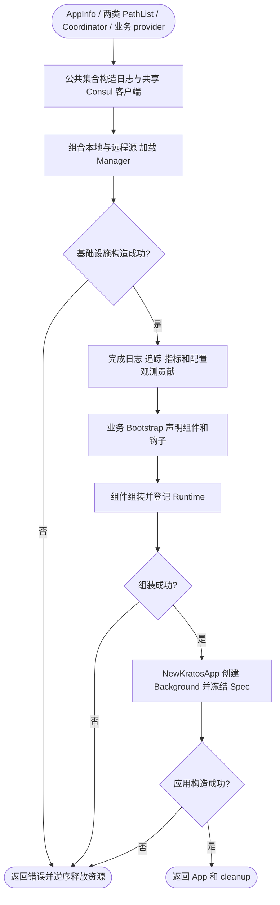

# bootstrap

`pkg/bootstrap` 负责跨组件集成与应用登记。领域包只声明自身依赖，提供普通 Go 构造函数；不导入 `app`、`bootstrap` 或 Wire 来参与应用组装。组件内部创建自身 SDK、配置解析与资源管理仍留在领域包中。

## 按应用选择组件（推荐）

`internal` 保存 service、biz、data、job 和 consumer 的实现；`cmd/<app>` 是唯一的应用组件组装点。
Wire 构造当前 provider 实际依赖的实现，业务 Boot provider 接收并填充 `*bootstrap.Spec`，无需提供 `*server.Spec` 或 `*job.Spec`。

```go
// cmd/api/bootstrap.go：只选择 HTTP，未选择的 gRPC 即使配置默认开启也不会创建。
func Boot(_ bootstrap.InfrastructureBootstrap, spec *bootstrap.Spec, service *service.AuthService) (bootstrap.Bootstrap, error) {
    spec.Http().Register(func(srv server.HTTPServer) error {
        auth_service_pb.RegisterAuthServiceHTTPServer(srv, service)
        return nil
    })
    return bootstrap.Bootstrap{}, nil
}
```

worker 的 provider 则可以选择任务和消费者：

```go
func Boot(_ bootstrap.InfrastructureBootstrap, spec *bootstrap.Spec, task *jobimpl.Reconcile, worker *queue.Worker) (bootstrap.Bootstrap, error) {
    spec.Job().RegisterCron("reconcile", "@every 1m", task)
    spec.RegisterRuntime(worker)
    return bootstrap.Bootstrap{}, nil
}
```

以上业务类型由消费项目定义。Queue Worker 由 Wire 调用 queue.NewWorker 构造，Kafka 消息消费则使用 kafka.NewConsumerRuntime，
与自定义 worker 一样通过 spec.RegisterRuntime(runtime) 登记；Spec 不再提供专用 Consumer 方法。
未调用 Http() 或 Grpc() 时不会创建服务器。
`Http()`、`Grpc()` 仅选择协议，默认仍遵循配置的 disable；显式 `.Enable()` 可以覆盖配置。
未调用 `Http()`、`Grpc()` 的 worker 不构造服务器，也不读取服务器配置；未调用 `Job()` 不构造任务管理器。
空 Spec 可用于不需要这些组件的应用；基础设施仍由 Wire 显式选择，本入口不会自动创建数据库、Redis 或消息客户端。

Wire 使用 `bootstrap.NewSpec, bootstrap.ApplicationSpec, Boot, bootstrap.NewComponentsBootstrap, bootstrap.NewApplicationBootstrap`。
bootstrap.NewSpec 创建组件声明及其持有的 app.Spec；ApplicationSpec 向基础设施 provider 暴露同一实例。
统一模式不要再提供 app.NewSpec，避免生成第二份状态或出现重复 provider。
Boot 返回 `Bootstrap`，NewComponentsBootstrap 依赖该标记，保证先声明后构造。
NewApplicationBootstrap 等待组件登记完成并返回 `StartupReady`，随后 NewKratosApp 才能冻结应用；此模式不使用旧的 NewBootstrap。
Boot 不得依赖 ComponentsBootstrap，否则形成循环；Boot 只接收 *bootstrap.Spec，直接调用 BeforeStart 等方法登记应用贡献。
停机策略使用 `bootstrap.NewStopPolicy` 替代 `app.NewStopPolicy`，自动从组件标记取得服务器等待时间；无服务器时为零。
业务无需提供 time.Duration 适配函数；停机策略的订阅 cleanup 继续由 Wire 在组件资源之前释放。
不要为同一组件同时使用统一入口与旧的独立 Bootstrap，否则会重复登记。

`bootstrap.Spec` 在构造期串行填充，只能组装一次；组装开始后不可再修改 Spec 或保留的 Builder。
`NewComponentsBootstrap` 不启动后台任务。成功返回的 cleanup 归 Wire，在应用停止后调用；
错误会保留原因链并释放已创建的服务器资源，失败的 app.Spec 应丢弃。
底层数据库、消息客户端和消费者资源的 cleanup 仍归各自 provider；运行时 Start/Stop 由 app 生命周期管理。
bootstrap.Spec 按模块提供 Http()、Grpc()、Job()；业务无需接收第二个 Spec。
生命周期方法直接挂在 spec 上；日志仅通过 log.WithKV、log.WithTimeFormat 等包级方法修改全局状态，不再提供 spec.Log()。
最终 app.NewApp 冻结的正是这份由私有字段持有的状态；冻结后直接调用 BeforeStart、AddMetadata 等方法会返回 app.ErrSpecFrozen。
请使用 bootstrap.NewSpec 创建统一声明，不能使用其零值；app 包仍然不依赖 server、job、queue。



Consul 模式可使用 `ConsulBaseProviderSet` 完成基础组装；其他模式仍可按需选择构造函数。

| 构造函数 | 返回标记 | 组装职责 |
| --- | --- | --- |
| `NewAppInfoBootstrap(info, spec)` | `AppInfoBootstrap` | 登记身份并设置日志服务字段 |
| `NewLogBootstrap(logger, spec)` | `LogBootstrap` | 登记 Logger，安装全局 Logger 并返回恢复 cleanup |
| `NewTracingBootstrap()` | `TracingBootstrap` | 设置日志中的 trace/span 动态字段 |
| `NewMetricsBootstrap(spec, meter)` | `MetricsBootstrap` | 将默认 Meter 注入 App Context |
| `NewServerBootstrap(spec, runtime)` | `ServerBootstrap` | 登记已启用的 HTTP/gRPC Server |
| `NewJobBootstrap(spec, manager)` | `JobBootstrap` | 登记非空任务管理器并适配任务完成结果 |

这些构造函数都返回 error，登记失败时保留错误链；独立登记函数中仅 LogBootstrap 额外返回 `func()` cleanup。其他资源的 cleanup 来自领域构造函数，由 Wire 在构造失败或调用方退出时逆序执行。Bootstrap 不启动 Runtime。

`NewInfrastructureBootstrap` 汇合 AppInfo、Log、Tracing、Metrics 和 ConfigObservability 的贡献标记。业务 provider 接收 `InfrastructureBootstrap` 和所需的 `ServerBootstrap`、`JobBootstrap` 等标记，返回 `Bootstrap`。`NewBootstrap` 汇合基础设施和业务标记后，`NewKratosApp` 才调用 `app.NewApp` 冻结 Spec。

Wire 只执行最终返回值的依赖链。仅把构造函数放进 set 不保证执行；业务必须让每项贡献被最终标记引用。阶段内只保留实际依赖：仅在最终业务 provider 接收基础设施标记，不会推迟其所有参数的构造。



构造错误由调用方处理，登记函数本身不重复记录日志。NewLogBootstrap 安装共享同一输出的派生 Logger，保留独立的 cleanup 身份，不增加固定 caller 跳过层数；默认模式由日志包统一识别 Kratos 全局函数及 Context/Helper 包装。深度统一按过滤包装后的调用点计数，详见 [日志 caller 规则](../log/README.md#caller-depth)。
日志全局安装沿用单应用、逆序释放的约定；多个应用并发安装或交错释放全局 Logger 不受本包保障。优先将实例 Logger 显式注入组件。

`JobBootstrap` 的适配只转换 Manager 返回的独立 `job.ErrCompleted`，任务失败保持原样。Job 包不依赖 App 的错误契约。Queue 的 `ConsumerRuntime` 通过 Go 方法集隐式满足 `app.Runtime`；由 Wire 调用 `queue.NewConsumerRuntime` 构造，再通过 `spec.RegisterRuntime` 登记；统一入口不代为构造消费者。



真实 Wire 生成、逆序 cleanup 与失败回滚由 `wire_integration_test.go` 在临时模块验证，不提交或手改生成副本。
该 fixture 还启动 HTTP 订单服务并访问临时 SQLite，检查事务提交、回滚、具名连接隔离和旧配置拒绝；
通过根目录 `make test-business` 运行，验收范围及发布检查见 [v2 迁移清单](../../MIGRATION_V2.md)。

## 可选依赖由 Wire 构造注入

`registry.Registrar` 直接注入 `NewKratosApp(spec, ready, config, stopPolicy, registrar)`；
`job.ConcurrencyCoordinator` 注入 `NewComponentsBootstrap(spec, manager, logger, metrics, tracing, boot, coordinator)`，
再传给 `job.NewManager`。它们不属于 Spec 声明，不需要 Boot 登记。

下面是完整的最小 Wire 示例，两个文件放在消费项目的同一个组装包中，并执行该项目的 Wire 生成命令。
示例将其余依赖作为 injector 输入：调用 `initializeApp` 前须完成基础设施/业务 Bootstrap 聚合，
取得同一份 `app.Spec` 和 `StartupReady`；调用 `initializeJobs` 前须声明好任务。
实际应用也可将这两个 nil provider 放进已有的完整 `wire.Build`，由现有 provider 构造其余依赖。

`providers.go`（普通源码，生成后的应用也需要编译这些 provider）：

```go
package assembly

import (
    "github.com/go-kratos/kratos/v2/registry"
    "github.com/jaggerzhuang1994/kratos-foundation/v2/pkg/job"
)

func noRegistrar() registry.Registrar { return nil }
func noCoordinator() job.ConcurrencyCoordinator { return nil }
```

`wire.go`：

```go
//go:build wireinject

package assembly

import (
    "github.com/go-kratos/kratos/v2"
    "github.com/google/wire"
    "github.com/jaggerzhuang1994/kratos-foundation/v2/pkg/app"
    "github.com/jaggerzhuang1994/kratos-foundation/v2/pkg/bootstrap"
    "github.com/jaggerzhuang1994/kratos-foundation/v2/pkg/job"
    "github.com/jaggerzhuang1994/kratos-foundation/v2/pkg/log"
    "github.com/jaggerzhuang1994/kratos-foundation/v2/pkg/metrics"
    "github.com/jaggerzhuang1994/kratos-foundation/v2/pkg/tracing"
)

func initializeApp(spec *app.Spec, ready bootstrap.StartupReady,
    config app.Config, stopPolicy *app.StopPolicy) (*kratos.App, error) {
    wire.Build(noRegistrar, bootstrap.NewKratosApp)
    return nil, nil
}

func initializeJobs(logger log.Logger, spec *job.Spec, tracingProvider tracing.Provider,
    metricsProvider metrics.Provider) (*job.Manager, error) {
    wire.Build(noCoordinator, job.NewManager)
    return nil, nil
}
```

nil provider 应返回真正的 nil interface，不能返回装入接口的 nil 具体指针。
nil Registrar 禁用服务注册；nil Coordinator 允许普通 Cron、Once、Daemon，但带分布式并发策略的 Cron 会在 `NewManager` 构造时失败。
注入协调器本身不会启用分布式策略，仍须显式选择 `SkipIfDistributedRunning` 或 `DelayIfDistributedRunning`。Delay 默认限制每任务每进程的进入数量，可通过 `spec.Job().RegisterCron(..., job.WithDelayOverflowHandler(handler))` 接入满额通知；容量、回调与超额跳过语义见 [Job 文档](../job/README.md#delay-容量)。
这些依赖在构造时确定，不支持通过事后修改 Spec 切换。

启用服务注册时，将 `noRegistrar` 替换为 [`contrib/registry/consul.NewRegistry`](../../contrib/registry/consul/README.md)，并提供其配置与客户端依赖。
启用 Redis 协调时，将 `noCoordinator` 替换为 [Job 文档中的 `newJobCoordinator`](../job/README.md)，由业务 provider 固定连接名及协调参数。
每个接口只保留一个 provider；无需额外 `wire.Bind`，这些 provider 已返回目标接口。
共享客户端仍由其构造函数返回的 cleanup 管理；先停止应用，再由 Wire 逆序释放依赖。



以上构造路径返回错误，不额外记录日志；运行时服务注册及租约获取、续租、释放流程见对应领域和 contrib 文档。

## 配置观测组装

将 `bootstrap.NewConfigObservabilityBootstrap` 加入 Wire provider 集合；
`NewInfrastructureBootstrap` 已聚合其完成标记，业务 Boot 只需依赖 `InfrastructureBootstrap`。它依赖现有
`config.Manager` 和 `metrics.Provider`，返回标记、幂等 cleanup、error；Wire 负责在关闭
metrics Provider 和配置 Manager 之前取消注册。自定义 Manager 未实现 `config.StatusReader`
会明确返回错误，重复注册也会失败，不会静默替换已有 collector。

该可选组装直接接入实例私有 registry，现有 HTTP metrics 端点自动暴露指标，无新增轮询任务：

| 指标 | 含义 |
| --- | --- |
| foundation_config_watcher_up | 监听正常为 1，终止或关闭为 0 |
| foundation_config_revision | 本地接受快照序号 |
| foundation_config_updates_total{result="accepted\|rejected"} | 包括初始加载的接受次数、后续拒绝次数 |
| foundation_config_last_success_timestamp_seconds | 最近接受快照时间 |
| foundation_config_subscription_overloads_total | 累计订阅过载次数 |
| foundation_config_subscriptions_accepting | 仍接受更新的订阅数 |
| foundation_config_subscription_queue_depth | 当前注册订阅待处理通知总数，含终止通知 |
| foundation_config_callbacks_running | 当前注册订阅中正在运行的回调数 |
| foundation_config_callback_duration_seconds_sum / _count | 完成回调耗时总和、次数，无分位数 |

告警起点：`foundation_config_watcher_up == 0`，以及
`increase(foundation_config_subscription_overloads_total[5m]) > 0`。回调平均耗时可使用
`rate(foundation_config_callback_duration_seconds_sum[5m]) / rate(foundation_config_callback_duration_seconds_count[5m])`，无回调时分母为零，不解释为故障。
不因长期无配置更新告警，也不把快照接受或回调结束解释为业务应用成功。指标没有 key、订阅 ID、
配置值或原始错误标签，避免高基数及敏感信息。详细定位使用 Status 和已有错误日志。



Wire 业务 fixture 同时验证配置指标实际可抓取，以及默认 healthz、readyz 在应用启动后的响应。

ServerBootstrap 同时登记业务监听与 `Runtime.ManagementServers()` 返回的独立监控监听；管理端口不加入业务服务发现。地址复用规则见 [server 监控监听配置](../server/README.md#监控端点监听地址)。

业务 Spec 显式开放组件声明、AddContext、AddMetadata、AddEndpoints、AddSignals 和四个生命周期钩子。
app.Spec 由私有字段持有，不再通过匿名嵌入暴露 RegisterAppInfo、RegisterLogger 或 Ready；
运行时使用 RegisterRuntime() 声明。ApplicationSpec 仅作为 Wire 组装桥接函数供 Foundation provider 使用，业务 Boot 不应调用它。

日志 Wire provider 仅保留 log.NewLogger，配置加载与共享状态均由 log 包内部管理。

## Consul 基础组装

`ConsulBaseProviderSet` 提供完整基础组装：共享 Consul 客户端、配置 Manager、服务注册与发现、
Logger、Metrics、Tracing、Spec、启动阶段、停机策略和最终 Kratos App，
以及 Database、Redis、Client、Kafka、OSS 的默认 Manager/Factory 构造函数。
业务只需提供以下内容：

- `appinfo.AppInfo`：由 main 构造。
- `contrib/config/file.PathList`：有序本地文件或 glob 模式列表；空列表禁用本地来源。
- `contrib/config/consul.PathList`：有序 Consul KV 路径列表；空列表禁用远程来源。
- 业务 `Bootstrap`：声明端点、任务、自定义 Runtime 和生命周期钩子。
- 业务 `internal.ProviderSet`：构造 service、biz、repository 等业务实现，并选择具体驱动。

```go
func wireApp(info appinfo.AppInfo, files fileconfig.PathList) (*kratos.App, func(), error) {
    panic(wire.Build(
        bootstrap.ConsulBaseProviderSet,
        internal.ProviderSet, // 包含业务的 consulconfig.PathList provider
        Bootstrap,
    ))
}
```

默认资源 provider 仅在依赖图需要时才会出现在生成代码中；未使用的组件不会构造或建立连接。
数据库、OSS 等具体驱动仍由业务显式导入。Queue 消费者、具名 Producer、锁协调器等需要业务参数的实例仍由业务构造。
不要再次提供集合已有的 provider 或接口绑定。`ConsulBaseProviderSet` 内置 `job.DefaultCoordinator`，业务无需重复提供。
需要跨进程协调时，将集合替换为 `ConsulBaseProviderSetWithCustomJobCoordinator`，
并在业务 ProviderSet 中提供 `job.ConcurrencyCoordinator`；两个集合二选一，不要叠加使用。
`job.DefaultCoordinator()` 返回真正的 nil，不是本地协调器；进程内并发策略仍由 Job 自身处理，
选择分布式 Cron 策略而未提供实际 Coordinator 时，构造会失败。

`NewKratosApp` 内部使用 `context.Background()` 作为根上下文，Context 不通过 Wire 注入。
业务通过 `Spec.AddContext` 增加上下文信息；运行中的应用通过信号或 `App.Stop()` 停止，
Job 完成或运行时失败仍遵循既有停机流程。直接使用底层 `app.NewApp` 的调用方仍可指定 Context。

本地目录命名和文件选择规则属于业务。main 可将命令行参数包装为业务 `conf.ConfigPath`，
由 `internal/conf` 的 provider 转换为 `file.PathList`；Foundation 只消费最终列表。
业务既可以选择目录中的特定文件，也可以直接提供文件或 glob 列表。

`NewConsulSources(files, remote)` 组合两类来源并返回 `config.Sources`。
每组内后面的配置覆盖前面的配置；`local` 环境本地优先，其他环境 Consul 优先。
Consul 连接从环境读取，先于 Manager 构造，避免依赖环；`DISABLE_CONSUL=true` 时注册和发现为 nil。
资源仍通过 Wire cleanup 逆序释放，Manager 先停止监听，再释放共享 Consul 客户端。


