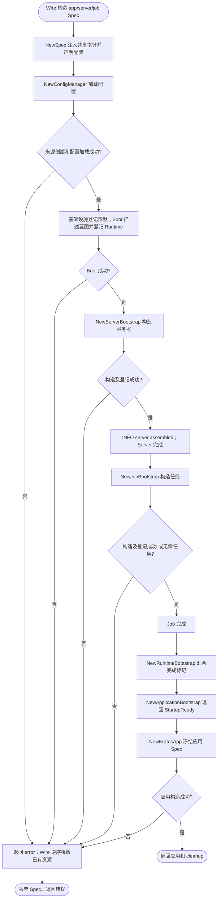
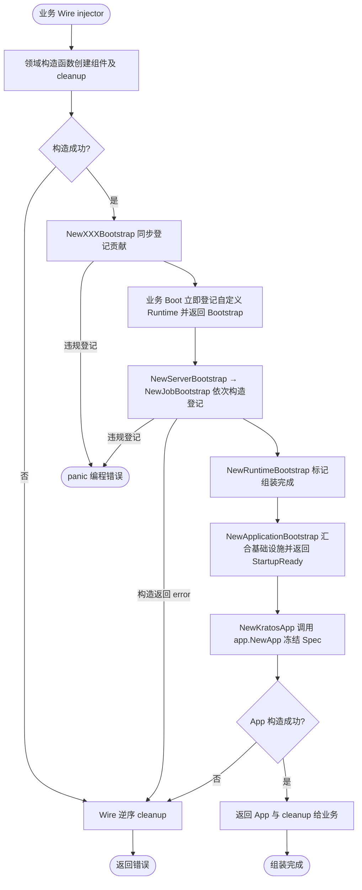
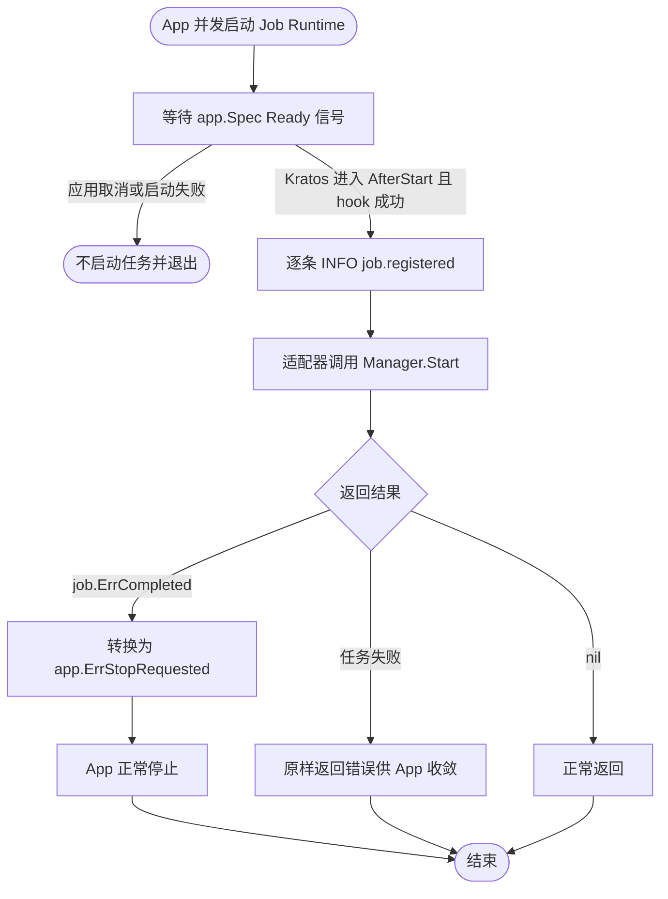
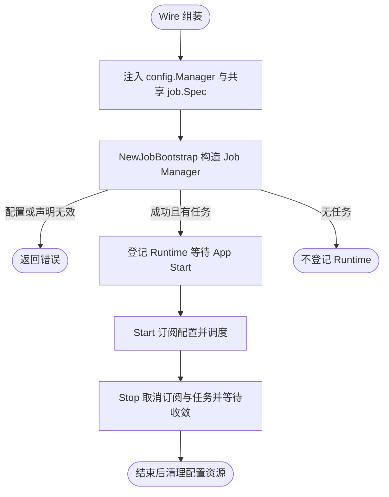
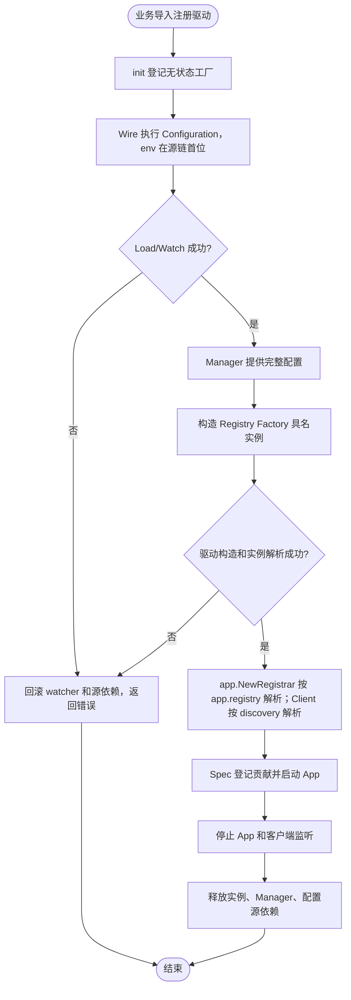
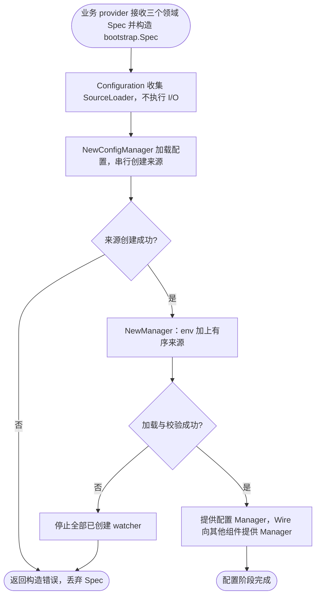

# bootstrap

AppInfo、Log、Tracing、Metrics Bootstrap 及其基础设施汇合入口集中在 `infrastructure.go`；Server、Job Bootstrap 及 Runtime 汇合入口集中在 `runtime.go`。日志 Bootstrap 安装 Kratos 模块适配器并借用实例输出；cleanup 恢复之前完整的全局绑定。配置源选择日志归属各 contrib 包。

`pkg/bootstrap` 负责跨组件集成与应用登记。领域包只声明自身依赖，提供普通 Go 构造函数；不导入 `app`、`bootstrap` 或 Wire 来参与应用组装。组件内部创建自身 SDK、配置解析与资源管理仍留在领域包中。

## 按应用选择组件（推荐）

`internal` 保存 service、biz、data、job 和 consumer 的实现；`cmd/<app>` 是唯一的应用组件组装点。
Wire 构造当前 provider 实际依赖的实现，业务 Boot provider 接收并填充 `*bootstrap.Spec`，也可在业务 provider 中直接注入同一份 `*server.Spec` 或 `*job.Spec`。

```go
// cmd/api/bootstrap.go：声明业务 HTTP；未注册 gRPC 服务时默认不创建 gRPC。
func Boot(_ bootstrap.InfrastructureBootstrap, spec *bootstrap.Spec, service *service.AuthService) (bootstrap.Bootstrap, error) {
    spec.Http().Register(func(srv server.HTTPServer) error {
        auth_service_pb.RegisterAuthServiceHTTPServer(srv, service)
        return nil
    })
    return bootstrap.Bootstrap{}, nil
}
```

worker 的 provider 则可以选择任务和消费者：

```go
func Boot(_ bootstrap.InfrastructureBootstrap, spec *bootstrap.Spec, task *jobimpl.Reconcile, worker *queue.Worker[email.Message]) (bootstrap.Bootstrap, error) {
    spec.Job().RegisterCron("reconcile", "@every 1m", task)
    spec.RegisterRuntime(worker)
    return bootstrap.Bootstrap{}, nil
}
```

以上业务类型由消费项目定义。队列使用 [queue.NewQueue](../queue/typed.md) 构造投递对象，再调用 q.Worker 绑定业务处理方法；通过 `spec.RegisterRuntime(worker)` 登记。Kafka 使用 `kafka.NewConsumerRuntime`，通过 `spec.RegisterKafkaConsumer(consumer)` 登记。登记立即写入共享 app.Spec，不负责构造或释放资源；cleanup 归原 provider，Start/Stop 由 App 管理。
`Http()` 只声明业务 HTTP 路由、WebSocket 和业务选项，不是全部 HTTP 监听的总开关。
业务 HTTP 即使未调用 `Http()` 也默认开启，只有 `server.http.disable: true` 关闭业务监听。
gRPC 仅在 `Grpc().Register(...)` 注册了至少一个非 nil 回调时默认开启；单独获取 Builder、配置中间件或 Option 不会开启。
`server.grpc.disable: false` 显式开启 gRPC（即使没有业务服务），`true` 显式关闭；省略时按服务注册决定。
两个协议的 Builder 均不提供 `Enable/Disable`，代码不能覆盖配置开关。以上配置构造时读取，修改需要重启。

`spec.Health().Checks(...)` 独立声明就绪检查；metrics/health 的地址、路径和开关由 `server.http.metrics/health` 配置决定。
省略监控地址时复用业务 HTTP；业务 HTTP 关闭后，显式指定地址的管理端点仍可独立启动。
地址归并、隔离和错误处理规则见 [server 文档](../server/README.md#监控端点监听地址)。
不需要业务 HTTP 的 worker 须配置 `server.http.disable: true`；若仍需探针或 metrics，显式配置对应管理地址。
Job Spec 始终由 Wire 提供；NewJobBootstrap 构造 Manager，任务为空时不登记 Runtime；空 Spec 仍默认创建业务 HTTP，但不会自动创建数据库、Redis 或消息客户端。

Wire 注册 `app.NewSpec`、`server.NewSpec`、`job.NewSpec`，分别构造唯一的领域声明；`bootstrap.NewSpec(application, servers, jobs, sources)` 借用这些指针，不创建副本。`BaseProviderSet` 已包含三个领域构造函数，使用它时不要重复注册；业务仍提供 bootstrap.Spec 的配置声明 provider。

`BaseProviderSet` 包含 `queue.NewObservability`，自动复用应用已有的 Logger、Tracing、Metrics；队列 provider 直接接收 `queue.Observability`。不要再注册返回相同类型的手写 provider。该入口不创建资源或增加 cleanup，详见 [Queue 默认观测依赖](../queue/typed.md#默认观测依赖)。

不用 BaseProviderSet 时，在现有 injector 中显式添加：

```go
wire.Build(
    app.NewSpec, server.NewSpec, job.NewSpec,
    newSpec, // 接收三个领域 Spec 并声明配置源，示例见下方 Configuration
    bootstrap.NewConfigManager,
    // 其余基础设施、业务 Boot 和 Bootstrap provider 同完整示例。
)
```

`NewServerBootstrap` 注入 `*app.Spec` 和 `*server.Spec`；`NewJobBootstrap` 注入 `*app.Spec` 和 `*job.Spec`；其他应用贡献 provider 与 `NewKratosApp` 直接注入 `*app.Spec`。手动组装同样必须复用传给 bootstrap.NewSpec 的实例，不能在各依赖处重新 NewSpec。原 `ApplicationSpec` 转发 provider 已删除。

领域 Spec 是共享可变声明，不拥有运行时资源，也没有 cleanup。直接注入领域 Spec 不会绕过 Wire 的组装顺序要求：业务声明 provider 仍应依赖 `InfrastructureBootstrap`，在 Boot 返回前完成修改；调用方应在组件构造开始前完成声明。

Boot 返回 `Bootstrap`，NewServerBootstrap 依赖该标记；NewJobBootstrap 显式依赖 ServerBootstrap，保证配置加载 → 业务声明 → Server → Job 的单向顺序；NewRuntimeBootstrap 再依赖 ServerBootstrap 和 JobBootstrap。
NewApplicationBootstrap 等待组件登记完成并返回 `StartupReady`，随后 NewKratosApp 才能冻结应用；这是唯一的 StartupReady 构造入口。这里的 `StartupReady` 是构造阶段完成标记，不等于运行期应用已经 Ready。运行期 Ready 由 `app.Spec` 在 Kratos 进入 AfterStart 且 Foundation 的 AfterStart hook 成功后关闭内部信号；它不等待阻塞型 Runtime.Start 返回。Job Bootstrap 登记的 Runtime 会等待该信号再启动任务。
Boot 不得依赖 ServerBootstrap、JobBootstrap 或 RuntimeBootstrap，否则形成循环；Boot 只接收 *bootstrap.Spec，直接调用 BeforeStart 等方法登记应用贡献。
停机策略直接使用 `app.NewStopPolicy(config, manager, logger)`，不依赖组件标记或服务器等待时间。建议总停机预算为服务器等待和资源清理预留足够时间，不做跨组件硬校验。
业务无需提供 time.Duration 适配函数；各 provider 的 cleanup 由 Wire 按实际依赖逆序释放。
不要为同一组件同时使用统一入口与独立 Bootstrap，否则会重复登记。

`bootstrap.Spec` 是业务蓝图，不维护阶段状态或检查调用顺序，仅支持串行声明。业务提供返回 `bootstrap.Bootstrap` 的构造函数，在其中注入 `*bootstrap.Spec` 并完成端点、任务和应用贡献的声明。Wire 通过完成标记保证先声明、再构造组件、最后创建 App；手动组装遵守同样的依赖顺序。

配置源应在提供 Spec 的构造函数中声明，供 NewConfigManager 使用。领域 Builder 是共享可变声明，应在 Boot 返回前完成修改；组件构造后修改蓝图不会重建已有资源。

`Configuration`、`RegisterRuntime`、`RegisterKafkaConsumer`、`AddContext`、`AddMetadata`、`AddEndpoints`、`AddSignals` 和全部 Hook 方法返回同一个 `*bootstrap.Spec`，可链式调用；Http/Grpc/Health/Job 仍返回对应领域 Builder。保留 nil 配置 loader 校验和底层 app.Spec 冻结后的写入保护。配置加载和资源构造的实际失败继续返回 error，由 Wire 逆序释放已成功构造的资源。

`NewRuntimeBootstrap(serverBootstrap, jobBootstrap)` 仅返回 `RuntimeBootstrap`，汇合组件完成标记；它不暂存、登记或重放 Runtime。`spec.RegisterRuntime` 直接调用共享 `app.Spec.RegisterRuntime`，因此自定义 Runtime 在业务调用当下登记，早于后续构造的服务器和任务。App 仍并发启动 Runtime，登记顺序不表示启动完成顺序。服务器资源由 NewServerBootstrap 的 cleanup 释放。

业务 Boot 可以这样链式登记（业务 Runtime 已由 provider 构造）：

```go
spec.RegisterRuntime(worker).
    AddMetadata(map[string]string{"component": "worker"}).
    BeforeStart(beforeStart).
    AfterStop(afterStop)
```

底层数据库、消息客户端和消费者资源的 cleanup 仍归各自 provider；运行时 Start/Stop 由 app 生命周期管理。
bootstrap.Spec 按模块提供 Http()、Grpc()、Health()、Job()；业务无需接收第二个 Spec。
生命周期方法直接挂在 spec 上；日志运行期策略来自 log 配置热更新，代码通过返回派生实例的 WithLevel 等方法定制，不提供 spec.Log()。
最终 app.NewApp 冻结 Wire 注入的同一份 app.Spec；基础设施 provider 直接登记该实例，受其冻结契约保护。
请使用 bootstrap.NewSpec 创建统一声明，不能使用其零值；app 包仍然不依赖 server、job、queue。



基础组装使用 `BaseProviderSet`，具体后端由具名驱动配置选择。

采用 local 文件、其他环境 Consul 的约定时，添加 [consulconfig.ProviderSet](../../contrib/bootstrap/consulconfig/README.md)。该集合通过 NewConfigSources 为 `bootstrap.NewSpec` 提供具体的 ConfigSources 描述，由 NewSpec 负责环境选择、校验和延迟加载，业务显式注入 AppInfo、LocalConfigPath 和 RemoteConfigDirName（无默认值）。RemoteConfigName 默认来自 AppInfo.Name()，可选择 `ProviderSetWithCustomRemoteConfigName` 并注入自定义名称；远程环境路径为 `{dir}/{env}/{name}.yaml` 和 `{dir}/{name}/{env}/*.yaml`。RemoteConfigPathsProvider 与 LocalConfigPathsProvider 契约定义在 bootstrap，默认实现位于 contrib：远程十二层、本地文件/目录/glob。BaseProviderSet 本身不包含此可选配置约定，也不重复提供 bootstrap.NewSpec。

| 构造函数 | 返回标记 | 组装职责 |
| --- | --- | --- |
| `NewAppInfoBootstrap(spec, info)` | `AppInfoBootstrap` | 登记身份并设置日志服务字段 |
| `NewLogBootstrap(spec, manager, logger)` | `LogBootstrap` | 订阅 log 配置、登记 Logger，安装全局 Logger；cleanup 取消订阅并恢复绑定 |
| `NewTracingBootstrap()` | `TracingBootstrap` | 设置日志中的 trace/span 动态字段 |
| `NewMetricsBootstrap(spec, meter)` | `MetricsBootstrap` | 将默认 Meter 注入 App Context |
| `NewServerBootstrap(application, servers, manager, logger, metrics, tracing, boot)` | `ServerBootstrap` | 按统一 Spec 构造和登记服务器，返回 cleanup |
| `NewJobBootstrap(application, jobs, configManager, logger, metrics, tracing)` | `JobBootstrap` | 按统一 Spec 构造、登记任务管理器并适配任务完成结果 |

构造参数统一按 Spec、配置依赖、组件专属依赖、观测依赖（Logger、Metrics、Tracing）、阶段完成标记排列；不存在的类别直接省略。纯阶段聚合函数按阶段顺序接收标记。参数位置只用于阅读，Wire 仍按类型解析依赖；组装顺序由完成标记建立，见下方流程图。

AppInfoBootstrap 和 MetricsBootstrap 只返回完成标记；LogBootstrap、ServerBootstrap、JobBootstrap 仍返回真实配置/构造错误，LogBootstrap 和 ServerBootstrap 额外返回 `func()` cleanup。冻结后登记及重复 AppInfo/Logger 登记会直接 panic；ServerBootstrap 在自身登记 panic 时释放刚构造的资源，但 Wire 只为 error 返回生成回滚分支，不保证 panic 时释放整条依赖链。其他资源的 cleanup 来自领域构造函数，由 Wire 在构造返回 error 或调用方退出时逆序执行。Bootstrap 不启动 Runtime。ServerBootstrap 由 NewServerBootstrap 在业务 Boot 后构造并登记服务器，再注入 NewRuntimeBootstrap 作为前置依赖；服务器 cleanup 独立归 Wire 所有。

`NewInfrastructureBootstrap` 汇合 AppInfo、Log、Tracing 和 Metrics 的贡献标记。业务 provider 接收 `InfrastructureBootstrap` 和业务依赖，返回 `Bootstrap`。随后 NewServerBootstrap → NewJobBootstrap 按顺序构造和登记服务器、任务，`NewRuntimeBootstrap` 等待二者完成后标记组装完成，`NewApplicationBootstrap` 汇合基础设施和 Runtime 标记，最后 `NewKratosApp` 调用 `app.NewApp` 冻结 Spec。所有入口共享 Wire 提供的应用 Spec，已独立登记的组件不要再通过统一入口重复选择。

Wire 只执行最终返回值的依赖链。仅把构造函数放进 set 不保证执行；业务必须让每项贡献被最终标记引用。阶段内只保留实际依赖：仅在最终业务 provider 接收基础设施标记，不会推迟其所有参数的构造。



构造错误由调用方处理，登记函数本身不重复记录日志。NewLogBootstrap 安装共享同一输出的全局派生 Logger；App Spec 另行派生带 `module=kratos` 的 Logger 传给 Kratos App，
不会给全局或其他组件日志附加该模块。全局派生 Logger 保留独立的 cleanup 身份，不增加固定 caller 跳过层数；默认模式由日志包统一识别 Kratos 全局函数及 Context/Helper 包装。深度统一按过滤包装后的调用点计数，详见 [日志 caller 规则](../log/README.md#caller-depth)。
日志全局安装沿用单应用、逆序释放的约定；多个应用并发安装或交错释放全局 Logger 不受本包保障。优先将实例 Logger 显式注入组件。

`JobBootstrap` 的适配只转换 Manager 返回的独立 `job.ErrCompleted`，任务失败保持原样。Job 包不依赖 App 的错误契约。Queue 的 `Worker[T]` 隐式满足 `app.Runtime`；应用入口通过 `q.Worker` 绑定业务方法，再调用 `spec.RegisterRuntime(worker)`。`Queue[T]` 只负责投递。



真实 Wire 生成、逆序 cleanup 与失败回滚由 `wire_integration_test.go` 在临时模块验证，不提交或手改生成副本。
该 fixture 还启动 HTTP 订单服务并访问临时 SQLite，检查事务提交、回滚、具名连接隔离和旧配置拒绝；
通过根目录 `make test-business` 运行，验收范围及发布检查见 [v2 迁移清单](../../MIGRATION_V2.md)。

## 可选依赖由 Wire 构造注入

`registry.Registrar` 直接注入 `NewKratosApp(spec, config, stopPolicy, registrar, ready)`。业务 Boot 可调用 `spec.DisableServiceRegistration()` 独立关闭服务注册与注销（默认不关闭），也可由业务 provider 返回 nil Registrar 禁用；开关不跳过 provider 构造和配置校验，不影响服务器或服务发现，详见 [App 开关说明](../app/README.md#独立关闭服务注册)；默认 BaseProviderSet 使用 app.NewRegistrar。

Job 不再有 Coordinator provider，NewJobBootstrap 直接接收应用 config.Manager。表达式、并发策略、runImmediately、maxPendingRuns 按配置 > 注册 > Task 默认值解析，热更新边界见 [Job 文档](../job/README.md)。



## 配置订阅与监控端点

Manager 已采用官方配置语义，不再提供 ConfigObservability collector；配置错误通过官方日志排查，业务是否应用更新应从对应组件观察。

NewServerBootstrap 同时登记业务监听与 `Runtime.ManagementServers()` 返回的独立监控监听；管理端口不加入业务服务发现。地址复用规则见 [server 监控监听配置](../server/README.md#监控端点监听地址)。

业务 Spec 显式开放组件声明、AddContext、AddMetadata、AddEndpoints、AddSignals 和四个生命周期钩子。
app.Spec 由私有字段持有，不再通过匿名嵌入暴露 RegisterAppInfo、RegisterLogger 或 Ready；
Queue Worker 和 Kafka ConsumerRuntime 可使用 RegisterRuntime()、RegisterKafkaConsumer() 声明，其他运行时使用 RegisterRuntime()。各 provider 按需直接注入相同的领域 Spec。

日志 Wire provider 使用 log.NewLogger 创建输出；NewLogBootstrap 注入 config.Manager 订阅 log，日志包校验并原子发布完整策略。策略优先级与 API 边界见 [日志文档](../log/README.md#三层策略与公共-api)。

## 驱动组装

使用 `BaseProviderSet`，业务提供已声明 Configuration 的 `*bootstrap.Spec`、`appinfo.AppInfo` 和 Boot。Job 复用应用 config.Manager，不需要单独的 Coordinator provider。

```go
// wireinject 文件中的业务 provider：Boot 已声明应用组件。
func wireApp(info appinfo.AppInfo, spec *bootstrap.Spec) (*kratos.App, func(), error) {
    wire.Build(bootstrap.BaseProviderSet, Boot)
    return nil, nil, nil
}
```

业务通过普通导入调用配置源添加函数，通过空导入选择注册驱动。源链及优先级在 Configuration 中显式声明，不再按环境自动选择本地/远程，也不自动拼接远程目录。main 检查构造错误，成功后 `defer cleanup()`，再调用 `application.Run()` 并处理错误。完整示例与生命周期见[具名驱动文档](../registry/README.md)。



默认资源 provider 只在 Wire 依赖图需要时构造。具体数据库、OSS、配置源和注册驱动由业务显式导入。`NewKratosApp` 继续接收 Registrar 接口，App 不访问驱动工厂。

根 `make test-business` 在临时模块生成并运行 Wire，验证完整驱动依赖图、失败回滚及 cleanup。已删除旧基础/Consul 组合集合和环境路径组装入口，不提供兼容别名。

## Configuration 配置阶段

业务提供 Spec 的构造函数应先完成配置声明，不能在依赖基础设施或业务服务的 Boot 中添加来源，避免配置依赖循环：

```go
func newSpec(application *app.Spec, servers *server.Spec, jobs *job.Spec) *bootstrap.Spec {
    return bootstrap.NewSpec(application, servers, jobs, bootstrap.ConfigSources{}).Configuration(
        file.AddConfigSource("configs/app.yaml"),
        consul.AddConfigSource("configs/production/app.yaml"),
    )
}
```

以上使用普通导入的 `contrib/config/file` 和 `contrib/config/consul`。`AddConfigSource` 复制路径并返回 `config.SourceLoader`，声明时不执行 I/O。Wire 使用 `newSpec` 提供唯一 Spec，`BaseProviderSet` 内的 `NewConfigManager` 先按声明顺序创建来源，再构造包含官方 env source 的 Manager；配置完整后才提供给其他组件。该 provider set 包含三个领域 NewSpec，但不包含 `bootstrap.NewSpec`；业务的 newSpec 是 bootstrap.Spec 的唯一 provider。

不使用 provider set 时，可显式组合 `app.NewSpec`、`server.NewSpec`、`job.NewSpec`、`newSpec`、`bootstrap.NewConfigManager` 与所需组件。没有额外来源时由 `bootstrap.NewSpec` 提供空声明即可。来源集合在构造阶段确定，运行中监听来源内容；没有全局配置源注册表，也不提供运行时增删来源接口。NewConfigManager 使用调用时已声明的来源，后续追加来源不会改变已有 Manager；正常 Wire 依赖链只构造一次 Manager。构造失败后应释放已有资源并放弃本次组装。返回 cleanup 由 Wire 逆序调用，取消 Manager 轮询并停止 watcher；不等待已开始的订阅回调，共享 Consul 客户端不释放。



可执行示例见 `examples/minimal/cmd/api/bootstrap.go`，对应生成入口为仓库根目录执行 `make -C examples/minimal generate`。
