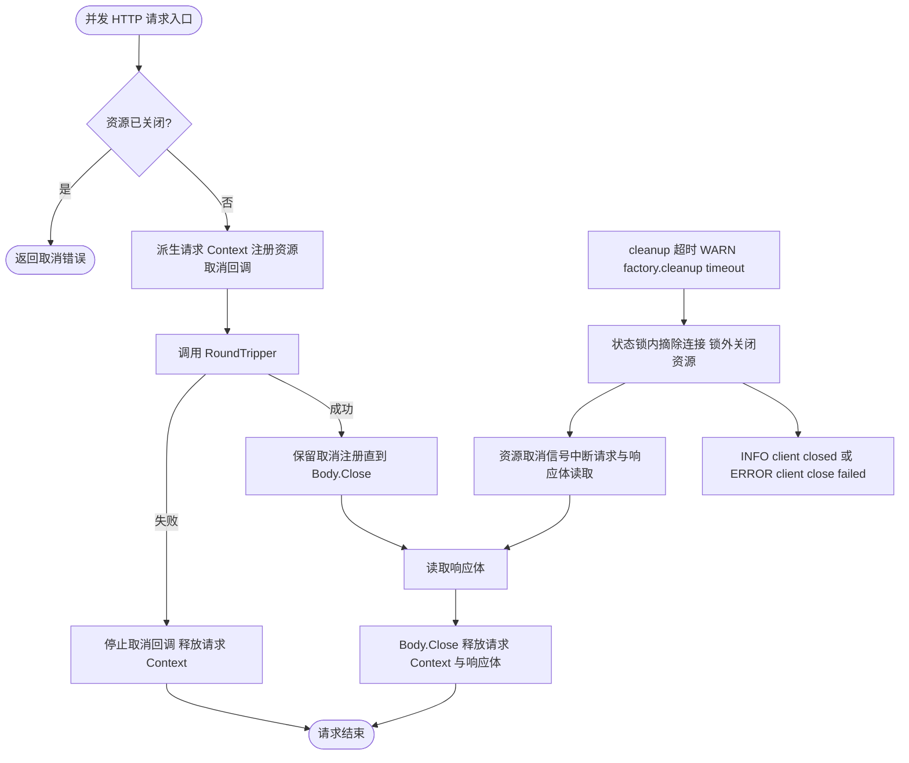
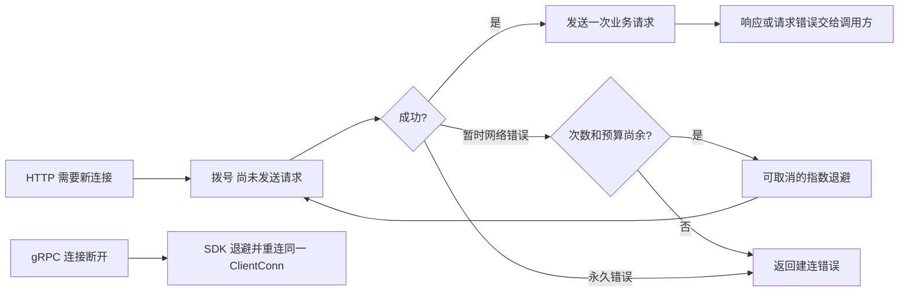
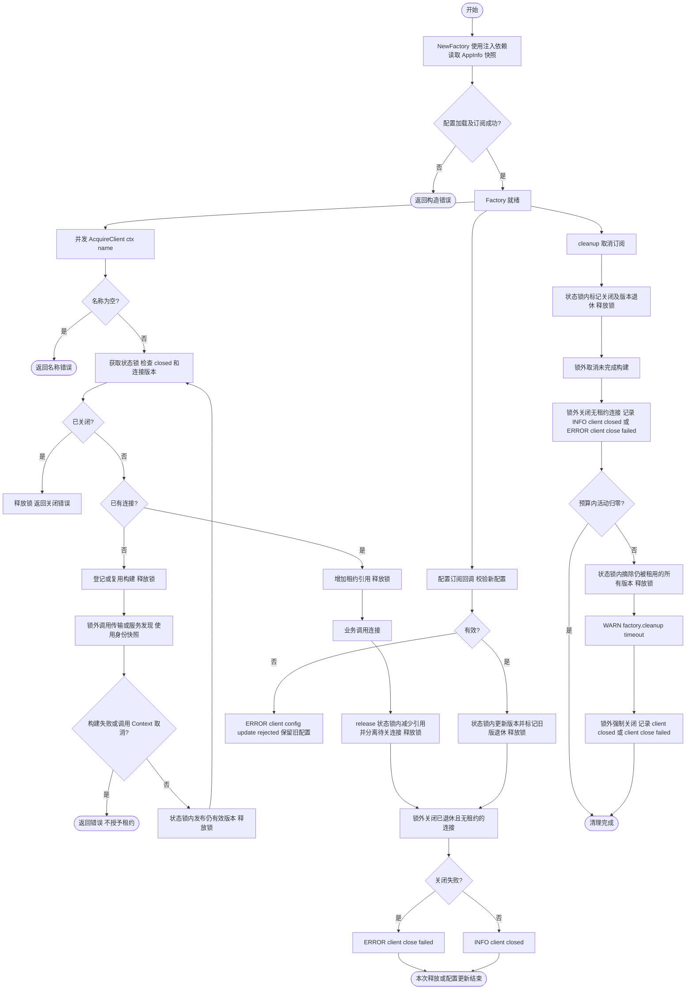
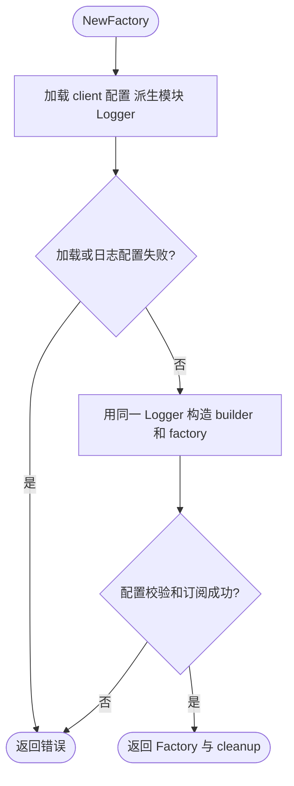

# Client

`pkg/client` 是业务与 Wire 构造 Kratos HTTP/gRPC 客户端的公共入口。`NewFactory` 直接接收配置、日志、应用身份、观测能力和服务发现；同包的 `builder.go` 负责传输及其中间件构造，`client_spec.go` 负责配置规范化，`pool.go` 负责构造结果和版本租约，`config.go` 与 `cleanup.go` 分别负责热更新和释放；实现类型不导出。独立熔断中间件保留在 `internal/middleware/circuitbreaker`。

```go
factory, cleanup, err := client.NewFactory(
    configManager, logger, appInfo, tracingProvider, metricsProvider, discovery,
)
if err != nil {
    return nil, err
}
// cleanup 由 Wire 持有，在业务停止使用客户端后执行。

httpClient, grpcConn, release, err := factory.AcquireClient(ctx, "orders")
if err != nil {
    return err
}
defer release()
// 在 release 前使用当前协议对应的 httpClient 或 grpcConn。
```

除 `discovery` 外，构造依赖必须非 nil，由组装层保证，构造函数不重复判空。服务发现仅在使用 `discovery:///...` 目标时需要；直连客户端可传 nil。名称不能为空，未配置的名称按 `discovery:///<name>` 构造默认 gRPC 客户端。

最小直连配置如下，先由配置源交给 config.Manager，再构造 Factory：

```yaml
client:
  clients:
    orders:
      protocol: GRPC
      target: "127.0.0.1:9000"
    catalog:
      protocol: HTTP
      target: "http://127.0.0.1:8000"
    payments:
      protocol: HTTPS
      target: "https://payments.example.com:443"
```

`AcquireClient(ctx, "orders")` 对应 map 的精确键名。服务发现示例为 `target: "discovery:///orders"`，需注入匹配的 Discovery；省略 target 也采用此形式。支持 `GRPC`、`HTTP`、`HTTPS`，省略 protocol 默认 GRPC。删除具名配置后再次获取会退回默认 discovery gRPC 配置，不会禁用该名称。

当前 Factory 的 gRPC 使用 `DialInsecure`，不提供 gRPC TLS/mTLS 配置，`GRPCS` 已移除；目标 URL 和单次调用选项不能启用 gRPC TLS。HTTPS 使用 TLS，标准 Transport 至少要求 TLS 1.2，并保留其已有 TLS 配置；自定义 RoundTripper/TLS 拨号函数须自行实现安全与取消策略。需要 gRPC TLS 时应由应用单独构造并管理原生客户端。

Factory 在构造时读取 `appInfo.Metadata()` 中的环境和主机名并保存独立快照。后续修改进程环境或原始 Metadata 不影响该 Factory 的路由。非 local 环境只匹配同环境节点；local 环境依次优先同环境同主机、同环境，均无匹配时保留全部节点。协议过滤和目标 URL 中的元数据过滤仍会继续应用。

每次成功获取连接都必须在调用完成后执行幂等 `release`。同名同版本客户端共享底层连接；配置更新后旧版本继续服务已有租约，最后一个租约释放后关闭。客户端连接配置可热更新，日志模块和 `client.cleanup_timeout` 变化需重启。cleanup 幂等取消订阅、阻止新租约、取消未完成构建，并最多等待 `client.cleanup_timeout`（默认 **30s**，必须为正的 Go duration）。预算耗尽后记录 WARN 并强制关闭仍被租用的当前及退役连接，晚到的幂等 release 不会重复关闭连接。该设置限制排空等待，不包含底层 Close 和日志输出耗时；业务回调及外部 I/O 仍必须遵守取消和有界返回约定，Go 无法强制终止任意阻塞函数。HTTP 正在执行的请求可能被取消，gRPC 在途 RPC 可能失败。它是 Wire 资源释放阶段的独立预算，不自动继承 app.stop_timeout。

HTTP 的 Invoke 和 Do 都绑定连接资源的取消信号。收到响应头不会提前取消 Context；
响应体读取期间仍受资源关闭控制，调用方必须关闭 Body。关闭 Body 只释放该请求的取消注册，
不取消调用方传入的 Context。自定义 RoundTripper 必须响应请求 Context，库不接管它的底层连接所有权。



`middleware.deadline.fallback_timeout` 缺失时默认 **10s**，未配置 `middleware` 或 `deadline` 也采用该默认值；仅在父 Context 没有截止时间时生效。显式设置 `fallback_timeout: 0s` 关闭回退超时，但仍遵守父 Context 和正数 `max_timeout` 的限制。路由未指定该字段时继承全局值，显式 `0s` 可关闭该路由的回退超时。热更新会区分“缺失”和“显式 0s”，删除显式值会恢复默认 10s。服务端与客户端共享[截止时间计算规则](../server/README.md#截止时间)。

启用 SRE 熔断时，`bucket` 必须为正数，`window` 必须是可精确表示为 Go `time.Duration` 的正时长，整除后的每桶时长至少为 1ns。`success` 必须在 `(0, 1]` 内且倒数有限；`request` 必须非负，零值表示不设最低请求数门槛。缺失字段沿用 Aegis 默认值（3s、10 桶、成功率 0.6、最低请求数 100），仍参与组合校验；禁用熔断时忽略其参数。`NewFactory` 在首次 RPC 前拒绝非法配置，配置订阅复用同一校验，任一客户端配置非法时整批更新被拒绝，现有版本与租约继续生效。

HTTP 非 2xx 错误响应体最多接受 **1 MiB**。解码器最多实际读取 1 MiB + 1 字节来判定超限，不依赖 `Content-Length`，同样适用于 chunked 响应。超限后关闭响应体，返回保留上游 HTTP 状态的受控错误；上限内仍按原有 JSON 业务错误契约解码，非 JSON 响应仍回退为 HTTP 状态错误。此限制只作用于错误响应体。


## 断线恢复

HTTP/HTTPS 使用独立克隆的标准 Transport。连接断开后，下次请求建连采用 100ms 起步、翻倍增长、带随机抖动的退避，最多 5 次尝试，每轮建连预算 30 秒；错误地址和其他永久错误直接返回。退避次数属于本次拨号，成功后自然重置，不共享可变重连状态。cleanup 会取消尚在拨号或退避的连接并关闭空闲连接。自定义 `RoundTripper` 或 TLS 拨号函数继续自行管理连接。

重试仅发生在 `DialContext`，没有新增请求级重试：POST 已发出但响应丢失时会返回错误，不自动重复业务操作。请求 Context 继续控制请求；标准库可能让取消请求的后台拨号继续以供复用，这些拨号受上述预算与资源 cleanup 控制。

gRPC 继续复用原来的 `ClientConn` 和 SDK 自动重连状态机，保留 1s 起步、1.6 倍增长、20% 抖动，将最大退避基准调整为 5s（含抖动最长约 6s）。连接尝试仍有自己的超时，因此黑洞网络的恢复时间还包含拨号耗时。普通 RPC 仍按原来的失败/超时语义返回；没有新增 RPC 重试策略或默认 `WaitForReady`。需要等待连接恢复的调用可自行使用有截止时间的 Context 和 `grpc.WaitForReady(true)`。





迁移时将 `NewBuilder(...)` 和 `NewFactory(configManager, builder)` 合并为上述六参数 `NewFactory`，Wire 不再注册 Builder provider。将 `AcquireClient(WithConnName(ctx, name))` 改为 `AcquireClient(ctx, name)`；`WithConnName`、`ConnNameFromContext` 已移除。

`ResolveClient`、`MakeGRPCConn`、`MakeHTTPClient` 已移除：统一使用 `AcquireClient` 并覆盖完整请求周期持有租约。使用 `protoc-gen-kratos-foundation-client-v2` 的项目应更新插件后重新生成客户端，使生成方法显式传入连接名称并在调用完成后 release。

## 模块日志

`client.log` 同时作用于工厂生命周期日志和 HTTP/gRPC 访问日志；禁用、级别和字段过滤在构造时固定。单个客户端的 `middleware.logging.disable` 仍可独立关闭访问日志。



## 单次调用选项

重新生成统一客户端后，可通过 `WithGRPCCallOptions`、`WithHTTPCallOptions` 追加本次调用选项。
方法签名不变，Factory 租约仍由生成代码在成功和错误路径上释放：

```go
ctx = client.WithGRPCCallOptions(ctx, grpc.WaitForReady(true))
reply, err := orders.CreateOrder(ctx, request)
```

多层 Context 按父选项在前、本次追加在后的顺序组合；具体选项优先级遵循底层协议库。生成代码只
使用实际选中协议的选项，另一协议的选项忽略。存取均复制切片，但不深拷贝选项中的指针或对象：
`grpc.Header` 等输出参数不能跨并发调用共享。CallOptions 不设置连接 TLS，WaitForReady 也不等于
无限等待；业务仍应设置 Context 截止时间。main 的旧函数名不保留，请迁移到新 API 后重新生成。


