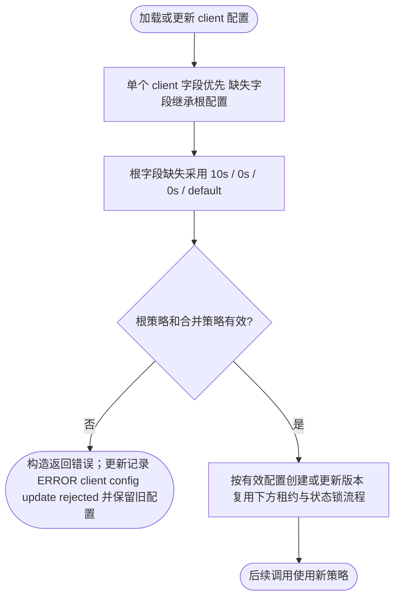
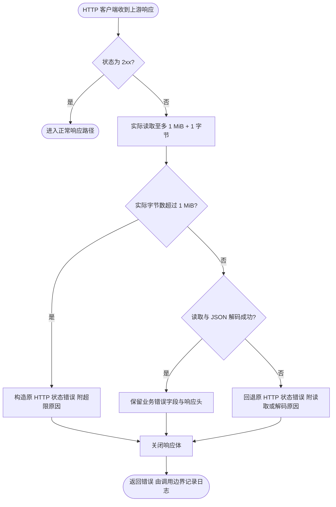
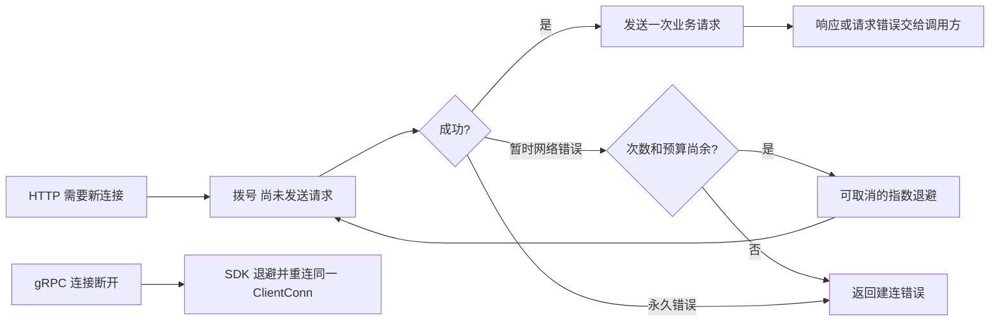
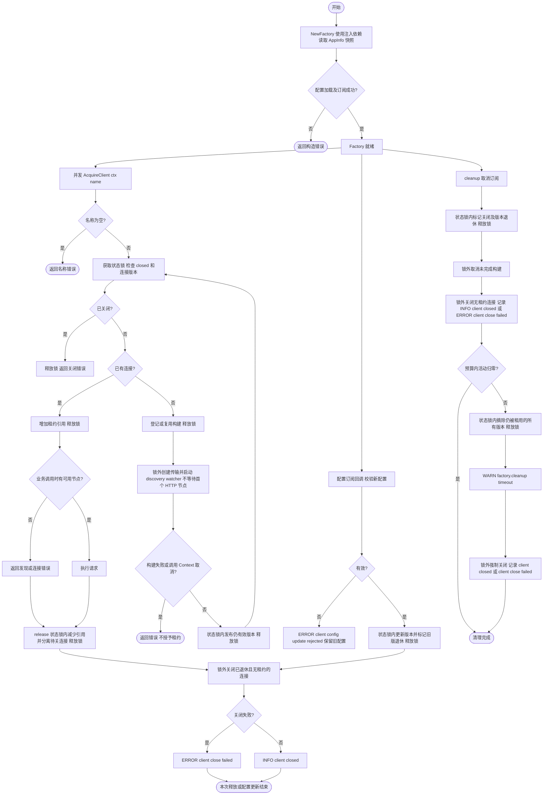
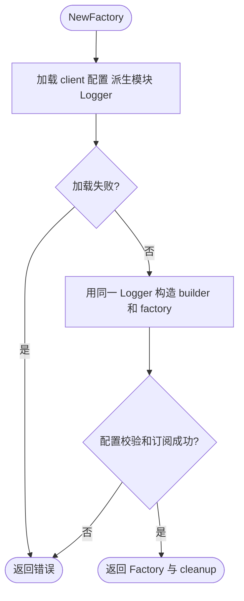
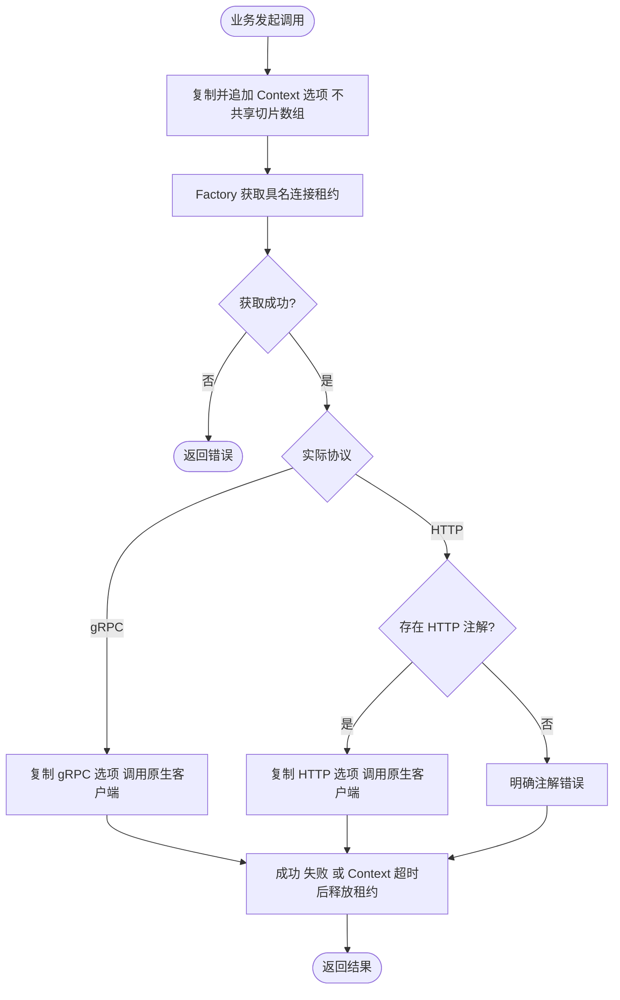
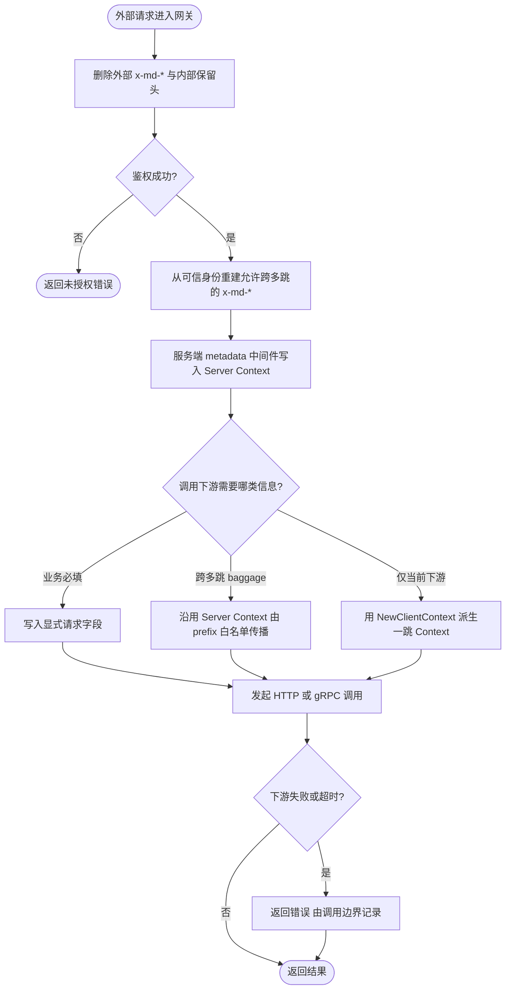
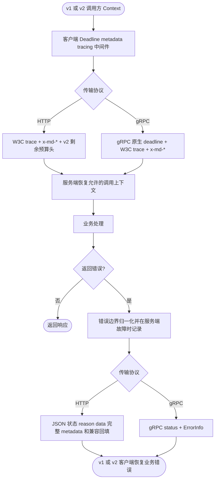

# Client

`pkg/client` 是业务与 Wire 构造 Kratos HTTP/gRPC 客户端的公共入口。`NewFactory` 直接接收配置、日志、应用身份、观测能力和具名 DiscoveryResolver；同包的 `builder.go` 负责传输及其中间件构造，`client_spec.go` 负责配置规范化，`pool.go` 负责构造结果和版本租约，`config.go` 与 `cleanup.go` 分别负责热更新和释放；实现类型不导出。独立熔断中间件保留在 `internal/middleware/circuitbreaker`。

```go
factory, cleanup, err := client.NewFactory(
    configManager, logger, appInfo, tracingProvider, metricsProvider, discoveries,
)
if err != nil {
    return nil, err
}
// cleanup 由 Wire 持有，在业务停止使用客户端后执行。

httpClient, grpcConn, release, err := factory.AcquireClient(ctx, "orders")
if err != nil {
    return err
}
defer release()
// 在 release 前使用当前协议对应的 httpClient 或 grpcConn。
```

除 `discoveries` 外，构造依赖必须非 nil，由组装层保证，构造函数不重复判空。服务发现仅在使用 `discovery:///...` 目标时需要；直连客户端可传 nil。客户端名称不能为空，未配置的名称使用默认 discovery 目标，并继承 `client.discovery`（根配置也省略时为 `default`）；需要提供对应 registry 实例能力。

最小直连配置如下，先由配置源交给 config.Manager，再构造 Factory：

```yaml
client:
  fallback_timeout: 10s
  max_timeout: 0s
  min_budget: 0s
  discovery: default
  clients:
    orders:
      protocol: GRPC
      target: "127.0.0.1:9000"
    catalog:
      protocol: HTTP
      target: "http://127.0.0.1:8000"
    payments:
      protocol: HTTPS
      target: "https://payments.example.com:443"
```

`AcquireClient(ctx, "orders")` 对应 map 的精确键名。服务发现示例为 `target: "discovery:///orders"`，`discovery` 省略或为空时继承 `client.discovery`，根配置也省略或为空时使用 `default`，需注入对应的 DiscoveryResolver；省略 target 也采用此形式。支持 `GRPC`、`HTTP`、`HTTPS`，省略 protocol 默认 GRPC。获取未配置的名称时同样继承根级 discovery；resolver 不存在或无法创建 watcher 时，Acquire 返回发现解析错误。

HTTP 服务发现客户端创建 watcher 后立即完成构建，不等待首个可用节点。这与 v1 的非阻塞构造语义一致，也避免调用者取消后留下等待节点的共享后台构建。`AcquireClient` 成功只表示客户端资源及 watcher 已建立，不保证当前已有可用地址；节点尚未发布时，实际 HTTP 请求返回发现错误，后续 watcher 更新可让同一个客户端开始工作。Acquire 调用 Context 只控制本次等待共享构建，已发布客户端与 watcher 由租约、配置更新和 Factory cleanup 管理。官方默认 merge 保留更新中省略的字段，不能通过从源中删除条目移除有效配置。

当前 Factory 的 gRPC 使用 `DialInsecure`，不提供 gRPC TLS/mTLS 配置，`GRPCS` 已移除；这是平台网关或 Service Mesh 终止并认证 TLS/mTLS 后的受信任内部明文链路，目标 URL 和单次调用选项不能启用 gRPC TLS。不得将该连接跨越不可信网络。HTTPS 仍使用 TLS，标准 Transport 至少要求 TLS 1.2，并保留其已有 TLS 配置；自定义 RoundTripper/TLS 拨号函数须自行实现安全与取消策略。需要应用自行管理 gRPC TLS 的例外场景，应单独构造和管理原生客户端，不改变 Factory 的平台责任边界。

Factory 在构造时读取 `appInfo.Metadata()` 中的环境和主机名并保存独立快照。后续修改进程环境或原始 Metadata 不影响该 Factory 的路由。非 local 环境只匹配同环境节点；local 环境依次优先同环境同主机、同环境，均无匹配时保留全部节点。协议过滤和目标 URL 中的元数据过滤仍会继续应用。

每次成功获取连接都必须在调用完成后执行幂等 `release`。同名同版本客户端共享底层连接；配置更新后旧版本继续服务已有租约，最后一个租约释放后关闭。客户端连接配置可热更新，`client.cleanup_timeout` 变化需重启，模块日志由 log.modules 热更新。cleanup 幂等取消订阅、阻止新租约、取消未完成构建，并最多等待 `client.cleanup_timeout`（默认 **30s**，必须为正的 Go duration）。预算耗尽后记录 WARN 并强制关闭仍被租用的当前及退役连接，晚到的幂等 release 不会重复关闭连接。该设置限制排空等待，不包含底层 Close 和日志输出耗时；业务回调及外部 I/O 仍必须遵守取消和有界返回约定，Go 无法强制终止任意阻塞函数。HTTP 正在执行的请求可能被取消，gRPC 在途 RPC 可能失败。它是 Wire 资源释放阶段的独立预算，不自动继承 app.stop_timeout。

HTTP 的 Invoke 和 Do 都绑定连接资源的取消信号。收到响应头不会提前取消 Context；
响应体读取期间仍受资源关闭控制，调用方必须关闭 Body。关闭 Body 只释放该请求的取消注册，
不取消调用方传入的 Context。自定义 RoundTripper 必须响应请求 Context，库不接管它的底层连接所有权。


根级 `client.fallback_timeout`、`client.max_timeout`、`client.min_budget` 为每个客户端提供默认值；根字段省略时分别为 **10s、0s、0s**。单个 `client.clients.<name>.deadline` 按字段覆盖根配置，未配置 deadline 或未列在 clients 中的名称也继承根配置。时长必须是合法的非负 Protobuf Duration，超出 Go duration 范围时沿用现有饱和转换；有效 min_budget 不能超过正数 fallback_timeout 或 max_timeout，合并后的客户端和路由策略也参与校验。

显式 `0s` 覆盖继承值：fallback_timeout 关闭无父截止时间时的回退超时，max_timeout 关闭本地最大耗时限制，min_budget 关闭最小剩余预算检查。父 Context 的截止时间仍生效。路由规则继续逐字段覆盖该客户端的有效策略。服务端与客户端共享[截止时间计算规则](../server/README.md#截止时间)。

`client.discovery` 为每个客户端提供默认发现实例，省略或空值默认 `default`；单个客户端的非空 discovery 优先，空值继承。直连目标不解析发现实例。根级四个字段支持热更新，新快照移除覆盖值后恢复继承（配置源默认 merge 会保留省略字段，仅删除源文件字段不保证移除有效值）；仅有效配置变化的客户端重建，已有租约继续持有旧版本。合并在独立副本上进行，不修改配置源快照。非法根时长（即使 clients 为空）或非法合并策略会拒绝整批配置；未配置名称的发现实例在实际获取时解析。




启用 SRE 熔断时，`bucket` 必须为正数，`window` 必须是可精确表示为 Go `time.Duration` 的正时长，整除后的每桶时长至少为 1ns。`success` 必须在 `(0, 1]` 内且倒数有限；`request` 必须非负，零值表示不设最低请求数门槛。缺失字段沿用 Aegis 默认值（3s、10 桶、成功率 0.6、最低请求数 100），仍参与组合校验；禁用熔断时忽略其参数。`NewFactory` 在首次 RPC 前拒绝非法配置，配置订阅复用同一校验，任一客户端配置非法时整批更新被拒绝，现有版本与租约继续生效。

HTTP 非 2xx 错误响应体最多接受 **1 MiB**。解码器最多实际读取 1 MiB + 1 字节来判定超限，不依赖 `Content-Length`，同样适用于 chunked 响应。超限后关闭响应体，返回保留上游 HTTP 状态的受控错误；上限内仍按原有 JSON 业务错误契约解码，非 JSON 响应仍回退为 HTTP 状态错误。此限制只作用于错误响应体。



## 断线恢复

HTTP/HTTPS 使用独立克隆的标准 Transport。

克隆结果的 `MaxIdleConnsPerHost` 为 0 时，Foundation 将其设为 **32**；非零设置保持原值。`MaxIdleConns`、`MaxConnsPerHost`、空闲超时和 KeepAlive 开关均保留，因此单个 Transport 的总空闲预算较小或关闭 KeepAlive 时，不保证保留 32 条连接。这里增加的是每主机空闲复用容量，不限制活动请求并发；HTTP/2 不按 HTTP/1.1 的并发数推算连接数。设置仅在 Transport 构造时读取，显式零值与省略无法区分。

连接断开后，下次请求建连采用 100ms 起步、翻倍增长、带随机抖动的退避，最多 5 次尝试，每轮建连预算 30 秒；错误地址和其他永久错误直接返回。退避次数属于本次拨号，成功后自然重置，不共享可变重连状态。cleanup 会取消尚在拨号或退避的连接并关闭空闲连接。自定义 `RoundTripper` 或 TLS 拨号函数继续自行管理连接。

重试仅发生在 `DialContext`，没有新增请求级重试：POST 已发出但响应丢失时会返回错误，不自动重复业务操作。请求 Context 继续控制请求；标准库可能让取消请求的后台拨号继续以供复用，这些拨号受上述预算与资源 cleanup 控制。

gRPC 继续复用原来的 `ClientConn` 和 SDK 自动重连状态机，保留 1s 起步、1.6 倍增长、20% 抖动，将最大退避基准调整为 5s（含抖动最长约 6s）。连接尝试仍有自己的超时，因此黑洞网络的恢复时间还包含拨号耗时。普通 RPC 仍按原来的失败/超时语义返回；没有新增 RPC 重试策略或默认 `WaitForReady`。需要等待连接恢复的调用可自行使用有截止时间的 Context 和 `grpc.WaitForReady(true)`。





迁移时将 `NewBuilder(...)` 和 `NewFactory(configManager, builder)` 合并为上述六参数 `NewFactory`，Wire 不再注册 Builder provider。将 `AcquireClient(WithConnName(ctx, name))` 改为 `AcquireClient(ctx, name)`；`WithConnName`、`ConnNameFromContext` 已移除。

`ResolveClient`、`MakeGRPCConn`、`MakeHTTPClient` 已移除：统一使用 `AcquireClient` 并覆盖完整请求周期持有租约。使用 `protoc-gen-kratos-foundation-client-v2` 的项目应更新插件后重新生成客户端，使生成方法显式传入连接名称并在调用完成后 release。

## 模块日志

工厂生命周期日志和 HTTP/gRPC 访问日志使用 module=client，禁用、级别和字段过滤统一由 `log.modules` 热更新；不再提供 `client.log`。单个客户端的 `middleware.logging.disable` 仍可独立关闭访问日志。

单个客户端设置 `middleware.tracing.disable: true` 或全局 `tracing.disable: true` 时，不记录、采样或导出客户端 Span，但仍创建或延续非采样 SpanContext，并向下游传播 TraceID/SpanID。这使同一请求中的业务日志继续包含 `trace.id`、`span.id`；不会创建 exporter。全局 Provider 在构造期禁用后，修改客户端中间件开关只能改变配置快照，不能恢复记录与导出，恢复真实 tracing 需要重启。



## 单次调用选项

重新生成统一客户端后，可通过 `WithGRPCCallOptions`、`WithHTTPCallOptions` 追加本次调用选项。
方法签名不变，Factory 租约仍由生成代码在成功和错误路径上释放：

```go
ctx = client.WithGRPCCallOptions(ctx, grpc.WaitForReady(true))
reply, err := orders.CreateOrder(ctx, request)
```

多层 Context 按父选项在前、本次追加在后的顺序组合；具体选项优先级遵循底层协议库。生成代码只
使用实际选中协议的选项，另一协议的选项忽略。存取均复制切片，但不深拷贝选项中的指针或对象：
`grpc.Header` 等输出参数不能跨并发调用共享。CallOptions 不设置连接 TLS，WaitForReady 也不等于
无限等待；业务仍应设置 Context 截止时间。main 的旧函数名不保留，请迁移到新 API 后重新生成。



共享 Grafana 组件面板、指标名称与采集边界见 [组件指标说明](../../deploy/observability/docs/components.md)。

## 可运行的组合用例

参见[核心组件集成用例](../INTEGRATION_TESTS.md)，从仓库根目录运行 `make test-components`，覆盖配置、SQLite 事务与 HTTP 客户端组合的成功、失败及资源释放场景。

## 跨服务 metadata 约定

业务必填参数应放在 protobuf/HTTP 请求字段中，不能依赖 metadata 隐式补全；只有不改变业务含义的请求级上下文适合 metadata。推荐按所有权分为三类：

- 需要安全地跨多跳传播的 baggage 使用 `x-md-` 前缀，例如网关鉴权后写入的租户或区域标记。公网入口必须先删除调用方提供的同名头，再从可信身份重建；服务端 Context 只有匹配 `middleware.metadata.prefix` 的键会自动向下游传播。
- 只发给当前下游的一跳参数使用 `metadata.NewClientContext` 显式写入调用 Context。显式 client metadata 不受发送端 prefix 限制，适合按目标服务选择的版本、幂等键或调用来源；接收端仍只把匹配自身 prefix 的头导入 Server Context。调用结束后不应把该派生 Context 复用于其他下游。
- 固定 `constants` 只保存当前客户端实例稳定且非敏感的标识。动态租户、用户凭据、token、cookie 和请求 ID 不应放入 constants。

Deadline、trace 和 request debug 由各自中间件拥有，不应通过通用 metadata 重复注入。`x-request-timeout-ms`、`grpc-timeout`、`traceparent`、`tracestate`、`baggage`、`x-md-service-name` 和 `x-foundation-debug` 均为框架保留键，通用 metadata 会在收发两端跳过，避免覆盖或追加出歧义多值。服务身份和授权优先使用 mTLS、网关签发凭据或针对当前下游显式生成的 `authorization`，不要把入站 Authorization/Cookie 作为 `x-md-` baggage 自动透传。多个普通来源写入同一个键时当前实现会追加多值，不提供覆盖优先级；每个键应只有一个明确所有者，接收方应拒绝意外多值。键名使用小写并保持紧凑，避免传播大对象或敏感数据。



## v1/v2 跨服务兼容范围

下表描述当前 Foundation v2 与 v1 服务互调时可依赖的线协议契约。这里的 v1 指继续使用旧 HTTP JSON、gRPC `ErrorInfo`、`x-md-*` URL 转义和 W3C TraceContext 的服务。

| 调用方向 | HTTP | gRPC |
| --- | --- | --- |
| v1 → v2 | HTTP 状态、reason、`reason_code`、data、响应头可恢复；`x-md-*` 和启用后的 W3C trace 可读取。v1 不发送剩余预算头，因此 v2 使用自身 Deadline 策略，并通过连接取消感知调用方超时 | gRPC 原生 deadline/cancel、`x-md-*`、W3C trace 和 `ErrorInfo` 可读取 |
| v2 → v1 | Encoder 保留完整 metadata，并回填 `http_data`、单值 `http_header`；v2 同时发送 `x-request-timeout-ms`，旧服务即使忽略该头，调用方截止时间仍会取消 HTTP 请求 | gRPC 原生 deadline/cancel、`x-md-*`、W3C trace、reason、`reason_code`、data 和诊断 metadata 可读取 |

只有接收端允许的 `x-md-*` 才作为跨版本业务 metadata 保证；v1 客户端曾经宽泛转发 Server Context，不代表 v2 接收端会接受非白名单头。trace 使用标准 `traceparent`、`tracestate` 和 `baggage`；v1 端必须启用其 tracing 中间件，v2 即使关闭采样也会保留关联 ID。

两个旧线协议边界无法由 v2 单方面补齐：v1 HTTP 没有发送剩余毫秒预算，因此只能依靠 v2 本地 Deadline 与 HTTP 取消；旧 gRPC 端没有 `http_code` 恢复契约，422 等非标准映射状态在旧端可能显示为 500，但 reason/`reason_code` 仍可用于业务判断。需要跨 gRPC 精确保留这类 HTTP 状态时，两端都应升级到 v2，或改用标准可映射状态。HTTP 响应头不跨 gRPC 传播，这是协议边界，不属于兼容字段。



## 请求 debug

向客户端调用传入 `request.WithDebug(ctx)` 派生的 Context，HTTP/gRPC 会传递该状态。`client.clients.<name>.request_debug.propagate` 默认 true；对外部服务可设为 false。它只控制出站传播，不清除本地状态，也不受通用 metadata 的 disable/prefix 控制。`accept_incoming` 字段仅服务端消费。

该字段随 `clients` 配置更新重建客户端；已有租约使用原策略，新租约使用新策略。gRPC stream 在建立时写入 metadata，原生 outgoing metadata 中的旧 debug 值会被清除。完整边界与流程见 [request](../request/README.md)。

## 驱动组装入口

应用通过 `spec.Configuration` 声明额外来源，由 `bootstrap.NewConfigManager` 构造默认包含官方 env source 的配置源链，使用 `registry.NewFactory` 管理具名注册与发现实例，由 `bootstrap.BaseProviderSet` 完成组装。注册与发现仅提供驱动入口。详见[驱动组装与迁移](../registry/README.md)。

`NewFactory` 接收 `DiscoveryResolver`，按每个 `client.clients.<name>.discovery` 选择实例。发现目标必须指定有效实例，错误在构造或配置更新校验时返回；更新被拒绝时保留原客户端。切换实例名称会重建连接。直连目标不使用发现配置。单个 Discovery 注入入口已删除。
