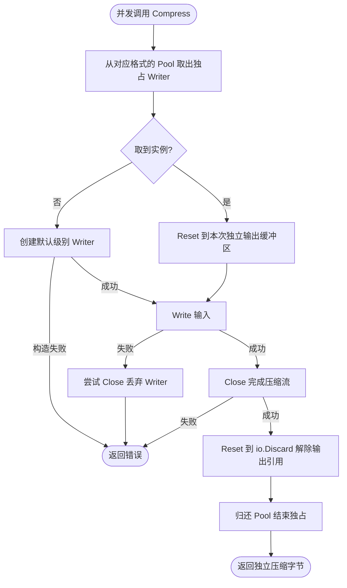

# compress

`compress` 为 Go 标准库中的 gzip、原始 DEFLATE 和 zlib 提供面向 `[]byte` 的内存压缩与解压辅助函数。它适合处理中小型、已经完整载入内存的数据；流式数据应直接使用标准库的
reader/writer。

## 引入

```go
import "github.com/jaggerzhuang1994/kratos-foundation/v2/pkg/compress"
```

## API

| 格式         | 压缩              | 解压                | 带输出上限的解压         |
|--------------|-------------------|---------------------|--------------------------|
| gzip         | `CompressGzip`    | `DecompressGzip`    | `DecompressGzipLimit`    |
| 原始 DEFLATE | `CompressDeflate` | `DecompressDeflate` | `DecompressDeflateLimit` |
| zlib         | `CompressZlib`    | `DecompressZlib`    | `DecompressZlibLimit`    |

压缩函数使用对应标准库实现的默认压缩级别。带 `Limit` 后缀的函数在解压结果超过 `maxBytes` 时返回 `ErrOutputTooLarge`；
`maxBytes <= 0` 表示不限制输出大小。

```go
compressed, err := compress.CompressGzip([]byte("hello"))
if err != nil {
    return err
}

plain, err := compress.DecompressGzipLimit(compressed, 1<<20)
if errors.Is(err, compress.ErrOutputTooLarge) {
    return fmt.Errorf("payload is too large: %w", err)
}
if err != nil {
    return err
}

```

## 使用约束

- 不可信压缩数据必须使用带 `Limit` 后缀的函数，避免压缩炸弹耗尽内存。
- `DecompressGzip`、`DecompressDeflate` 和 `DecompressZlib` 不限制输出大小，仅适用于大小已受其他边界控制的数据。
- DEFLATE API 处理的是不带 zlib 或 gzip 封装的原始 DEFLATE 流；三种格式不能混用。
- 返回的字节切片由调用方拥有，可以安全修改。

## Writer 复用与所有权

每种压缩格式各有一个 `sync.Pool`，调用从取出到归还期间独占 Writer，不在压缩期间持有包级互斥锁。输出缓冲区不入池；成功关闭后通过 `Reset(io.Discard)` 解除 Writer 对输出的引用，再归还池。构造、写入或关闭失败时返回原有错误，失败 Writer 不归还；本包不额外记录高频日志。

池可被 GC 清理，复用不是保证；并发峰值可能暂时保留多个约数百 KiB 的压缩工作区。它不限制并发、不承担背压，也不是严格内存上限。大消息的返回缓冲区不由池保留，生命周期由调用方控制。调用期间不得并发修改输入字节。



基准在仓库根执行：`go test ./pkg/compress -run '^$' -bench BenchmarkCompressionReuse -benchmem -count=6`。涵盖随机数据串行压缩和重复文本并发压缩；分配下降不等于所有输入的耗时都同比下降。
