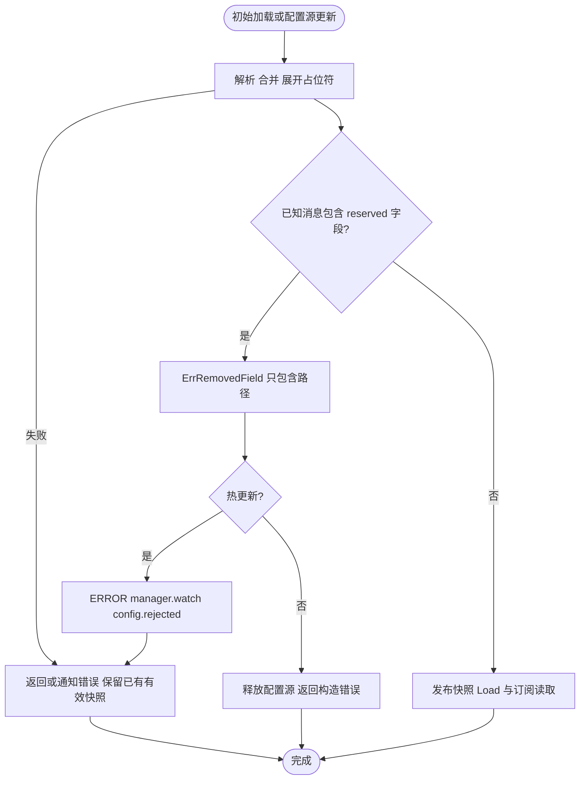
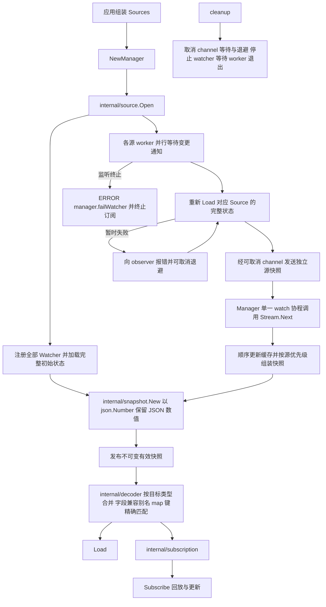
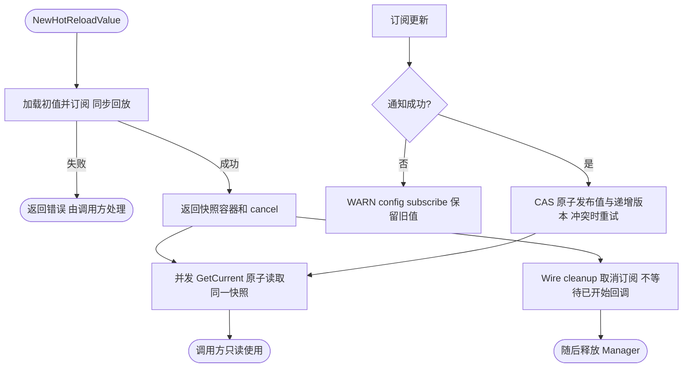
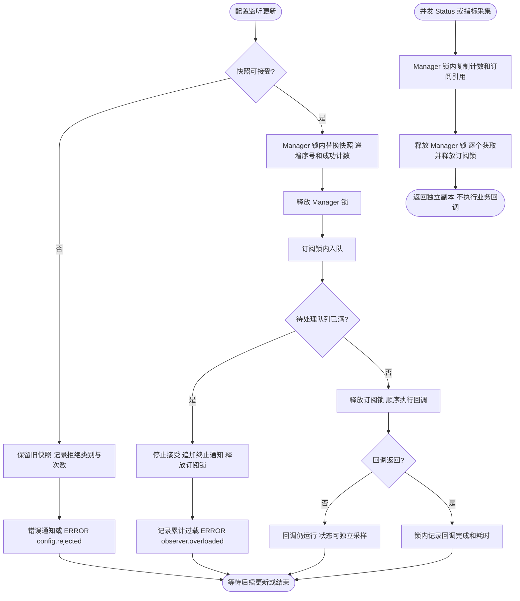

# 配置管理

`pkg/config` 负责应用全部配置源的加载、监听、优先级合并、类型解码和订阅生命周期。应用层只需要按顺序组装 `Sources`，不需要直接调用 Source 的 `Load`、`Watch` 或 Watcher 的 `Stop`。

## 基本用法

```go
sources := config.NewSources()
sources = append(sources, fileSources...)
sources = append(sources, consulSources...)

manager, cleanup, err := config.NewManager(sources)
if err != nil {
	return err
}
defer cleanup()

var server ServerConfig
if err := manager.Load("server", &server); err != nil {
	return err
}
```

`Sources` 是有序列表，后面的源优先级更高。每个源内部返回的多个 `KeyValue` 也保持原始顺序。map 会递归合并，slice、标量和显式 `null` 整体覆盖。

Manager 在首次加载及每次更新发布前检查 Foundation 协议中的 reserved 字段。
已删除字段即使为 null 或空对象也会返回 `ErrRemovedField`，错误只包含字段路径，不包含值。
其他业务字段仍允许存在；protobuf Load/Subscribe 也检查对应消息的 reserved 字段。
首次加载失败会释放配置源；非法更新记录 `manager.watch | config.rejected`，通知订阅错误并保留旧快照，修正后可继续更新。
`Load("", &target)` 可读取整个有效配置。

| 已删除配置 | 迁移方式 |
|---|---|
| 顶层 `log` | 使用 `LOG_*` 环境变量及 `pkg/log` 包级 `WithXXX` |
| 顶层 `metrics` | 显式构造 Provider，HTTP 暴露开关使用 `server.http.metrics` |
| 顶层 `job`、`queue` | 使用各组件的强类型 Spec/构造配置并显式组装 |
| `app.disable_registrar` | 在组装层决定是否登记 Registrar |
| `server.middleware.timeout`、`client.clients.*.middleware.timeout` | 改为 `deadline`，明确设置 fallback/max/min 预算 |
| `database.connections.*.replicas/datas/trace_resolver_mode` | 改为显式连接选择；本版不恢复自动读写路由 |
| `server.log`、`tracing.log`、`tracing.tracer_name` | 使用 Logger 派生和 Provider 的 instrumentation scope |
| `redis.connections.*.read_only/disable_indentity` | 删除已移除配置；拼写改为 `disable_identity` |

App、Server、Database 保留字段恢复 main 的 wire 编号；删除字段的编号与名字保留，
Deadline 使用新的字段编号，旧 Timeout 二进制不会被误解释成新策略。
这不代表旧配置可以不迁移：已删除能力仍需按上表处理。
恢复编号会破坏此前未发布 v2 的二进制配置，请从 YAML/JSON 重新生成，勿复用旧 v2 二进制。





四个 `internal` 包都是单一职责叶子包，彼此不互相依赖；非导出 manager 是唯一编排层。
`source` 管理配置源生命周期，`snapshot` 计算有效配置，`decoder` 写入业务对象，
`subscription` 管理每个订阅的顺序投递和取消。
`source` 的缓存只由 `Stream.Next` 更新，源加载可以并行，汇总和发布顺序保持一致，避免完整快照倒退；缓存不需要共享锁。

## Load

`Load` 的 target 必须是已经分配的非 nil 指针：

```go
effective := new(ServerConfig)
defaults := &ServerConfig{Port: 8080}
if err := manager.Load("server", effective, defaults); err != nil {
	return err
}
```

默认值最多传一个，并且必须与 target 的具体指针类型完全一致。Manager 先复制默认值，再用配置字段覆盖；调用方可以安全复用包级默认值。每次加载前都会清空 target，配置删除字段后不会残留旧数据。

JSON 配置源和默认值在合并时使用 `json.Number` 保留数值文本，`int64`、`uint64` 的完整范围以及嵌套数组中的整数不会经过 `float64` 舍入；订阅更新和默认值回退保持相同精度。数字占位符也保留原始文本。JSON 源必须是单个完整值，非法内容或尾随的第二个值都会报错。

普通 Go 类型使用 JSON 语义解码；protobuf message 使用 `protojson`，支持 proto 字段名、JSON 字段名和 duration 等 protobuf 类型。

## Subscribe

```go
cancel, err := manager.Subscribe(
	"server.middleware.deadline",
	new(DeadlineConfig),
	func(key string, value any, err error) {
		if err != nil {
			// 根据 errors.Is 判断错误类别。
			return
		}
		latest := value.(*DeadlineConfig)
		_ = latest
	},
	&DeadlineConfig{Timeout: time.Second},
)
if err != nil {
	return err
}
defer cancel()
```

Subscribe 在返回前同步回放一次当前值。后续每次回调都会分配新的同类型对象，调用方可以直接保存。单个订阅的回调按顺序执行，同时最多运行一个；不同订阅互不阻塞。

每个订阅有独立的有界更新队列。回调持续落后时，该订阅会在已接受更新之后收到 `ErrObserverOverloaded` 并停止。cancel 和 Manager cleanup 不等待已经开始的业务回调，因此回调仍需自行保证最终可返回。

## 读取热更新快照

只需要读取最新值时，可使用 `NewHotReloadValue`。以下片段中的 manager 已按前文构造；泛型参数是值类型，默认值和读取结果为其指针：

```go
type Limits struct {
    MaxBatch int `json:"max_batch"`
}
hot, cancel, err := config.NewHotReloadValue[Limits](
    manager, "business.limits", &Limits{MaxBatch: 100},
)
if err != nil {
    return err
}
defer cancel() // Wire 中由 provider 返回，在 Manager cleanup 前取消订阅。
latest, version := hot.GetCurrent()
maxBatch := latest.MaxBatch
_ = maxBatch // 使用只读字段处理本次工作。
_ = version  // 可用于避免对同一版本重复计算。
```

`GetCurrent` 返回一致的值与版本对，值是共享只读快照，不能修改其字段或嵌套 map/slice；需要修改时先复制，嵌套对象也应复制。原子发布只保护快照指针，不保护调用方对值的写入；修改共享值会绕过版本机制，并可能导致并发数据竞争。版本是本实例的成功通知计数，不是配置中心 revision，也不应假定初始版本为零。

首次加载或订阅失败会返回错误；后续错误记录 `config subscribe` WARN 并保留旧值。辅助类型不校验业务约束、不暴露订阅终止状态，也不会自动重订阅；需要可靠感知过载或监听终止时，使用 `Subscribe` 的错误回调或 `StatusReader`。取消订阅后已开始的回调仍可能结束，读取对象仍保留最近快照；调用方负责停止使用并释放引用。



## 错误语义

使用 `errors.Is` 判断稳定错误：

- `ErrNotFound`：key 不存在且没有提供默认值。
- `ErrManagerClosed`：cleanup 已经开始或完成。
- `ErrWatcherStopped`：底层 watcher 永久终止；已有订阅收到终止错误，后续 Load 和 Subscribe 也返回该错误。
- `ErrObserverOverloaded`：单个订阅队列写满，该订阅已经停止。

更新时 Source 重载失败、JSON/YAML 解析失败、占位符解析失败或目标类型解码失败，会通过 observer 的 err 报告。可恢复错误不会终止订阅；Manager 保留最后一份有效快照，后续有效更新可以继续发布。

## 占位符

字符串配置支持引用其他标量路径：

```yaml
host: localhost
port: 8080
address: ${host}:${port}
optional: ${missing:fallback}
```

缺失且没有 fallback、引用 map/slice 或出现循环引用时，快照构建失败。配置源之间按原始键名合并；默认值与结构体字段合并时会兼容大小写、下划线、连字符和空白差异；业务 map（含 protobuf map）的键始终精确匹配，例如 `order_service` 与 `order-service` 是两个不同资源名。

file 和 Consul 适配器通过 `NewSources` 返回各自的底层源，由应用/Wire 按优先级组合后交给 `NewManager`。配置监听、重载和合并统一由 Manager 驱动。

## 运行状态观测与过载处置

`NewManager` 返回的实例还实现 `config.StatusReader`，不修改已有 Manager 接口，因此自定义
Manager 不必为编译兼容而实现观测。`Status()` 返回独立副本，不包含配置值或原始错误信息：

```go
status := manager.(config.StatusReader).Status()
// WatcherRunning / Closed：配置监听和生命周期状态。
// Revision / AcceptedUpdates / RejectedUpdates / LastSuccess：快照接受状态。
// Overloads：生命周期累计过载次数，订阅移除后仍保留。
// Subscriptions：当前注册订阅的 key、Accepting、Pending、Running、RunningSince。
```

Revision 是本地快照序号，初始加载计为 1，不是配置中心的版本。LastErrorCode 是最近记录的
错误类别（source_error、invalid_snapshot、watcher_stopped、observer_overloaded），后续成功发布
会清空它；历史过载必须看累计 Overloads。Callbacks 和 CallbackDuration 包含首次同步回放和错误
通知，表示已结束回调的次数及累计耗时，不表示业务应用成功，也不包含仍未结束回调的耗时。

每个订阅最多接受 16 条待处理普通通知；过载时追加一条终止通知，因此 Pending 可达到 17。
正在执行的回调阻塞时，Status 仍可读取 Accepting=false 和 Running=true，不依赖终止通知送达。
cancel 或终止交付后订阅会移出列表；已经开始的回调仍需自行返回，列表不是进程 goroutine 清单。
Manager 与各订阅分别采样，不保证所有字段来自同一个全局原子时刻。

推荐保留现有“有界顺序投递，过载终止”契约：回调只做短时本地应用，避免慢 I/O；接入过载告警，
必要时停止接入依赖该配置的新请求；确认旧回调已结束或重建受影响组件后再重新订阅，首次回放会拿到当前配置。旧回调仍在运行时
直接重订阅，可能使旧回调晚到的写入覆盖新配置。不要无限自动
重订阅来掩盖阻塞，也不要仅扩大队列。只保留最新值会丢弃中间版本，属于另一种契约，本实现不采用。

指标接入见 [bootstrap 配置观测](../bootstrap/README.md#配置观测组装)。关键配置可通过 server 的
ReadinessCheck 显式检查 WatcherRunning 和所关心订阅状态；框架不把任意可选订阅失败自动升级为
全服务不可用。订阅已移除时也应按预期订阅数量判断，不能把空列表当作健康。


