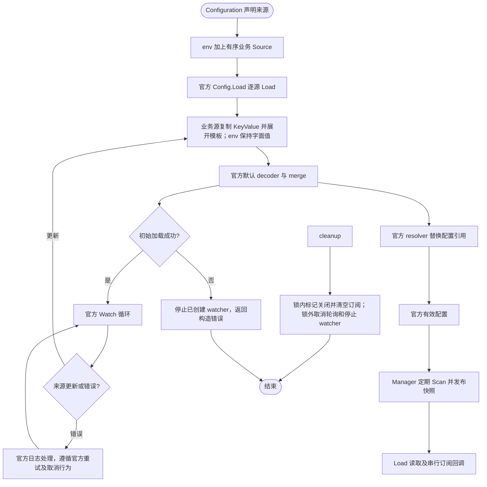
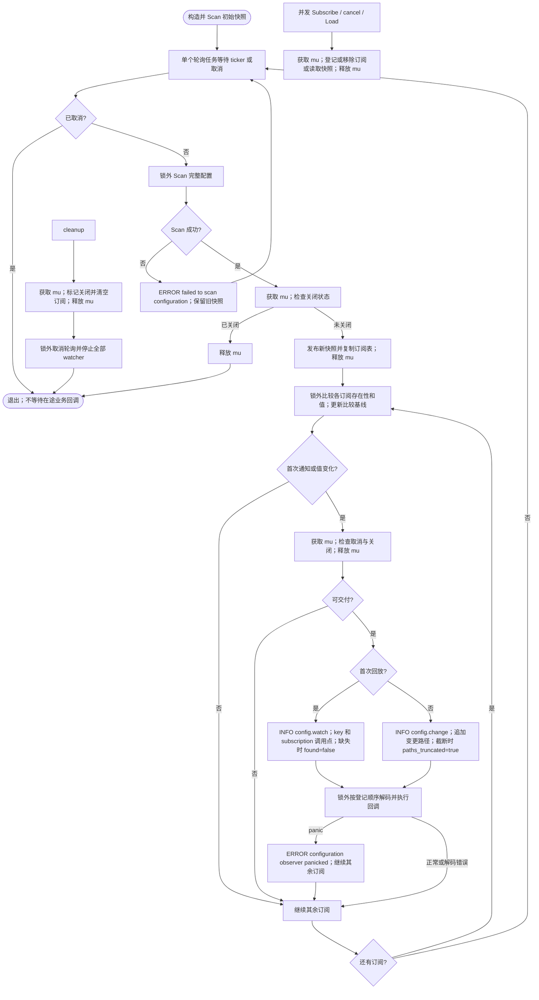
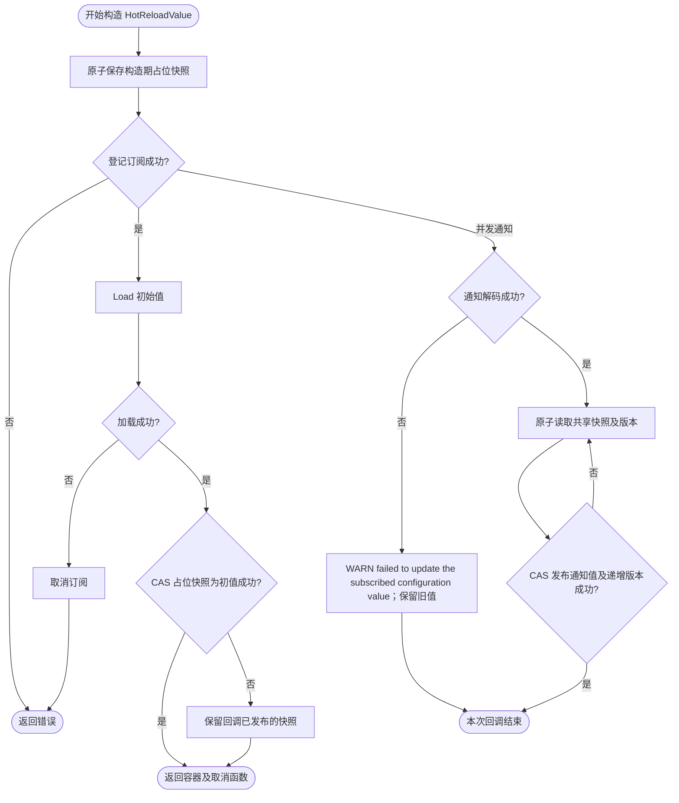

# 配置管理

Manager 内部持有 Kratos 官方 `config.Config`，使用其默认 decoder、默认 merge、默认 resolver、值缓存和监听循环。Foundation 组装来源、预处理环境模板，每轮 Scan 一次完整配置并持有不可变快照，按订阅 key 比较变化并串行通知。没有自定义源合并、内部根节点、订阅队列或配置健康指标。

## 组装

```go
spec := bootstrap.NewSpec(app.NewSpec(), server.NewSpec(), job.NewSpec(), bootstrap.ConfigSources{}).Configuration(
    file.AddConfigSource("configs/app.yaml"),
    consul.AddConfigSource("configs/production/app.yaml"),
)
manager, cleanup, err := bootstrap.NewConfigManager(spec)
if err != nil {
    return err
}
defer cleanup()
```

手工组装片段使用 `pkg/app`、`pkg/server`、`pkg/job`、`pkg/bootstrap` 和普通导入的 `contrib/config/file`、`contrib/config/consul`；完整可运行示例见 [minimal](../../examples/minimal/README.md)。Wire 场景由业务 provider 接收同一组领域 Spec 并返回已声明的 bootstrap.Spec，`bootstrap.NewConfigManager` 在依赖 Manager 的组件之前执行。来源集合只在构造阶段确定，内容按各 Source 的 Watch 能力更新。默认总是先添加官方 `config/env.NewSource()`，无前缀筛选，不改变键名。

也可直接调用 `config.NewManager(config.Sources{source1, source2})`，适配官方或自定义 Source；`config.NewSources(...)` 仅过滤 nil。构造失败停止已经创建的 watcher；成功后 cleanup 幂等取消轮询、清空订阅并停止全部 watcher，包括某个 Stop 返回错误时的其他来源。已获准执行的回调不等待、不强制中断；它返回后轮询退出，因此回调也可调用 cleanup。业务回调必须能自行返回，否则会阻塞本 Manager 的通知任务。官方 Close 不等待最后的监听日志协程结束。共享 Consul 客户端不归 Manager 释放。



## 来源与合并

初次加载按列表顺序合并，后加载覆盖前加载。热更新由各来源的官方 watcher 循环独立合并到当前配置，不重新计算全源快照。因此：

- 后续更新不保证固定来源优先级；低优先级来源的更新也可能覆盖原来的高优先级值。
- 新结果省略字段或返回空列表，不会自动删除旧字段，也不会恢复低优先级来源的旧值。
- 数组、零值和 null 的行为沿用当前依赖版本的官方默认 merge，不额外承诺整体替换或清空。
- JSON 数字使用官方默认解码，不提供 `json.Number` 精度保证。大整数建议用字符串字段表达。
- 更新使用 `Watcher.Next` 直接返回的 KeyValue，不额外调用 Source.Load。自定义 watcher 应返回可供官方 merge 处理的数据；`FullSnapshot` 扩展已移除。
- 没有全局 reserved 字段校验及“完整快照校验后原子发布”的保证。业务 Load/Subscribe 解码 protobuf 时仍检查目标消息声明的保留字段；Foundation 自带配置协议已清除 reserved。

## 环境变量模板

业务 Source 的 `Load` 和 `Watcher.Next` 返回数据后、官方 decoder 解析 JSON/YAML 前，使用 compose-go/template 展开 KeyValue 的 key 和 value。默认 env source 的值按原样保留，不进行模板替换。

支持 `$VAR`、`${VAR}`、`${VAR:-default}`、`${VAR:?required}` 和 `$$`；普通变量未设置时替换为空。替换结果仍须满足 JSON/YAML 及业务目标类型要求。随后由官方默认 resolver 在合并后的配置中替换 `${key}` / `${key:default}`，支持点分路径，缺失且无默认值时替换为空字符串；默认替换结果保持字符串，再由业务目标解码器转换。

要将配置引用保留到第二阶段，业务源中须使用 `$$` 跳过环境模板处理：

```yaml
database:
  host: localhost
port: ${PORT:-8080}
dsn: "postgres://$${database.host}:$${database.port:5432}/app"
```

例如 PORT 未设置时，decoder 将 port 解析为数字 8080，resolver 将 dsn 解析为 `postgres://localhost:5432/app`。`$${...}` 只跳过第一阶段，不能保证最终保留字面占位符；环境变量值中包含的 `${...}` 同样可能被第二阶段解析。官方 resolver 原地替换字符串，不维护引用依赖图；仅更新被引用字段不会自动重算已替换的字符串，更新时应一并提供引用模板。不额外提供递归引用或循环检测保证。

预处理复制数据，不修改来源持有的原始模板。每次来源返回新数据时重新读取进程环境；单独修改环境变量不会触发通知，也不会重算其他来源。模板或来源错误遵循官方 watcher 的日志与重试路径，不通过 Manager.Observer 转发。

## 扫描间隔与快照

`CONFIG_POLL_INTERVAL` 在 Manager 构造时从进程环境读取一次，未设置默认 `1s`；支持 Go duration，例如 `500ms`、`2s`。显式空值、非 duration、零或负数均使构造失败。它不是热更新配置项，不从文件或 Consul 覆盖，也不支持通过零值关闭轮询。

构造期间同步 Scan 初始快照，随后每个 Manager 仅用一个任务定期 Scan。Load 和订阅比较均使用最近成功扫描的快照，不会为每个订阅重复 Scan。扫描失败记 ERROR 并保留旧快照，下轮重试。每轮通知的是该次采样的变化，不能保证捕获两轮之间的中间值，例如 `A → B → A` 可能没有通知；慢回调会延迟下一轮，ticker 不积压扫描任务。

官方来源仍独立更新，Scan 不提供跨来源事务或“merge 与 resolver 整体原子完成”的额外保证。业务默认值仅用于目标解码，不改变源合并结果。

## Load

```go
var limits Limits
if err := manager.Load("business.limits", &limits, &Limits{MaxBatch: 100}); err != nil {
    return err
}
```

`target` 必须为已分配的非 nil 指针；最多一个默认值，其具体指针类型须与 target 一致。每次读取先清空 target，再将最近扫描快照中的值和业务默认值解码为独立对象。默认值仅用于这次业务读取，不写回来源，不改变官方 merge。

`Load("", &target)` 读取整份配置，包括官方 env source 的键。缺失且无默认值返回 `ErrNotFound`，cleanup 后返回 `ErrManagerClosed`。业务自定义 protobuf 若声明 reserved，解码命中时返回 `ErrRemovedField`。Foundation 自带配置协议不再声明 reserved，旧字段作为未知字段处理，不再触发此错误；未被业务读取的旧顶层字段不会因 Manager 创建而自动拒绝。

## Subscribe

```go
// 首次读取用于构造；订阅在下一轮扫描异步回放当前值，补上登记前的更新。
if err := manager.Load("business.limits", &limits); err != nil {
    return err
}
cancel, err := manager.Subscribe("business.limits", new(Limits), func(_ string, value any, err error) {
    if err != nil {
        // 处理业务值解码错误。
        return
    }
    apply(value.(*Limits))
})
if err != nil {
    return err
}
defer cancel()
```

`Subscribe` 登记后，在下一轮成功 Scan 时异步回放该轮当前值；不是登记时的历史快照，也不在 Subscribe 内同步调用。首次回放与后续通知均由同一个轮询任务按登记顺序串行执行。允许 key 不存在或为 null，无默认值也可登记；首次缺失按默认值或 ErrNotFound 通知，后续存在性、值或类型变化都会触发通知。相同 key 可以登记多个独立订阅；空 key 订阅整份配置。初次 Load 与 Subscribe 仍是两个操作，首次回放会补上两者之间已采样的更新，但不保证捕获采样之间的中间状态。

每轮按订阅登记顺序串行执行回调，同一 Manager 内不会并行，也不会同时扫描下一轮；不同 Manager 不共享串行约束。快照发布后才通知，因此回调可安全调用 Load、Subscribe 或 cancel。新登记的订阅从下一轮成功扫描开始首次通知，之后参与比较；回调修改接收到的独立对象不影响快照或其他订阅。回调 panic 记录 ERROR 后继续后续通知，不重试该次回调；业务应自行处理错误并尽快返回。

cancel 幂等移除订阅，首次回放前取消会跳过该次回放；不等待已通过执行检查的回调。扫描、比较、解码和业务回调均不持有订阅锁；普通互斥锁只保护快照指针、订阅登记/移除和关闭状态的复合操作，避免注册和扫描交错导致状态不一致。

每个订阅实际通知前记录一行 INFO，不记录配置值：首次回放使用 `config.watch`，后续变更使用 `config.change`。空 key 的整份配置订阅以 `<root>` 标识，使用 `subscription` 定位订阅登记位置；同一位置重复登记会显示相同值，不表示唯一订阅标识。

| 字段 | 含义 |
| --- | --- |
| `key` | 订阅范围 |
| `subscription` | 直接调用 `Subscribe` 的源码位置，格式为 `末级目录/文件.go:行号`；无法获取时为 `<unknown>` |
| `changed_paths` | 仅变更事件记录，相对该订阅上次快照的绝对 JSON Pointer 路径 |
| `found` | 仅当前快照缺失该范围时记录 false；有默认值时仍可能正常解码 |
| `paths_truncated` | 仅路径超过 32 项时记录 true，此时列表不完整 |

例如（省略时间戳与 caller）：

```text
INFO module=config key=job subscription=job/config_reload.go:37 msg=config.watch
INFO module=config key=job subscription=job/config_reload.go:37 changed_paths=[/job/cron/refresh/disabled] msg=config.change
```

变更路径按键排序，新增、删除、类型变化和数组变化只记录对应节点，不展开其值；路径中的 `~` 和 `/` 分别转义为 `~0` 和 `~1`，根节点变化显示 `<root>`。首次回放是当前值交付而非变更事件，不记录变更路径。字段路径可能包含业务自定义键名，配置键名本身不应承载凭据或隐私数据。

根订阅和局部订阅可能记录相同变更路径，可结合 `key` 和 `subscription` 定位其订阅范围与调用点。日志只说明即将通知，不表示这些路径都被该订阅使用，也不保证解码或业务应用成功；业务是否应用仍以相应组件的结果日志为准。

后续未变化、已取消或扫描失败时不记录通知事件。通知日志不再输出 `observer`、`subscription_id`、`target_type`、`initial` 字段；回调 panic 的 ERROR 日志同样使用 `subscription` 调用点，便于关联。调用点在登记时捕获；通过 `NewHotReloadValue` 等封装订阅时，记录封装内部直接调用 `Subscribe` 的位置，不向上追溯业务调用栈，也不记录回调函数的定义位置。输出受当前 Logger 级别和过滤规则控制。

存在性与值分别比较：若扫描结果中的 key 消失，无默认值通过 observer 返回 `ErrNotFound`，有默认值解码默认值；显式 null 按目标解码规则处理。源文件中省略字段不等于有效配置删除，仍受官方 merge 约束。Manager 不再使用官方 Value/Watch，因此不受其缺失 key、同 key 单 observer 和直接监听 null 的限制；resolver 等官方处理仍沿用上游行为。

`Observer.err` 表示目标解码错误或缺失值错误，不表示来源加载、模板失败或 watcher 健康状态。`ErrWatcherStopped`、`ErrObserverOverloaded`、`StatusReader` 和 ConfigObservability Bootstrap 不恢复。



## HotReloadValue

`NewHotReloadValue[T](manager, key, defaults...)` 先登记订阅，再初始 Load，避免读取与登记之间遗漏更新。初始值仅通过 CAS 替换构造期占位快照；如果回调已经发布新值，则保留该值。订阅失败不执行 Load，初始 Load 失败会取消订阅并返回错误。它原子保存最近一次成功解码的值；业务解码错误记 WARN 并保留旧值，但无法报告来源健康状态。读取结果是共享只读对象，修改前须自行复制。版本只是成功回调次数，包含首次回放，不能用版本零判断初始化状态；首次回放后未观察到变化时不会增加；提供默认值后可从缺失 key 开始监听，后续新增配置会更新容器。




Job 的 `job.cron` 订阅调度参数变更，按配置 > 注册 > Task 默认值解析；热更新与启动立即执行的边界见 [Job 配置](../job/README.md#配置热更新与生命周期)。
