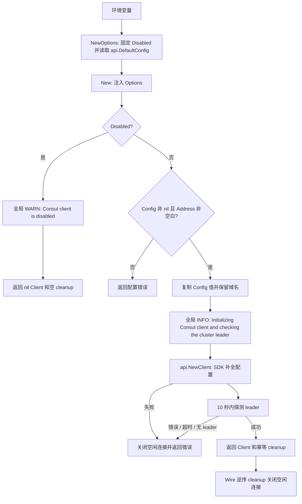

# Consul

`pkg/consul` 提供配置、服务发现和服务注册适配器共享的公共 Consul API 客户端构造入口：

```go
options := consul.NewOptions()
client, cleanup, err := consul.New(options)
if err != nil {
	return err
}
defer cleanup()

if client == nil {
	// Consul 已被显式禁用。
}
```

`New` 的启动诊断使用 `pkg/log` 全局入口，并保留 `module=consul` 字段。
Bootstrap 安装应用 Logger 前使用默认标准输出，安装后使用当前应用输出；客户端和 cleanup 不拥有 Logger。

`Client` 是 `*github.com/hashicorp/consul/api.Client` 的别名。`cleanup` 幂等关闭客户端 transport 的空闲连接；无论客户端是否启用都可以调用。

`NewOptions` 在建立 `config.Manager` 之前读取环境，返回 `Options{Disabled, Config}`。以下任一条件成立时，将 `Disabled` 固定为 `true`：

- `DisableConsul` 对应的 `DISABLE_CONSUL` 可解析为 `true`；
- 应用处于 `local` 环境，并且没有设置 `CONSUL_HTTP_ADDR`。

`Config` 来自 `api.DefaultConfig()`。`New(options)` 只根据显式的 `Disabled` 决定是否构造客户端，后续环境变化不会改变这个决策；禁用时返回 `nil` 客户端、空清理函数和 `nil` 错误。调用方也可以直接传入 `Options{Config: consulConfig}`，启用时 `Config` 不能为 nil，且 `Config.Address` 必须是非空白地址；空地址在 SDK 构造与网络探测前返回 `consul address is empty`。

构造器先复制 `api.Config` 的值，直接把原始地址交给 SDK，避免回写调用方的地址、Scheme、Transport 等字段；已有 Transport/HttpClient 指针仍然共享。地址由调用方提供，其余连接参数沿用 HashiCorp Consul Go API 的语义：SDK 的 `api.NewClient` 仍会读取默认配置、补全其他零值字段并处理 token 等环境选项，因此这里并不保证所有 SDK 配置都是环境快照。

启用时，构造器会在最多 10 秒内确认集群已经选出 leader；探测与幂等清理位于同包 `consul.go`。域名不会在启动时被随机固定为单个 IP：标准 HTTP transport 每次新建连接都会正常解析域名，从而允许断线后的 DNS 切换；已有连接及自定义 Transport/HttpClient 的解析策略仍由 SDK/调用方控制。Wire provider set 同时提供 `consul.NewOptions` 和 `consul.New`，后者依赖前者产生的 `Options`；不需要依赖尚未建立的 `config.Manager`。


