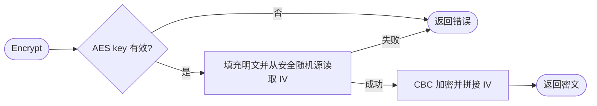

# aes

`aes` 提供带随机 IV 的 AES-CBC 字节及字符串接口，用于已明确采用该格式的数据库静态字段。

```go
import foundationaes "github.com/jaggerzhuang1994/kratos-foundation/v2/pkg/crypto/aes"
```

使用 `foundationaes.CBC{}`，通过 `Encrypt/Decrypt` 处理字节，`EncryptString/DecryptString` 处理字符串与标准 Base64 密文。完整调用和错误处理见 [AES-CBC 示例](../README.md#aes-cbc)。

- key 为 16、24 或 32 字节；字符串 key 直接按字节使用，不做口令派生。
- 密文为 `IV || AES-CBC(PKCS#7(plaintext))`，填充发生在加密之前。
- CBC 不提供完整性或来源校验。适用威胁模型和不可信密文限制见父文档；不能把解密成功当成认证成功。
- 实例不持有密钥、连接或后台任务，无 cleanup；错误由调用边界处理，本包不记录明文或密钥。


