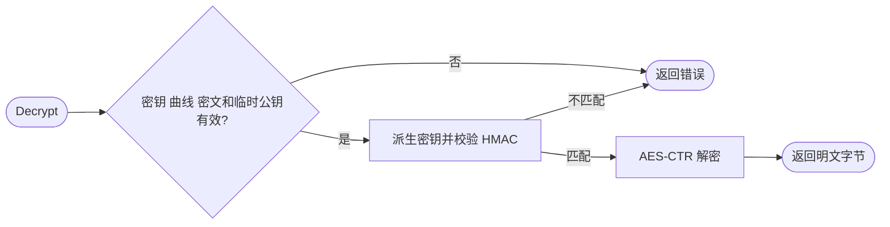

# ecc

`ecc` 提供本仓库格式的 ECIES 加解密，以及 ECDSA 密钥 PEM 编解码。

```go
import "github.com/jaggerzhuang1994/kratos-foundation/v2/pkg/crypto/ecc"
```

`GenerateKey` 返回 P-256 私钥、公钥与错误；`Encrypt` 接收字符串和公钥，`Decrypt` 返回明文字节。Base64 包装、PEM 编码和完整示例见 [ECIES 与 EC 密钥](../README.md#ecies-与-ec-密钥)。

- 加解密支持 P-256、P-384、P-521；通信双方必须一致采用本仓库的曲线、KDF、哈希及密文格式。
- 密文为 `R || IV || ciphertext || HMAC`；解密前校验覆盖临时公钥与正文的 HMAC。
- `EncryptToBase64StringByPubHex` 仅接受不含 `04` 前缀的 128 字符 P-256 公钥十六进制编码。
- 旧版仅认证 IV 与正文的密文不兼容，升级须迁移或重新加密。
- 函数不持有资源，无 cleanup；调用方负责私钥保护及错误处理。


