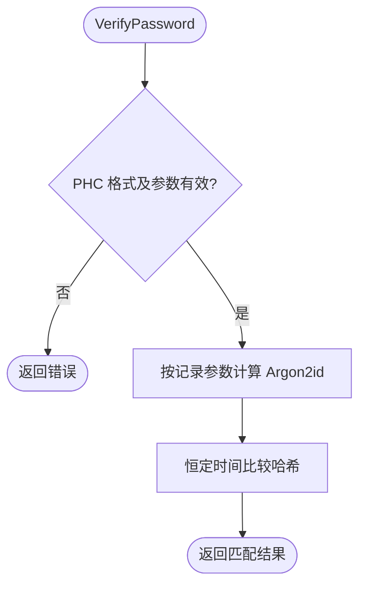

# password

`password` 提供 Argon2id 密码哈希、PHC 字符串验证和重哈希判断。

```go
import "github.com/jaggerzhuang1994/kratos-foundation/v2/pkg/crypto/password"
```

使用 `HashPassword` 保存哈希，登录时通过 `VerifyPassword` 验证。默认参数、返回值和完整示例见 [Argon2id 密码哈希](../README.md#argon2id-密码哈希)。

- 默认内存 64 MiB、3 次迭代、4 路并行、16 字节随机盐和32字节输出。
- `HashPasswordWithParams` 使用显式参数；验证已有 PHC 时使用其中的参数，但在分配内存前执行上限校验。
- `VerifyPassword` 的 `false, nil` 表示不匹配，非 nil 错误表示 PHC 或参数无效。密码长度等业务规则由调用方验证。
- `NeedsRehash(encoded, desired)` 比较所有参数是否不同，并不判断目标参数是否更强；应在认证成功后按业务策略调用。
- 每次调用独立计算，没有 cleanup；调用方负责并发内存预算和存储写入。


