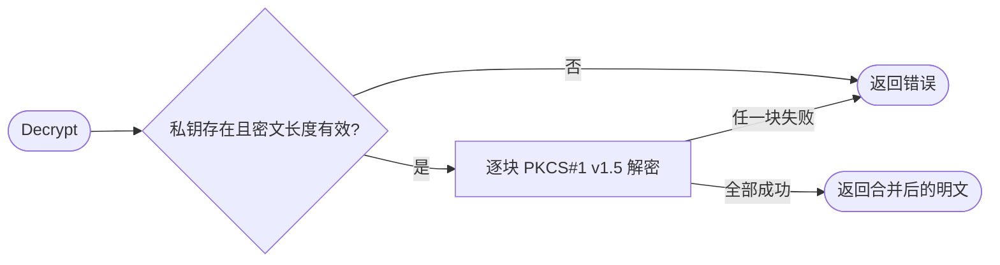

# rsa

`rsa` 提供分块 RSA PKCS#1 v1.5 加解密及 PKCS#1 PEM 密钥编解码，供既有协议兼容使用。

```go
import foundationrsa "github.com/jaggerzhuang1994/kratos-foundation/v2/pkg/crypto/rsa"
```

先通过 `GenerateKey(bits)` 创建密钥或 `ParsePrivateKey/ParsePublicKey` 导入，再调用 `Encrypt/Decrypt`。协议与算法边界见 [RSA 兼容 API](../README.md#rsa-兼容-api)。

- `Encrypt` 按公钥字节数减11分块，`Decrypt` 要求非空密文长度为私钥对应模数字节数的整数倍。
- `EncryptToBase64String/DecryptFromBase64String` 只包装标准 Base64，不改变底层格式。
- 密钥编码使用 PKCS#1，不能把 PKIX 公钥或 PKCS#8 私钥直接交给这些解析入口。
- 错误由调用方处理；不得向不可信调用方暴露可区分的解密失败细节。适用限制见父文档。
- 不持有资源或后台任务，无 cleanup；密钥生命周期由调用方负责。


