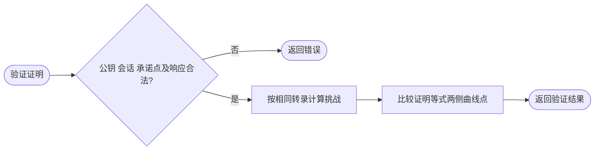

# schnorr

`schnorr` 提供绑定会话的 ECDSA 私钥知识证明，采用本仓库约定的 GG18 风格转录。

```go
import "github.com/jaggerzhuang1994/kratos-foundation/v2/pkg/crypto/schnorr"
```

`SchnorrProof(privateKey, session)` 返回承诺点的两个坐标、响应标量和错误；将这三个值、公钥及相同 session 交给 `SchnorrProofVerify`。完整示例见 [Schnorr 知识证明](../README.md#schnorr-知识证明)。

- session 必须非空，每次协议操作使用新的且不可混淆的会话值。
- 证明与验证双方必须采用相同曲线、公钥、会话和转录格式。
- 验证返回 `false, nil` 表示等式不成立；结构或标量非法返回错误。
- 此 API 不是 BIP-340 签名，不能作为通用签名接口使用。
- 无 cleanup；调用方负责会话生成、重放控制以及私钥保护，本包不存储已使用的会话。


