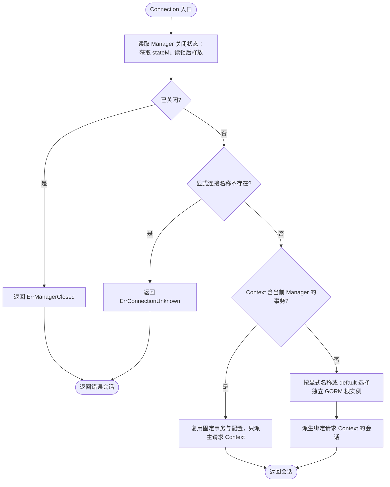
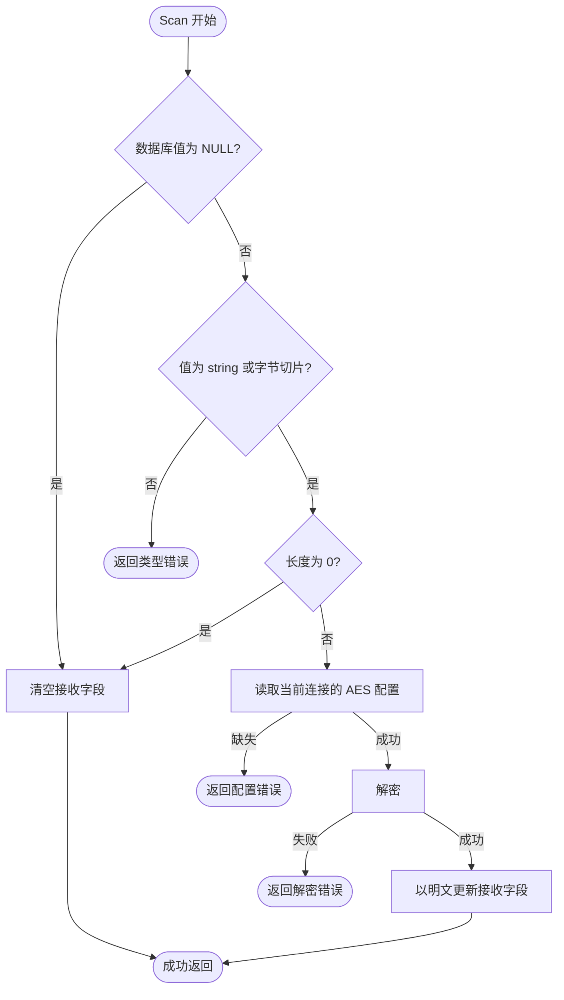
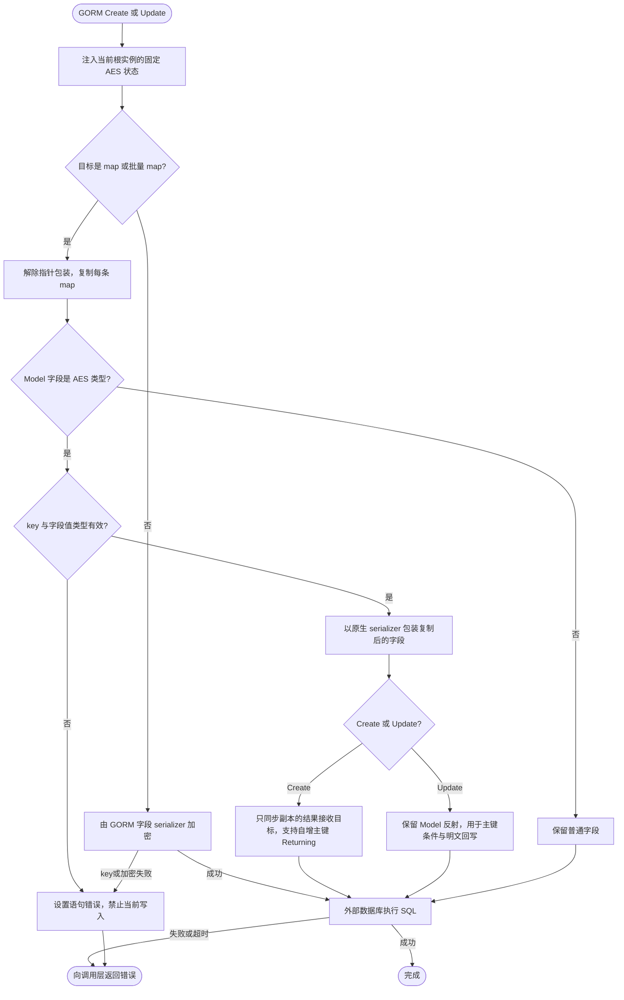
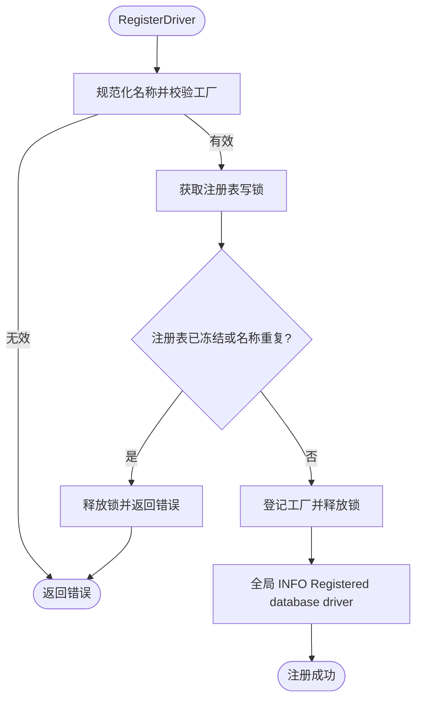
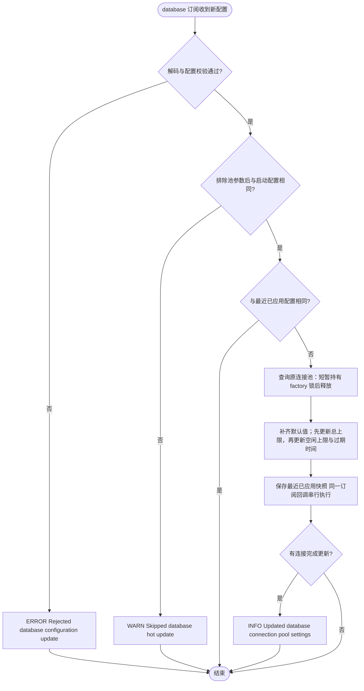
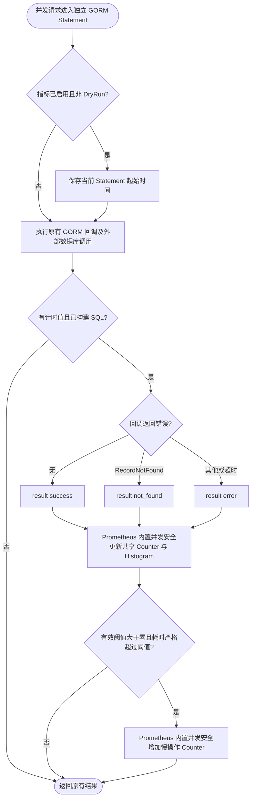
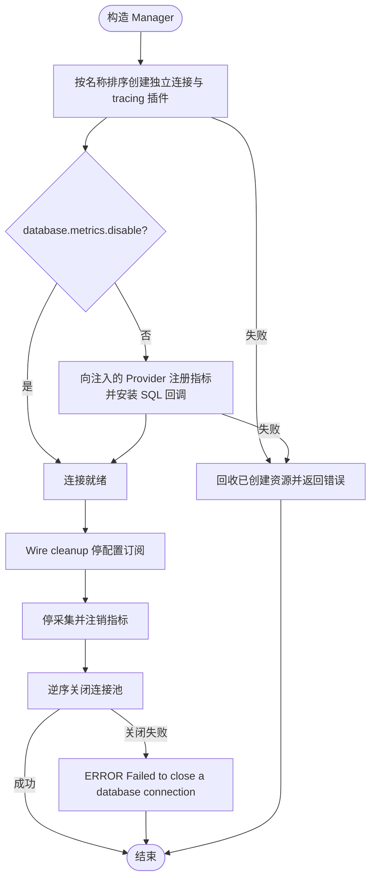
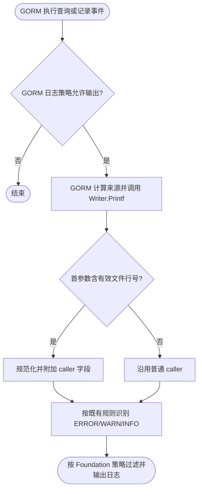

# Database

`pkg/database` 提供业务与 Wire 组装层使用的数据库 Manager、事务方法、Context 连接选择、AES 字段类型和驱动注册入口；具体数据库实现放在 `contrib/database/<driver>`，核心包不直接依赖任何 GORM 数据库驱动。

公共契约与实现集中在 `pkg/database`，按连接池、GORM 插件、事务和指标职责组织文件。`NewManager` 取得一次冻结的驱动快照，非导出的 `manager` 统一持有连接与关闭状态；业务与 Wire 依赖 `Manager` 接口。AES 插件与字段类型分别位于 `aes_plugin.go` 和 `aes_types.go`。

## 注册默认驱动

应用在组装层按实际需要空导入驱动包：

```go
import (
	_ "github.com/jaggerzhuang1994/kratos-foundation/v2/contrib/database/mysql"
	_ "github.com/jaggerzhuang1994/kratos-foundation/v2/contrib/database/sqlite"
)
```

空导入触发的 `init()` 向 `pkg/database` 注册无状态工厂并记录注册日志，不会打开连接或访问数据库。连接由 `database.NewManager` 根据配置创建和管理。

配置中的 canonical 驱动名是 `mysql` 和 `sqlite3`；省略 `driver` 时使用 `mysql`：

```yaml
database:
  default: primary
  connections:
    primary:
      driver: mysql
      dsn: user:password@tcp(127.0.0.1:3306)/app
    local:
      driver: sqlite3
      dsn: app.db
```

同一个 Manager 可以为不同具名连接选择不同的已注册驱动。未编译进应用的驱动会在打开任何连接前被配置校验拒绝。

## 独立连接与迁移

每个 `DBConnection` 对应一个独立的 SQL 连接池和 GORM 根实例，方言、SQL 构造器、回调、AES 与连接级 GORM 配置相互隔离。默认调用使用 `database.default`；跨库访问通过 `database.UseConnection(ctx, "local")` 选择连接。连接上的 `gorm` 配置只覆盖显式设置的字段，包括显式 `false`，其余字段继承全局配置。

已删除读写分离和隐式表路由：迁移时移除 `replicas`、`datas`、`trace_resolver_mode` 配置及 `GormDialector` 类型；配置协议已移除这些字段及 reserved 声明，迁移时应主动清理旧键。删除 `UseRead` / `UseWrite` 调用，将需要访问的其他数据库声明为独立的 `connections` 条目，并用 `UseConnection` 选择。`datas` 原来关联的表不会再自动切换连接。

事务在进入 `Transaction` 时固定数据库连接、GORM 配置和 AES key。回调内使用传入 Context 调用 `Connection` 或嵌套 `Transaction`；同一 Manager 的事务 Context 即使指定另一个已存在连接，也继续使用当前事务。未知连接仍返回 `ErrConnectionUnknown`。事务 Context 仅在回调期间有效。



`Transaction` 使用 GORM 事务：顶层回调成功时提交，返回错误或 panic 时回滚。默认情况下，嵌套事务使用 GORM savepoint，内层失败只回滚到该保存点。若所选连接的有效 `gorm.disable_nested_transaction` 为 `true`，内层直接复用外层事务，不建立保存点，也不独立回滚；外层若捕获内层错误后返回 `nil`，内层已执行的写入也会提交。需要整体回滚时，应把错误继续返回给顶层回调。显式 SQL 选项始终不能用于嵌套事务。连接选择或事务失败由调用层处理，底层不重复记录错误。


## AES 字段

Model 使用 `AESDecryptString` / `AESDecryptBytes` 声明加密字段。普通结构体写入由 serializer 加密；`Model(...).Create` 或 `Updates` 使用 map 时，插件按 Model 字段信息包装原生 serializer，在 SQL 绑定时加密，包括 `[]map[string]any` 及指针包装。插件复制 map 与批量切片，不向调用方原值写回密文或自增 ID。批量副本使用 GORM RETURNING 支持的切片指针形态，兼容自增主键及显式 Returning。Updates 保留 Model 的主键反射和明文回写，Returning 按 AES 字段类型解密。读取使用当前连接的 key 解密；缺少 key 的 AES 字段写入返回 `ErrAESConfigMissing`，不会把该批数据写入数据库。

读取时，数据库值为 `NULL`、空字符串或长度为 0 的字节切片（含 `[]byte(nil)`）会跳过密钥读取和解密，并将 `AESDecryptString` 清为 `""`、`AESDecryptBytes` 清为 `nil`。非空值仍须使用当前连接的 key 解密；空值写入仍走原有加密流程。



map 操作须提供含 AES 字段定义的 `Model`。`Table`、原始 SQL 和 SQL 表达式不能替代 Model 的字段加密契约；对 AES 字段使用表达式会被拒绝，原始 SQL 的参数由调用方负责加密。



## 注册时序

首个 `database.NewManager` 会冻结全局驱动注册表并持有不可变快照。所有驱动包都必须在此之前由应用组装层导入；冻结后调用 `RegisterDriver` 或 `MustRegisterDriver` 会失败。驱动工厂的执行不持有注册表锁。

新增 PostgreSQL 等实现时，应在独立公共 `contrib/database/<driver>` 包中调用 `database.MustRegisterDriver`，业务只需选择性空导入该包。

驱动注册成功时使用全局日志记录 `module=database`、`function=RegisterDriver` 和规范化的 `driver` 名称，消息为 `Registered database driver`。MySQL、SQLite 的空导入注册均适用；不记录 DSN 或密钥，注册失败只返回错误。



## 连接池热更新

连接建立时已应用初始池参数；订阅在下一轮成功扫描异步回放当前值，未变化的回放或通知不记录更新日志。只有实际配置变化才应用并记录 `Updated database connection pool settings`，恢复到初始值也属于实际更新。

Manager 订阅 `database` 配置，仅热更新 `max_idle_conns`、`max_open_conns`、`conn_max_lifetime` 和 `conn_max_idle_time`。DSN、驱动、连接集合和其他非池参数决定启动时创建的资源，变更后需要重启。

每次更新都与启动配置比较，比较时忽略上述四个池参数。包含非池参数变化的整次更新会被跳过，并保持现有池参数；被跳过的配置不会成为后续比较基线。恢复启动时的连接身份与集合后，合法的池参数更新可以立即生效。

池参数每次完整应用。官方默认 merge 会保留更新中省略的字段，删除源中的字段不会恢复默认值。启动时未配置的默认值为：`max_open_conns` 为 0（不限总连接数），`max_idle_conns` 为 2，两个过期时间为 0（不因时间关闭连接）。显式设置 `max_idle_conns: 0` 表示不保留空闲连接。更新时先设置总连接上限，再设置空闲上限，避免扩容被旧上限截断；最终空闲上限仍受新总上限约束。



同一订阅内的回调顺序执行；查询连接池沿用 factory 的现有互斥锁，setter 调用在锁外执行。Wire cleanup 仍负责取消订阅并释放资源。

## 指标与生命周期

GORM tracing 插件只记录 trace，不向全局 OpenTelemetry MeterProvider 注册指标。数据库指标统一使用构造函数注入的 `metrics.Provider`，由 `database.metrics.disable` 控制。旧配置 `database.tracing.exclude_metrics` 仅为兼容保留，不再改变行为。

启用数据库指标时（`database.metrics.disable` 省略或为 `false`），所有具名连接自动安装 GORM SQL 操作回调：

| 指标 | 类型 | 含义 |
| --- | --- | --- |
| `database_sql_operations_total` | Counter | GORM SQL 操作回调完成次数 |
| `database_sql_operation_duration_seconds` | Histogram | 回调链耗时（秒），提供 `_bucket`、`_sum`、`_count` |
| `database_sql_slow_operations_total` | Counter | 回调链耗时严格超过有效慢操作阈值的次数 |
| `database_sql_slow_threshold_seconds` | Gauge | 每个连接构造时采用的 GORM 慢操作阈值（秒）；0 表示关闭慢操作判断 |

操作次数、耗时和慢操作次数使用固定标签 `db_name`、`operation`（`create/update/delete/query/row/raw`）和 `result`（`success/error/not_found`）；阈值仅使用 `db_name`。全部指标复用应用身份与 `database.metrics.labels` 常量标签。自定义标签不得使用 `db_name`、`operation` 或 `result`；指标不包含 SQL、参数、表名或错误文本。计数与耗时仅在观察到相应事件后输出时间序列；从未发生慢操作时，慢计数序列尚不存在。

慢操作沿用 `database.gorm.logger.slow_threshold`，省略时默认为 **200ms**；`database.connections.<name>.gorm.logger.slow_threshold` 显式设置时完整替换全局阈值，包括 `0s`（关闭该连接的慢操作判断）。负值在构造期校验失败。只有有效阈值大于零、且回调耗时严格大于该阈值时才增加慢计数，等于阈值不计入。阈值在构造期读取，不热更新。慢计数仍按 `success/error/not_found` 分类，不受 GORM 日志级别影响，默认 `SILENT` 也会统计；它不是慢日志输出条数，GORM 日志的错误优先分支和计时边界可能与回调指标不同。

耗时从 GORM 回调链开始到结束，包含回调处理和默认事务开销，并非数据库服务端的纯 SQL 时间。`ErrRecordNotFound` 独立记为 `not_found`；其他回调返回错误（包括超时）记为 `error`。DryRun 和未构建 SQL 的前置失败不计数；已构建 SQL 后的校验失败可能计入 `error`，因此次数代表 GORM 操作尝试，并不保证每次都向数据库发出 SQL。批量、关联和预加载可能产生多个操作；不单独统计 `BEGIN/COMMIT/ROLLBACK`，不覆盖直接使用原生 `sql.DB` 的调用。`Row/Rows` 只测量返回游标之前的回调，调用方之后的扫描或遍历失败不计入结果。

回调在构造期完成安装，运行期不更换回调或新增同步策略；每个操作的计时值保存在自己的 GORM Statement，计数器和直方图使用 Prometheus 已有的并发安全更新。cleanup 注销全部四项指标后，尚持有旧会话的操作不会重新注册指标。注册失败只回滚本次成功注册的指标，保留其他组件的冲突指标。开关和标签只在构造期读取；高频 SQL 不额外逐条输出日志，业务错误继续由已有 GORM logger 配置及调用方处理。



`NewManager` 返回的 Wire cleanup 先停止连接池配置订阅，再停止指标采集、注销指标，最后按构造的逆序关闭连接池；业务不单独关闭 Manager 返回的连接。



MySQL 状态采集只针对默认连接，沿用 `gorm_status_<variable>`（或配置的 prefix）与 `db_name` 标签。省略 `variable_names` 时，每个首次出现的数值变量独立注册固定的描述符；显式白名单在启动前注册。成功快照中消失的变量不再输出。注册冲突、查询失败或扫描失败保留上一次完整快照，并记录 WARN；cleanup 只注销本刷新器成功注册的指标，支持在同一个 Registry 中重新创建 Manager。


共享 Grafana 组件面板、指标名称与采集边界见 [组件指标说明](../../deploy/observability/docs/components.md)。

## 可运行的组合用例

参见[核心组件集成用例](../INTEGRATION_TESTS.md)，从仓库根目录运行 `make test-components`，覆盖配置、SQLite 事务与 HTTP 客户端组合的成功、失败及资源释放场景。

## SQL 日志来源

`database/gorm` 日志的结构化 `caller` 使用 GORM 提供的查询来源，格式为 `目录/文件:行号`，与 SQL 消息中的来源对应，不依赖固定跳栈层数。GORM 无法提供有效来源时使用日志包默认 caller。原 SQL 消息、慢 SQL 阈值、参数过滤、RecordNotFound 策略和日志级别保持不变；此调整不会让 Writer 获得 GORM 未传入的请求 Context。



数据库管理日志使用 `database`，SQL 日志使用 `database/gorm`；通过 `log.modules` 集中配置级别、禁用和追加过滤，`database.log` 已移除。可用 `database*` 匹配两者。GORM 自身的 SQL 生成开关、慢查询阈值等仍由 gorm.logger 决定，Foundation 模块策略不能恢复 GORM 未生成的日志。详见 [log](../log/README.md#模块策略)。
