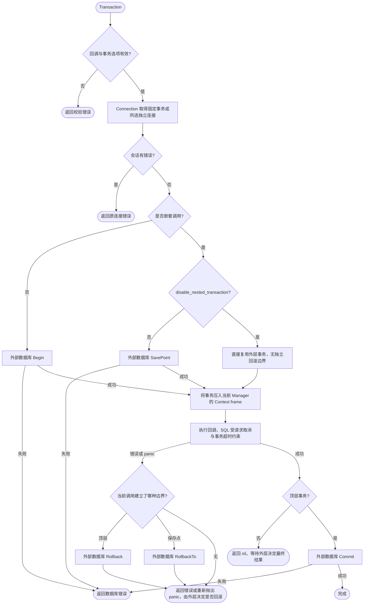
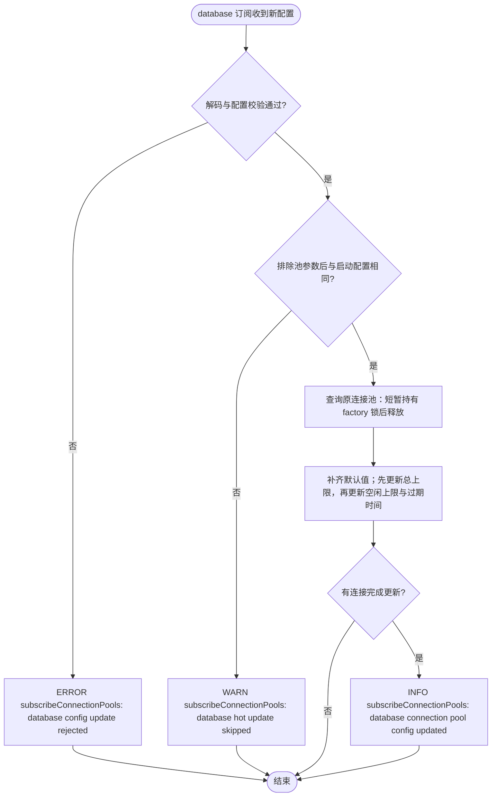
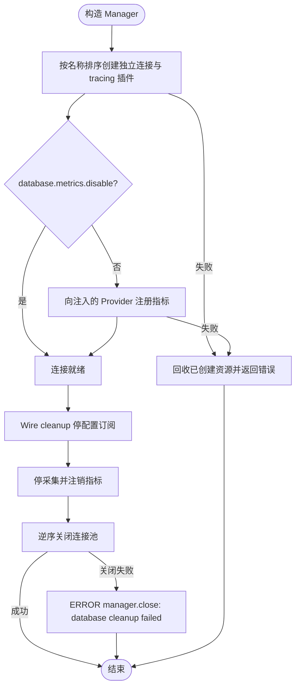
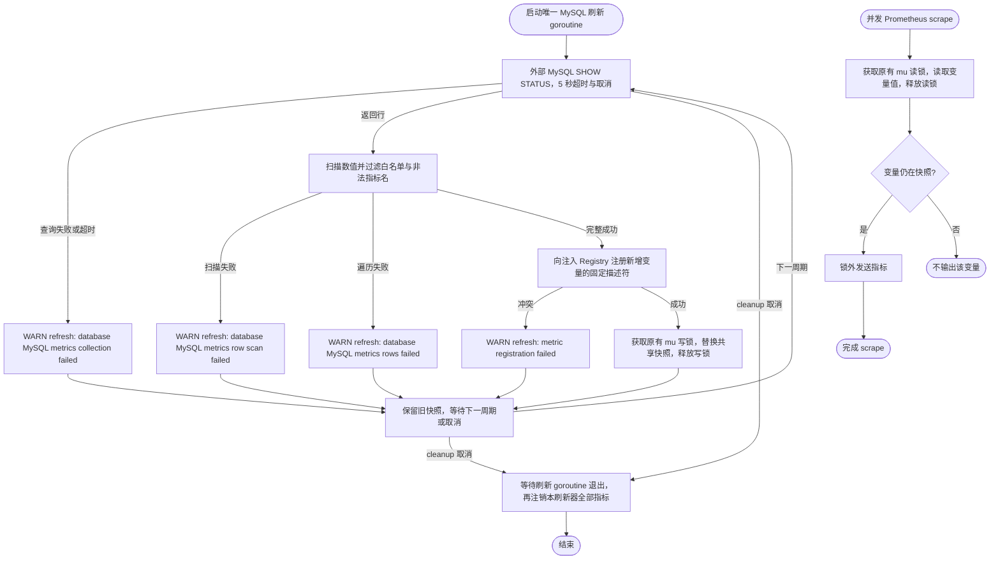

# Database

`pkg/database` 提供业务与 Wire 组装层使用的数据库 Manager、事务方法、Context 连接选择、AES 字段类型和驱动注册入口；具体数据库实现放在 `contrib/database/<driver>`，核心包不直接依赖任何 GORM 数据库驱动。

公共契约与实现集中在 `pkg/database`，按连接池、GORM 插件、事务和指标职责组织文件。`NewManager` 取得一次冻结的驱动快照，非导出的 `manager` 统一持有连接与关闭状态；业务与 Wire 依赖 `Manager` 接口。AES 插件与字段类型分别位于 `aes_plugin.go` 和 `aes_types.go`。

## 注册默认驱动

应用在组装层按实际需要空导入驱动包：

```go
import (
	_ "github.com/jaggerzhuang1994/kratos-foundation/v2/contrib/database/mysql"
	_ "github.com/jaggerzhuang1994/kratos-foundation/v2/contrib/database/sqlite"
)
```

空导入触发的 `init()` 只向 `pkg/database` 注册无状态工厂，不会打开连接或访问数据库。连接由 `database.NewManager` 根据配置创建和管理。

配置中的 canonical 驱动名是 `mysql` 和 `sqlite3`；省略 `driver` 时使用 `mysql`：

```yaml
database:
  default: primary
  connections:
    primary:
      driver: mysql
      dsn: user:password@tcp(127.0.0.1:3306)/app
    local:
      driver: sqlite3
      dsn: app.db
```

同一个 Manager 可以为不同具名连接选择不同的已注册驱动。未编译进应用的驱动会在打开任何连接前被配置校验拒绝。

## 独立连接与迁移

每个 `DBConnection` 对应一个独立的 SQL 连接池和 GORM 根实例，方言、SQL 构造器、回调、AES 与连接级 GORM 配置相互隔离。默认调用使用 `database.default`；跨库访问通过 `database.UseConnection(ctx, "local")` 选择连接。连接上的 `gorm` 配置只覆盖显式设置的字段，包括显式 `false`，其余字段继承全局配置。

已删除读写分离和隐式表路由：迁移时移除 `replicas`、`datas`、`trace_resolver_mode` 配置及 `GormDialector` 类型；原字段编号与名称已保留为 protobuf `reserved`。删除 `UseRead` / `UseWrite` 调用，将需要访问的其他数据库声明为独立的 `connections` 条目，并用 `UseConnection` 选择。`datas` 原来关联的表不会再自动切换连接。

事务在进入 `Transaction` 时固定数据库连接、GORM 配置和 AES key。回调内使用传入 Context 调用 `Connection` 或嵌套 `Transaction`；同一 Manager 的事务 Context 即使指定另一个已存在连接，也继续使用当前事务。未知连接仍返回 `ErrConnectionUnknown`。事务 Context 仅在回调期间有效。


`Transaction` 使用 GORM 事务：顶层回调成功时提交，返回错误或 panic 时回滚。默认情况下，嵌套事务使用 GORM savepoint，内层失败只回滚到该保存点。若所选连接的有效 `gorm.disable_nested_transaction` 为 `true`，内层直接复用外层事务，不建立保存点，也不独立回滚；外层若捕获内层错误后返回 `nil`，内层已执行的写入也会提交。需要整体回滚时，应把错误继续返回给顶层回调。显式 SQL 选项始终不能用于嵌套事务。连接选择或事务失败由调用层处理，底层不重复记录错误。



## AES 字段

Model 使用 `AESDecryptString` / `AESDecryptBytes` 声明加密字段。普通结构体写入由 serializer 加密；`Model(...).Create` 或 `Updates` 使用 map 时，插件按 Model 字段信息包装原生 serializer，在 SQL 绑定时加密，包括 `[]map[string]any` 及指针包装。插件复制 map 与批量切片，不向调用方原值写回密文或自增 ID。批量副本使用 GORM RETURNING 支持的切片指针形态，兼容自增主键及显式 Returning。Updates 保留 Model 的主键反射和明文回写，Returning 按 AES 字段类型解密。读取使用当前连接的 key 解密；缺少 key 的 AES 字段写入返回 `ErrAESConfigMissing`，不会把该批数据写入数据库。

map 操作须提供含 AES 字段定义的 `Model`。`Table`、原始 SQL 和 SQL 表达式不能替代 Model 的字段加密契约；对 AES 字段使用表达式会被拒绝，原始 SQL 的参数由调用方负责加密。


## 注册时序

首个 `database.NewManager` 会冻结全局驱动注册表并持有不可变快照。所有驱动包都必须在此之前由应用组装层导入；冻结后调用 `RegisterDriver` 或 `MustRegisterDriver` 会失败。驱动工厂的执行不持有注册表锁。

新增 PostgreSQL 等实现时，应在独立公共 `contrib/database/<driver>` 包中调用 `database.MustRegisterDriver`，业务只需选择性空导入该包。

## 连接池热更新

Manager 订阅 `database` 配置，仅热更新 `max_idle_conns`、`max_open_conns`、`conn_max_lifetime` 和 `conn_max_idle_time`。DSN、驱动、连接集合和其他非池参数决定启动时创建的资源，变更后需要重启。

每次更新都与启动配置比较，比较时忽略上述四个池参数。包含非池参数变化的整次更新会被跳过，并保持现有池参数；被跳过的配置不会成为后续比较基线。恢复启动时的连接身份与集合后，合法的池参数更新可以立即生效。

池参数每次完整应用。删除字段会恢复默认值：`max_open_conns` 为 0（不限总连接数），`max_idle_conns` 为 2，两个过期时间为 0（不因时间关闭连接）。显式设置 `max_idle_conns: 0` 表示不保留空闲连接。更新时先设置总连接上限，再设置空闲上限，避免扩容被旧上限截断；最终空闲上限仍受新总上限约束。



同一订阅内的回调顺序执行；查询连接池沿用 factory 的现有互斥锁，setter 调用在锁外执行。Wire cleanup 仍负责取消订阅并释放资源。

## 指标与生命周期

GORM tracing 插件只记录 trace，不向全局 OpenTelemetry MeterProvider 注册指标。数据库指标统一使用构造函数注入的 `metrics.Provider`，由 `database.metrics.disable` 控制。旧配置 `database.tracing.exclude_metrics` 仅为兼容保留，不再改变行为。

`NewManager` 返回的 Wire cleanup 先停止连接池配置订阅，再停止指标采集、注销指标，最后按构造的逆序关闭连接池；业务不单独关闭 Manager 返回的连接。



MySQL 状态采集只针对默认连接，沿用 `gorm_status_<variable>`（或配置的 prefix）与 `db_name` 标签。省略 `variable_names` 时，每个首次出现的数值变量独立注册固定的描述符；显式白名单在启动前注册。成功快照中消失的变量不再输出。注册冲突、查询失败或扫描失败保留上一次完整快照，并记录 WARN；cleanup 只注销本刷新器成功注册的指标，支持在同一个 Registry 中重新创建 Manager。


