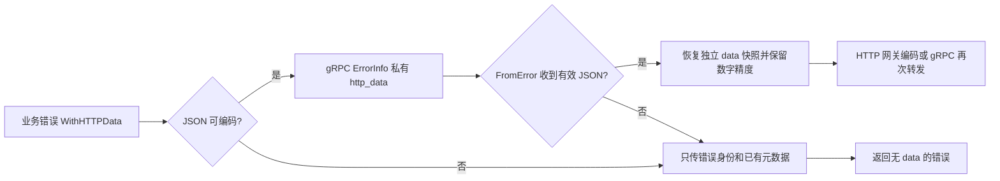

# errors

`errors.go` 定义错误值、通用操作与堆栈处理，`metadata.go` 管理错误附加信息，`grpc.go` 负责 gRPC 状态转换，`validation_error.go` 处理校验错误。
`errors` 在 Kratos 状态错误之上统一 HTTP 状态、gRPC 状态、业务原因码、公开元数据、参数校验信息和内部错误链。业务代码创建错误，传输边界负责选择如何对外编码。

## 创建与包装

```go
err := errors.New(
http.StatusUnprocessableEntity,
"VALIDATION_FAILED",
"name is required",
).
WithReasonCode(42201).
WithMetadata(map[string]string{"request_id": requestID}).
WithCause(cause)
```

`New(code, reason, message)` 中：

- `code` 是 HTTP 状态码；
- `reason` 是稳定、适合程序判断的原因标识；
- `message` 是允许对外展示的消息。

所有 `With...` 方法都返回副本，不修改原错误，因此可以安全地从一个错误模板派生多个实例。

| API                   | 用途                                                |
|-----------------------|-----------------------------------------------------|
| `WithCause`           | 保存内部原因并支持标准 `errors.Is`/`errors.As` 遍历 |
| `WithErrStack`        | 保存调用栈；仅在 `%+v` 或 `ErrStack` 中展开         |
| `WithReasonCode`      | 设置独立于 HTTP 状态的业务数值码                    |
| `WithMetadata`        | 合并可公开的字符串元数据                            |
| `WithHTTPData`        | 设置 HTTP 响应中的结构化 `data`                     |
| `WithHTTPHeaders`     | 合并 HTTP 错误响应头并去重                          |
| `WithValidationError` | 附加 protobuf 参数校验失败列表                      |

`PublicMetadata`、`HTTPData`、`HTTPHeaders`、`ValidationError`、`ReasonCode` 和 `ErrStack` 分别读取对应状态。`GRPCStatus`
用于服务端 gRPC 编码；`Unwrap`、`Is`、`Error` 和 `Format` 由 Go 错误协议及格式化接口调用，业务代码通常无需直接调用。

## 读取错误

```go
statusCode := errors.Code(err)
reason := errors.Reason(err)
message := errors.Message(err)
reasonCode := errors.ReasonCode(err)
```

这些辅助函数支持包装错误。对 `nil` 错误，`Code` 和 `ReasonCode` 返回 200，`Message` 返回空字符串，HTTP data 为空，HTTP header
为空集合。

`FromError` 的处理顺序是：

1. 按由外到内的顺序查找明确状态，直接读取本包错误或实现 `GetCode/GetReason/GetMessage/GetMetadata` 的本地错误；
2. 尝试恢复 gRPC status 及 `ErrorInfo`；
3. 其他错误转换为 500/UNKNOWN，并把原错误文本作为诊断消息。

服务端出口使用 `Normalize(err)`，再交给 HTTP/gRPC 编码器。它保留明确结构化错误的 HTTP 状态、reason 和业务码，
将无结构化信息的未知服务端故障转换为安全的 500/UNKNOWN，原始错误仅存于本地 cause。调用取消返回 499，截止时间超限返回 504；
已明确设置的外层业务状态不会被内部 cause 覆盖。`Normalize(nil)` 返回 nil。`FromError` 是诊断读取 API，不能单独用来保证未知错误的公开消息安全。

旧 `cyberkite_pb` 错误无需更换依赖即可在发送端适配：422 直接从本地状态读取，然后由 Foundation 序列化携带 `http_code=422`。
旧 `http_data` 使用原始 JSON 恢复以保留大整数精度，旧 `http_header` 映射到 HTTP 响应头；metadata 会复制，原错误不被修改。
旧堆栈和 cause 诊断通过服务间 gRPC details 的 `err_stack` 保留，接收端可继续包装和转发；HTTP metadata 仍过滤堆栈，gRPC 不转发响应头。如果旧发送端已经将 422 丢失成 gRPC Unknown，
且没有携带 `http_code`，接收端无法恢复；不能用独立业务码 `reason_code` 猜测 HTTP 状态。

本包的状态错误使用 HTTP 状态码和 reason 参与 `errors.Is` 匹配。底层 cause 仍可通过 `errors.Is` 和 `errors.As` 访问。

## HTTP 与 gRPC 边界

`GRPCStatus` 把 HTTP 状态映射为 gRPC code，并通过 `google.rpc.ErrorInfo` 传递 reason、业务原因码和公开元数据。对于无法由标准
gRPC code 唯一表示的 HTTP 错误状态，会携带受校验的原始 HTTP 状态码以便往返恢复。

以下内部字段不会出现在 `PublicMetadata` 中：错误栈、业务原因码、HTTP 状态恢复字段、HTTP data、HTTP header
和参数校验详情。不要把秘密、凭据或只供日志使用的内部信息放入普通 metadata。

`WithHTTPData` 面向可 JSON 编码的数据。读取 `HTTPData` 得到独立副本；调用方不应依赖自定义 Go 类型在 JSON 边界后仍保持原具体类型。
数字以 `json.Number` 保留，避免大整数或高精度小数在快照复制和 HTTP 往返中被 `float64` 舍入；需要计算时由调用方显式转换。

## 参数校验错误

`ParseValidationError` 识别 protoc-gen-validate 生成的单条或聚合校验错误，并转换为稳定的 `ValidationError`：

```go
validationErrors := errors.ParseValidationError(request.ValidateAll())
err := errors.New(400, "VALIDATION_FAILED", "invalid request").
WithValidationError(validationErrors)
```

无法识别的非空错误会保留为一条 `unknown` 记录；传入 `nil` 返回 `nil`。

`ValidationError` 实现 `error`、`json.Marshaler` 和 `json.Unmarshaler`，对应方法为 `Error`、`MarshalJSON` 和
`UnmarshalJSON`。它的公开字段 `Field`、`Reason`、`Cause`、`Key` 和 `ErrorName` 是稳定传输表示；调用方应优先通过
`ParseValidationError` 构造，而不是依赖具体生成器错误类型。

`SupportPackageIsVersion1` 只供生成代码做编译期兼容性断言，业务代码不应引用。

## 日志与公开信息

- `Error()`、`%s` 和 `%v` 只输出公开状态与公开 metadata。
- `%+v` 和 `ErrStack` 会包含调用栈及底层 cause，可用于受控内部日志和服务间 gRPC 诊断，必须在网关公开出口屏蔽。
- `message`、HTTP data、validation error 和普通 metadata 都可能离开进程，必须在创建错误时完成脱敏。
- 底层包应返回带 `%w` 的原因错误；决定 HTTP/gRPC 呈现的边界层再创建本包状态错误。

### HTTP data 跨 gRPC 恢复

可 JSON 编码的 `WithHTTPData` 快照通过 `ErrorInfo.Metadata` 的私有 `http_data` 字段传输，
`FromError` 恢复后可继续供 HTTP 网关编码或再次经 gRPC 转发。数字保留为 `json.Number`；
栈通过独立私有 `err_stack` 字段传输，HTTP headers 不随之传输。不可编码的数据或损坏的远端 JSON 会被省略，错误身份保持不变。



### 服务间堆栈与网关出口

`GRPCStatus` 将 `ErrStack()` 的诊断文本写入 `ErrorInfo.Metadata["err_stack"]`；`FromError` 保留收到的堆栈。业务通过 `WithCause(err)` 或 `%w` 包装后，后续发送仍包含远端栈、本地已有栈和 cause 文本。普通转发不主动采集新的调用栈；需要定位新增失败阶段时使用 `WithErrStack`。Go 错误对象及 `errors.Is/As` 身份仅在本进程内有效，网络上传输的是诊断文本。

网关先用 `errors.ErrStack(err)` 或 `%+v` 记录内部诊断，再使用 Foundation HTTP Encoder 输出公开错误，它会通过 `PublicMetadata` 过滤 `err_stack`。如果网关对外提供 gRPC，需要在该出口过滤 ErrorInfo 中的 `err_stack`；不能把内部 gRPC status 原样返回公网客户端。本次只修改 Foundation，不代表外部网关已完成改造。


