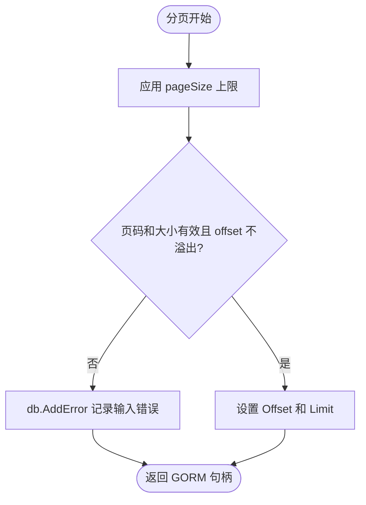

# gormscope

`cursor.go` 负责游标提取及分页查询，`sort_key.go` 负责不同排序键的编码和解码，`scopes.go` 提供常用 GORM 查询作用域。
`gormscope` 提供可复用、方言感知的 GORM 查询 scope，包括 LIKE 匹配、时间范围、页码分页和复合游标分页。
本包不会重新导出 GORM API；应用仍应直接使用 `gorm.io/gorm`。

```go
import "github.com/jaggerzhuang1994/kratos-foundation/v2/pkg/gormscope"
```

## 常用过滤和页码分页

所有列名都通过当前 GORM 方言安全引用，查询值使用占位参数传递。

```go
var users []User

begin := time.Date(2026, 1, 1, 0, 0, 0, 0, time.UTC)
end := time.Date(2026, 1, 31, 23, 59, 59, 0, time.UTC)

err := db.Scopes(
    gormscope.Contains("name", keyword),
    gormscope.TimeBetween("created_at", &begin, &end),
    gormscope.Paginate(page, pageSize, 100),
).Find(&users).Error
if err != nil {
    return err
}
```

### LIKE scope

`Contains`、`Prefix` 和 `Suffix` 把输入作为字面值处理，会自动转义 `%`、`_` 和转义字符 `!`。

```go
db.Scopes(gormscope.Contains("name", "100%"))
db.Scopes(gormscope.Prefix("email", "alice_"))
db.Scopes(gormscope.Suffix("filename", ".json"))
```

`Like` 接受显式 LIKE 模式。模式中的字面内容应先调用 `EscapeLike`：

```go
pattern := "%" + gormscope.EscapeLike(userInput) + "%"
db.Scopes(gormscope.Like("name", pattern))
```

### 时间范围

`TimeBetween` 使用包含端点的 `>=` 和 `<=`。任一边界可以为 `nil`；两者都为 `nil` 时不添加条件。

```go
db.Scopes(gormscope.TimeBetween("created_at", &begin, nil))
db.Scopes(gormscope.TimeBetween("created_at", nil, &end))
```

### 页码分页

`Paginate` 的页码从 1 开始。`maximumPageSize` 为正数时会限制实际 page size；为 0 或负数时不设置上限。

```go
db.Scopes(gormscope.Paginate(2, 50, 100)) // OFFSET 50, LIMIT 50
db.Scopes(gormscope.Paginate(1, 500, 100)) // LIMIT 100
```

`page < 1` 或 `pageSize < 1` 会向 GORM 句柄添加错误，最终通过 `db.Error` 或查询的 `.Error` 返回。

## 游标分页

游标分页按照声明顺序构造字典序条件，同时应用完全相同的排序。最后一个排序键必须唯一，通常使用主键；否则相同排序值的记录可能重复或遗漏。

```go
type User struct {
    ID        uint64
    Score     int64
    CreatedAt time.Time
}

keys := gormscope.SortKeys{
    gormscope.TimeDescSortKey("users.created_at"),
    gormscope.NumberDescSortKey("users.score"),
    gormscope.NumberAscSortKey("users.id"), // 唯一尾键
}

// cursor 是客户端上一页返回的值；第一页传 nil。
var cursor *string
var users []User
err := db.Table("users").
    Scopes(gormscope.ScopeFromSortKey(cursor, keys, ":")).
    Limit(20).
    Find(&users).Error
if err != nil {
    return err
}

var nextCursor *string
if len(users) > 0 {
    value, err := keys.GetSortKey(users[len(users)-1], ":")
    if err != nil {
        return err
    }
    nextCursor = &value
}
```

`ScopeFromSortKey` 的 cursor 为 `nil` 或空字符串时只添加排序，不添加游标边界。非空 cursor 必须具有与 `SortKeys` 相同数量的值。

### 排序键类型

| 类型 | 值类型 | 排序方向 |
| --- | --- | --- |
| `TimeAscSortKey` | `time.Time` 或非空 `*time.Time` | 升序 |
| `TimeDescSortKey` | `time.Time` 或非空 `*time.Time` | 降序 |
| `NumberAscSortKey` | Go 整数、无符号整数、浮点数、数值字符串或数值 `fmt.Stringer` | 升序 |
| `NumberDescSortKey` | Go 整数、无符号整数、浮点数、数值字符串或数值 `fmt.Stringer` | 降序 |
| `StringAscSortKey` | `string` | 升序 |
| `StringDescSortKey` | `string` | 降序 |

排序键名称可以是 `column` 或 `table.column`。生成 cursor 时，字段可以通过 Go 字段名、默认数据库列名或显式 GORM column tag 匹配：

```go
type User struct {
    Identifier uint64 `gorm:"column:custom_id"`
}

keys := gormscope.SortKeys{
    gormscope.NumberAscSortKey("users.custom_id"),
}
```

### 分隔符和错误处理

分隔符不能为空，且字符串排序值不能包含该分隔符。应选择不会出现在业务值中的固定分隔符；如果字符串值无法满足这一约束，应在应用层先使用无歧义编码。

无效排序键、值数量、时间或数值会返回或记录 `ErrInvalidCursor`：

```go
err := db.Scopes(gormscope.ScopeFromSortKey(cursor, keys, ":")).Find(&users).Error
if errors.Is(err, gormscope.ErrInvalidCursor) {
    return errBadCursor
}
```

## 标识符规则

`QuoteIdentifier` 接受 `column` 或 `table.column`，并使用当前 GORM 方言进行引用。空名称、空组成部分、NUL 字符和超过两段的标识符会被拒绝。

```go
quoted, err := gormscope.QuoteIdentifier(db, "users.name")
```

安全引用只防止标识符改变 SQL 结构，不负责业务授权。如果列名来自请求参数，应用仍必须使用允许列表限制可查询或可排序的字段。

## 正确性与安全边界

- 过滤值和 cursor 值通过 SQL 参数绑定，不直接拼接进 SQL。
- cursor 本身不是加密或签名令牌。客户端可以修改分页边界；需要防篡改时应在应用层签名或封装 cursor。
- 复合游标必须包含唯一尾键，并且查询期间的排序字段应保持稳定。
- cursor 使用的字段类型必须与对应 `SortKey` 类型一致；可空排序字段应先定义明确的 NULL 排序和编码策略。
- `Scope` 可以复用；`Paginate` 不会在执行时修改捕获的分页参数。
- 页码分页的 `maximumPageSize <= 0` 表示不限制，面向外部请求时应始终传入合理的正上限。
- 应用大小上限后，如果 `(page - 1) * pageSize` 超出平台 `int` 范围，scope 会通过 `db.AddError` 拒绝查询，不会回绕到首页。



## 测试与性能基准

```bash
go test ./pkg/gormscope
go test -race ./pkg/gormscope
go test -bench . ./pkg/gormscope
```
