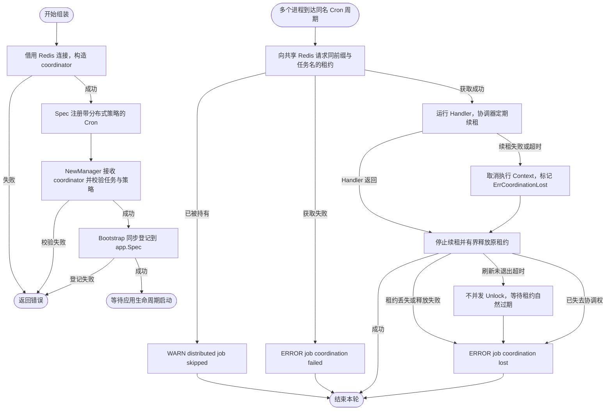

# Job

`pkg/job` 是业务与 Wire 声明、构造和注册后台任务的公共入口。业务使用 `Spec` 注册 Cron、Once 或 Daemon 任务，再通过 `NewManager` 构造运行时并交给 `bootstrap.NewJobBootstrap`；不应导入 `pkg/job/internal/*`。

并发策略只作用于 Cron：默认 `AllowOverlap` 允许重叠，`SkipIfRunning` / `DelayIfRunning` 只约束当前进程；跨进程控制必须同时注入 `ConcurrencyCoordinator` 并为任务选择 `SkipIfDistributedRunning` 或 `DelayIfDistributedRunning`。仅注入协调器不会改变任务策略。`NewManager(logger, spec, tracing, metrics, coordinator)` 的最后一个参数允许 nil，此时仅可使用进程内策略；分布式策略缺少协调器会在构造时返回错误，不会静默退化为无锁执行。所有声明必须在 `NewManager` 之前完成，之后修改 Spec 不会重配已创建的 Manager。

以下 Wire provider 分别构造 Redis 协调器和 Job 运行时。`redisManager` 已按 [Redis 配置](../redis/README.md) 声明 `locks` 连接；其他依赖由业务 Wire 提供。`appSpec` 必须是最终创建应用使用的同一个 Spec；返回的 `JobBootstrap` 要加入 [Bootstrap 聚合](../bootstrap/README.md)，确保应用构造前完成登记。`cleanupTask` 是实现 `job.Task` 的业务任务。

```go
package assembly

import (
	jobredis "github.com/jaggerzhuang1994/kratos-foundation/v2/contrib/job/redis"
	lockredis "github.com/jaggerzhuang1994/kratos-foundation/v2/contrib/lock/redis"
	"github.com/jaggerzhuang1994/kratos-foundation/v2/pkg/app"
	"github.com/jaggerzhuang1994/kratos-foundation/v2/pkg/bootstrap"
	"github.com/jaggerzhuang1994/kratos-foundation/v2/pkg/job"
	"github.com/jaggerzhuang1994/kratos-foundation/v2/pkg/log"
	"github.com/jaggerzhuang1994/kratos-foundation/v2/pkg/metrics"
	"github.com/jaggerzhuang1994/kratos-foundation/v2/pkg/redis"
	"github.com/jaggerzhuang1994/kratos-foundation/v2/pkg/tracing"
)

func newJobCoordinator(redisManager redis.Manager) (job.ConcurrencyCoordinator, error) {
	return jobredis.NewLockCoordinator(
		redisManager,
		job.LockCoordinatorConfig{KeyPrefix: "example:production:job:"},
		lockredis.WithConnection("locks"),
	)
}

func newJobs(
	logger log.Logger,
	coordinator job.ConcurrencyCoordinator,
	tracingProvider tracing.Provider,
	metricsProvider metrics.Provider,
	appSpec *app.Spec,
	cleanupTask job.Task,
) (bootstrap.JobBootstrap, error) {
	spec := job.NewSpec()
	spec.RegisterCron("cleanup", "@every 1m", cleanupTask,
		job.WithConcurrentPolicy(job.SkipIfDistributedRunning))
	manager, err := job.NewManager(logger, spec, tracingProvider, metricsProvider, coordinator)
	if err != nil {
		return bootstrap.JobBootstrap{}, err
	}
	return bootstrap.NewJobBootstrap(appSpec, manager)
}
```

将 `newJobCoordinator` 和 `newJobs` 加入业务 Wire provider 集合，协调器由 Wire 注入。统一 Spec 模式中则注入 `bootstrap.NewComponentsBootstrap`，由它传给 `job.NewManager`；禁用能力的 provider 示例见 [Bootstrap 文档](../bootstrap/README.md#可选依赖由-wire-构造注入)。

`KeyPrefix` 应替换成自己的应用和环境标识；需要互斥的副本使用相同前缀与任务名。任务结束后由协调器释放租约；共享 Redis 连接仍由 Redis Manager cleanup 释放。



Job Runtime 在 `Start` 时立即启动。`ExitWhenDone` 要求至少注册一个 Once，且 Spec 只能包含 Once；混入 Cron 或 Daemon 会在 `NewManager` 校验时返回错误。该模式在所有 Once 任务成功完成后返回 `job.ErrCompleted`；组装层 `bootstrap.NewJobBootstrap` 的适配器将该结果转换为 `app.ErrStopRequested`，请求正常停机。任务自身的失败原样保留。直接使用 Manager 时，由调用方处理 `job.ErrCompleted`。


停止期间只忽略正常返回和纯 Context 取消错误。若任务把取消与业务失败通过 `errors.Join` 合并，业务失败仍交给原有错误处理边界，不会当作正常停止而丢弃。


`bootstrap.NewJobBootstrap` 仅在 Manager 包含任务时，同步追加 Runtime；空 Manager 不作登记。它不创建资源也不返回 cleanup，Manager 的 Start/Stop 由 `app.NewApp` 创建的应用生命周期监督层拥有。

Job 不使用全局驱动注册表，也不会读取 `job.lock.driver` 自动选择实现。任务与协调器公共契约、调度、并发策略和观测逻辑直接定义在 `pkg/job`。`manager.go` 负责构造与任务组装，`manager_lifecycle.go` 负责运行和收敛；`cron.go` 集中调度与表达式解析，`log.go` 集中任务及 cron 日志适配；`lock_coordinator.go` 负责锁获取与配置校验，`lock_guard.go` 负责租约续租释放。

租约续租失败或超过 `OperationTimeout` 时，执行 Context 会独立取消并携带 `ErrCoordinationLost`，即使底层 `Refresh` 尚未返回；晚到的成功不会恢复旧任务。Handler 应响应 Context 取消。协调器不会重新拿锁继续旧任务，后续周期调度仍按原计划运行。

Release 先取消旧执行和续租，再最多等待 `OperationTimeout` 让在途续租退出。超过等待预算便返回错误，不与在途刷新并发 Unlock，而让租约自然过期。Redis 在途 I/O 仍遵守原客户端配置；默认读取超时有限。显式配置无限读取且禁用 Context 超时时，旧任务仍及时取消、Release 仍可返回，但原续租调用需等网络返回或 Redis Manager cleanup 关闭连接后收尾。第三方 Lease 仍须遵守 Context 约定，完全不可取消的实现无法被 Go 强制终止。协调器不为每次调用额外创建阻塞 goroutine；超时只触发短取消回调。

任务实现和中间件可通过 `job.JobNameFromContext(ctx)` 读取任务的注册名称。
名称由执行器注入，派生 Context 会继承；非任务 Context 返回空字符串。
