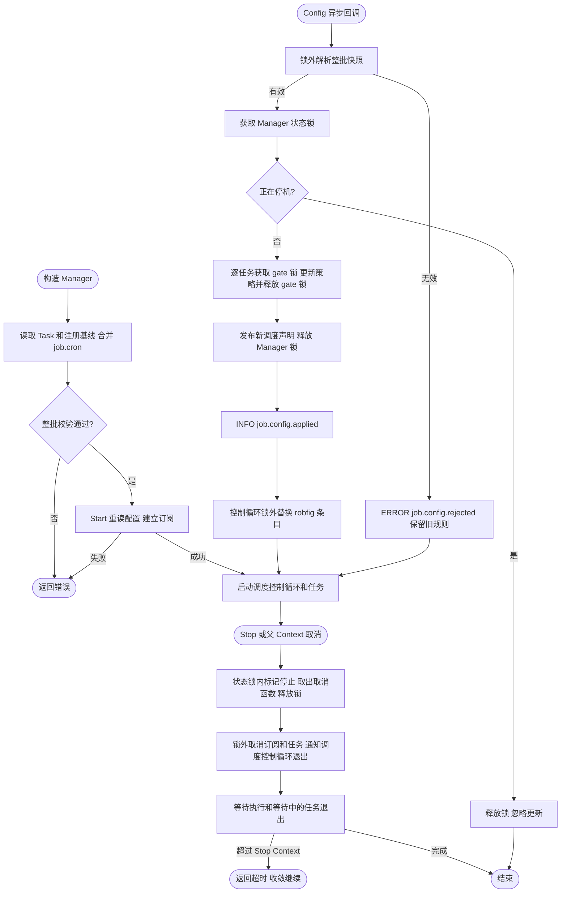
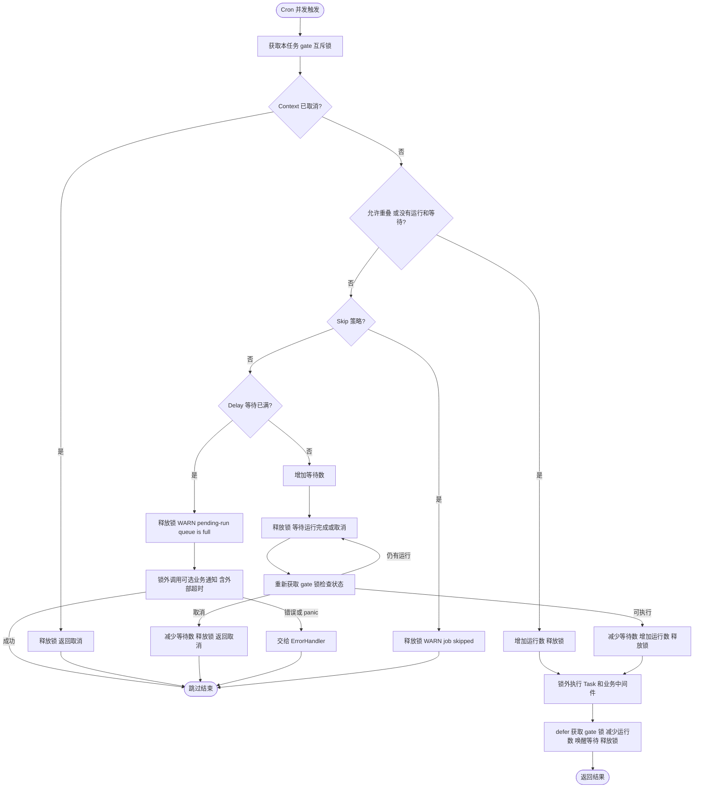
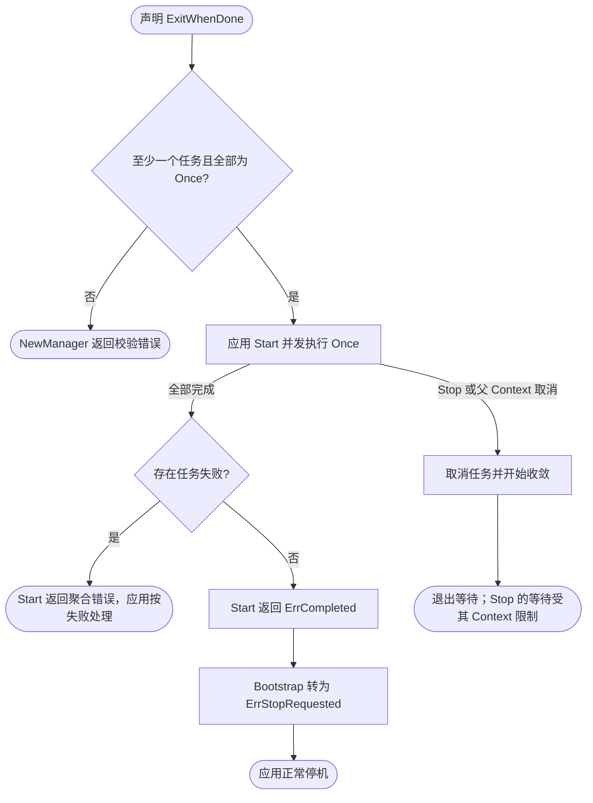
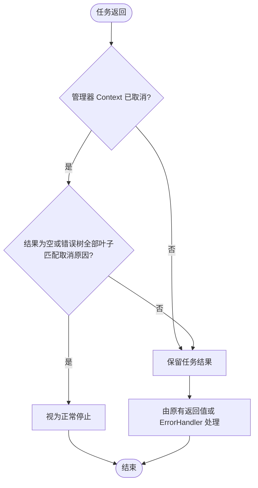
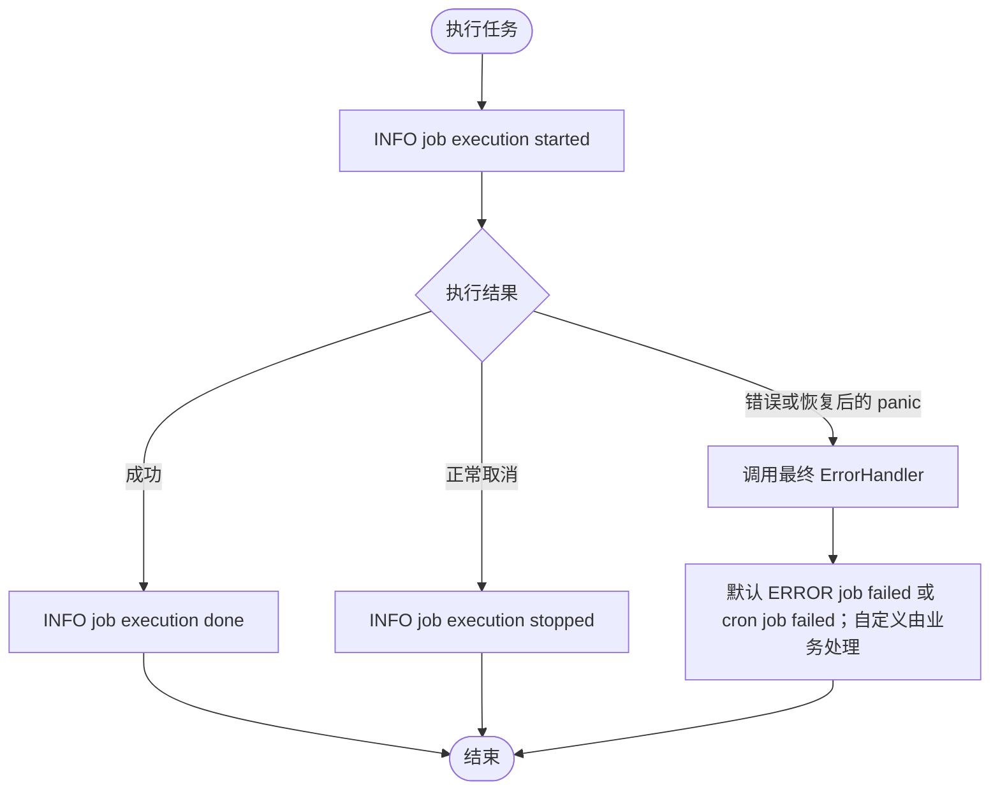
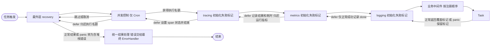

# Job

`pkg/job` 声明 Cron、Once 和 Daemon 任务。`bootstrap.Spec.Job()` 使用 Wire 共享的 job.Spec；`bootstrap.NewJobBootstrap` 注入应用的 config.Manager，构造 Manager 并登记 Runtime。Job 只提供本进程内、同一 Manager 中同一注册名称的并发控制；不同 Manager 和进程互不协调。

## 声明与优先级

Cron 四项参数逐字段按 **配置 > 注册时显式指定 > Task 自身声明 > 框架默认值** 解析。Task 可分别实现以下可选接口，不必全部实现；方法只在 Manager 构造时调用一次，后续热更新复用这份基线。

| 参数 | 配置字段 | 注册声明 | Task 可选方法 | 框架默认值 |
| --- | --- | --- | --- | --- |
| 定时规则 | `schedule` | RegisterCron 的非空 schedule | `Schedule() string` | 无，合并后必须非空且合法 |
| 并发策略 | `concurrent_policy` | `WithConcurrentPolicy(...)` | `ConcurrentPolicy() job.ConcurrentPolicy` | `AllowOverlap` |
| 启动立即执行 | `run_immediately` | `RunImmediately(bool)` | `RunImmediately() bool` | false |
| Delay 容量 | `max_pending_runs` | `WithMaxPendingRuns(int)` | `MaxPendingRuns() int` | 1 |

下面是可放入业务组装包的完整声明示例。Task 的 Run 承担业务工作，Boot 只登记已注入的 Task。

```go
package assembly

import (
    "context"
    "github.com/jaggerzhuang1994/kratos-foundation/v2/pkg/bootstrap"
    "github.com/jaggerzhuang1994/kratos-foundation/v2/pkg/job"
)

type RefreshTask struct{}
func (*RefreshTask) Run(ctx context.Context) error { return ctx.Err() } // 替换为实际业务逻辑。
func (*RefreshTask) Schedule() string { return "@every 1m" }
func (*RefreshTask) ConcurrentPolicy() job.ConcurrentPolicy { return job.SkipIfRunning }
func (*RefreshTask) RunImmediately() bool { return true }
func (*RefreshTask) MaxPendingRuns() int { return 2 }

func Boot(_ bootstrap.InfrastructureBootstrap, spec *bootstrap.Spec, task *RefreshTask) bootstrap.Bootstrap {
    spec.Job().RegisterCron("refresh", "", task, job.RunImmediately(false))
    return bootstrap.Bootstrap{}
}
```

空注册表达式表示使用 Task 或配置。配置中的空字符串是显式覆盖，因表达式无效而报错。配置使用 optional 字段，false、0、ALLOW_OVERLAP 都是有效的显式覆盖。有效快照中删除某个覆盖字段或将其设为 null，会重新使用注册/Task 基线。来源如何合并和删除字段仍遵循 [Config 语义](../config/README.md#来源与合并)。修改已经传入的 Spec 或 Task 默认方法不产生热更新。

```yaml
job:
  cron:
    refresh:
      schedule: "*/10 * * * * *"
      concurrent_policy: DELAY_IF_RUNNING
      run_immediately: false
      max_pending_runs: 1
```

表达式支持五字段、六字段（含秒）以及 `@hourly`、`@every 1m` 等描述符，时区由 `job.WithLocation` 指定。配置只覆盖已注册 Cron；未知任务名和 Once/Daemon 名称均拒绝，不能通过配置动态创建 Task。三种并发枚举为 `ALLOW_OVERLAP`、`DELAY_IF_RUNNING`、`SKIP_IF_RUNNING`；旧分布式策略不再支持。

## 配置热更新与生命周期

`NewManager(logger, spec, tracing, metrics, configManager)` 构造时读取并验证配置；configManager 可显式传 nil，表示只用静态声明。Bootstrap 正常注入应用 config.Manager。Start 再读取最新快照并建立 `job` 订阅，Stop 取消订阅；不额外返回 cleanup。由 App 管理 Start/Stop，应用先停止任务，再清理 Config Manager、日志和遥测资源。

每次更新先完整校验全部任务，任一表达式、策略、容量或名称无效则整批拒绝，记录 `ERROR job.config.rejected` 并保留上一份有效规则；初次构造或启动时无效则返回错误。合法变更记录 `INFO job.config.applied`。Config Manager 按轮询快照通知，短时间多次更新可能合并。

新表达式重新计算后续调度，旧周期不补跑。调度控制循环通过替换 robfig 条目应用更新，不等待正在执行的 Task。运行中修改 run_immediately 不额外触发：它只影响下一次进程启动；构造后、Start 前的配置变化仍会影响本次启动。

并发规则与容量作用于后续触发；正在执行的任务继续，已经排队的调用仍等待串行执行。切换策略保留运行计数，AllowOverlap 改成 Skip/Delay 时不会丢失旧调用。缩容不丢弃已有等待，只限制新增等待；切到 AllowOverlap 后，新调用可能先于旧等待执行，不保证严格 FIFO 或公平性。容量只限制 Delay 的等待数，不限制 AllowOverlap 的并行数。



## Delay 容量

`DelayIfRunning` 默认最多一轮执行、一轮等待。`max_pending_runs=0` 不保留等待，-1 表示无界等待；小于 -1 或最大 int 拒绝。满额触发跳过并记录 WARN，不调用 ErrorHandler。需要逐轮可靠处理的工作使用持久队列。

`WithDelayOverflowHandler(func(context.Context, job.DelayOverflow) error)` 可注入满额通知，事件含 Name、Policy、MaxPendingRuns。回调在锁外同步调用，不占执行名额；可能并发发生，业务负责并发安全、超时和去重。回调成功仍跳过本轮，错误或 panic 转换结果交给 Cron ErrorHandler；框架不重试。配置热更新不替换此回调。



Job Runtime 在 `Start` 时立即启动。`ExitWhenDone` 要求至少注册一个 Once，且 Spec 只能包含 Once；混入 Cron 或 Daemon 会在 `NewManager` 校验时返回错误。该模式在所有 Once 任务成功完成后返回 `job.ErrCompleted`；组装层 `bootstrap.NewJobBootstrap` 的适配器将该结果转换为 `app.ErrStopRequested`，请求正常停机。任务自身的失败原样保留。直接使用 Manager 时，由调用方处理 `job.ErrCompleted`。



停止期间只忽略正常返回和纯 Context 取消错误。若任务把取消与业务失败通过 `errors.Join` 合并，业务失败仍交给原有错误处理边界，不会当作正常停止而丢弃。



`bootstrap.NewJobBootstrap(application, jobs, configManager, logger, metrics, tracing)` 只构造和登记有任务的 Runtime，空 Spec 不登记。Job 不依赖 app/bootstrap，不管理全局容器，也没有 Coordinator、锁租约或 Redis 适配。`manager.go` 管构造，`manager_lifecycle.go` 管启停，`config.go` 管优先级，`config_reload.go` 管订阅与更新，`concurrent_policy.go` 管持续存在的本进程执行状态。

任务和中间件通过 `job.JobNameFromContext(ctx)` 读取注册名；非任务 Context 返回空字符串。

共享 Grafana 组件面板、指标名称与采集边界见 [组件指标说明](../../deploy/observability/docs/components.md)。

## 集成测试与边界用法

参见[核心组件集成用例](../INTEGRATION_TESTS.md#扩展模块与常见边界)。根目录 `make test-components` 运行自包含组合；`make test-components-external` 创建隔离 Docker 服务，验证真实 Kafka、Redis 和锁等功能。具体场景、所有权及适用边界见用例说明。

任务中间件记录开始、成功和正常取消；错误与 panic 仅交给最终 ErrorHandler。默认处理器携带 Context 记录一次最终错误；自定义 `WithErrorHandler` 时由业务负责最终错误日志。



## 中间件执行顺序

Cron 的进入顺序为：recovery → 并发控制 → tracing → metrics → logging → 按注册顺序的业务中间件 → Task；返回及 defer 按相反顺序执行。Once、Daemon 使用同一顺序，但没有并发控制。关闭观测只移除对应观测层，recovery 始终位于整个执行链最外层，且只组装一次。

观测层进入时将结果初始化为 panic 失败标记，只有下层正常返回才用返回值覆盖。因此 panic 展开期间不会按 nil error 记录成功，运行指标会归还、span 会以失败状态结束。最外层 recovery 统一将 panic 转为携带原始内容与堆栈的错误，交给既有结果处理边界。业务 panic 的 trace 使用通用 `job execution panicked` 描述，详细错误由最终 ErrorHandler 接收。

观测实现自身 panic 时只能保证返回错误，不能保证该实现已中断的指标或 span 完整。构造中间件时、最终 ErrorHandler 内及 Task 自建 goroutine 中的 panic 不在这条执行链的保护范围内。


