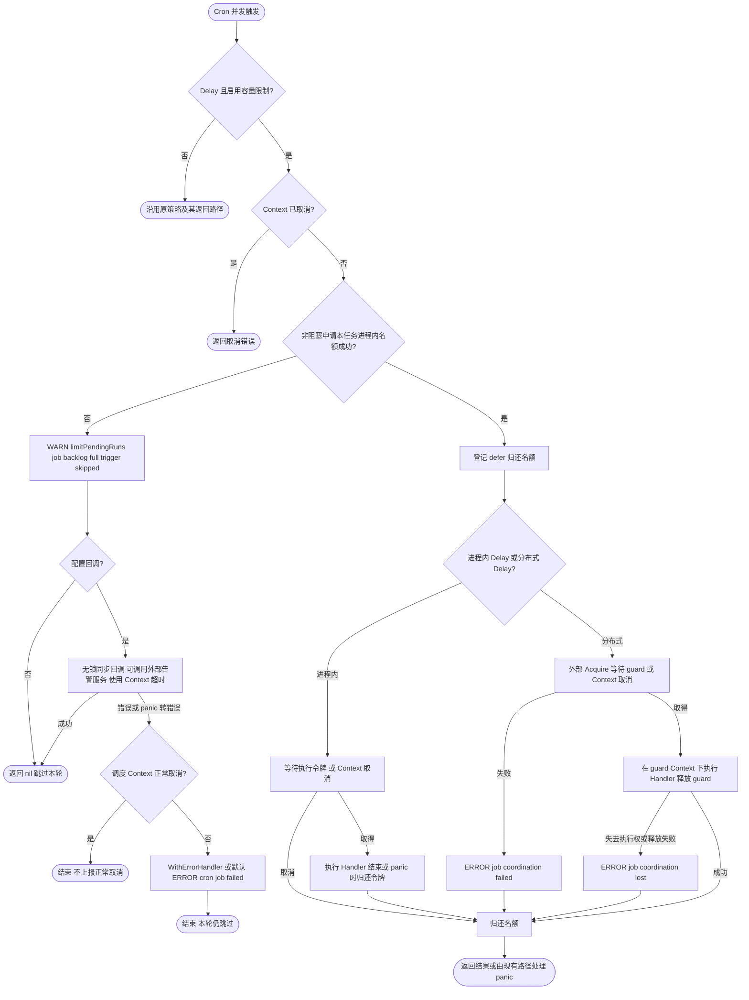

# Job

`pkg/job` 是业务与 Wire 声明、构造和注册后台任务的公共入口。业务使用 `bootstrap.Spec.Job()` 声明 Cron、Once 或 Daemon 任务，再由 `bootstrap.NewJobBootstrap` 在 Boot 后构造并登记运行时；不应导入 `pkg/job/internal/*`。

并发策略只作用于 Cron：默认 `AllowOverlap` 允许重叠，`SkipIfRunning` / `DelayIfRunning` 只约束当前进程；跨进程控制必须同时注入 `ConcurrencyCoordinator` 并为任务选择 `SkipIfDistributedRunning` 或 `DelayIfDistributedRunning`。仅注入协调器不会改变任务策略。`NewManager(logger, spec, tracing, metrics, coordinator)` 的最后一个参数允许 nil，此时仅可使用进程内策略；分布式策略缺少协调器会在构造时返回错误，不会静默退化为无锁执行。所有声明必须在 `NewManager` 之前完成，之后修改 Spec 不会重配已创建的 Manager。

## Delay 容量

`DelayIfRunning` 默认最多一轮执行、一轮等待；满额的新触发直接跳过，默认返回 nil 并记录 `WARN limitPendingRuns | job backlog full; trigger skipped`，不调用 ErrorHandler。`DelayIfDistributedRunning` 在外部 Acquire 前限制每个任务、每个进程最多两个进入竞争的调用；其他节点持有执行权时，这两个调用可能都在等待。该限制不是分布式全局队列，也不保证严格 FIFO。

使用 `job.WithMaxPendingRuns(n)` 覆盖，`n=0` 不保留额外等待名额，`n=-1` 显式恢复旧的无界等待。分布式 Delay 的总进入名额为 `n+1`，因此 n=0 时仍可能有一个调用等待远端执行权。负数仅允许 -1；最大 int 不支持，因为还需预留一个执行名额。所有配置在 Manager 构造时固化，不能运行期修改。默认 `AllowOverlap` 和两种 Skip 策略不受此选项限制。

```go
spec.RegisterCron("refresh", "@every 10s", task,
    job.WithConcurrentPolicy(job.DelayIfRunning),
    job.WithMaxPendingRuns(1))
```

片段中的 `spec` 是 `job.NewSpec()`，`task` 实现 `job.Task`。必须逐轮可靠执行的工作应使用持久队列；有界 Delay 会丢弃超额触发，显式无界 Delay 则仍有积压耗尽资源的风险。

通过 `job.WithDelayOverflowHandler` 为单个 Cron 注入业务告警：

```go
// 前置条件：spec 为 bootstrap.NewSpec()；task 为业务 job.Task。
// notify 由业务注入，签名为 func(context.Context, job.DelayOverflow) error。
spec.Job().RegisterCron("refresh", "@every 10s", task,
    job.WithConcurrentPolicy(job.DelayIfRunning),
    job.WithMaxPendingRuns(1),
    job.WithDelayOverflowHandler(func(ctx context.Context, event job.DelayOverflow) error {
        notifyCtx, cancel := context.WithTimeout(ctx, 2*time.Second)
        defer cancel()
        return notify(notifyCtx, event)
    }))
```

使用独立 `job.Spec` 时直接调用 `spec.RegisterCron`，选项相同。示例需导入 `context`、`time`、`job` 和 `bootstrap`。回调事件是独立值，含任务名 `Name`、策略 `Policy` 和配置容量 `MaxPendingRuns`；不代表全局或实时队列长度。仅有界 Delay 满额时调用，未配置、无界 Delay、Skip 和 AllowOverlap 不调用。

回调在默认 WARN 之后同步执行，不持锁、不占任务执行名额；可能被同一任务的多个触发并发调用。业务负责并发安全、请求超时及告警去重/限频，框架不创建通知 goroutine、不重试。慢回调仍会占用调度 goroutine 并延迟停止，应响应传入 Context，避免无限阻塞。回调成功仍跳过本轮；错误保留错误链，panic 转为错误，沿用 Cron 最终错误入口（自定义 `WithErrorHandler` 或默认 `ERROR cron job failed`）。与普通任务一致，随调度 Context 正常取消的错误不再上报。回调依赖由业务构造并在任务停止后释放；构造 Manager 后修改 Spec 不会替换已捕获的回调。

名额通过每任务独立的 buffered channel 非阻塞申请，不增加包级锁；执行、外部 Acquire 和日志不在互斥临界区中。正常返回、取消和 panic 均归还名额；进程内执行令牌与分布式 guard 的取得/释放沿用原策略。第三方 Acquire 仍须响应 Context；容量限制不能强制终止不合作的实现。



## 构造示例

以下 Wire provider 分别构造 Redis 协调器和 Job 运行时。`redisManager` 已按 [Redis 配置](../redis/README.md) 声明 `locks` 连接；其他依赖由业务 Wire 提供。`appSpec` 必须是最终创建应用使用的同一个 Spec；返回的 `JobBootstrap` 要加入 [Bootstrap 聚合](../bootstrap/README.md)，确保应用构造前完成登记。`cleanupTask` 是实现 `job.Task` 的业务任务。

```go
package assembly

import (
	jobredis "github.com/jaggerzhuang1994/kratos-foundation/v2/contrib/job/redis"
	lockredis "github.com/jaggerzhuang1994/kratos-foundation/v2/contrib/lock/redis"
	"github.com/jaggerzhuang1994/kratos-foundation/v2/pkg/bootstrap"
	"github.com/jaggerzhuang1994/kratos-foundation/v2/pkg/job"
	"github.com/jaggerzhuang1994/kratos-foundation/v2/pkg/redis"
)

func newJobCoordinator(redisManager redis.Manager) (job.ConcurrencyCoordinator, error) {
	return jobredis.NewLockCoordinator(
		redisManager,
		job.LockCoordinatorConfig{KeyPrefix: "example:production:job:"},
		lockredis.WithConnection("locks"),
	)
}

func Boot(spec *bootstrap.Spec, cleanupTask job.Task) bootstrap.Bootstrap {
    spec.Job().RegisterCron("cleanup", "@every 1m", cleanupTask,
        job.WithConcurrentPolicy(job.SkipIfDistributedRunning))
    return bootstrap.Bootstrap{}
}
```

将 `newJobCoordinator`、`Boot`、`bootstrap.NewJobBootstrap` 加入业务 Wire provider 集合，协调器由 Wire 注入 NewJobBootstrap，再传给 `job.NewManager`。NewRuntimeBootstrap 接收 JobBootstrap 保证登记完成；禁用能力的 provider 示例见 [Bootstrap 文档](../bootstrap/README.md#可选依赖由-wire-构造注入)。

`KeyPrefix` 应替换成自己的应用和环境标识；需要互斥的副本使用相同前缀与任务名。任务结束后由协调器释放租约；共享 Redis 连接仍由 Redis Manager cleanup 释放。


Job Runtime 在 `Start` 时立即启动。`ExitWhenDone` 要求至少注册一个 Once，且 Spec 只能包含 Once；混入 Cron 或 Daemon 会在 `NewManager` 校验时返回错误。该模式在所有 Once 任务成功完成后返回 `job.ErrCompleted`；组装层 `bootstrap.NewJobBootstrap` 的适配器将该结果转换为 `app.ErrStopRequested`，请求正常停机。任务自身的失败原样保留。直接使用 Manager 时，由调用方处理 `job.ErrCompleted`。


停止期间只忽略正常返回和纯 Context 取消错误。若任务把取消与业务失败通过 `errors.Join` 合并，业务失败仍交给原有错误处理边界，不会当作正常停止而丢弃。


`bootstrap.NewJobBootstrap` 在 Boot 完成后构造 Manager，仅在包含任务时登记 Runtime；未选择 Job 时跳过构造，空 Job 声明不登记。它不启动任务、不返回 cleanup；Manager 的 Start/Stop 由 App 生命周期监督层拥有。重复组装返回错误，构造或登记失败后应丢弃 Spec。

Job 不使用全局驱动注册表，也不会读取 `job.lock.driver` 自动选择实现。任务与协调器公共契约、调度、并发策略和观测逻辑直接定义在 `pkg/job`。`manager.go` 负责构造与任务组装，`manager_lifecycle.go` 负责运行和收敛；`cron.go` 集中调度与表达式解析，`log.go` 集中任务及 cron 日志适配；`lock_coordinator.go` 负责锁获取与配置校验，`lock_guard.go` 负责租约续租释放。

租约续租失败或超过 `OperationTimeout` 时，执行 Context 会独立取消并携带 `ErrCoordinationLost`，即使底层 `Refresh` 尚未返回；晚到的成功不会恢复旧任务。Handler 应响应 Context 取消。协调器不会重新拿锁继续旧任务，后续周期调度仍按原计划运行。

Release 先取消旧执行和续租，再最多等待 `OperationTimeout` 让在途续租退出。超过等待预算便返回错误，不与在途刷新并发 Unlock，而让租约自然过期。Redis 在途 I/O 仍遵守原客户端配置；默认读取超时有限。显式配置无限读取且禁用 Context 超时时，旧任务仍及时取消、Release 仍可返回，但原续租调用需等网络返回或 Redis Manager cleanup 关闭连接后收尾。第三方 Lease 仍须遵守 Context 约定，完全不可取消的实现无法被 Go 强制终止。协调器不为每次调用额外创建阻塞 goroutine；超时只触发短取消回调。

任务实现和中间件可通过 `job.JobNameFromContext(ctx)` 读取任务的注册名称。
名称由执行器注入，派生 Context 会继承；非任务 Context 返回空字符串。

默认不启用分布式协调时，Wire 可选择 `job.DefaultCoordinator`，其返回真正的 nil interface。
它不提供本地锁实现；进程内并发策略仍由 Job 自身处理。需要分布式协调时，替换该 provider，
不要同时登记默认和自定义 provider。

共享 Grafana 组件面板、指标名称与采集边界见 [组件指标说明](../../deploy/observability/docs/components.md)。

## 集成测试与边界用法

参见[核心组件集成用例](../INTEGRATION_TESTS.md#扩展模块与常见边界)。根目录 `make test-components` 运行自包含组合；`make test-components-external` 创建隔离 Docker 服务，验证真实 Kafka、Redis 和锁等功能。具体场景、所有权及适用边界见用例说明。
