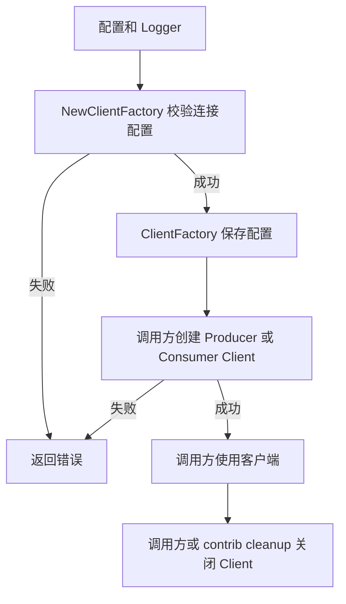

# Kafka

`pkg/kafka` 提供业务与 Wire 使用的 `ClientFactory`，按具名配置创建 franz-go 客户端。工厂只保存连接配置，不持有或共享创建出的客户端，因此不使用 Driver Registry，也不返回资源 cleanup。

```go
factory, err := kafka.NewClientFactory(logger, configManager)
if err != nil {
	return err
}

producer, err := factory.NewProducerClient("events")
if err != nil {
	return err
}
defer producer.Close()
```

公共工厂与实现集中在 `pkg/kafka`，配置校验、TLS/SASL 解析、franz-go 选项与日志适配分别位于 `config.go`、`security.go`、`options.go` 和 `logger.go`。每次创建的 producer/consumer client 归调用方或上层 contrib Runtime 所有并负责关闭。原 `Manager` / `NewManager` 调用应迁移到 `ClientFactory` / `NewClientFactory`。

Kafka Queue 的 Producer、Consumer 和 Runtime 组合位于 `contrib/queue/kafka`，由业务/Wire 显式构造。



当前固定版本 franz-go v1.20.7 已实现连接重建、Fetch 与消费组恢复，以及带抖动的指数退避（基础间隔 250ms、实际等待上限 5s）。工厂保留这些 SDK 默认策略，不启动额外重连协程。普通请求和位点提交的重试有次数/时间边界；队列适配器对耗尽后仍属暂时故障的消费操作提供恢复，详见 [Kafka 队列适配器](../../contrib/queue/kafka/README.md)。
