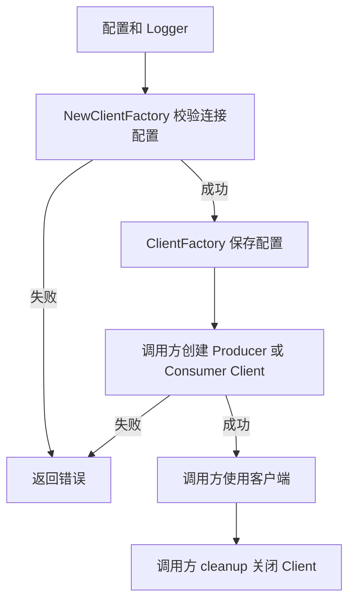
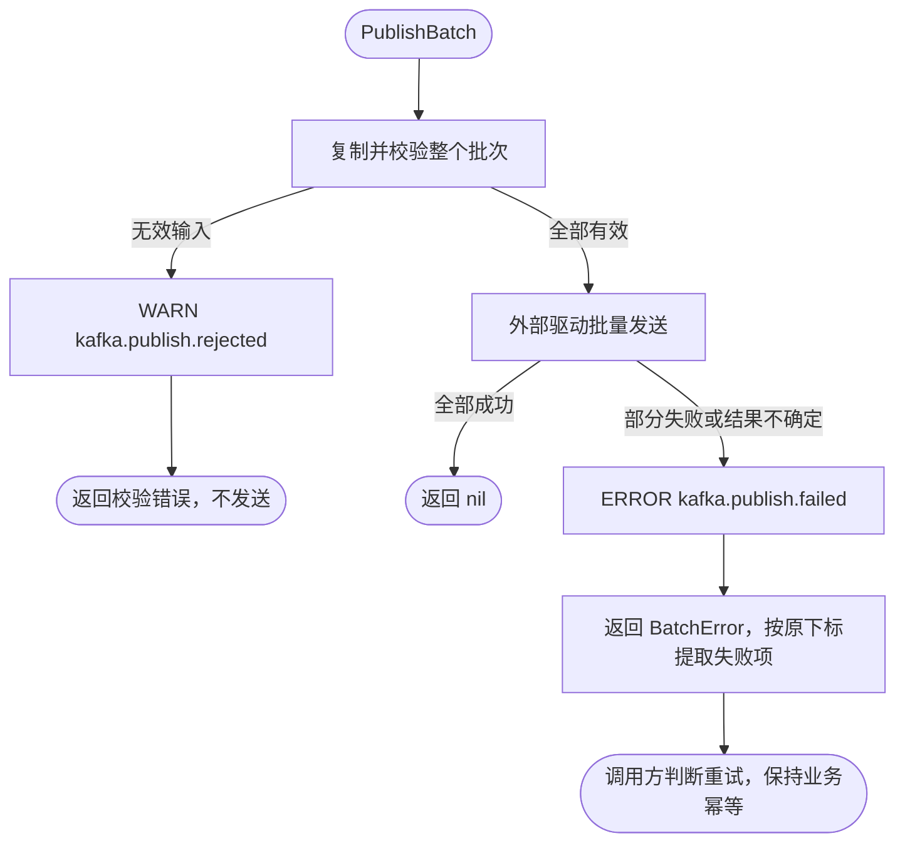
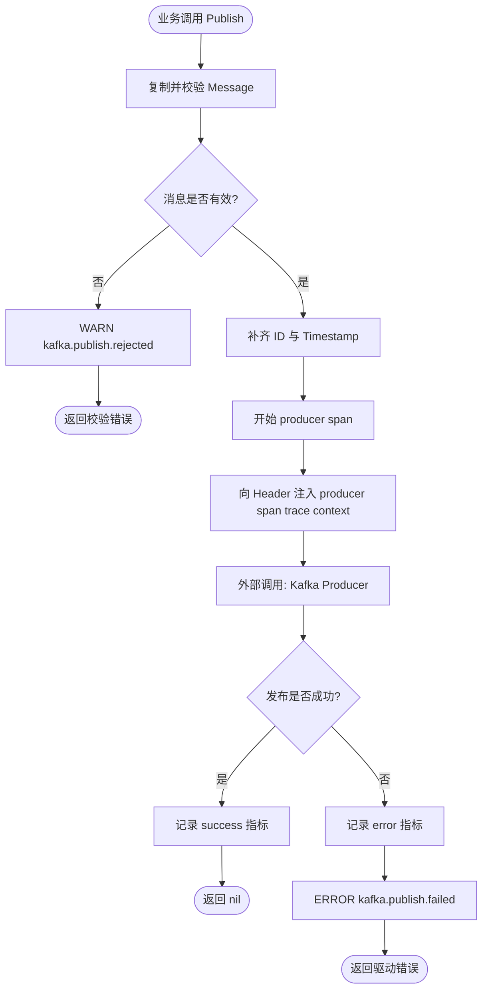
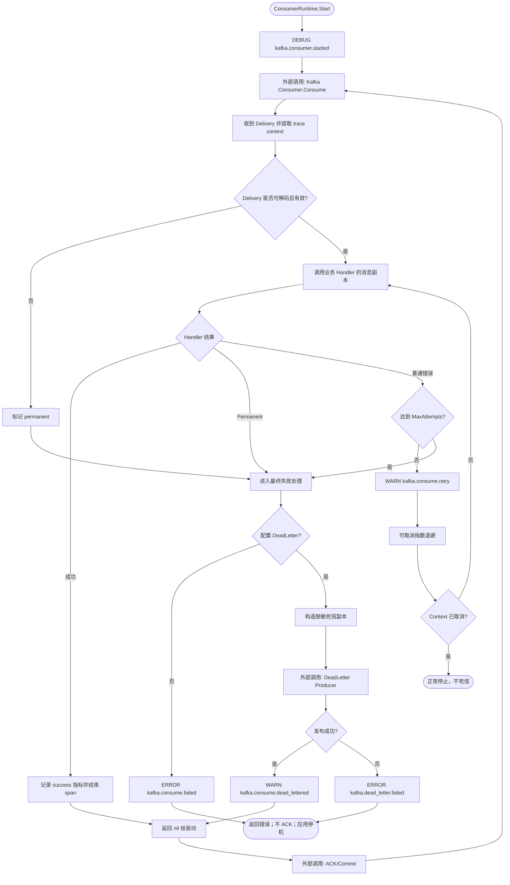
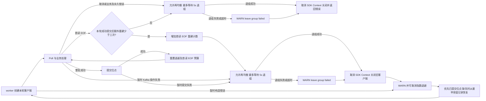
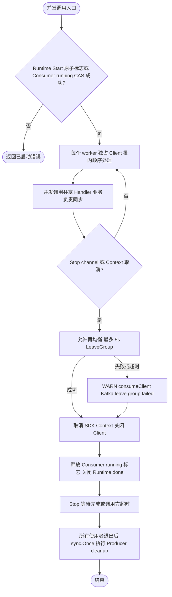

# Kafka

SDK 适配器、消费者，以及独立 NewManagedProducer / NewConsumerRuntime 的运行日志均归属 `module=kafka`。

`pkg/kafka` 提供业务与 Wire 使用的 `ClientFactory`，按具名配置创建 franz-go 客户端。工厂只保存连接配置，不持有或共享创建出的客户端，因此不使用 Driver Registry，也不返回资源 cleanup。

先在配置 Manager 的 `kafka.connections` 中声明示例引用的 `events`：

```yaml
kafka:
  connections:
    events:
      brokers:
        - 127.0.0.1:9092
```

连接配置由工厂在构造时保存为快照，变更后需要重启应用。TLS、SASL 和生产/消费选项见 [kafka.proto](../../proto/config_pb/kafka.proto)。下面的 logger 和配置 Manager 由业务 Wire 提供；创建 client 成功不代表 Broker 已可用，实际操作仍须处理连接和认证错误。

```go
factory, err := kafka.NewClientFactory(logger, configManager)
if err != nil {
	return err
}

producer, err := factory.NewProducerClient("events")
if err != nil {
	return err
}
defer producer.Close()
```

公共工厂与实现集中在 `pkg/kafka`，配置校验、TLS/SASL 解析、franz-go 选项与日志适配分别位于 `config.go`、`security.go`、`options.go` 和 `logger.go`。每次创建的 producer/consumer client 归调用方或上层 Runtime 所有并负责关闭。原 `Manager` / `NewManager` 调用应迁移到 `ClientFactory` / `NewClientFactory`。

Kafka 的消息契约、Producer、Consumer 和 ConsumerRuntime 也直接位于本包，由业务/Wire 显式构造；与 `pkg/queue` 持久化任务队列互不依赖。



当前固定版本 franz-go v1.20.7 已实现连接重建、Fetch 与消费组恢复，以及带抖动的指数退避（基础间隔 250ms、实际等待上限 5s）。工厂保留这些 SDK 默认策略，不启动额外重连协程。普通请求和位点提交的重试有次数/时间边界；队列适配器对耗尽后仍属暂时故障的消费操作提供恢复，详见 本文的“断线与消费恢复”。

## 迁移与所有权

旧 `contrib/queue/kafka` 构造器直接改为本包同名入口。旧 `queue.Message`、`Producer`、`Consumer`、`ConsumerRuntime`、`RetryPolicy` 等消息 API 改为 `kafka`；旧 `queue.NewProducer` 装饰器改为 `kafka.NewManagedProducer`。原始 Producer cleanup 在所有运行时停止后调用；装饰器借用原始 Producer，不额外拥有客户端。ConsumerRuntime 只能 Start 一次，Stop 等待消费循环退出并支持调用 Context 超时。

队列提供 **at-least-once** 语义，不提供 exactly-once：业务 Handler 必须可幂等，例如以业务键或消息 ID 去重。驱动只会在 `DeliveryHandler` 返回 `nil` 后 ACK 或 Commit 原消息；因此仅 Handler 成功、或死信消息已经发布成功时，原消息才会被确认。

## 生产消息

Observability 的 Tracing、Metrics 必须由应用注入 provider（关闭功能时也注入对应禁用 provider），Logger 可选。

生产者先由后端直接构造，再由 `kafka.NewManagedProducer` 装饰。装饰器深复制单条或批量输入，调用方继续拥有原始 `Message`、`Key`、`Body`、Header Value 及其批次切片；批量中任一输入无效时，整个批次都不会发送。

批量输入校验全部通过，只保证可以开始发送，不保证发送原子性。驱动可能已成功发送部分消息，再返回 `*kafka.BatchError`；其中 `Failures` 的 `Index` 对应原输入下标。不要因一个错误直接重发整个批次。以下函数只提取失败项，由调用方决定是否重试；网络错误仍可能表示结果不确定，重试失败项也需要业务幂等。需要跨重试保持消息身份时，发布前由业务设置稳定的 `Message.ID`。

```go
package assembly

import (
	"context"
	"errors"

	"github.com/jaggerzhuang1994/kratos-foundation/v2/pkg/kafka"
)

func publishBatch(ctx context.Context, producer kafka.Producer, messages []*kafka.Message) ([]*kafka.Message, error) {
	err := producer.PublishBatch(ctx, messages)
	if err == nil {
		return nil, nil
	}
	var batchErr *kafka.BatchError
	if !errors.As(err, &batchErr) {
		return nil, err // 输入校验等错误没有逐条发送结果。
	}
	failed := make([]*kafka.Message, 0, len(batchErr.Failures))
	for _, failure := range batchErr.Failures {
		failed = append(failed, messages[failure.Index])
	}
	return failed, err // 保留原错误供调用层分类、记录和决定重试。
}
```



它会校验 Header Key，在缺少时生成消息 ID；仅当 `Timestamp` 为零值时才生成 UTC 时间，业务提供的非零时间戳会保留。它还会将 W3C TraceContext 和 Baggage 写入消息 Header。

### Kafka

Kafka Producer 独占它创建的客户端。`releaseProducer` 由调用方在停止使用 Producer 后调用，且可安全地重复调用；`kafka.NewManagedProducer` 失败时也必须释放它。

```go
package assembly

import (
	"context"

	"github.com/jaggerzhuang1994/kratos-foundation/v2/pkg/kafka"
)

func newKafkaProducer(
	kafkaFactory *kafka.ClientFactory,
	observability kafka.Observability,
) (kafka.Producer, func(), error) {
	rawProducer, releaseProducer, err := kafka.NewProducer(kafkaFactory, kafka.ProducerConfig{
		Connection: "main",
		Topic:      "orders.created",
	})
	if err != nil {
		return nil, nil, err
	}
	producer, err := kafka.NewManagedProducer("orders.created", rawProducer, observability)
	if err != nil {
		releaseProducer()
		return nil, nil, err
	}
	return producer, releaseProducer, nil
}

func publishOrder(ctx context.Context, producer kafka.Producer, body []byte) error {
	return producer.Publish(ctx, &kafka.Message{Key: []byte("order-42"), Body: body})
}
```

Producer 仅对无效输入记录 WARN、对发布失败记录 ERROR，不逐条记录成功日志；失败日志关联 producer span Context，span 与指标使用逻辑 destination。



## 消费消息

`Consumer` 只有一个入口：`Consume(context.Context, kafka.DeliveryHandler)`。驱动通过 `Delivery` 把消息或解码错误交给运行时；业务只编写 `kafka.Handler`。不存在本包的 `Plan`、`Manager`、`Driver`、`Binding` 或 `Worker` API，也不应通过隐式发现注册消费者。

Kafka 的完整组装示例如下。将 `logger`、`appInfo`、`service` 和 `observability` 替换为应用已有依赖；`appSpec` 是同一个 `app.Spec`，可与默认 server/job Runtime 共用。业务应将返回的 `billingOrderCreatedBootstrap` 加入最终 `bootstrap.Bootstrap` 聚合器，确保运行时已在 `app.NewApp` 冻结 Spec 前登记。

```go
package assembly

import (
	"github.com/jaggerzhuang1994/kratos-foundation/v2/pkg/app"
	"github.com/jaggerzhuang1994/kratos-foundation/v2/pkg/appinfo"
	"github.com/jaggerzhuang1994/kratos-foundation/v2/pkg/log"
	"github.com/jaggerzhuang1994/kratos-foundation/v2/pkg/kafka"
)

type billingOrderCreatedBootstrap struct{}

func NewBillingOrderCreated(
	kafkaFactory *kafka.ClientFactory,
	logger log.Logger,
	appInfo appinfo.AppInfo,
	service *BillingService,
	observability kafka.Observability,
	appSpec *app.Spec,
) (kafka.Producer, billingOrderCreatedBootstrap, func(), error) {
	rawProducer, releaseProducer, err := kafka.NewProducer(kafkaFactory, kafka.ProducerConfig{
		Connection: "main",
		Topic:      "orders.created",
	})
	if err != nil {
		return nil, billingOrderCreatedBootstrap{}, nil, err
	}
	producer, err := kafka.NewManagedProducer("orders.created", rawProducer, observability)
	if err != nil {
		releaseProducer()
		return nil, billingOrderCreatedBootstrap{}, nil, err
	}

	rawConsumer, err := kafka.NewConsumer(kafkaFactory, logger, kafka.ConsumerConfig{
		Connection:  "main",
		Topic:       "orders.created",
		Group:       "billing",
		Instance:    appInfo.ID(),
		Concurrency: 4,
	})
	if err != nil {
		releaseProducer()
		return nil, billingOrderCreatedBootstrap{}, nil, err
	}
	runtime, err := kafka.NewConsumerRuntime(
		kafka.RuntimeConfig{
			Name:        "billing-order-created",
			Destination: "orders.created",
		},
		rawConsumer,
		service.HandleOrderCreated,
		observability,
	)
	if err != nil {
		releaseProducer()
		return nil, billingOrderCreatedBootstrap{}, nil, err
	}
	if err := appSpec.RegisterRuntime(runtime); err != nil {
		releaseProducer()
		return nil, billingOrderCreatedBootstrap{}, nil, err
	}
	return producer, billingOrderCreatedBootstrap{}, releaseProducer, nil
}
```

`Retry: nil` 默认最多调用 Handler 三次，初始退避 500ms、最大退避 30s。非 nil 的 `RetryPolicy` 必须提供正数 MaxAttempts（最多 1000），MinBackoff 为零表示不等待；MaxBackoff 为零时仅首次重试等待 MinBackoff，后续不等待；两者非零时间隔倍增并受最大值限制。Handler 返回 `kafka.Permanent(err)` 跳过重试；panic 转换为可重试错误。

最终失败时，未配置死信 Producer 和 destination，或死信发布失败，`ConsumerRuntime.Start` 都返回错误，源消息不提交；接入 app supervisor 后会触发应用停机。死信发布成功后该投递返回 nil，整批均成功时才提交位点。投递或运行时 Context 取消时不发布死信。

死信保留原 key、body 和合法 headers，生成新 ID 与时间戳，仅添加受控的 `x-queue-*` 失败元数据；不复制原始 Handler 错误文本。迁移保留既有 `x-queue-*` 传输头以兼容 Kafka 中已存在的消息，观测事件及标签改为 `kafka.*`、指标改为 `kafka_*`。



## 可观测性与数据边界

每次发布创建一个 producer span。每次投递创建一个 consumer span；该投递的所有 retry attempt 和 retry event 都属于同一个 span，不会创建新的根 span。consumer span 开始前会从消息 Header 提取 trace context。最终失败分类使用受控的 `kafka.consume.permanent` 或 `kafka.consume.retry_exhausted` span event，并且不把原始错误文本写入分类事件。

指标仅使用稳定、低基数标签 `kafka.destination`、`kafka.consumer`、`kafka.operation` 和 `kafka.result`。不要将消息 Body、Header Value、消息 ID、trace ID、死信原始错误文本、连接地址或随机 consumer 实例 ID 放入指标标签。日志通过 context 关联，可包含逻辑 Destination、Consumer Name、消息 ID、attempt、受限错误分类和本文事件名；不得包含消息 Body、Header Value、trace ID 或死信原始错误文本。

## 断线与消费恢复

franz-go 自身负责连接重建、Fetch 重试和消费组会话恢复，保持其原生指数退避。若这些机制之外的 Kafka 操作仍返回暂时错误（例如提交位点耗尽 SDK 重试或组代次失效），仅故障 worker 关闭旧客户端，再通过可取消退避重新创建客户端；其他 worker 继续运行。额外恢复等待从 100ms 基数翻倍至 5s，加入 80%–100% 抖动；一旦成功处理并提交消息，连续失败次数重置。

重建后优先从 Broker 的已提交位点继续消费。首次会话尊重配置的 `StartLatest`；恢复会话若仍没有已提交位点，则从该分区最早保留记录开始，可能重放保留历史，以避免首批提交失败后跳过已投递记录。已存在的提交位点和配置的越界重置策略保持不变。提交结果不确定或提交失败时，已执行的 Handler 可能再次执行，因此仍要求业务幂等，保持 **at-least-once** 语义。恢复不会直接重试旧客户端的业务 Handler，也不会跨越未确认批次提交新位点。

SDK 的 `ErrFirstReadEOF` 也可能由 Broker 重启引起，其 TLS/SASL 提示不是认证失败的确证。该错误从 Fetch 向外传播后，每个 worker 最多额外重建三次，沿用可取消退避；只有实际提交成功才重置这项预算。持续协议不匹配仍会在预算耗尽后终止，明确的认证、授权和证书验证失败不进入这项恢复。

只有明确发生在 Kafka 构造、Fetch 或提交阶段的暂时错误（以及上述有界首读 EOF）才触发恢复。Handler 即使返回 EOF 等网络错误，也会照常终止消费；认证、授权、客户端关闭及其他永久错误同样终止。worker Context 控制 Poll 和退避等待，每轮 SDK 客户端拥有独立的生命周期。退出时先允许再均衡，再用最多 5 秒的独立 Context 执行 LeaveGroup，最后取消 SDK Context 并关闭客户端。健康 Broker 可立即释放成员及分区；退组超时或失败会记录 WARN，并继续清理，Broker 侧成员仍可能保留至会话超时。



## 批量消费与本地开销

`ConsumerConfig.MaxPollRecords` 的零值仍为 1，支持 1–10000；这是单次 Poll 上限，不保证每批凑满。`Concurrency` 的零值仍为 1，每个 worker 使用独立 Client。保持整批顺序处理、整批成功后同步 CommitRecords；任意 Handler、Context 或提交失败都不越过该批提前确认。单分区直接借用 Fetch 的记录切片，避免展平分配；多分区、多 Broker 保留 SDK 遍历顺序和完整提交列表，交给 Handler 的消息所有权不变。

批量调优应使用真实 Broker 和业务 Handler：固定并发，依次比较 1、32、128 的吞吐、处理及提交 p95/p99、消费积压和重放量，再调整并发。增加批量可摊薄同步提交成本，但也扩大失败时可能重放的范围，延长阻止再均衡的处理时间；全部处理和提交时间应留在业务配置的再均衡预算内。框架不自动调大默认值或切换异步提交。

本地基准（仓库根目录）`go test ./pkg/kafka -run '^$' -bench BenchmarkProcessFetches -benchmem -count=6` 只测解码、投递和提交前的本地开销，提交器无网络延迟，不能作为 Broker 吞吐或最佳批量的结论。实际提交与失败恢复流程见上图。

真实 Docker 验证入口为仓库根目录 `make test-external`，包括 Broker 重启恢复、未提交消息重放，以及 1/32/128 批次的网络提交分位数；环境、隔离和结果边界见 [外部测试说明](../../testdata/external/README.md)。

## 并发与停止边界

沿用原有同步策略：Consumer 的原子运行标志拒绝同一实例并发 Consume；每个 worker 独占客户端，批内顺序处理，多个 worker 可同时调用 Handler。ConsumerRuntime 的原子标志限制单次启动，Stop 通过一次关闭的 stop channel 通知，再等待 done 或调用方超时；Producer cleanup 使用 sync.Once 关闭独占客户端。Handler 及其共享业务状态由业务保证并发安全；停止所有使用者之后才能 cleanup。cleanup 后不得继续 Publish/PublishBatch；当前 SDK 在关闭后发布可能阻塞，Context 超时不构成释放后调用的退出保证。



共享 Grafana 组件面板、指标名称与采集边界见 [组件指标说明](../../deploy/observability/docs/components.md)。

## 集成测试与边界用法

参见[核心组件集成用例](../INTEGRATION_TESTS.md#扩展模块与常见边界)。根目录 `make test-components` 运行自包含组合；`make test-components-external` 创建隔离 Docker 服务，验证真实 Kafka、Redis 和锁等功能。具体场景、所有权及适用边界见用例说明。
