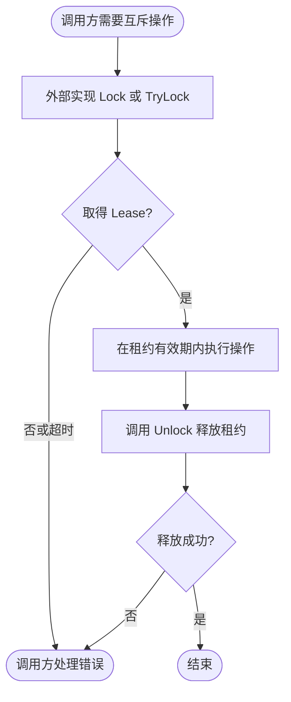

# lock

本包只定义 `Locker`、`Lease` 及 `ErrNotAcquired`、`ErrNotHeld`，不创建连接、不启动后台续租、不管理应用生命周期。实现由调用方注入；Redis 实现见 `contrib/lock/redis`，带自动续租的任务协调见 `pkg/job`。

`Lock(ctx, key, ttl)` 等待租约，`TryLock` 只尝试一次。调用方应传入有界 Context 与正 TTL；用 `errors.Is` 判断稳定错误。租约操作均需处理错误，失去租约后不能假设仍有执行权。

操作级租约由调用方释放；底层 Redis Manager 的连接 cleanup 仍由 Wire 逆序管理。本包没有日志实现。
