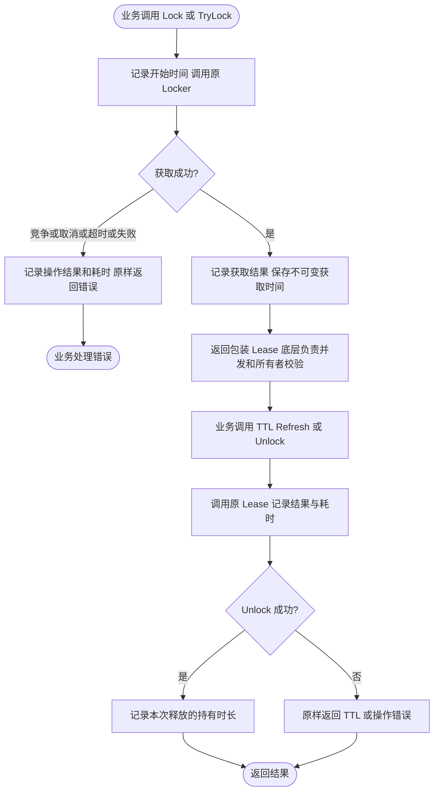

# lock

本包定义 `Locker`、`Lease`、`ErrNotAcquired`、`ErrNotHeld`，并提供可选的 `WithMetrics` 观测包装；不创建连接、不启动后台续租、不管理应用生命周期。实现由调用方注入；Redis 实现见 `contrib/lock/redis`。Job 只提供本进程并发策略，不再提供锁租约或自动续租；长任务由业务显式调用 `Lease.Refresh`，跨 Job、请求和消费者复用的 watchdog 仅是[开发指南中的候选设计](../DEVELOPMENT.md#watchdog-开发示例)，当前尚未实现。

`Lock(ctx, key, ttl)` 等待租约，`TryLock` 只尝试一次。调用方应传入有界 Context 与正 TTL；用 `errors.Is` 判断稳定错误。租约操作均需处理错误，失去租约后不能假设仍有执行权。

操作级租约由调用方释放；底层 Redis Manager 的连接 cleanup 仍由 Wire 逆序管理。本包没有日志实现。

## 指标包装

可在业务 Wire provider 中调用 `lock.WithMetrics(rawLocker, "orders", metricsProvider)`，检查返回错误后，将返回的 `Locker` 注入业务。`rawLocker`、`metricsProvider` 是已构造的必需依赖；名称必须为非空且无首尾空白的固定业务分类，不传订单 ID、租户 ID 或完整锁键。包装层借用资源，不产生额外 cleanup。

| 指标 | 标签 / 含义 |
| --- | --- |
| lock_operations_total | lock_name、operation、result；operation 为 lock/try_lock/ttl/refresh/unlock |
| lock_operation_duration_seconds | 同上；获取锁耗时包含底层等待与重试，单位秒 |
| lock_released_hold_duration_seconds | lock_name；成功获取到成功 Unlock 返回的时间，单位秒 |

result 为 success、contended、not_held、timeout、canceled、error；通过 `errors.Is` 识别原始错误，包装不改变返回值。TryLock 竞争是预期结果，不能直接当成基础设施故障；Lock 超时可能来自竞争，也可能来自依赖超时，需结合 Redis 与日志排查。

持有时长只在成功 Unlock 时记录：不覆盖自动过期、释放失败或进程崩溃，不表示当前占用数，也不持续读取 TTL。Redis 实现重复释放会返回 ErrNotHeld；如果自定义实现把重复 Unlock 当作成功，每次成功调用都会产生样本。包装层不做去重，不新增 goroutine、锁或共享可变状态；并发安全和所有者校验仍由底层实现保证。操作失败继续交给业务处理边界记录日志，避免库层重复记录。

组件面板和采集前提见 [组件指标说明](../../deploy/observability/docs/components.md)。

## 集成测试与边界用法

参见[核心组件集成用例](../INTEGRATION_TESTS.md#扩展模块与常见边界)。根目录 `make test-components` 运行自包含组合；`make test-components-external` 创建隔离 Docker 服务，验证真实 Kafka、Redis 和锁等功能。具体场景、所有权及适用边界见用例说明。
