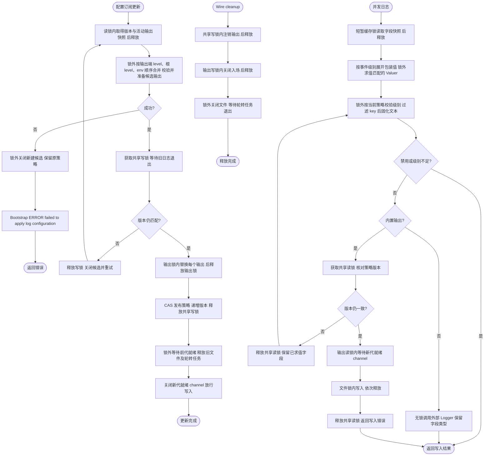
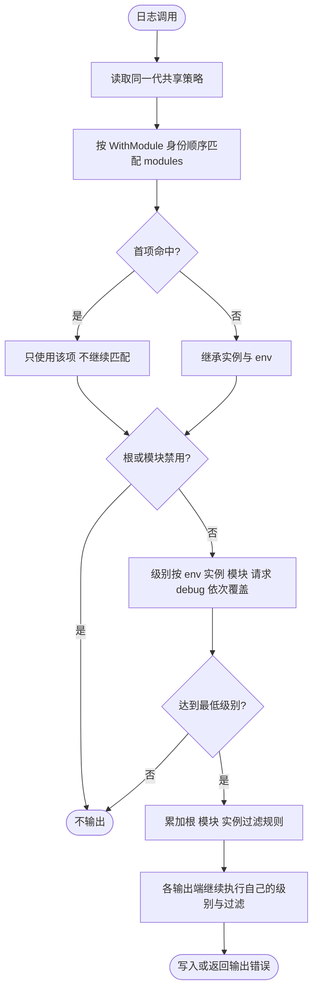
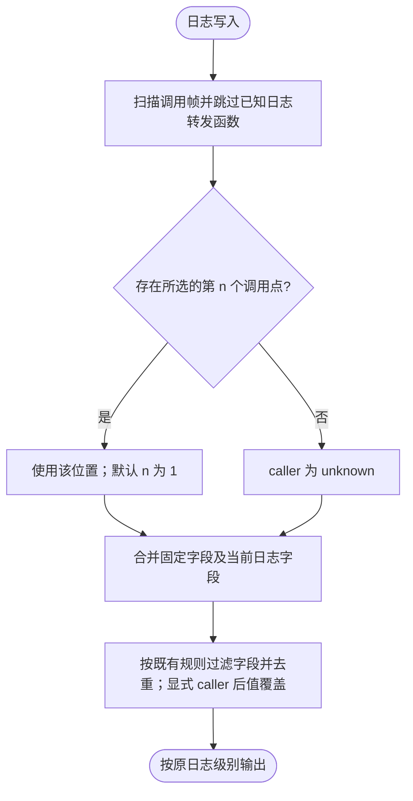
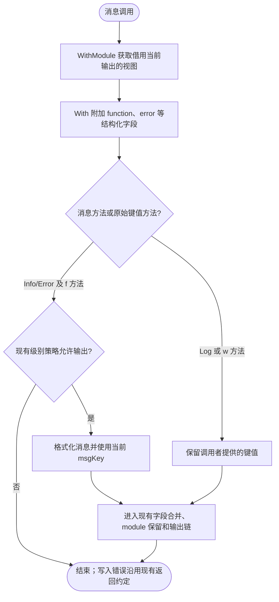
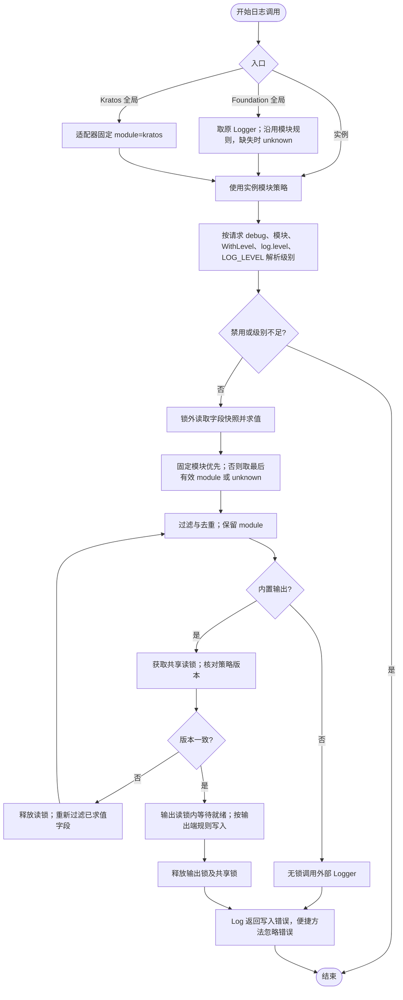
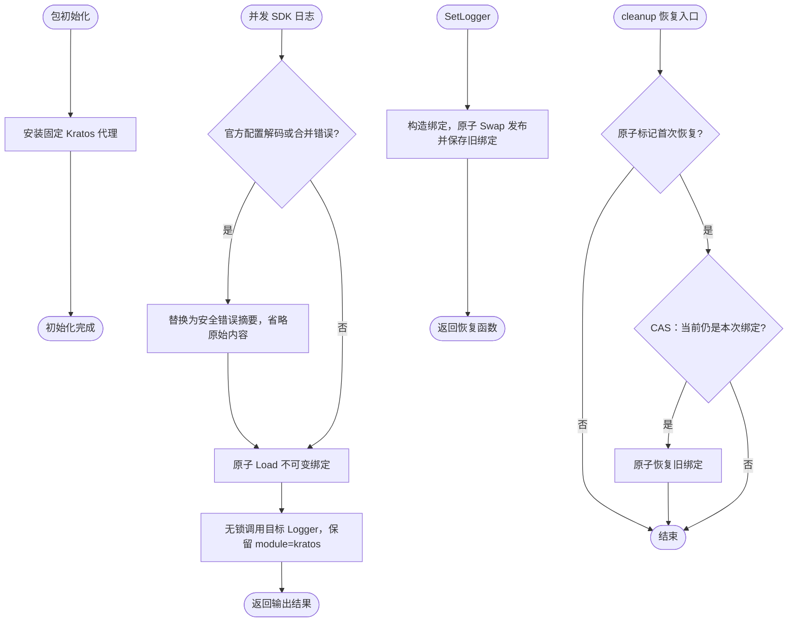

# log

`pkg/log` 直接提供业务与 Wire 使用的 Kratos Logger，支持配置驱动的运行期策略、不可变派生 Logger、字段过滤和重复字段合并。公共契约、版本缓存、原子共享状态、配置校验与输出组装在同一包内按职责分文件；file/std/filter/stack 等独立输出能力保留在 `internal/output`。

## 初始化与释放

每次 `log.NewLogger()` 读取并校验 `LOG_*`，保存该实例的启动基线，构造独立输出并返回 cleanup。派生 Logger 复用实例输出；Wire 在业务退出后释放。共享状态借用活动实例进行策略更新，资源所有权始终属于各实例的 cleanup。

```go
logger, cleanup, err := log.NewLogger()
if err != nil { return err }
defer cleanup()
logger.WithModule("orders").Info("ready")
```

关闭一个实例不会关闭其他实例，也不清除共享策略。已关闭实例及其派生 Logger 的有效写入返回 `os.ErrClosed`；后续配置更新不会重新激活它。新建实例会合并当前运行期策略与自己的 env 基线。多个实例各自拥有输出；同一进程使用全局 `file.path` 会让这些实例写入同一路径，通常应只构造一个应用 Logger。

组装前的全局 fallback 只输出到标准输出，使用内置固定格式，不打开文件，也不登记为可切换输出。`bootstrap.NewLogBootstrap(appSpec, manager, logger)` 安装实例全局视图；cleanup 先取消订阅、恢复原绑定，再由 Wire 释放实例输出。`SetLogger` 为 Kratos 全局入口派生 `module=kratos`，Foundation 入口保留原实例模块。

## 策略优先级与公共 API

级别优先级：**请求 debug > log.modules 首个命中项的 level > WithLevel > log.level > LOG_LEVEL**。根 `LOG_DISABLE` 和命中模块的 `disable: true` 是硬限制，不能由请求 debug 解除。组件通过 `WithModule` 声明归属，模块策略集中在 `log.modules` 并支持热更新。

| 入口 | 用途与限制 |
| --- | --- |
| `Logger.WithLevel` / `log.WithLevel` | 设置实例最低级别；模块配置与请求 debug 优先，不修改父实例或全局策略 |
| `WithModule`、`With`、`WithContext`、`WithFilterKeys` | 派生模块、字段、请求上下文和追加过滤 |
| `Logger.WithCallerDepth` | 调整业务包装深度 |
| `AtLevel` / `DebugOnly` | 包装按事件级别显示的字段值；`DebugOnly` 在 Debug 事件或请求级 debug 中显示，默认 `filter_empty=true` 时其他场景删除整组 KV |
| `request.WithDebug(ctx)` | 请求级诊断标记，详见 [request](../request/README.md) |
| `ValidateRuntimeConfig` / `ApplyRuntimeConfig` | 组装层配置适配入口；校验与发布完整策略，失败返回错误 |
| `RegisterFields` | 组装层登记 service/trace 等共享元数据 |
| `SetLogger` / `GetLogger` | 借用、恢复全局绑定，不接管输出所有权 |

`WithFilterEmpty`、`WithTimeFormat`、`WithMsgKey` 不对编码阶段开放，这些固定行为由启动 env 控制。所有派生调用必须使用返回值。

```go
// 前置条件：logger 已构造，ctx 为请求上下文。
orders := logger.WithModule("orders").WithLevel(kratoslog.LevelWarn)
orders.WithContext(request.WithDebug(ctx)).Debug("request details")
```

输出端级别是独立的最低限制，debug 不绕过它。未配置 `log.level` 且 `LOG_LEVEL=info` 时，仅把 `log.std.level` 改成 debug 不会产生 DEBUG 日志；需要根配置、模块配置、实例或请求放宽根级别。

## 配置热更新

| 分类 | 字段 | 生效方式 |
| --- | --- | --- |
| 固定 | 根 disable、filter_empty、time_format、msg_key | 每个实例构造时从 env 读取，之后固定 |
| 动态 | 根 level、filter_keys、modules；std 的 level、disable、filter_keys；file 的 enable、level、filter_keys、path、rotating 全部字段 | env 为初始值，可由配置覆盖 |

`bootstrap.NewLogBootstrap` 订阅 `log`；进程应由一个权威配置 Manager 管理。每次发布完整替换动态策略，缺失字段恢复该实例的 env 值（输出端级别优先继承 `log.level`）。`NewLogger` 本身不会创建配置 Manager。根固定字段不属于动态契约；各组件的 log 配置已移除，请迁移到 log.modules。

```yaml
log:
  level: info # std/file 未设置 level 时继承此值
  filter_keys: [password, token]
  std:
    disable: false
    filter_keys: []
  file:
    enable: true
    path: ./app.log
    rotating:
      disable: false
      max_size: 100
      max_file_age: 7
      max_files: 10
      local_time: false
      compress: true
```

以上为示例值。输出端级别按 **log.std/file.level > log.level > LOG_STD/FILE_LEVEL** 解析；根级别按 **log.level > LOG_LEVEL** 解析。未配置根或输出端级别且没有输出端环境变量时，输出端保持无独立限制。`log.level` 支持 debug/info/warn/error/fatal（协议和 schema 接受全小写或全大写；直接使用 RuntimeConfig 时忽略大小写及首尾空白），空字符串或非法值拒绝整次更新；null 或缺失回退环境值。继承自 `log.level` 的输出端阈值同样不会被请求 debug、模块规则或 WithLevel 绕过。环境变量仍在实例构造时解析和校验，非法环境值会使构造失败，不能靠配置覆盖绕过校验。其他动态字段省略时继承 env；显式 false、0 或空列表不会当作缺失。`filter_keys: []` 清空该层过滤，`null` 和缺失均恢复 env；根、首个命中模块、实例追加过滤和输出端过滤最终取并集。这里的缺失/null 规则针对传给 `ApplyRuntimeConfig` 的有效对象；通过 config.Manager 更新时，官方默认 merge 会保留源中省略的旧字段，因此从源中删除字段不等于恢复 env。`RuntimeConfig` 使用普通 JSON 结构保留 nil 与空切片的区别，不是 protobuf 类型别名；protobuf `Logging` 负责根配置协议及 schema。

文件默认关闭，`LOG_FILE_ENABLE=true` 可在启动时启用；配置 `log.file.enable=true` 也能在启动后启用。关闭文件会释放句柄和轮转任务。路径或轮转变化会准备新输出；新代通过就绪 channel 等待前代释放后才允许写入，同路径切换也遵守该规则。仅修改级别、过滤或标准输出策略复用原文件。启用轮转时 max_size 必须大于零；保留天数与数量为零表示不限制，负值非法。

完整策略与各活动实例的 env 合并、校验及输出准备全部成功后才发布。路径不可用或任一实例校验失败时保留所有旧策略、旧输出，由 Bootstrap 记录 ERROR。失败候选会关闭；准备阶段只验证文件可追加，不启动候选轮转任务；可能创建空文件或目录，不保证撤销这些磁盘副作用。已停用或关闭的实例不会因晚到更新重新登记。

并发提交使用共享 `RWMutex`：内置输出只在最终写入时持读锁，核对策略版本后使用同一代策略和输出；更新、登记与退出用写锁保护复合状态。Valuer、Stringer、error 和 Formatter 等用户字段求值及格式化在所有日志锁外执行，可以重入日志或发布策略。每条事件只求值一次；`AtLevel` 包装的 Valuer 仅在事件级别精确匹配时求值，`DebugOnly` 还会在绑定 Context 启用请求级 debug 时求值。求值期间策略发生变化时，使用已求值字段重新应用最新级别和过滤规则，不重复执行回调。共享字段在事件开始时取快照，期间新登记的字段从后续事件开始生效。

内置文本输出先按根、模块和实例的 key 规则过滤，再在入场前按原有 `%s`/`%v` 格式固化放行字段；这些规则拒绝的字段不会执行格式化方法。输出端的独立过滤仍在随后执行。外部 Logger 保留原始字段类型，调用其 Log 时不持本包锁，输出生命周期仍由调用方管理。磁盘创建、关闭和轮转任务退出在提交锁外执行；候选准备期间发生其他提交则释放候选并重试。提交会等待现有内置日志写入结束，因此慢磁盘可能延迟更新和新日志。实例缓存锁仅保护不可变快照发布与读取，不与共享入场锁嵌套；内置写入锁顺序为共享入场锁、输出锁、底层文件写锁。不增加常驻 goroutine 或资源租约。



取消订阅不等待已经开始的回调，最近有效策略继续保留。监听终止时不自动重订阅。直接调用 `ApplyRuntimeConfig` 的调用方负责处理返回错误，不应在多个层级重复记录。

## 模块策略

```yaml
log:
  filter_keys: [password, token]
  modules:
    - module: database/gorm
      level: debug
      filter_keys: [sql.secret*]
    - module: database*
      level: warn
    - module: client
      disable: true
    - module: "*"
      level: info
```

列表按顺序匹配，首个命中即停止；精确项没有特殊优先权，宽泛项放前面会遮住后面的精确项。支持精确模块名、末尾单个 `*` 的前缀表达式和 `*` 全匹配；不支持其他通配符或正则表达式。重复表达式、空名称、非法级别和过滤字段使整次发布失败。

匹配使用 `WithModule` 声明的模块身份，没有声明则为 `unknown`；普通 KV 中的 module 仅用于输出展示，不改变模块策略身份。模块规则未设置 level 时依次继承 WithLevel、log.level 或 LOG_LEVEL，不从后续项补齐；disable 缺失或 false 表示不额外禁用，不能解除 LOG_DISABLE。请求 debug 仍遵守输出端级别。

模块 filter_keys 只追加：根规则 + 首个命中模块规则 + WithFilterKeys + 对应 std/file 规则取并集，重复键不会影响结果。模块空列表不会清除其他层。字段规则支持精确键和尾部 `*`，仅处理结构化日志键，不递归处理字段值；module 字段始终保留。

modules 没有 env 初始值。向 ApplyRuntimeConfig 传入空或缺失 modules 会移除模块策略，已有 Logger 在下一次写入使用新策略；通过配置源撤销时应显式设置 `modules: []`，因为官方默认 merge 会保留省略的键。每次发布深拷贝模块列表及字段，不借用调用方可变切片。



该流程在锁外求值后读取策略；内置写入入场时再次核对版本，变化时重新过滤已求值字段。

## 组件日志字段

appinfo 和 tracing 在 Bootstrap 中调用 `RegisterFields` 登记共享字段。更新沿用 CAS，在最新快照副本上重试，避免并发登记或策略更新丢失字段；同名 key 后登记的值生效。KV 对象不深拷贝，调用方负责对象本身的读取安全。

## 派生 Logger

派生方法返回新对象，不修改父 Logger：

```go
moduleLogger := logger.WithModule("orders")
requestLogger := moduleLogger.
	WithContext(ctx).
	With("order.id", orderID).
	WithFilterKeys("authorization", "payload.secret*")

requestLogger.Info("order loaded")
requestLogger.Infow("status", "ready")
```

`WithModule` 用于程序内常量；module 必须非空且不带首尾空白，非法值直接 panic。模块运行期规则在发布时校验，失败返回错误并保持旧策略。

### Caller depth

默认 caller 扫描最多 64 个调用帧，跳过 Foundation Logger、Kratos Helper/With/WithContext/全局入口，以及已知的 GORM Writer、Kafka、Cron 日志转发函数。仅按完整函数所属路径识别，不跳过整个业务包；业务辅助函数、访问日志中间件和 SDK 实际产生事件的位置会保留。没有有效来源或深度超过可用调用帧时输出 `unknown`。

深度唯一入口是派生 Logger 的 `WithCallerDepth(n)`：在过滤内置包装后，选择第 n 个调用点。默认 `1` 为直接调用者；业务额外封装一层日志函数时设置为 `2`。`n <= 0` 恢复默认值 `1`。多次设置以后一次为准，不累加，不修改原 Logger；With/WithModule/WithContext 等派生操作会保留所选深度。没有包级全局深度、增量或原始 Go 栈深度模式。

下面片段假定 `logger` 已按上文构造；应将 `wrapped` 交给业务自定义的日志转发函数使用：

```go
wrapped := logger.WithCallerDepth(2) // 跳过一层业务日志封装
reset := wrapped.WithCallerDepth(1) // 恢复直接调用点
_ = reset
```

Foundation 自身的派生方法不增加日志转发帧，内置适配器也无需用户补偿。未识别的自定义包装仍会计入深度。旧版本固定栈数字不能直接沿用，迁移说明见 [caller API 迁移](../../MIGRATION_V2.md#caller-api-简化)。

显式 `caller` 字段沿用字段去重的后值覆盖前值规则（仍受字段过滤规则约束）。GORM Writer 从 GORM 提供的首参数提取查询来源，规范化为 `目录/文件:行号`；有效来源优先于深度选择，来源缺失或行号无效时沿用普通 caller。SQL 消息格式不变。



## 字段过滤与去重

### 按事件级别显示字段

`AtLevel` 按当前日志事件的精确级别决定字段值。`DebugOnly` 通常等同于 Debug 级别，但绑定的 Context 经过 `request.WithDebug` 时，也会在 Info/Warn/Error/Fatal 事件中展开，适合让同一条请求日志在诊断模式携带更多字段。它们可以用于 `RegisterFields`、`With`、`WithKv` 和单次 `Log/*w` 的值位置：

```go
logger := logger.With(
    "component", "orders",
    "error.stack", log.DebugOnly(kratoslog.Valuer(func(ctx context.Context) any {
        return stackFromContext(ctx)
    })),
)

logger.Info("request failed")  // 不计算、不输出 error.stack
logger.Debug("request failed") // 计算并输出 error.stack

debugLogger := logger.WithContext(request.WithDebug(ctx))
debugLogger.Info("request failed") // 请求级 debug：计算并输出 error.stack
```

`AtLevel` 匹配事件自身的精确级别，不是 Logger 的最低输出级别；即使请求级 debug 已开启，`AtLevel(kratoslog.LevelDebug, value)` 仍不会出现在 Info、Warn、Error 或 Fatal 事件中。只有 `DebugOnly` 具有请求级 debug 例外。条件不匹配时包装值展开为 `nil`：默认 `LOG_FILTER_EMPTY=true` 会删除键和值；显式设置 `LOG_FILTER_EMPTY=false` 时会保留该键并输出空值。普通单次 `Log/*w` 参数中的 Kratos Valuer 仍不由 Foundation 自动求值，只有显式包装在 `AtLevel`/`DebugOnly` 内的 Valuer 会在匹配条件成立时求值。

字段按用途分为三层：

- `event`、`result`、`duration`、稳定错误分类、请求/任务/资源标识及 `trace.id`、`span.id` 属于检索和关联字段，在 Info/Warn/Error 中保持可见；关闭 tracing 记录与导出也不会隐藏关联 ID。
- Warn/Error 保留紧凑的 `error`、失败阶段和重试信息，保证后台 Job、Queue、Kafka 以及启动失败不依赖请求 debug 才能定位根因。
- 完整错误链、调用栈、deadline 计算细节等高噪声或高成本字段使用 `DebugOnly`。请求链可以在单条 Info/Warn/Error 事件中按需展开；没有请求 Context 的后台链路应使用独立 Debug 事件承载额外细节，不能把必要故障信息包装后永久隐藏。

进程最低级别配置为 Debug 不会让一条 Info/Warn/Error 事件中的 `DebugOnly` 自动展开；最低级别决定事件能否输出，包装值仍按事件自身级别或请求 debug 判断。

过滤键支持精确匹配和尾部 `*` 前缀匹配：

- `authorization` 只过滤同名字段；
- `payload.secret*` 过滤所有以 `payload.secret` 开头的字段。

完整字段按 preset、进程共享 KV、派生 Logger KV、Context KV、本次调用字段合并。普通字符串 key 后值覆盖前值，保留第一次出现的位置；非字符串 key 不参与去重。根过滤与去重之后，各输出端继续执行自己的字段和级别过滤。

输出字段固定按 `ts → module → caller → 其余 KV` 展示；其余字段保留原来的相对顺序。
`ts` 或 `caller` 被过滤时直接省略，`module` 仍保留。

`module` 是保留字段，使用以下独立规则：

- 每条实际输出恰好包含一个非空且没有首尾空白的字符串 module；未指定时为 `unknown`。
- `WithModule` 指定的固定模块优先；普通字段不能覆盖它，重新调用 `WithModule` 可以派生其他模块。
- 没有固定模块时，派生 `With` 和本次调用中的最后一个有效 module 生效。非法值被忽略；没有有效值则使用 `unknown`。显式 `WithModule` 仍会对非法常量 panic。
- 共享 `RegisterFields` 和 Context 中的 module 不参与归属选择；请求字段不能修改组件模块。
- 所有根、实例和输出端过滤均保留 module，即使过滤规则为 `module`、`mod*` 或 `*`。
- `With` / Context 字段中的 Valuer 求值后，module 统一规范化；单次 `Log/*w` 参数中的 Valuer 沿用 Kratos 行为，不自动求值。孤立字段补值 `(MISSING)`，防止追加的 module 被误识别为前一个字段的值。

全局调用推荐在使用处派生模块视图，把消息与结构化字段分开：

```go
log.WithModule("config/file").
    With("files", matches).
    Info("matched local configuration files")
```

以上片段中的 `matches` 是已经匹配到的文件列表。`WithModule` 返回借用当前全局输出的 Logger，不创建文件或 cleanup；已有视图持续应用共享日志设置，但后续 `SetLogger` 不会替换它借用的输出。因此应在调用处获取，避免在包初始化时长期保存启动 fallback 的视图；输出仍由原所有者释放。

`Info/Warn/Error/Debug/Fatal` 和对应 `f` 方法使用当前 `msgKey`；Foundation 包级消息方法也遵循此规则。配置 `log.msg_key: message` 会让上述日志输出 `message=matched local configuration files`。`module` 是保留字段，不能用作 msgKey；设置时会告警并保留旧值。附加字段使用 `With`，不要手写 `"msg"` 再包装 `fmt.Sprintf`。`Log` 和 `*w` 是原始键值入口，保留调用者提供的字段，不自动猜测或重命名消息字段。

`log.Context(ctx)` 保留 Kratos Helper 返回类型，它在构造时捕获当前消息字段名；需要已保存视图持续跟随动态消息字段配置 时，使用 `log.WithModule("orders").WithContext(ctx)`。

消息直接说明发生了什么、失败了什么以及实际采取的回退；日志自带 `caller`，不再重复写入 `function`，`error`、路径、配置键等仍作为独立字段。避免把阶段和上下文拼进消息。稳定的 `event` 字段可继续用于检索，不能替代可读的诊断说明。

绑定 Logger 及调用均未指定模块时兜底 `unknown`。通过 `log.SetLogger` 或 Bootstrap 绑定后，直接调用 Kratos 全局入口的 SDK 日志归属 `kratos`，包括 HTTP/gRPC 启停日志。Kratos 代理仅在包初始化时安装一次，当前输出目标由原子指针维护；切换不再调用官方非线程安全的 SetLogger，不增加输出资源。



运行期禁止直接调用第三方 `kratoslog.SetLogger`：它会替换稳定代理，并与 SDK 后台日志产生竞态。应通过 Foundation 的 `log.SetLogger` 安装输出。Foundation 全局函数会在转交外部 Logger 前规范化 module，但无法约束外部 Logger 自行删除或改写字段。直接调用任意外部 Logger、标准库 slog 或其他未接入适配器的 SDK，不属于本包的输出保证。



模块归属约定：`config/file`、`config/consul`、`config`、`bootstrap`、`log`、`app`、`server`、`server/health`、`server/websocket`、`queue`、`kafka`、`client`、`database`、`database/gorm`、`redis`、`oss`、`job`、`job/cron`、`consul`、`registry`、`discovery`。Consul 注册和发现另带 `driver=consul`。业务组件在构造入口派生稳定模块名，队列名、任务名和实例名使用独立字段。

## 环境变量

| 变量 | 默认值 | 说明 |
|---|---:|---|
| `LOG_DISABLE` | `false` | 根禁用，构造后固定 |
| `LOG_MSG_KEY` | `msg` | 消息字段名，构造后固定；不能为空或 module |
| `LOG_LEVEL` | `info` | 根 Logger 初始最低级别，可被 log.level 覆盖 |
| `LOG_FILTER_EMPTY` | `true` | 过滤值为 `nil` 或空字符串的字段 |
| `LOG_FILTER_KEYS` | 空 | 根过滤键，逗号分隔 |
| `LOG_TIME_FORMAT` | `time.RFC3339` | 时间戳格式 |
| `LOG_STD_DISABLE` | `false` | 禁用标准输出端 |
| `LOG_STD_LEVEL` | 无独立限制 | 标准输出端初始最低级别，低于 log.level 和 log.std.level |
| `LOG_STD_FILTER_KEYS` | 空 | 标准输出端过滤键，默认保留 service 字段 |
| `LOG_FILE_ENABLE` | `false` | 显式启用文件输出端 |
| `LOG_FILE_LEVEL` | 无独立限制 | 文件输出端初始最低级别，低于 log.level 和 log.file.level |
| `LOG_FILE_FILTER_KEYS` | 空 | 文件输出端过滤键 |
| `LOG_FILE_PATH` | `./app.log` | 当前日志文件 |
| `LOG_FILE_ROTATING_DISABLE` | `false` | 禁用文件轮转 |
| `LOG_FILE_ROTATING_MAX_SIZE` | `100` | 轮转前最大大小，单位 MB，必须大于零 |
| `LOG_FILE_ROTATING_MAX_FILE_AGE` | `0` | 保留天数，`0` 表示不限制 |
| `LOG_FILE_ROTATING_MAX_FILES` | `0` | 保留文件数，`0` 表示不限制 |
| `LOG_FILE_ROTATING_LOCAL_TIME` | `false` | 轮转文件名使用本地时间 |
| `LOG_FILE_ROTATING_COMPRESS` | `false` | gzip 压缩轮转文件 |

环境日志级别忽略大小写和首尾空白。布尔值接受 `strconv.ParseBool` 支持的形式。CSV 字段会去除空项并稳定去重。非法显式值在首次 `NewLogger` 初始化时返回错误，不会静默回退到默认值。
普通进程与测试进程均默认关闭文件输出；仅设置路径或级别不会启用文件日志。需要文件日志时设置 `LOG_FILE_ENABLE=true`；显式 false 保持关闭，空值或非法布尔值返回配置错误。配置中心也可通过 `log.file.enable=true` 启用；旧的 `LOG_FILE_DISABLE` 不再读取。

## 代码结构

- `shared.go` 管理共享字段、策略与活动输出登记；组件字段通过 `RegisterFields` 合并。
- `logger.go` 负责 Logger 构造和写入，`logger_fields.go` 负责字段快照、缓存和格式化，`level_value.go` 提供按事件级别展开的字段值；`derived.go` 提供受限的实例派生 API，`runtime_config.go` 校验并发布运行期策略。
- `output.go`、`preset.go`、`context.go`、`kratos.go`、`validation.go` 分别提供输出组装、默认字段、上下文字段、Kratos 全局适配与校验辅助能力。
- `env_config.go` 收拢私有配置类型与环境变量解析，供 Logger 实例构造使用。
- `runtime_config.go` 定义动态契约与 env 合并；`runtime_output.go` 协调输出提交；`output.go` 管理实例输出生命周期，`internal/output` 实现 file/std/filter/dedupe/stack 等独立底层组件。
- 构造、并发和状态测试跟随实现放在同一包内；`pkg/bootstrap/infrastructure.go` 负责日志配置订阅、登记 Logger 和恢复全局 Logger。

## 设计边界

- 业务代码只依赖顶层 `Logger`；Wire 只注入 log.NewLogger；状态和环境配置的创建在包内完成。
- 环境配置、进程级设置和派生 Logger 保存自己的 slice 副本；KV 中的对象不会深拷贝，调用方仍需保证其读取安全。
- 派生 Logger 不会反向修改父 Logger；首次写入或 version 变化时才重建缓存。
- cleanup 只关闭对应实例的输出；新实例拥有自己的输出，不能复活旧实例。
- 不提供外部 Backend 注入入口；自定义输出应在本包内部扩展并统一处理生命周期。

## 验证

```bash
go test ./pkg/log/...
go test -race ./pkg/log/...
go vet ./pkg/log/...
```

## 集成测试与边界用法

参见[核心组件集成用例](../INTEGRATION_TESTS.md#扩展模块与常见边界)。根目录 `make test-components` 运行自包含组合；`make test-components-external` 创建隔离 Docker 服务，验证真实 Kafka、Redis 和锁等功能。具体场景、所有权及适用边界见用例说明。

## 全局日志桥的并发边界

`SetLogger(target)` 返回幂等恢复函数；不需要恢复时可以忽略返回值。`GetLogger()` 返回原始业务目标，官方 `kratoslog.GetLogger()` 则始终返回初始化时安装的固定代理。Bootstrap 使用恢复函数取消本次绑定；CAS 仅在本次绑定仍有效时恢复旧目标，避免旧 cleanup 覆盖新绑定。

每次切换创建不可变绑定，通过原子 Swap 发布；SDK 日志原子 Load 后调用目标，不持锁执行输出。调用方须提供可并发使用的 Logger。已取得的旧目标可能完成在途日志，SetLogger 不等待它们，也不关闭输出；Foundation 输出继续由其既有资源所有权与输出同步机制保护。

这使官方 Config 的异步退出日志不会与 Bootstrap 修改 SDK 全局 Logger 的字段发生竞争。官方 Config.Close 不等待其最终日志协程结束；Manager cleanup 会停止所有子来源 worker 并取消业务订阅。App 构造覆盖 `kratos.Logger(nil)`，不再临时设置或恢复 SDK 全局 Logger；应用运行日志通过固定代理路由到 Bootstrap 安装的目标。

官方 Config 解码或合并失败的日志会拼入完整配置。固定代理将这两类消息替换为安全摘要，保留级别和模块，避免泄露环境模板展开后的凭据；其他 SDK 消息保持原样。该保护依赖当前 Kratos 错误格式，并由真实默认 decoder 的回归用例验证。业务直接输出配置内容或绕过本桥接设置官方 Logger 不在此保护范围。


