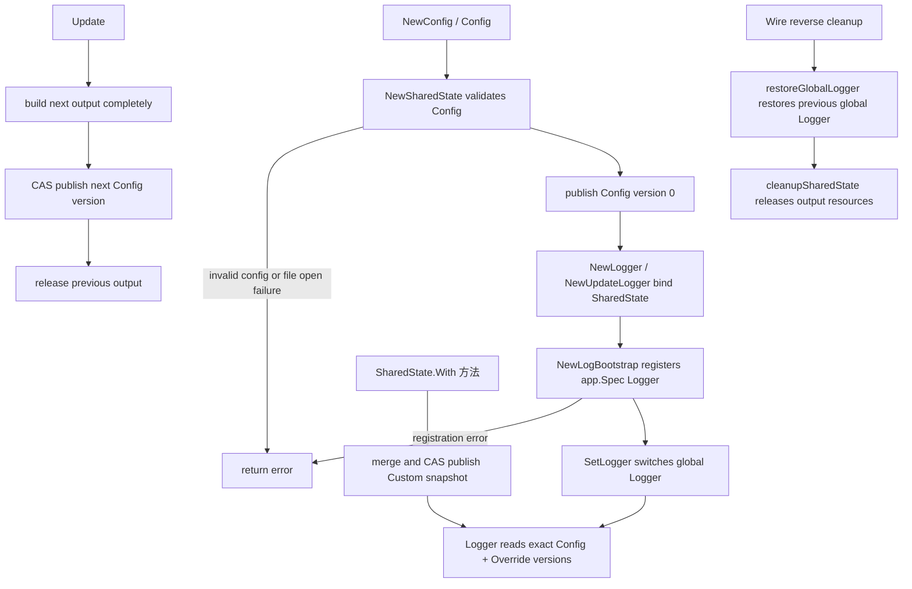
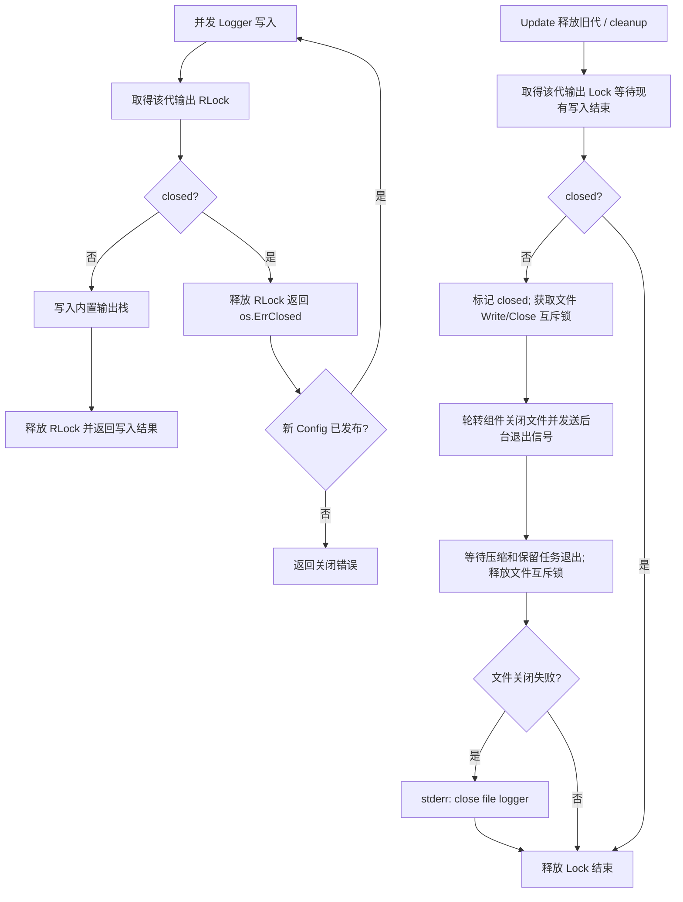
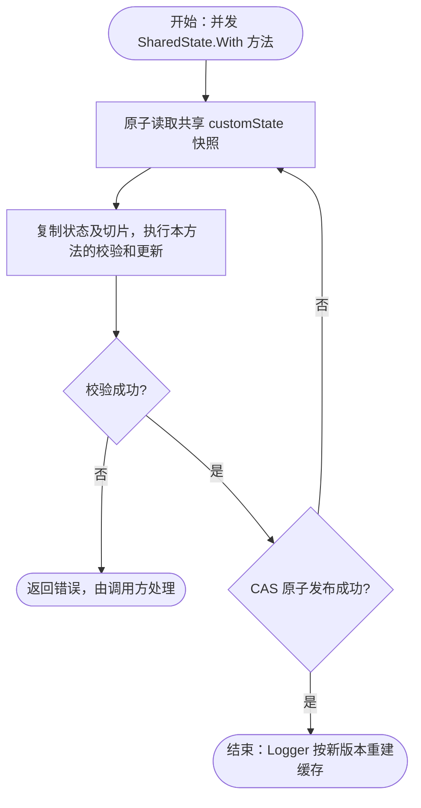

# log

`pkg/log` 直接提供业务与 Wire 使用的 Kratos Logger，支持配置热更新、进程级 Override、不可变派生 Logger、字段过滤和重复字段合并。公共契约、版本缓存、原子共享状态、配置校验与输出组装在同一包内按职责分文件；file/std/filter/stack 等独立输出能力保留在 `internal/output`。

## 初始化与释放

```go
package main

import foundationlog "github.com/jaggerzhuang1994/kratos-foundation/v2/pkg/log"

func newLogger(config foundationlog.Config) (
	foundationlog.Logger,
	foundationlog.UpdateLogger,
	func(),
	error,
) {
	shared, cleanupSharedState, err := foundationlog.NewSharedState(config)
	if err != nil {
		return nil, nil, nil, err
	}
	return foundationlog.NewLogger(shared),
		foundationlog.NewUpdateLogger(shared),
		cleanupSharedState,
		nil
}
```

`NewSharedState` 会校验 Config、完整创建第一代输出，并持有 SharedState 和输出资源；它**不会**切换 Kratos 全局 Logger。`NewLogger` 和 `NewUpdateLogger` 只生成绑定该 SharedState 的视图，因此不会再次返回构造错误。

`cleanupSharedState` 可以重复调用：它停止 SharedState 的后续写入，等待进行中的输出写入结束，关闭文件并等待轮转组件的压缩、保留任务退出；它不恢复或修改全局 Logger。应用应在所有使用该 Logger 的 goroutine 退出后调用它。关闭耗时包含正在进行的文件压缩和清理，不会将这些任务遗留到 cleanup 返回之后。

应用组装还应调用 `bootstrap.NewLogBootstrap(shared, appSpec)`。它先向 `app.Spec` 成功登记稳定 Logger，随后才将 Kratos 全局 Logger 切换到该应用 Logger，并返回一个恢复调用前全局 Logger 的 cleanup：

```go
contribution, restoreGlobalLogger, err := bootstrap.NewLogBootstrap(shared, appSpec)
```

`NewSharedState` 返回的 `cleanupSharedState` 拥有 SharedState、输出和文件句柄；`bootstrap.NewLogBootstrap` 返回的 `restoreGlobalLogger` 只拥有这次全局 Logger 切换。由于 Bootstrap 依赖 SharedState，Wire 逆序 cleanup 时先恢复此前全局 Logger，再释放 SharedState 的输出资源。Bootstrap 只同步登记，不启动 Runtime。



每一代输出用独立的 `RWMutex` 保护写入与关闭边界：写入持读锁，允许并发进入；释放持写锁，等待当前写入完成后标记 closed 并关闭输出。旧引用之后进入时返回 `os.ErrClosed`，由 Logger 读取已发布的新版本重试。锁不覆盖 Valuer 求值和 Config 构建；底层文件写入的锁仍负责文件自身的 Write/Close 契约，两者始终按输出代、文件的顺序获取。



## 进程级 Override

Override 用于覆盖不适合放入环境 Config 的进程级设置：

```go
if err := shared.WithLevel(kratoslog.LevelDebug); err != nil {
	return err
}
if err := shared.WithFilterKeys("password", "token", "payload.secret*"); err != nil {
	return err
}
if err := shared.WithKV("region", "hk", "deployment", "blue"); err != nil {
	return err
}
```

`SharedState` 直接提供 `WithLevel`、`WithFilterEmpty`、`WithFilterKeys`、`WithKV`、`WithCallerDepth`、`WithTimeFormat` 和 `WithMsgKey`，均返回 `error`。这些方法更新当前共享状态，不创建派生 Logger。

每次方法调用只更新对应设置并原子发布新快照，其他设置保持不变。KV 按 key 合并并使用后调用的值，filter keys 追加且拒绝重复项；空的 `WithKV()` 或 `WithFilterKeys()` 不清空已有数据。校验失败不发布本次修改。连续多次方法调用分别生效，不构成一个整体事务；后续调用失败不会回滚此前成功的调用。

单值的优先级为：派生 Logger > Override > Config/包内默认值。filter keys 按 Config、Override、派生 Logger 三层取并集，高层不能取消低层的敏感字段过滤规则。

## 组件日志字段

组件统一使用 `shared.WithKV("service.name", "orders")` 注册日志字段，复用 `customState`，不再维护独立的组件贡献状态和版本。appinfo 与 tracing 分别调用时保留彼此的字段。同名 key 无特殊的组件优先级，以最后成功发布的值为准。

内部 `customState` 属于对应的 `SharedState`，不是 Kratos 全局 Logger 状态。各方法通过同一 CAS 发布边界更新状态；并发冲突时在最新快照的副本上重试，避免丢失其他调用的设置。



该操作沿用无锁 CAS 发布，不修改旧快照，不执行外部 I/O，也不在日志底层重复记录校验错误。

## 热更新与 generation retry

`UpdateLogger` 只负责更新 Config：

```go
next, err := foundationlog.NewConfig()
if err != nil {
	return err
}
if err := updater.Update(next); err != nil {
	return err
}
```

`Update` 会先校验配置并完整创建下一代输出，再使用 CAS 发布；失败的候选输出会立即释放，已发布的 Config 不受影响。发布成功后才释放旧输出。

文件轮转使用 [Timberjack v1.4.7](https://github.com/DeRuina/timberjack/releases/tag/v1.4.7)。输出仍使用原来的每代 `RWMutex` 和每文件 Write/Close 互斥边界，配置仍通过 CAS 发布；每个轮转实例的后台任务由该实例的 cleanup 停止并等待，因此正常替换、构造失败和 CAS 失败都不会留下常驻任务。

文件备份名为 `app-<timestamp>-size.log`（压缩时追加 `.gz`）。旧 lumberjack 的 `app-<timestamp>.log[.gz]` 不属于当前组件的保留集合；日志库不会自动重命名或删除这些历史文件。

每个业务 Logger 缓存一条由“Config version + Override version”确定的不可变写入链。构建完成前若任一快照已经变化，该缓存不会发布，Logger 会重新读取一对最新快照。写旧 generation 时若输出已关闭并且新 Config 已经发布，Logger 会自动用新 generation 重试；其他输出错误原样返回。

## 派生 Logger

派生方法返回新对象，不修改父 Logger：

```go
moduleLogger := logger.WithModule("orders")
requestLogger := moduleLogger.
	WithContext(ctx).
	With("order.id", orderID).
	WithFilterKeys("authorization", "payload.secret*")

requestLogger.Info("order loaded")
requestLogger.Infow("status", "ready")
```

`WithModuleConfig` 用于外部模块配置，会返回校验错误：

- module 必须非空且不能带首尾空白；
- level 仅接受 `debug`、`info`、`warn`、`error`、`fatal`，忽略大小写和首尾空白；
- filter key 必须非空、不能带首尾空白，并且同一配置内不能重复。

`WithModule` 用于程序内常量；非法 module 会直接 panic，使编程错误尽早暴露。

### Caller depth

Caller depth 的计算顺序是：包内默认值 `6` → Override 绝对值 → 派生 Logger 绝对值 → 派生 Logger delta。

- `WithCallerDepth(n)` 设置绝对值，并清除该 Logger 上已有的 delta。
- `AddCallerDepth()` 将 delta 设置为 `1`。
- `AddCallerDepth(n)` 将 delta 设置为 `n`；如果传入多个参数，只使用第一个。
- `AddCallerDepth` 不是累加操作。链式调用时，后一次 delta 覆盖前一次。

例如：

```go
logger.WithCallerDepth(8).AddCallerDepth(2) // 最终为 10
logger.AddCallerDepth(2).AddCallerDepth(3)  // 最终为 base + 3
logger.AddCallerDepth(2).WithCallerDepth(8) // 最终为 8
```

## 字段过滤与去重

过滤键支持精确匹配和尾部 `*` 前缀匹配：

- `authorization` 只过滤同名字段；
- `payload.secret*` 过滤所有以 `payload.secret` 开头的字段。

完整字段依次来自 preset、module、Context KV、Override KV、派生 Logger KV 和本次 `Log` 调用。根过滤完成后，独立去重层会在进入输出栈前统一处理所有字符串 key：

- 重复 key 使用最后声明的值；
- key 保留第一次出现的位置；
- 非字符串 key 不参与去重；
- 奇数个参数的最后一项会原样保留；
- 没有重复字符串 key 时直接透传原切片。

因此，本次 `Log` 调用可以覆盖派生 Logger、Context 或 Override 中的同名字段。各输出端自己的 filter 和 level 规则在去重后执行。

## 环境变量

| 变量 | 默认值 | 说明 |
|---|---:|---|
| `LOG_LEVEL` | `info` | 根 Logger 最低级别 |
| `LOG_FILTER_EMPTY` | `true` | 过滤值为 `nil` 或空字符串的字段 |
| `LOG_FILTER_KEYS` | 空 | 根过滤键，逗号分隔 |
| `LOG_TIME_FORMAT` | `time.RFC3339` | 时间戳格式 |
| `LOG_STD_DISABLE` | `false` | 禁用标准输出端 |
| `LOG_STD_LEVEL` | `LOG_LEVEL` | 标准输出端最低级别 |
| `LOG_STD_FILTER_KEYS` | `service.id,service.name,service.version` | 标准输出端过滤键 |
| `LOG_FILE_DISABLE` | `false` | 禁用文件输出端 |
| `LOG_FILE_LEVEL` | `LOG_LEVEL` | 文件输出端最低级别 |
| `LOG_FILE_FILTER_KEYS` | 空 | 文件输出端过滤键 |
| `LOG_FILE_PATH` | `./app.log` | 当前日志文件 |
| `LOG_FILE_ROTATING_DISABLE` | `false` | 禁用文件轮转 |
| `LOG_FILE_ROTATING_MAX_SIZE` | `100` | 轮转前最大大小，单位 MB，必须大于零 |
| `LOG_FILE_ROTATING_MAX_FILE_AGE` | `0` | 保留天数，`0` 表示不限制 |
| `LOG_FILE_ROTATING_MAX_FILES` | `0` | 保留文件数，`0` 表示不限制 |
| `LOG_FILE_ROTATING_LOCAL_TIME` | `false` | 轮转文件名使用本地时间 |
| `LOG_FILE_ROTATING_COMPRESS` | `false` | gzip 压缩轮转文件 |

环境日志级别忽略大小写和首尾空白。布尔值接受 `strconv.ParseBool` 支持的形式。CSV 字段会去除空项并稳定去重。非法显式值由 `NewConfig` 返回错误，不会静默回退到默认值。

## 代码结构

- `config.go` 定义配置契约，`config_env.go` 和校验文件负责环境解析与配置验证。
- `shared.go`、`shared_custom.go` 管理配置版本和进程级自定义配置，组件字段统一通过 `WithKV` 合并。
- `logger.go` 负责 Logger 派生、写入和便捷方法，`logger_cache.go` 负责版本缓存；`context.go`、`preset.go` 管理上下文字段与默认字段。
- `output.go` 组装并管理每代输出生命周期，`internal/output` 实现 file/std/filter/dedupe/stack 等独立底层组件。
- 构造、并发和状态测试跟随实现放在同一包内；`pkg/bootstrap/log.go` 负责向 `app.Spec` 登记 Logger 和恢复全局 Logger。

## 设计边界

- 业务代码只依赖顶层 `Logger`；Wire 只通过顶层构造函数创建 `SharedState`、`Logger` 和 `UpdateLogger`。
- Config、Override 和派生 Logger 都持有调用方 slice 的独立快照。
- 派生 Logger 不会反向修改父 Logger；首次写入或 version 变化时才重建缓存。
- `cleanup` 后直接调用 `Logger.Log` 或 `Update` 会返回 `shared state is released`。
- 不提供外部 Backend 注入入口；自定义输出应在本包内部扩展并统一处理生命周期。

## 验证

```bash
go test ./pkg/log/...
go test -race ./pkg/log/...
go vet ./pkg/log/...
```
