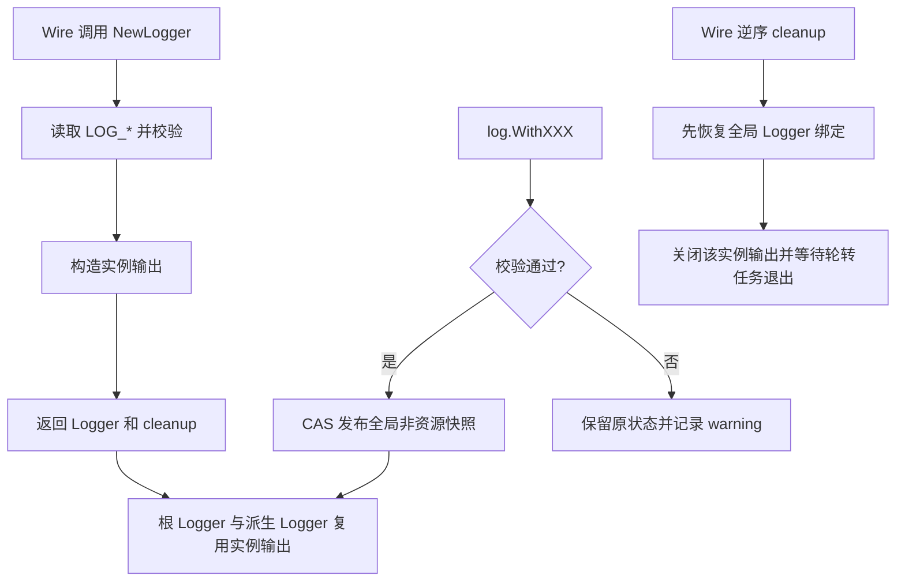
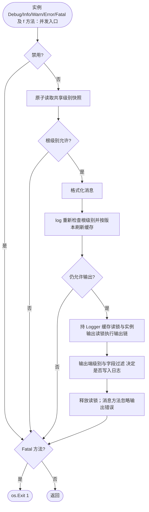
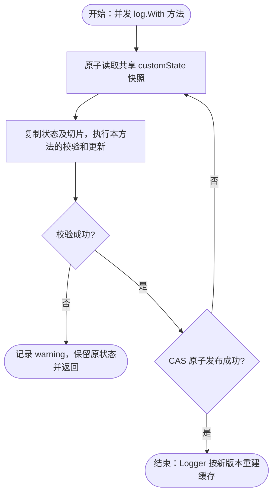

# log

`pkg/log` 直接提供业务与 Wire 使用的 Kratos Logger，支持进程级 Override、不可变派生 Logger、字段过滤和重复字段合并。公共契约、版本缓存、原子共享状态、配置校验与输出组装在同一包内按职责分文件；file/std/filter/stack 等独立输出能力保留在 `internal/output`。

## 初始化与释放

`sharedState` 仅保存进程级非资源设置：最低级别、字段过滤、公共 KV、时间格式和消息字段名。它没有输出、cleanup、生命周期锁或资源引用计数。
每次 `log.NewLogger()` 读取并校验 `LOG_*`，构造独立输出并返回对应 cleanup。Wire 持有该 cleanup，在依赖 Logger 的运行时退出后释放；同一实例派生的 Logger 共用该输出。

```go
logger, cleanup, err := log.NewLogger()
if err != nil { return err }
defer cleanup()

log.WithKV("region", "hk") // 所有常规 Logger 共享此设置
logger.WithModule("orders").Info("ready")
```

关闭一个实例不会关闭其他实例，也不会清除进程自定义设置。已关闭实例及其派生 Logger 的后续有效写入返回 `os.ErrClosed`；创建新实例不会重新激活旧实例。
多个实例各自持有输出资源，多个应用需要文件输出时应配置各自的文件路径。

应用组装前，`log.Info` 等全局方法使用标准输出，仍应用进程自定义设置，不读取文件输出环境配置、不打开日志文件，也不需要全局 cleanup。
`bootstrap.NewLogBootstrap(logger, appSpec)` 安装 Wire Logger 的全局视图，并在清理时恢复此前的 Logger。全局绑定只借用实例，Wire 按顺序先恢复绑定，再关闭输出。



共享设置沿用 CAS；实例输出沿用独立 `RWMutex`：写入持读锁，cleanup 持写锁，等待正在执行的写入后标记关闭并释放文件。该锁不阻塞其他 Logger 实例，cleanup 可重复调用。输出锁与底层文件锁的获取顺序不变。

## 进程级 Override

Override 用于覆盖不适合放入环境 Config 的进程级设置：

```go
log.WithLevel(kratoslog.LevelDebug)
log.WithFilterKeys("password", "token", "payload.secret*")
log.WithKV("region", "hk", "deployment", "blue")
```

包级 `log` 直接提供 `WithLevel`、`WithFilterEmpty`、`WithFilterKeys`、`WithKV`、`WithTimeFormat` 和 `WithMsgKey`，均无返回值，暂不支持链式调用；校验失败时打印包含 `state` 配置项名称和 `error` 原因的 warning。这些方法更新当前共享状态，不创建派生 Logger。

每次方法调用只更新对应设置并原子发布新快照，其他设置保持不变。KV 按 key 合并并使用后调用的值，filter keys 追加且拒绝重复项；空的 `WithKV()` 或 `WithFilterKeys()` 不清空已有数据。校验失败不发布本次修改。连续多次方法调用分别生效，不构成一个整体事务；后续调用失败不会回滚此前成功的调用，也不会阻止后续设置更新。

根过滤及其他共享单值的优先级为：派生 Logger > 进程级设置 > 环境配置/包内默认值。filter keys 按 Config、Override、派生 Logger 三层取并集，高层不能取消低层的敏感字段过滤规则。

实例 `Logger` 的 `Debug/Info/Warn/Error` 及对应 `f` 方法，会先检查禁用状态和根级别，再执行消息格式化；被根过滤拒绝的消息不会调用参数的 `String()`。调用表达式本身仍由 Go 在进入方法前求值；输出端独立过滤也仍在格式化之后发生。此保证不涵盖 Kratos 包级辅助函数内部的预格式化。`Fatal/Fatalf` 被禁用时跳过格式化，但仍以状态码 1 退出。



图中缓存与实例输出锁沿用现有实现，提前过滤不增加锁。cleanup 与输出通过实例锁协调；输出已关闭时返回错误，消息方法不重试。缓存构建遇到共享版本变化会重试，不在读锁内格式化消息。

输出端级别在 `NewLogger` 时固定，仍会独立过滤。例如默认 `LOG_LEVEL=info` 时，之后调用 `log.WithLevel(kratoslog.LevelDebug)` 只放宽根过滤，stdout/file 仍过滤 debug；需要运行期打开 debug 时，应在构造前将相应 `LOG_STD_LEVEL` / `LOG_FILE_LEVEL` 设置为 `debug`。

## 组件日志字段

组件统一使用 `log.WithKV("service.name", "orders")` 注册日志字段，复用 `customState`，不再维护独立的组件贡献状态和版本。appinfo 与 tracing 分别调用时保留彼此的字段。同名 key 无特殊的组件优先级，以最后成功发布的值为准。

内部 customState 是进程全局状态，所有常规 Logger 及 Kratos 全局日志共享。各方法通过同一 CAS 发布边界更新状态；并发冲突时在最新快照的副本上重试，避免丢失其他调用的设置。



该操作沿用 CAS 发布，不修改旧快照；校验失败时记录一条包含失败项和原因的 warning。

## 共享配置更新与实例输出

包级完整配置 Update 及底层输出替换已移除。私有 `envConfig` 只作为 env 解析与 Logger 构造的输入；实例创建后输出配置固定，进程级定制通过 `log.WithXXX` 完成。
每个 Logger 的包装缓存只跟踪共享设置版本。构建过程中若共享快照已变化，放弃该次缓存并重试；这不会创建、关闭或切换输出资源。

文件轮转使用 Timberjack；轮转工作由对应实例的 cleanup 停止并等待。文件备份名为 `app-<timestamp>-size.log`，压缩后追加 `.gz`；不会自动重命名或删除旧 lumberjack 的备份格式。

## 派生 Logger

派生方法返回新对象，不修改父 Logger：

```go
moduleLogger := logger.WithModule("orders")
requestLogger := moduleLogger.
	WithContext(ctx).
	With("order.id", orderID).
	WithFilterKeys("authorization", "payload.secret*")

requestLogger.Info("order loaded")
requestLogger.Infow("status", "ready")
```

`WithModuleConfig` 用于外部模块配置，会返回校验错误：

- module 必须非空且不能带首尾空白；
- level 仅接受 `debug`、`info`、`warn`、`error`、`fatal`，忽略大小写和首尾空白；
- filter key 必须非空、不能带首尾空白，并且同一配置内不能重复。

`WithModule` 用于程序内常量；非法 module 会直接 panic，使编程错误尽早暴露。

### Caller depth

默认 caller 扫描最多 64 个调用帧，跳过 Foundation Logger、Kratos Helper/With/WithContext/全局入口，以及已知的 GORM Writer、Kafka、Cron 日志转发函数。仅按完整函数所属路径识别，不跳过整个业务包；业务辅助函数、访问日志中间件和 SDK 实际产生事件的位置会保留。没有有效来源或深度超过可用调用帧时输出 `unknown`。

深度唯一入口是派生 Logger 的 `WithCallerDepth(n)`：在过滤内置包装后，选择第 n 个调用点。默认 `1` 为直接调用者；业务额外封装一层日志函数时设置为 `2`。`n <= 0` 恢复默认值 `1`。多次设置以后一次为准，不累加，不修改原 Logger；With/WithModule/WithContext 等派生操作会保留所选深度。没有包级全局深度、增量或原始 Go 栈深度模式。

下面片段假定 `logger` 已按上文构造；应将 `wrapped` 交给业务自定义的日志转发函数使用：

```go
wrapped := logger.WithCallerDepth(2) // 跳过一层业务日志封装
reset := wrapped.WithCallerDepth(1) // 恢复直接调用点
_ = reset
```

Foundation 自身的派生方法不增加日志转发帧，内置适配器也无需用户补偿。未识别的自定义包装仍会计入深度。旧版本固定栈数字不能直接沿用，迁移说明见 [caller API 迁移](../../MIGRATION_V2.md#caller-api-简化)。

显式 `caller` 字段沿用字段去重的后值覆盖前值规则（仍受字段过滤规则约束）。GORM Writer 从 GORM 提供的首参数提取查询来源，规范化为 `目录/文件:行号`；有效来源优先于深度选择，来源缺失或行号无效时沿用普通 caller。SQL 消息格式不变。


## 字段过滤与去重

过滤键支持精确匹配和尾部 `*` 前缀匹配：

- `authorization` 只过滤同名字段；
- `payload.secret*` 过滤所有以 `payload.secret` 开头的字段。

完整字段依次来自 preset、module、Context KV、Override KV、派生 Logger KV 和本次 `Log` 调用。根过滤完成后，独立去重层会在进入输出栈前统一处理所有字符串 key：

- 重复 key 使用最后声明的值；
- key 保留第一次出现的位置；
- 非字符串 key 不参与去重；
- 奇数个参数的最后一项会原样保留；
- 没有重复字符串 key 时直接透传原切片。

因此，本次 `Log` 调用可以覆盖派生 Logger、Context 或 Override 中的同名字段。各输出端自己的 filter 和 level 规则在去重后执行。

## 环境变量

| 变量 | 默认值 | 说明 |
|---|---:|---|
| `LOG_LEVEL` | `info` | 根 Logger 最低级别 |
| `LOG_FILTER_EMPTY` | `true` | 过滤值为 `nil` 或空字符串的字段 |
| `LOG_FILTER_KEYS` | 空 | 根过滤键，逗号分隔 |
| `LOG_TIME_FORMAT` | `time.RFC3339` | 时间戳格式 |
| `LOG_STD_DISABLE` | `false` | 禁用标准输出端 |
| `LOG_STD_LEVEL` | `LOG_LEVEL` | 标准输出端最低级别 |
| `LOG_STD_FILTER_KEYS` | `service.id,service.name,service.version` | 标准输出端过滤键 |
| `LOG_FILE_DISABLE` | `false` | 禁用文件输出端 |
| `LOG_FILE_LEVEL` | `LOG_LEVEL` | 文件输出端最低级别 |
| `LOG_FILE_FILTER_KEYS` | 空 | 文件输出端过滤键 |
| `LOG_FILE_PATH` | `./app.log` | 当前日志文件 |
| `LOG_FILE_ROTATING_DISABLE` | `false` | 禁用文件轮转 |
| `LOG_FILE_ROTATING_MAX_SIZE` | `100` | 轮转前最大大小，单位 MB，必须大于零 |
| `LOG_FILE_ROTATING_MAX_FILE_AGE` | `0` | 保留天数，`0` 表示不限制 |
| `LOG_FILE_ROTATING_MAX_FILES` | `0` | 保留文件数，`0` 表示不限制 |
| `LOG_FILE_ROTATING_LOCAL_TIME` | `false` | 轮转文件名使用本地时间 |
| `LOG_FILE_ROTATING_COMPRESS` | `false` | gzip 压缩轮转文件 |

环境日志级别忽略大小写和首尾空白。布尔值接受 `strconv.ParseBool` 支持的形式。CSV 字段会去除空项并稳定去重。非法显式值在首次 `NewLogger` 初始化时返回错误，不会静默回退到默认值。

## 代码结构

- `shared.go` 仅管理进程级非资源设置和原子更新；组件字段通过 `WithKV` 合并。
- `logger.go` 统一负责 Logger 构造、包装、派生、版本缓存、写入和便捷方法。
- `output.go`、`preset.go`、`context.go`、`kratos.go`、`validation.go` 分别提供输出组装、默认字段、上下文字段、Kratos 全局适配与校验辅助能力。
- `env_config.go` 收拢私有配置类型与环境变量解析，供 Logger 实例构造使用。
- `output.go` 组装并管理实例输出生命周期，`internal/output` 实现 file/std/filter/dedupe/stack 等独立底层组件。
- 构造、并发和状态测试跟随实现放在同一包内；`pkg/bootstrap/infrastructure.go` 负责向 `app.Spec` 登记 Logger 和恢复全局 Logger。

## 设计边界

- 业务代码只依赖顶层 `Logger`；Wire 只注入 log.NewLogger；状态和环境配置的创建在包内完成。
- 环境配置、进程级设置和派生 Logger 保存自己的 slice 副本；KV 中的对象不会深拷贝，调用方仍需保证其读取安全。
- 派生 Logger 不会反向修改父 Logger；首次写入或 version 变化时才重建缓存。
- cleanup 只关闭对应实例的输出；新实例拥有自己的输出，不能复活旧实例。
- 不提供外部 Backend 注入入口；自定义输出应在本包内部扩展并统一处理生命周期。

## 验证

```bash
go test ./pkg/log/...
go test -race ./pkg/log/...
go vet ./pkg/log/...
```

## 集成测试与边界用法

参见[核心组件集成用例](../INTEGRATION_TESTS.md#扩展模块与常见边界)。根目录 `make test-components` 运行自包含组合；`make test-components-external` 创建隔离 Docker 服务，验证真实 Kafka、Redis 和锁等功能。具体场景、所有权及适用边界见用例说明。
