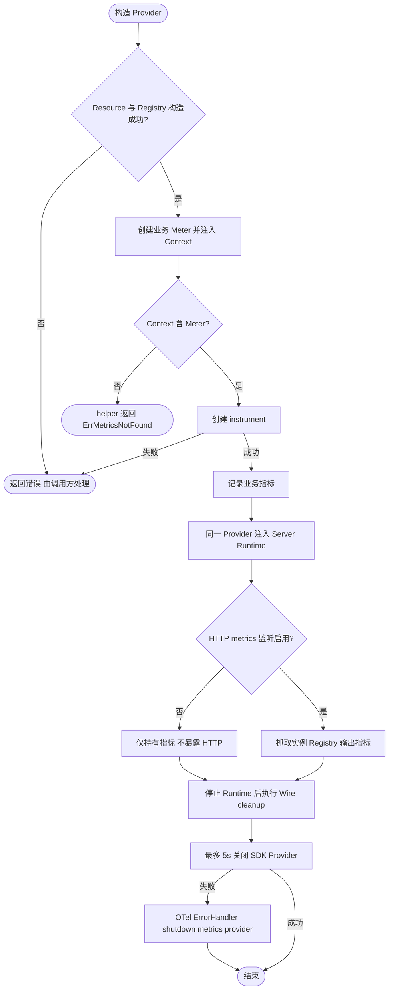
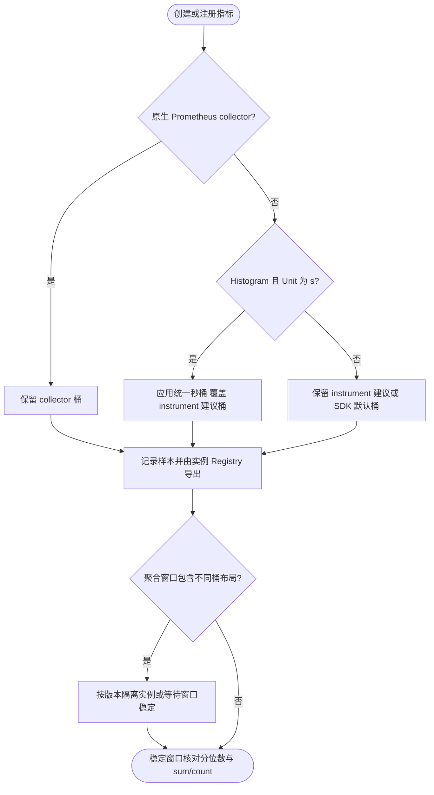

# Metrics

`pkg/metrics` 提供业务与 Wire 使用的公共 `Provider`、默认 `Metrics` 和 Context 指标辅助函数。应用只通过 `NewProvider` 构造实例，并负责调用返回的幂等 cleanup。

```go
provider, cleanup, err := metrics.NewProvider(appInfo)
if err != nil {
	return err
}
defer cleanup()

meter := metrics.NewMetrics(provider, appInfo)
```

`metrics.go` 定义公共契约和默认 Meter 构造，并使用非导出的 `provider` 管理 OpenTelemetry SDK Resource、MeterProvider、Prometheus Registry 与关闭状态；`helpers.go` 提供 Context 指标辅助函数。需要原生 Prometheus collector 时，通过公共 Provider 的 `PrometheusRegisterer` 注册；采集端使用 `PrometheusGatherer`。

组装期调用 `bootstrap.NewMetricsBootstrap(appSpec, meter)`，向 `app.Spec` 追加 ContextDecorator。`app.NewApp` 会在锁外基于调用方 Context 应用它，因此业务 Runtime 可通过 Metrics Context 辅助函数取得同一个 Meter：

```go
contribution, err := bootstrap.NewMetricsBootstrap(appSpec, meter)
```

该 Bootstrap 不启动 Runtime，也不拥有 Provider 的关闭；`NewProvider` 返回的 cleanup 仍由调用方/Wire 负责。

## 记录与暴露指标

默认 Meter 使用应用名作为 instrumentation scope。以下片段中的 provider、appInfo 已按前文构造；HTTP handler 等未获得 App Context 的入口也可显式注入：

```go
ctx := metrics.WithMetrics(context.Background(), metrics.NewMetrics(provider, appInfo))
counter, err := metrics.Int64Counter(ctx, "orders_created")
if err != nil {
    return err
}
counter.Add(ctx, 1)
```

Context helper 在未注入 Meter 时返回 `metrics.ErrMetricsNotFound`，不会自动使用全局 Provider。Bootstrap 注入的是 App Context，不应假定任意外部创建的 Context 都包含它；可在组件构造期通过注入的 Meter 创建并复用 instrument。异步指标回调的注册由调用方持有，并在对应资源释放前 `Unregister`。

Provider 创建实例私有 Registry，默认包含 Go 和进程 collector；不会自动挂载 HTTP 端点。将同一个 Provider 传给 `server.NewRuntime`，或通过统一 Bootstrap 组装，才能由 `server.http.metrics` 暴露；业务 HTTP 默认启用 `/metrics`，独立管理地址、禁用规则见 [Server 监控端点监听地址](../server/README.md#监控端点监听地址)。原生 collector 也须注册到该实例的 `PrometheusRegisterer()`，注册到全局 Registry 的指标不会自动出现在这里。



### 秒单位直方图

`NewProvider` 在构造期为所有 `Histogram` 且 `Unit == "s"` 的 OpenTelemetry instrument 配置统一 SDK View。有限桶边界（秒）为：

```text
0.0001, 0.00025, 0.0005, 0.001, 0.0025, 0.005, 0.01, 0.025, 0.05,
0.1, 0.25, 0.5, 1, 2.5, 5, 10, 30, 60, 300, 600, 1800, 3600,
7200, 21600, 43200, 86400
```

此 View 优先于 instrument 的 `WithExplicitBucketBoundaries` 建议，包括 Job、Cache、Lock 已声明的秒单位桶；所有通过该 Provider 创建的同类业务指标也受影响。统一桶同时保留 Job 原有的长任务范围，最大有限边界为 86400 秒（24 小时）；例如 3601 秒的任务进入 7200 秒桶。超过 86400 秒的样本进入 `+Inf` 桶，仍计入 `_sum` 和 `_count`，但无法据此精确估计更长任务的尾延迟。`Unit == "ms"`（例如 Redis）、未声明单位或其他单位的 instrument 保留各自的建议桶或 SDK 默认桶；通过 `PrometheusRegisterer()` 注册的原生 collector（包括数据库、Go 和进程指标）不经过该 View，桶定义保持原样。

SDK 通用默认桶的首个正边界为 5；当单位是秒而实际操作只耗时微秒时，`histogram_quantile(0.95, ...)` 会在宽桶内插值，可能显示约 4.75 秒，这不是实测单次耗时。统一细桶改善估计分辨率，但分位数仍是桶内估计；可结合 `_sum / _count` 与日志核对。

升级会改变同名直方图的 `le` 序列。滚动升级期间避免聚合不同桶布局的实例；等待全部实例升级完成，并让查询所用 `rate`/`increase` 时间窗口完全落在新版本运行期间后，再比较新旧分位数。历史窗口仍可能混合旧桶与新桶，不能将其变化直接解释为性能改善或回退。



## 业务缓存与接入指南

`NewCacheMetrics(provider, "products")` 提供固定缓存类别的 Hit/Miss/Error/Load 记录。只有业务层知道“有效命中”和“实际回源”，它不自动操作 Redis、不改变缓存一致性或并发策略。命中率使用 hit/(hit+miss)，访问错误单独统计；Load 记录实际回源次数、结果及秒单位耗时。对象只持有 instrument 与不可变名称，没有单独 cleanup。

Provider 默认 Go collector 之外额外启用 `/cpu/classes/gc/total:cpu-seconds` 与 `/sched/latencies:seconds`，用于 GC CPU 估计开销和调度等待分布；保留现有默认 Go/Process 指标，不导出全部 runtime 指标。不同平台的 process 指标可能不同，缺失不补零。

完整可编译示例、指标设计、Grafana 查询、实例图例及可复用接入任务说明见 [业务指标接入指南](../../deploy/observability/docs/business-metrics.md)。
