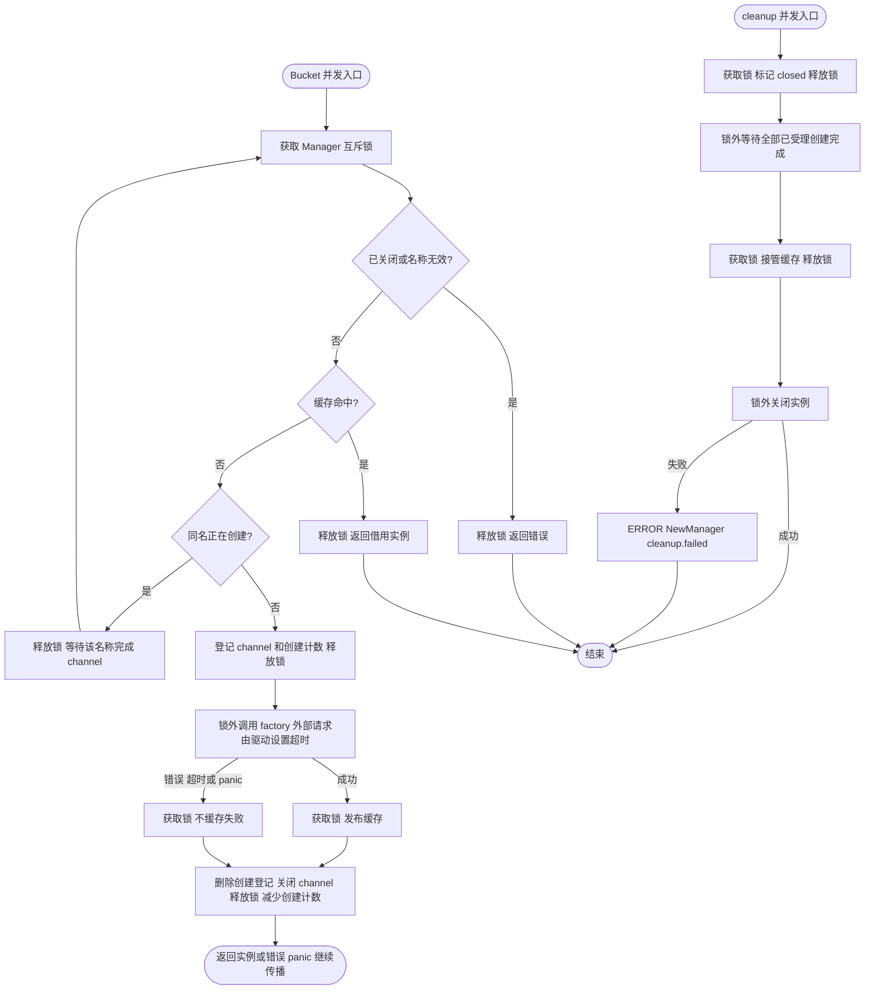
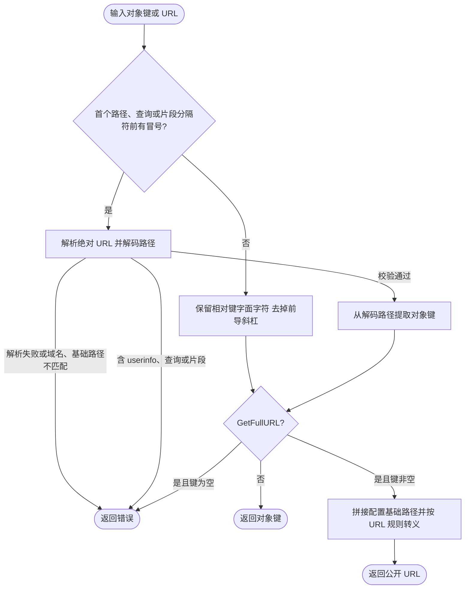

# OSS

`pkg/oss` 提供业务与 Wire 组装层使用的对象存储 Manager、通用 Bucket 契约、域名辅助类型和驱动注册入口；云厂商实现放在 `contrib/oss/<driver>`。

公共契约与实现集中在 `pkg/oss`：`driver.go` 管理驱动注册，`manager.go` 校验 Bucket 定义并管理延迟缓存和关闭状态，`domain.go` 处理域名解析。`NewManager` 取得一次冻结的驱动快照，非导出的 `manager` 持有实例和资源。

## 注册 Aliyun 驱动

应用在组装层空导入需要的驱动：

```go
import _ "github.com/jaggerzhuang1994/kratos-foundation/v2/contrib/oss/aliyun"
```

空导入触发的 `init()` 只向 `pkg/oss` 注册无状态工厂，不会访问远程对象存储。Bucket 在业务首次调用 `Manager.Bucket` 时延迟创建。

OSS 配置必须显式填写已注册的驱动名；仓库提供的 Aliyun 实现使用 `aliyun`：

```yaml
oss:
  buckets:
    assets:
      driver: aliyun
      bucket: production-assets
      domain: https://static.example.com
      options:
        region: cn-hangzhou
        access_key_id: ${ALIYUN_ACCESS_KEY_ID}
        access_key_secret: ${ALIYUN_ACCESS_KEY_SECRET}
```

同一个 Manager 可以让不同逻辑 Bucket 使用不同的已注册驱动。新增七牛云等实现时，应在独立公共 `contrib/oss/<driver>` 包中注册工厂，由业务组装层选择性空导入。

## 注册时序

首个 `oss.NewManager` 会冻结全局驱动注册表并持有不可变快照。所有驱动包都必须在此之前导入；冻结后调用 `RegisterDriver` 或 `MustRegisterDriver` 会失败。驱动工厂的执行不持有注册表锁。

## 构造与释放

构造入口为 `oss.NewManager(configManager config.Manager, logger log.Logger) (Manager, func(), error)`。在 Wire 中直接提供该构造函数；手工构造时使用返回的 cleanup 释放资源。

```go
manager, cleanup, err := oss.NewManager(configManager, logger)
if err != nil {
    return err
}
defer cleanup()
bucket, err := manager.Bucket("assets")
```

Manager 持有其创建的 Bucket，cleanup 幂等关闭其中实现 `io.Closer` 的实例。关闭失败通过注入的 logger 记录 `oss` 模块日志，业务不单独关闭借用的 Bucket。

缓存查询只短暂持有 Manager 互斥锁；未命中时在锁内登记创建名额，驱动 factory 在锁外执行。同名调用等待该名称的完成 channel，成功后共享同一实例；失败不缓存，后续调用仍可重试。不同名称可并发创建，慢 factory 不再阻塞其他缓存命中，因此驱动 factory 必须并发安全，不得依赖跨名称串行调用。

cleanup 先在锁内标记关闭，阻止新请求，再在锁外等待已受理创建完成后关闭实例；factory panic 也释放创建屏障并继续向调用方传播。返回 Bucket 是借用，不是操作租约，业务必须先停止使用再 cleanup。Bucket API 不带 Context，框架不会强制取消 factory 或同名等待；外部调用需由驱动自行设置超时，避免停机永久等待。factory 不应递归获取正在创建的同名 bucket 或调用本 Manager cleanup。




## 对象键与公开 URL

`BucketDomainHelper` 接收原始相对对象键或属于配置域名、基础路径的绝对 URL。相对键中的 `%`、`%2F`、`?` 和 `#` 都是字面字符，例如 `reports/100%.pdf` 生成 `reports/100%25.pdf`，`reports/%2F.pdf` 生成 `reports/%252F.pdf`。绝对 URL 按 URL 规则解码，路径中的 `%2F` 恢复为 `/`；域名、scheme 或基础路径不匹配、非法转义、userinfo、查询和片段会返回错误。


