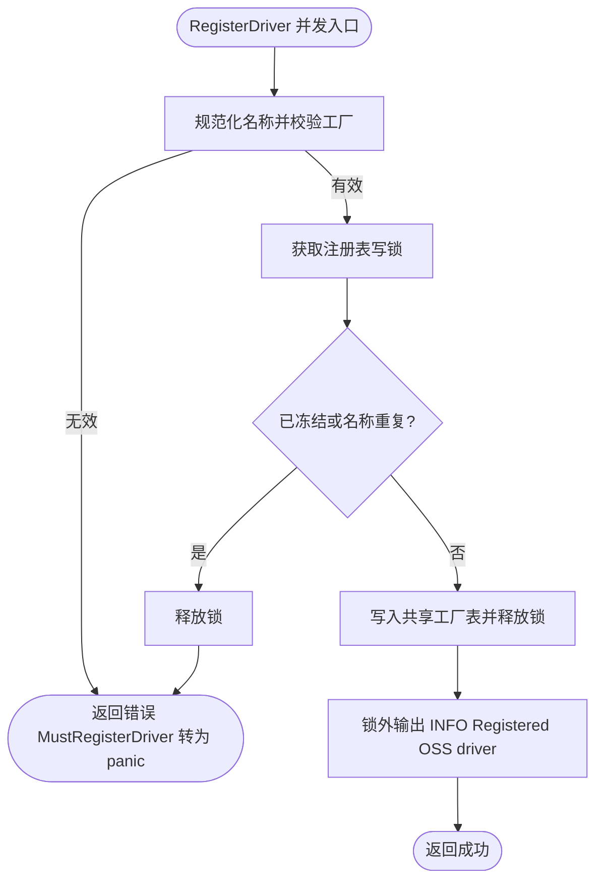
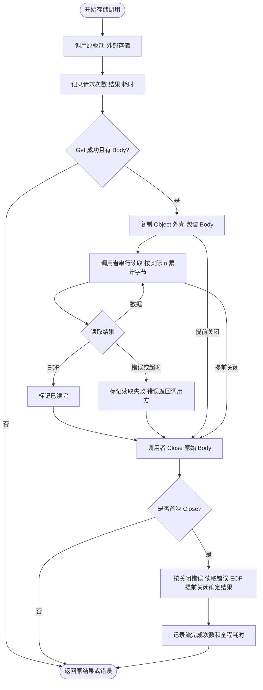

# OSS

`pkg/oss` 提供业务与 Wire 组装层使用的对象存储 Manager、通用 Bucket 契约、域名辅助类型和驱动注册入口；云厂商实现放在 `contrib/oss/<driver>`。

公共契约与实现集中在 `pkg/oss`：`driver.go` 管理驱动注册，`manager.go` 校验 Bucket 定义并管理延迟缓存和关闭状态，`domain.go` 处理域名解析。`NewManager` 取得一次冻结的驱动快照，非导出的 `manager` 持有实例和资源。

## 注册 Aliyun 驱动

应用在组装层空导入需要的驱动：

```go
import _ "github.com/jaggerzhuang1994/kratos-foundation/v2/contrib/oss/aliyun"
```

空导入触发的 `init()` 只向 `pkg/oss` 注册无状态工厂，不会访问远程对象存储。Bucket 在业务首次调用 `Manager.Bucket` 时延迟创建。

OSS 配置必须显式填写已注册的驱动名；仓库提供的 Aliyun 实现使用 `aliyun`：

```yaml
oss:
  buckets:
    assets:
      driver: aliyun
      bucket: production-assets
      domain: https://static.example.com
      options:
        region: cn-hangzhou
        access_key_id: ${ALIYUN_ACCESS_KEY_ID}
        access_key_secret: ${ALIYUN_ACCESS_KEY_SECRET}
```

同一个 Manager 可以让不同逻辑 Bucket 使用不同的已注册驱动。新增七牛云等实现时，应在独立公共 `contrib/oss/<driver>` 包中注册工厂，由业务组装层选择性空导入。

## 注册时序

首个 `oss.NewManager` 会冻结全局驱动注册表并持有不可变快照。所有驱动包都必须在此之前导入；冻结后调用 `RegisterDriver` 或 `MustRegisterDriver` 会失败。驱动工厂的执行不持有注册表锁。

驱动注册成功时使用全局日志输出 INFO 事件 `Registered OSS driver`，包含 `module=oss` 和规范化的 `driver` 名称。空导入 Aliyun 驱动会记录 `driver=aliyun`；此时仅完成工厂注册，不代表 Bucket 已创建或远程连接成功。日志使用注册时的全局 logger，通常早于应用 logger 的组装，不记录 Bucket 配置或凭据；注册失败只返回错误，`MustRegisterDriver` 将错误转为 panic。



## 构造与释放

构造入口为 `oss.NewManager(configManager config.Manager, logger log.Logger) (Manager, func(), error)`。在 Wire 中直接提供该构造函数；手工构造时使用返回的 cleanup 释放资源。

```go
manager, cleanup, err := oss.NewManager(configManager, logger)
if err != nil {
    return err
}
defer cleanup()
bucket, err := manager.Bucket("assets")
```

Manager 持有其创建的 Bucket，cleanup 幂等关闭其中实现 `io.Closer` 的实例。关闭失败通过注入的 logger 记录 `oss` 模块日志，业务不单独关闭借用的 Bucket。

缓存查询只短暂持有 Manager 互斥锁；未命中时在锁内登记创建名额，驱动 factory 在锁外执行。同名调用等待该名称的完成 channel，成功后共享同一实例；失败不缓存，后续调用仍可重试。不同名称可并发创建，慢 factory 不再阻塞其他缓存命中，因此驱动 factory 必须并发安全，不得依赖跨名称串行调用。

cleanup 先在锁内标记关闭，阻止新请求，再在锁外等待已受理创建完成后关闭实例；factory panic 也释放创建屏障并继续向调用方传播。返回 Bucket 是借用，不是操作租约，业务必须先停止使用再 cleanup。Bucket API 不带 Context，框架不会强制取消 factory 或同名等待；外部调用需由驱动自行设置超时，避免停机永久等待。factory 不应递归获取正在创建的同名 bucket 或调用本 Manager cleanup。


## 对象键与公开 URL

`BucketDomainHelper` 接收原始相对对象键或属于配置域名、基础路径的绝对 URL。相对键中的 `%`、`%2F`、`?` 和 `#` 都是字面字符，例如 `reports/100%.pdf` 生成 `reports/100%25.pdf`，`reports/%2F.pdf` 生成 `reports/%252F.pdf`。绝对 URL 按 URL 规则解码，路径中的 `%2F` 恢复为 `/`；域名、scheme 或基础路径不匹配、非法转义、userinfo、查询和片段会返回错误。


## 请求与流量指标

可选调用 `oss.WithMetrics(manager, provider)` 得到带指标的 Manager。`provider` 必须是 HTTP 指标导出端使用的同一个 `metrics.Provider`；默认 `NewManager` 不会启用这些指标。包装不持有驱动生命周期，继续调用原构造函数返回的 cleanup，且只包装一次。`BucketNames` 沿用原 Manager；每次 `Bucket` 返回轻量包装，不能依赖包装对象指针相等。驱动提供的 `Lister`、`Copier`、`URLResolver` 能力保持不变，公开 URL 本地计算不计请求。

以下片段的前置条件是已有成功构造的 `manager`、`provider`，并由组装层保管两者 cleanup；包装成功后将返回的 Manager 注入业务：

```go
observed, err := oss.WithMetrics(manager, provider)
if err != nil {
    return err
}
bucket, err := observed.Bucket("assets")
if err != nil {
    return err
}
// 使用 bucket 调用存储操作；GetObject 成功后的 Body 仍须由调用者 Close。
_ = bucket
```

| Prometheus 指标 | 标签 | 含义 |
| --- | --- | --- |
| `oss_requests_total` | `bucket`, `operation`, `result` | 已返回的驱动调用次数；result 为 success/error |
| `oss_request_duration_seconds` | 同上 | 驱动调用耗时直方图；Get 只计返回 Body 前的时间 |
| `oss_transferred_bytes_total` | `bucket`, `operation` | put/get 在 Reader 边界实际读取的字节数，包括返回错误时的非零 n |
| `oss_streams_total` | `bucket`, `operation`, `result` | Get Body 首次 Close 时结束的流，operation 固定 get |
| `oss_stream_duration_seconds` | 同上 | 从 Get 调用开始到 Body 首次 Close 的耗时直方图 |

`bucket` 使用配置中的逻辑名称；`operation` 限定 put/get/delete/stat/exists/list/copy。标签不包含对象键、URL、错误文本或凭据。上传统计驱动从调用者 Reader 消费的字节，下载统计调用者从 Body 消费的字节，均不是物理网络字节，也不使用 Size、Content-Length 或服务端复制对象大小。上传包装保留输入原有的 `io.Seeker`、`io.ReaderAt`、`Len() int` 能力，供 SDK 推断长度、回放或分段读取；nil 输入原样交给驱动校验。`ReadAt` 返回的非零 n 同样计入字节，不转发会绕过 Read 计数的 `WriterTo`。Seek 本身不增加计数，Seek 回放、校验预读或重复 Read/ReadAt 都按每次返回的字节重复累计，因此数值可能大于对象大小。SDK 内部缓存中发生且不经过输入 Reader 的重试或预取无法由这个边界精确计量。请求错误、流读取错误分别统计，Get 返回成功后读取失败不会回写请求结果。

流最终结果按优先级为 `close_error`（首次关闭失败）、`read_error`（曾遇到非 EOF 读取错误）、`success`（已观察到 EOF）、`closed_early`（未观察到 EOF 就关闭）。读完已知长度但没有继续读到 EOF 仍属于 closed_early。重复 Close 继续委托底层，但不会重复统计；调用者未 Close 时字节仍累计，流完成次数及耗时不产生。包装后的同一 Body 必须串行 Read/Close，不能并发关闭来中断读取；不同操作、不同 Body 可并发使用。没有新增锁或 goroutine。流记录使用 Background，不保存请求 Context，也不跟踪流读取 trace。错误原样返回，由调用方决定日志级别，本包装不重复记录底层错误。


