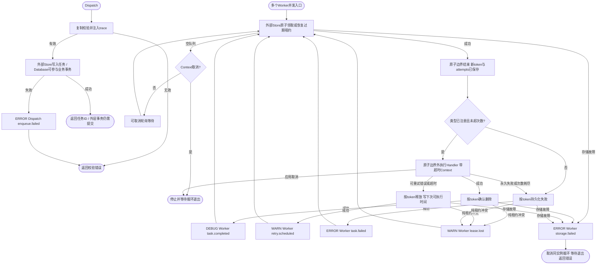
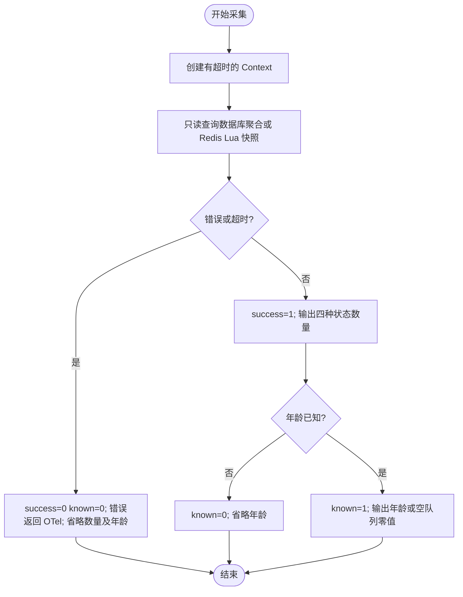

# Queue

Worker 和 Dispatcher 在构造时从注入 Logger 派生 `module=queue`，业务 handler 的日志由业务自行声明模块。

`pkg/queue` 是持久化后台任务队列，提供 `Task`、`Store`、`Dispatcher` 和 `Worker`。业务显式选择 [Redis Store](../../contrib/queue/redis/README.md) 或 [Database Repo 适配器](../../contrib/queue/database/README.md)，通过构造参数注入业务 Handler 和观测依赖。Kafka 消息生产、消费组、重试/死信位于独立的 [pkg/kafka](../kafka/README.md)，不作为任务 Store。`pkg/job` 保留 Cron、Once、Daemon；`job.DelayIfRunning` 不是持久化延迟队列。

## 契约与所有权

- Task 只存任务类型、可序列化 Payload、Header、ID 与时间；业务依赖通过 Handler 闭包或方法注入，不序列化服务对象。Type 必须非空，对应 Worker 构造时的 Handler 表。
- Dispatcher 深复制输入，补齐 ID、CreatedAt、AvailableAt 并传播 W3C trace context/baggage；不修改调用者对象。Handler 收到独立副本，修改它不会更改待重试记录。返回的 Reservation/FailedTask 也为独立快照；Reservation 的 Task ID、Token、Attempts 应只读。
- Redis Store 用业务提供的 `KeyPrefix` 隔离，前缀原样保留且不得为空或全为空白；Database Store 由业务绑定单个队列的 Repo 隔离，可为每个队列使用不同表。任务 ID 为 1–128 字节且不能全为空白。相同 ID 的待执行、已领取、失败记录不能重复入队，返回 `ErrDuplicate`；完成删除后允许复用 ID。这不是永久业务去重。
- Dispatch 返回实际 ID；存储提交后响应丢失时可能同时返回 ID 和错误。需要跨重试识别同一任务时，业务应在投递前设置稳定 ID。调用成功表示后端已接受，耐久性仍依赖 Redis AOF/RDB/复制或数据库刷盘配置。
- Store 借用 Redis Manager 或业务 Repo，无独立 cleanup。先停止 Worker 并等待 Handler 退出，再由原拥有者释放连接。Dispatcher、Worker 均不关闭 Store 连接；没有全局 Registry、隐式启动或顶层 queue 配置。

## 构造与投递

以下是可编译的业务组装函数。前置条件：业务已经实现绑定 mail 队列的 `databasequeue.Repo` 并完成自己选择的表迁移，观测依赖已初始化，`appSpec` 是应用唯一的 `app.Spec`，Handler 可并发调用并响应 Context。业务也可使用 [GORM 泛型 Repo](../../contrib/queue/database/gorm/README.md) 复用默认实现。Repo 的原子领取与错误语义必须满足 [持久化契约](../../contrib/queue/database/README.md)。

```go
package assembly

import (
    "context"
    "time"

    databasequeue "github.com/jaggerzhuang1994/kratos-foundation/v2/contrib/queue/database"
    "github.com/jaggerzhuang1994/kratos-foundation/v2/pkg/app"
    "github.com/jaggerzhuang1994/kratos-foundation/v2/pkg/queue"
)

func NewMailQueue(
    repo databasequeue.Repo,
    appSpec *app.Spec,
    observability queue.Observability,
    sendEmail queue.Handler,
) (*queue.Dispatcher, error) {
    store := databasequeue.NewStore(repo)
    dispatcher, err := queue.NewDispatcher("mail", store, observability)
    if err != nil {
        return nil, err
    }
    worker, err := queue.NewWorker(queue.WorkerConfig{
        Name: "mail-worker", Queue: "mail", Concurrency: 4,
    }, store, map[string]queue.Handler{"send-email": sendEmail}, observability)
    if err != nil {
        return nil, err
    }
    if err := appSpec.RegisterRuntime(worker); err != nil {
        return nil, err
    }
    return dispatcher, nil
}

func SendLater(ctx context.Context, dispatcher *queue.Dispatcher) (string, error) {
    return dispatcher.Dispatch(ctx, &queue.Task{
        ID: "welcome-user-42",
        Type: "send-email",
        Payload: []byte(`{"user_id":42}`),
        AvailableAt: time.Now().Add(10 * time.Minute),
    })
}
```

Wire 层须将上述登记过程纳入最终 Bootstrap 构造屏障，确保在 app.Spec 冻结前完成。Store 不新增资源，函数无 cleanup；业务 Repo 及数据库依赖的 cleanup 由应用组装层保留。完整生命周期组装见 [Bootstrap 文档](../bootstrap/README.md)。

Redis 使用 `redisqueue.NewStore(redisManager, redisqueue.Config{Connection: "main", KeyPrefix: "app:queue:mail"})` 替换 Store 构造，其余 Dispatcher/Worker 不变。Redis 连接必须已在 Manager 中声明；示例与键结构见 [Redis Store](../../contrib/queue/redis/README.md)。

## 执行、延迟与失败

`AvailableAt` 为零表示立即可领取，非零表示最早可领取时间；Redis 的调度索引和租约截止按毫秒向上取整，领取时当前时间向下取整，避免提前执行。Database Repo 接收 time.Time，并自行按存储精度向上取整截止时间，不能提前执行或回收。运行节点必须保持时钟同步。到期不保证准点：轮询、队列积压、存储延迟和 Handler 并发容量都会增加等待；不提供严格 FIFO、任务优先级或精确计时器保证。

Worker 每次从 Store 原子领取一个任务并持久增加 Attempts，再在存储原子操作之外执行 Handler。失败后把下次可执行时间写回 Store 并释放当前 Worker，不在 Handler 循环内等待退避。不同实例重启后继续使用持久化次数；Worker 配置应在同一队列各实例保持一致。

| 配置 | 零值/省略默认 | 约束 |
| --- | --- | --- |
| Name / Queue | 无默认 | 必填，Queue 是观测逻辑名，不用于选择 Redis KeyPrefix、Repo 或数据库表 |
| Concurrency | 1 | 1–1024；Handler 可能被并发调用 |
| PollInterval | 200ms | 必须为正；空队列等待可取消 |
| Timeout | 30s | 从领取请求开始计算，包含领取耗时，采用协作取消 |
| StorageTimeout | 5s | 每次 Reserve/Ack/Release/Fail 操作的最长等待 |
| Lease | 60s | 至少 1ms，且严格大于 Timeout + StorageTimeout |
| Retry=nil | 3 次领取，500ms 初始退避，30s 最大退避 | 次数包含首次领取及执行前崩溃的领取 |
| Retry 非 nil | 使用显式字段 | MaxAttempts 为 1–1000；退避不可负；两个 Backoff 均为零表示不等待 |

Retry 的第一次等待使用 MinBackoff，后续按两倍增长并受 MaxBackoff 限制；沿用已有 RetryPolicy 的显式零语义：MinBackoff 为零始终不等待，MinBackoff 非零而 MaxBackoff 为零时仅第一次使用 MinBackoff，后续不等待。重试配置在构造时固化，不热更新。

成功后按当前 Token 确认删除。普通错误、panic 和执行超时进入重试；`queue.Permanent(err)` 或未注册的任务类型进入永久失败，次数耗尽进入 `retry_exhausted`。失败持久化成功后 Worker 继续处理其他任务。`Store.Failed(ctx, limit)` 查询最多 1–1000 条独立失败快照；`Store.Retry(ctx, id, at)` 人工重新投递失败任务并清零次数；找不到返回 `ErrNotFound`。失败记录不会自动过期，无分页、删除或管理界面。

多 Worker 通过 Redis Lua 或业务 Repo 的原子操作竞争领取；Token 防止旧 Worker 确认、释放或失败归档已被重新分配的任务，冲突返回 `ErrLeaseLost`，Worker 记录 WARN 并继续。Token 到期但尚未重新分配时仍可确认。Handler 执行不在 Redis Lua、领取事务或 Go 互斥锁内；Repo 的具体同步机制由业务实现；竞争可能有饥饿，不保证领取公平。

采用**允许重投、有限重试**的执行模型。存储可靠且领取正常完成时，未确认任务可重投；领取后、执行前反复崩溃也可能耗尽次数进入失败状态，不保证 Handler 至少实际执行一次或最终成功。业务成功后、确认前崩溃仍会重投，必须依靠业务幂等。超时 Context 无法强杀忽略取消的 Go Handler；它可能超过租约并与重投任务同时执行。Worker 不启动额外 Handler goroutine，不自动续租；较长任务应配置相应执行窗口与租约，或在业务中拆成可恢复的小任务。

Start 阻塞运行且实例只能启动一次。Stop 幂等取消领取和 Handler，等待受调用 Context 限制；停止过程中未确认任务由租约到期恢复。存储故障或损坏记录返回错误，由 Worker 记录 `ERROR storage.failed` 后退出，应用 supervisor 决定后续动作；不自动把存储失败当作成功确认。损坏记录的隔离与修复方式见对应 Store 文档。



日志记录队列、任务 ID、任务类型、次数、重试等待时间或受控失败分类；`reason` 保留最终处理分类，`cause` 区分 `handler_missing`、`timeout`、`panic`、`attempts_exhausted` 和 `handler_error`，不记录 Payload、Headers 或 Handler 错误原文。Trace span 传播跨投递/执行上下文，指标标签使用逻辑队列和 Worker 名称，勿用任务 ID 构造这些名称。业务错误的详细定位由业务 Handler 在符合自身脱敏规则的边界完成；普通错误仍可被追踪系统记录为异常事件。

Database Store 支持与业务数据同事务投递：业务 Repo.Insert 必须复用调用方事务，Dispatch 成功不代表事务已提交；消费只领取已提交任务。组装及 Outbox 边界见 [Database 事务投递](../../contrib/queue/database/README.md#与业务事务一起投递)。

## 验证与迁移

在仓库根目录执行 `make verify`（所有模块的 test/vet/race）与 `make lint`。Redis Lua 需要真实服务测试，隔离入口是 `make test-external`；数据库队列完整 Repo 的真实服务测试由业务提供，框架在 `pkg/database` 的 SQLite 测试中验证同事务投递的提交、回滚和可见性；队列包普通测试使用确定性存储/Repo 替身，不会自行启动服务。详细范围见 [外部服务验证](../../testdata/external/README.md)。旧 Redis Streams 无自动数据转换，旧消息 API 与调用迁移见 [迁移说明](../../MIGRATION_V2.md#持久化任务队列与-kafka-分离)。

共享 Grafana 组件面板、指标名称与采集边界见 [组件指标说明](../../deploy/observability/docs/components.md)。

## 持久化积压统计

`StatsProvider` 是可选只读接口，`Store` 的必需方法不变。`Stats(ctx, now)` 返回单个队列的独立快照：
ready 包括已到期任务和过期租约，scheduled 为尚未到期的未领取任务，running 为有效租约，failed 为等待人工 Retry 的任务。
四种状态互斥；ready + scheduled 是待执行积压。running 表示持有有效租约，不保证 Handler 此刻仍存活。
最老 ready 年龄按 `now - min(AvailableAt)` 计算，不是创建年龄；Release/Retry 会重置排期时间，过期租约保留原排期时间。

应用完成 Store 与 Metrics Provider 构造后，显式调用
`queue.RegisterStats("email", statsProvider, metricsProvider, time.Second)`，处理返回错误，并由组装层在关闭借用连接和 Provider 前调用返回的 `func() error` cleanup，处理注销错误。
自定义 Store/Repo 只有实现 `StatsProvider` 才能提供真实统计；数据库 Store 对不支持统计的 Repo 返回错误。
同一 Provider 与业务队列名只注册一次；队列名必须固定，不能使用任务 ID。

采样发生在 Metrics 采集回调中，不启动后台 goroutine；每次使用传入的正数 timeout 和采集 Context 中较早的截止时间，后端必须遵守 Context 取消。
低层返回错误，由 OTel 错误处理边界处理；本功能不额外写日志。

| 指标 | 标签 | 含义 |
| --- | --- | --- |
| `queue_tasks` | `queue_destination`, `state` | 四种状态的真实数量 |
| `queue_oldest_ready_age_seconds` | `queue_destination` | 最老 ready 当前排期等待秒数；已知为空时为 0 |
| `queue_stats_collection_success` | `queue_destination` | 本次采集成功为 1，失败为 0 |
| `queue_stats_oldest_ready_known` | `queue_destination` | 年龄可精确提供为 1，否则为 0 |

失败时省略任务数量及年龄，不输出伪零，也不沿用上次成功值。Redis ready 候选超过 1000 时仍返回精确数量，但年龄不可用，known 为 0 并省略 age；该限制不是队列年龄为零。多个应用实例采集同一持久队列会产生重复快照，监控应按队列使用 `max` 去重，不能将实例数量直接相加。



## 集成测试与边界用法

参见[核心组件集成用例](../INTEGRATION_TESTS.md#扩展模块与常见边界)。根目录 `make test-components` 运行自包含组合；`make test-components-external` 创建隔离 Docker 服务，验证真实 Kafka、Redis 和锁等功能。具体场景、所有权及适用边界见用例说明。
