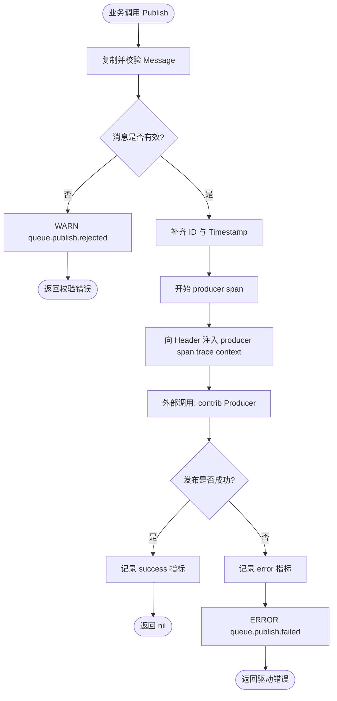
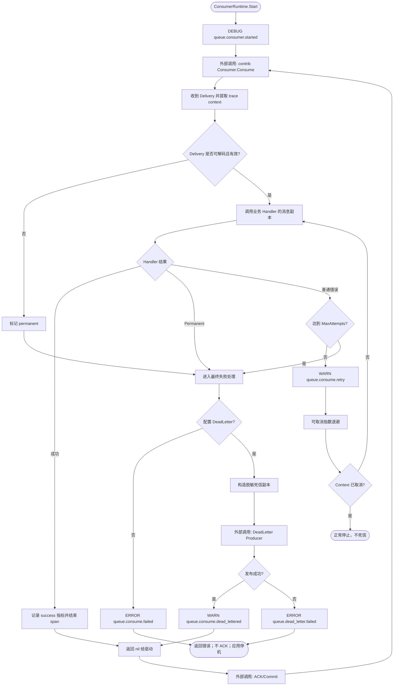

# queue

`pkg/queue` 是业务与 Wire 组装层使用的稳定入口，定义驱动无关的消息、生产者、消费者和单消费者运行时。业务显式选择 `contrib/queue/kafka` 或 `contrib/queue/redis` 的强类型构造器，再把原始驱动实例与业务 Handler 组合为 `app.Runtime`；不应导入 `pkg/queue/internal/*`。

消息、驱动契约、生产装饰器与消费者运行时直接定义在 `pkg/queue`。`runtime.go` 管理构造、启停和取消顺序，`consumer.go` 处理投递、重试、死信和消费事件日志；独立的遥测能力保留在 `internal/telemetry`。

队列提供 **at-least-once** 语义，不提供 exactly-once：业务 Handler 必须可幂等，例如以业务键或消息 ID 去重。驱动只会在 `DeliveryHandler` 返回 `nil` 后 ACK 或 Commit 原消息；因此仅 Handler 成功、或死信消息已经发布成功时，原消息才会被确认。

## 生产消息

生产者先由后端直接构造，再由 `queue.NewProducer` 装饰。装饰器深复制单条或批量输入，调用方继续拥有原始 `Message`、`Key`、`Body`、Header Value 及其批次切片；批量中任一输入无效时，整个批次都不会发送。

它会校验 Header Key，在缺少时生成消息 ID；仅当 `Timestamp` 为零值时才生成 UTC 时间，业务提供的非零时间戳会保留。它还会将 W3C TraceContext 和 Baggage 写入消息 Header。

### Kafka

Kafka Producer 独占它创建的客户端。`releaseProducer` 由调用方在停止使用 Producer 后调用，且可安全地重复调用；`queue.NewProducer` 失败时也必须释放它。

```go
package assembly

import (
	"context"

	kafkaqueue "github.com/jaggerzhuang1994/kratos-foundation/v2/contrib/queue/kafka"
	foundationkafka "github.com/jaggerzhuang1994/kratos-foundation/v2/pkg/kafka"
	"github.com/jaggerzhuang1994/kratos-foundation/v2/pkg/queue"
)

func newKafkaProducer(
	kafkaFactory *foundationkafka.ClientFactory,
	observability queue.Observability,
) (queue.Producer, func(), error) {
	rawProducer, releaseProducer, err := kafkaqueue.NewProducer(kafkaFactory, kafkaqueue.ProducerConfig{
		Connection: "main",
		Topic:      "orders.created",
	})
	if err != nil {
		return nil, nil, err
	}
	producer, err := queue.NewProducer("orders.created", rawProducer, observability)
	if err != nil {
		releaseProducer()
		return nil, nil, err
	}
	return producer, releaseProducer, nil
}

func publishOrder(ctx context.Context, producer queue.Producer, body []byte) error {
	return producer.Publish(ctx, &queue.Message{Key: []byte("order-42"), Body: body})
}
```

### Redis Streams

Redis Producer borrows the named client from `pkg/redis.Manager`. The Manager owns that shared client, so this constructor returns no cleanup function and callers must not close the client through the Producer.

```go
package assembly

import (
	redisqueue "github.com/jaggerzhuang1994/kratos-foundation/v2/contrib/queue/redis"
	foundationredis "github.com/jaggerzhuang1994/kratos-foundation/v2/pkg/redis"
	"github.com/jaggerzhuang1994/kratos-foundation/v2/pkg/queue"
)

func newRedisProducer(
	redisManager foundationredis.Manager,
	observability queue.Observability,
) (queue.Producer, error) {
	rawProducer, err := redisqueue.NewProducer(redisManager, redisqueue.ProducerConfig{
		Connection: "main",
		Stream:     "orders.created",
	})
	if err != nil {
		return nil, err
	}
	producer, err := queue.NewProducer("orders.created", rawProducer, observability)
	if err != nil {
		return nil, err
	}
	return producer, nil
}
```

Redis Consumer uses the same borrowing rule. Kafka Consumer creates clients for each `Consume` run and closes them when that run exits.

Producer logs only rejected inputs and failed publishes—there is no per-message success log. Rejections use WARN with the caller Context; driver failures use ERROR with the active producer-span Context. Producer spans and metrics use the logical destination, not a connection address.



## 消费消息

`Consumer` 只有一个入口：`Consume(context.Context, queue.DeliveryHandler)`。驱动通过 `Delivery` 把消息或解码错误交给运行时；业务只编写 `queue.Handler`。不存在 queue 的 `Plan`、`Manager`、`Driver`、`Binding` 或 `Worker` API，也不应通过隐式发现注册消费者。

Kafka 的完整组装示例如下。将 `logger`、`appInfo`、`service` 和 `observability` 替换为应用已有依赖；`appSpec` 是同一个 `app.Spec`，可与默认 server/job Runtime 共用。业务应将返回的 `billingOrderCreatedBootstrap` 加入最终 `bootstrap.Bootstrap` 聚合器，确保运行时已在 `app.NewApp` 冻结 Spec 前登记。

```go
package assembly

import (
	kafkaqueue "github.com/jaggerzhuang1994/kratos-foundation/v2/contrib/queue/kafka"
	"github.com/jaggerzhuang1994/kratos-foundation/v2/pkg/app"
	"github.com/jaggerzhuang1994/kratos-foundation/v2/pkg/appinfo"
	foundationkafka "github.com/jaggerzhuang1994/kratos-foundation/v2/pkg/kafka"
	"github.com/jaggerzhuang1994/kratos-foundation/v2/pkg/log"
	"github.com/jaggerzhuang1994/kratos-foundation/v2/pkg/queue"
)

type billingOrderCreatedBootstrap struct{}

func NewBillingOrderCreated(
	kafkaFactory *foundationkafka.ClientFactory,
	logger log.Logger,
	appInfo appinfo.AppInfo,
	service *BillingService,
	observability queue.Observability,
	appSpec *app.Spec,
) (queue.Producer, billingOrderCreatedBootstrap, func(), error) {
	rawProducer, releaseProducer, err := kafkaqueue.NewProducer(kafkaFactory, kafkaqueue.ProducerConfig{
		Connection: "main",
		Topic:      "orders.created",
	})
	if err != nil {
		return nil, billingOrderCreatedBootstrap{}, nil, err
	}
	producer, err := queue.NewProducer("orders.created", rawProducer, observability)
	if err != nil {
		releaseProducer()
		return nil, billingOrderCreatedBootstrap{}, nil, err
	}

	rawConsumer, err := kafkaqueue.NewConsumer(kafkaFactory, logger, kafkaqueue.ConsumerConfig{
		Connection:  "main",
		Topic:       "orders.created",
		Group:       "billing",
		Instance:    appInfo.ID(),
		Concurrency: 4,
	})
	if err != nil {
		releaseProducer()
		return nil, billingOrderCreatedBootstrap{}, nil, err
	}
	runtime, err := queue.NewConsumerRuntime(
		queue.RuntimeConfig{
			Name:        "billing-order-created",
			Destination: "orders.created",
		},
		rawConsumer,
		service.HandleOrderCreated,
		observability,
	)
	if err != nil {
		releaseProducer()
		return nil, billingOrderCreatedBootstrap{}, nil, err
	}
	if err := appSpec.RegisterRuntime(runtime); err != nil {
		releaseProducer()
		return nil, billingOrderCreatedBootstrap{}, nil, err
	}
	return producer, billingOrderCreatedBootstrap{}, releaseProducer, nil
}
```

For Redis, create the typed adapter with `redisqueue.NewConsumer(redisManager, logger, redisqueue.ConsumerConfig{Connection: "main", Stream: "orders.created", Group: "billing", Instance: appInfo.ID(), Concurrency: 4})`, then pass it to the same `queue.NewConsumerRuntime` call and use the same named Bootstrap pattern to register it explicitly.

`Retry: nil` uses three total Handler attempts, with a 500 ms initial backoff and a 30 s maximum backoff. Supplying a non-nil `RetryPolicy` controls all three fields; zero `MinBackoff` and `MaxBackoff` explicitly means no wait. Return `queue.Permanent(err)` from the Handler to skip remaining retries and enter final-failure processing. Handler panics are converted into retryable failures.

If a final failure has no configured dead-letter Producer and destination, `ConsumerRuntime.Start` returns an error, the application supervisor stops the application, and the source message is not ACKed. If dead-letter publishing fails, it likewise returns an error and leaves the source unacknowledged. When dead-letter publishing succeeds, the runtime returns `nil` for that delivery and the driver ACKs/commits it. Cancelling the delivery or runtime Context stops processing without publishing to dead letter.

Dead-letter records preserve the original key, body and legal headers, use a new ID and timestamp, and add only controlled `x-queue-*` failure metadata. The original Handler error text is not copied into the dead-letter headers.



## 可观测性与数据边界

每次发布创建一个 producer span。每次投递创建一个 consumer span；该投递的所有 retry attempt 和 retry event 都属于同一个 span，不会创建新的根 span。consumer span 开始前会从消息 Header 提取 trace context。最终失败分类使用受控的 `queue.consume.permanent` 或 `queue.consume.retry_exhausted` span event，并且不把原始错误文本写入分类事件。

指标仅使用稳定、低基数标签 `queue.destination`、`queue.consumer`、`queue.operation` 和 `queue.result`。不要将消息 Body、Header Value、消息 ID、trace ID、死信原始错误文本、连接地址或随机 consumer 实例 ID 放入指标标签。日志通过 context 关联，可包含逻辑 Destination、Consumer Name、消息 ID、attempt、受限错误分类和本文事件名；不得包含消息 Body、Header Value、trace ID 或死信原始错误文本。
