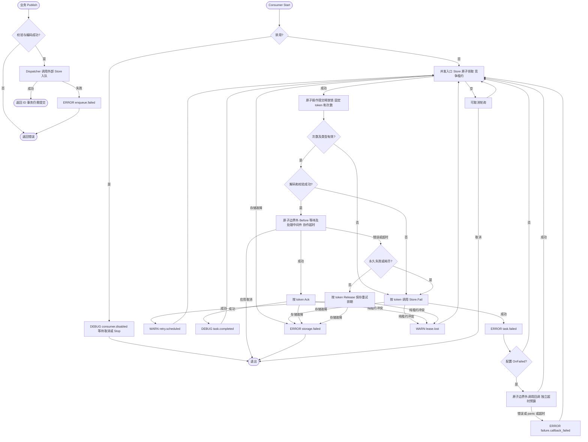

# 类型化队列接入

业务只定义消息、发送所需的小接口和处理方法。JSON、任务类型、领取次数、租约、重试、确认和启停由框架负责；Wire、驱动和 Runtime 登记仅出现在应用入口或基础设施组装层。业务不需要导入 queue、实现 Store、编写 Worker 壳或声明泛型队列身份。

## 业务侧

以下业务文件可以独立编译，不依赖 Foundation。真实处理方法应响应 Context，并自行保证外部副作用幂等。

```go
package email

import "context"

type Message struct {
    Address string `json:"address"`
    Body    string `json:"body"`
}

type Sender interface {
    Publish(context.Context, Message) (string, error)
}

type DeliveryService struct {
    Send func(context.Context, string, string) error
}

func (s *DeliveryService) Handle(ctx context.Context, message Message) error {
    return s.Send(ctx, message.Address, message.Body)
}
```

业务用例通过注入的 `Sender.Publish(ctx, message)` 发送消息，无须处理 Task、Headers 或 Codec。返回 ID 可用于排障；有稳定业务幂等键或延迟需求时，由适配层使用 `PublishWith`，而不是把所有队列选项传入 biz。

## 应用入口一次接入

下列完整示例为方便编译集中展示消息和处理方法；真实项目应引用业务包中的类型与方法。前置条件：Store 已绑定到 mail 物理队列、数据库已迁移、观测依赖已初始化，Spec 尚未冻结。

```go
package assembly

import (
    "context"
    "errors"

    "github.com/jaggerzhuang1994/kratos-foundation/v2/pkg/bootstrap"
    "github.com/jaggerzhuang1994/kratos-foundation/v2/pkg/queue"
)

type Message struct {
    Address string `json:"address"`
    Body    string `json:"body"`
}

type Sender interface {
    Publish(context.Context, Message) (string, error)
}

func RegisterMail(
    spec *bootstrap.Spec,
    store queue.Store,
    observability queue.Observability,
    deliver func(context.Context, Message) error,
) (Sender, error) {
    endpoint, err := queue.NewEndpoint(
        queue.Definition[Message]{
            Queue: "mail", MessageType: "send-email", Version: 1,
            Validate: func(message Message) error {
                if message.Address == "" {
                    return errors.New("email address is empty")
                }
                return nil
            },
        },
        store,
        queue.Handle(deliver),
        queue.ConsumerConfig{Concurrency: 4, MaxAttempts: 3},
        observability,
    )
    if err != nil {
        return nil, err
    }
    spec.RegisterRuntime(endpoint)
    return endpoint, nil
}
```

登记须在业务 Boot 构造依赖链内完成，具体屏障契约见 [Bootstrap](../bootstrap/README.md)。`Endpoint` 同时提供发布与消费；只发布的 API 进程使用 `NewPublisher(definition, store, observability)`，无需消费者或处理方法。只消费时使用 `NewConsumer`。它们都不关闭 Store：先停止消费者，再由原拥有者 cleanup 连接与观测 Provider。

构造函数复制定义和配置；Codec、校验函数、处理器、钩子及中间件对象仍共享，须支持配置并发度下的调用，不能运行时修改。消息编码期间调用方不可并发修改消息或 Header；默认 JSON 解码产生独立消息。自定义 Codec 须返回独立数据。业务校验不应修改消息或产生副作用。

## 契约与兼容性

- `Queue` 是观测逻辑名称，不能根据它自动选择 Redis key 或数据库表。驱动和物理隔离由组装层确定。
- `MessageType` 必须显式声明，`Version` 为正整数，持久化 `Task.Type` 固定为 `MessageType.vVersion`，例如 `send-email.v1`，不依赖 Go 类型名。
- Publisher 与 Consumer 共享定义；默认 `JSONCodec`，可替换 `Codec[T]`。发布校验/编码失败直接返回，不访问 Store。JSON 本身不拒绝未知字段，`null`/零值是否有效由 Validate 决定。
- 消费解码/校验失败调用现有永久归档路径，`Reason=permanent`，`Cause=decode_error/validation_error`；未知类型或版本是 `handler_missing`。损坏 Store 外层记录仍由 Store 报错，不等于业务消息解码失败。
- 旧 `Dispatcher`、`Worker`、`Handler` 和 `Store` API 保留。旧的 `send-email` 任务不会自动变成 `send-email.v1`。切换前先由旧 Worker 排空旧队列，或使用新的独立物理队列；不要让只识别新版本的消费者竞争领取旧积压。版本迁移不修改历史数据。
- 发布成功仍可能只是写入尚未提交的业务事务。网络错误也可能发生在实际提交之后。需要识别重复投递时使用 `PublishWith` 的稳定 ID；完成后不保留永久去重记录。

## 配置与投递信息

| ConsumerConfig | 省略/零值 | 说明 |
| --- | --- | --- |
| Name | Definition.Queue | 观测名称，不能使用高基数业务 ID |
| Disabled | false | true 时 Start 等待取消/Stop，不调用 Store；仍校验配置和构造依赖，不影响 Publisher |
| Concurrency | 1 | 1–1024 |
| Timeout | 30s | 从领取请求开始，包括限流等待与处理，协作取消 |
| MaxAttempts | 3 | 1–1000，包含本次领取及执行前崩溃的领取 |
| PollInterval | 200ms | 空队列可取消等待 |
| StorageTimeout | 5s | 单次 Store 操作及归档后回调的独立超时预算 |
| Lease | max(60s, Timeout + StorageTimeout + 1s) | 检查时长溢出；显式值必须严格大于 Timeout + StorageTimeout |
| Retry | nil | 默认 500ms 初始退避、30s 上限；非 nil 时 MaxAttempts 必须为零，退避沿用底层显式零值语义 |

这些默认值属于 Consumer/Endpoint；直接构造 Worker 的 Lease 默认仍为 60s。配置只在构造时读取，不热更新。禁用实例同样只能 Start 一次，Stop 幂等。租约不自动续期，Context 无法强杀忽略取消的处理方法。

普通处理器用 `Handle(func(ctx, message) error)`。需要投递信息时在适配层用 `HandleDelivery(func(ctx, delivery) error)`：`ID` 是任务 ID，`Attempt` 来自真实 `Reservation.Attempts`，`MaxAttempts` 来自消费者配置，生产者 Header 无法覆盖。`CanRetry()` 仅表示次数预算未耗尽，不覆盖永久失败、取消或存储失败。适配层把 ID/次数转换成领域参数再调用 biz，领域不依赖 `Delivery[T]`。

## 中间件、限流与失败策略

`NewConsumer`/`NewEndpoint` 最后的可选参数为 `Middleware[T]`，按参数顺序从外向内包裹处理方法，返回时反向退出。中间件只包裹已解码校验成功的业务处理，不包裹 Store 操作、坏消息或归档回调；内置 Worker 观测仍覆盖所有领取结果。

执行顺序：解码 → 校验 → `Before(ctx)` → 检查 Context → 中间件/处理方法 → `Classify(err)` → Worker 持久化结果。Before 可以直接接入业务提供的共享限流器 Wait 方法；框架不为它创建新锁。等待发生在领取后，计入超时和领取次数；失败默认重试，必须响应取消。限流等待较长时应匹配执行窗口，不能把它当作领取前调度或不消耗次数的延迟。

Classify 可把领域错误映射为 `queue.Permanent(err)` 或返回普通错误；返回 nil 保留原错误，不能把执行失败改成成功。坏消息和已标记的永久错误不交给分类器。panic 和实际 Context 超时由 Worker 统一处理，不保证交给分类器。

`OnFailed(ctx, event)` 仅在 `Store.Fail` 成功后同步执行，覆盖永久错误、坏消息、未注册类型、重试耗尽及执行前领取次数耗尽。事件包含独立 Task 副本、Attempts、MaxAttempts、Reason、Cause 和 FailedAt，不要求坏消息能够解码成业务类型。回调错误、panic、超时记录 `ERROR failure.callback_failed`，不回滚归档、不重新执行消息；回调必须响应 Context。

**执行失败不等于归档成功；归档成功也不等于通知必达。** 归档存储失败或租约丢失不会触发回调；归档之后、回调之前崩溃可能丢通知。必须送达的业务通知需可靠任务或持久化事件设计，不能依赖此回调或在回调内简单发送一次。运维管理继续使用 `Store.Failed(ctx, limit)` 和 `Store.Retry(ctx, id, at)`，查询返回独立副本、limit 为 1–1000，重试清零领取次数；不自动扫描重试，不新增全局 Manager。



业务成功后、确认前崩溃可能重复执行；执行前反复崩溃也可能耗尽次数。因此不无条件保证 Handler 至少执行一次，不保证 exactly-once；原有并发、幂等和存储可靠性边界不变。

## 多队列与驱动

同一个进程多个队列即使都传 `string` 也必须物理隔离。组装层可以用 `type emailQueue struct { *queue.Endpoint[string] }` 与 `type botQueue struct { *queue.Endpoint[string] }` 区分 Wire 返回类型；匿名嵌入直接复用 Publish/Start/Stop，无转发方法。各自绑定到业务定义的不同小接口，不要求业务编写泛型标记类型或查全局 Manager。

可运行的 [Wire fixture](testdata/wireassembly/assembly.go) 和 [injector](testdata/wireassembly/wire.go) 验证两个相同消息类型的队列及不同业务接口。根目录执行 `go test ./pkg/queue -run TestPublisherWireBindings -v`，测试使用根 go.mod 声明的 `go tool wire`，在临时模块生成 injector、检查产物并运行竞态测试，不维护生成副本。

数据库只存队列字段时使用 [GORM 简单模式](../../contrib/queue/database/gorm/README.md#简单模式)，只配置独立表并显式迁移；需要业务索引/字段或查询等待状态时保留 Model/Factory 扩展模式，两者都可以复用事务 Context。Redis 继续由 [Redis Store](../../contrib/queue/redis/README.md) 构造。驱动选择不进入 biz，框架不引入 Registry 或自动连接管理。
