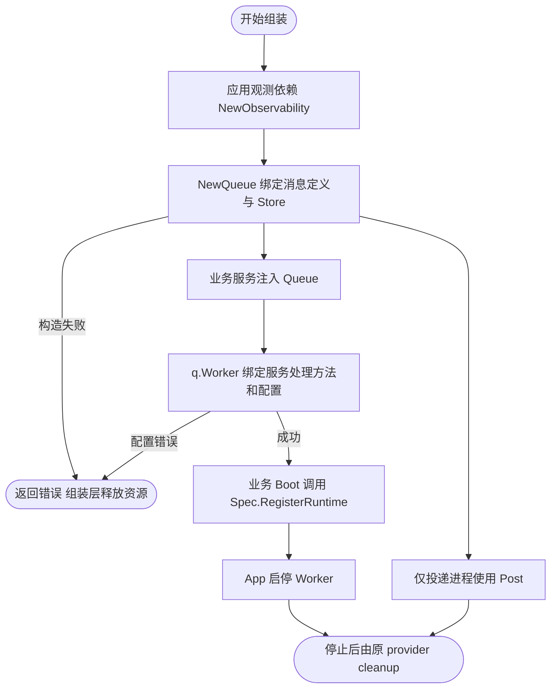
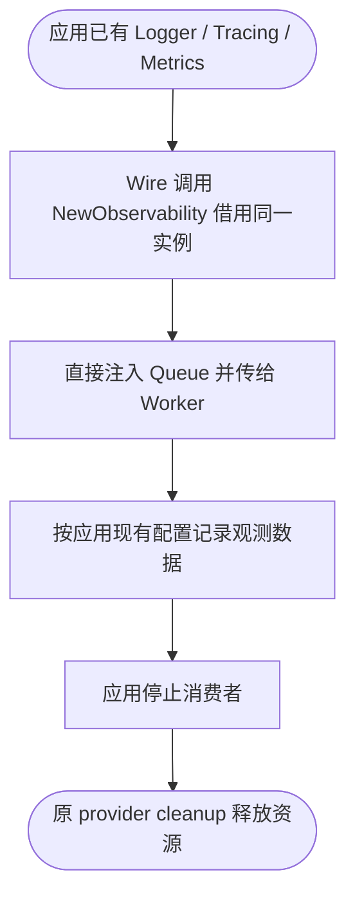
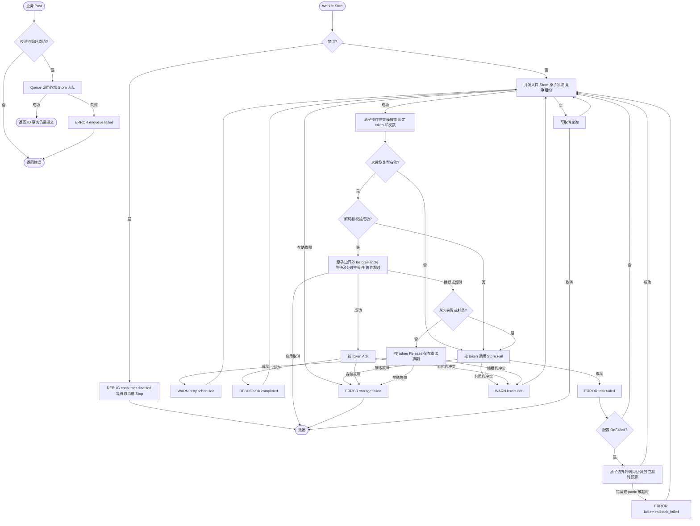

# 类型化队列接入

业务只定义消息、发送所需的小接口和处理方法。JSON、任务类型、领取次数、租约、重试、确认和启停由框架负责；Wire、驱动和 Runtime 登记仅出现在应用入口或基础设施组装层。业务不需要导入 queue、实现 Store、编写 Worker 壳或声明泛型队列身份。

## Queue 投递，Worker 消费

`NewQueue(definition, store, observability)` 返回 `*Queue[T]`，只提供 `Post` / `PostWith`，不要求处理器、不实现 Runtime。`q.Worker(handle, config)` 返回 `*Worker[T]`，提供 `Start` / `Stop`，由组装层登记到 Spec。两个对象均有消息类型，Wire 可以直接区分。

Queue 直接借用应用 Observability，并将其传给 Worker。组装层显式提供 Store、消息定义及观测依赖，无需额外的 Manager。



业务服务可以依赖 Queue；Worker 随后绑定服务方法，不会产生 Queue → Service → Queue 的构造循环。构造期没有 I/O 或新增日志事件；实际投递和执行失败见后面的运行流程。

## 业务侧

以下业务文件可以独立编译，不依赖 Foundation。真实处理方法应响应 Context，并自行保证外部副作用幂等。

```go
package email

import "context"

type Message struct {
    Address string `json:"address"`
    Body    string `json:"body"`
}

type Sender interface {
    Post(context.Context, Message) (string, error)
}

type Service struct {
    Send func(context.Context, string, string) error
}

func (s *Service) Handle(ctx context.Context, message Message) error {
    return s.Send(ctx, message.Address, message.Body)
}
```

业务用例通过注入的 `Sender.Post(ctx, message)` 发送消息，无须处理 Task、Headers 或 Codec。返回 ID 可用于排障；有稳定业务幂等键或延迟需求时，由适配层使用 `PostWith`，而不是把所有队列选项传入 biz。

## 应用入口一次接入

下列完整示例为方便编译集中展示消息和处理方法；真实项目应引用业务包中的类型与方法。前置条件：Store 已绑定到 mail 物理队列、数据库已迁移、观测依赖已初始化，Spec 尚未冻结。

```go
package assembly

import (
    "context"
    "errors"

    "github.com/jaggerzhuang1994/kratos-foundation/v2/pkg/bootstrap"
    "github.com/jaggerzhuang1994/kratos-foundation/v2/pkg/queue"
)

type Message struct {
    Address string `json:"address"`
    Body    string `json:"body"`
}

type Sender interface {
    Post(context.Context, Message) (string, error)
}

func RegisterMail(
    spec *bootstrap.Spec,
    store queue.Store,
    observability queue.Observability,
    deliver func(context.Context, Message) error,
) (*queue.Queue[Message], error) {
    q, err := queue.NewQueue(queue.Definition[Message]{
        Queue: "mail", MessageType: "send-email", Version: 1,
        Validate: func(message Message) error {
            if message.Address == "" { return errors.New("email address is empty") }
            return nil
        },
    }, store, observability)
    if err != nil { return nil, err }
    worker, err := q.Worker(deliver, queue.WorkerConfig{Concurrency: 4, MaxAttempts: 3})
    if err != nil { return nil, err }
    spec.RegisterRuntime(worker)
    return q, nil
}
```

登记须在业务 Boot 构造依赖链内完成，具体屏障契约见 [Bootstrap](../bootstrap/README.md)。纯发布进程只创建 Queue；消费进程额外创建 Worker 并登记。Queue 与 Worker 都不关闭 Store：先停止 Worker，再由原拥有者 cleanup 连接与观测 Provider。每次调用 q.Worker 都返回独立运行时，不自动缓存或启动；同一物理队列上的多个 Worker 会竞争任务。
构造函数复制定义和配置；Codec、校验函数、处理器、钩子及中间件对象仍共享，须支持配置并发度下的调用，不能运行时修改。消息编码期间调用方不可并发修改消息或 Header；默认 JSON 解码产生独立消息。自定义 Codec 须返回独立数据。业务校验不应修改消息或产生副作用。

## 默认观测依赖

`bootstrap.BaseProviderSet` 已包含 `queue.NewObservability`。应用入口直接声明 `queue.Observability` 参数即可由 Wire 提供，无需业务手写 struct 或 provider；同一依赖图中的队列复用应用已有的 `log.Logger`、`tracing.Provider`、`metrics.Provider`。

手动组装时调用 `queue.NewObservability(logger, tracingProvider, metricsProvider)`；不使用默认集合的 Wire injector 可显式添加 `queue.NewObservability`。三个参数必须非 nil，不为缺失依赖自动创建全局实例或静默降级为 no-op。已有 `Observability{...}` 显式写法保持可用。使用默认集合后，应移除自己提供相同返回类型的 provider，避免 Wire 重复绑定；需要单队列定制时在该队列的构造函数内调整传入的值。

此构造函数只返回借用引用，不创建 exporter、Registry、日志输出或 goroutine，不读取配置，不改变追踪和指标的启用状态，也不返回 cleanup。先停止消费者，再由原 provider 释放观测资源；日志模块仍由 Queue/Worker 构造时派生为 `queue`。



构造函数没有 I/O、失败分支或新增日志事件；应用 provider 的创建失败仍由 Wire 返回并逆序 cleanup。真实生成及共享实例验证复用本文末尾的 Wire fixture 测试。

## 契约与兼容性

- `Queue` 是观测逻辑名称，不能根据它自动选择 Redis key 或数据库表。驱动和物理隔离由组装层确定。
- `MessageType` 必须显式声明，`Version` 为正整数，持久化 `Task.Type` 固定为 `MessageType.vVersion`，例如 `send-email.v1`，不依赖 Go 类型名。
- Queue 的发布与处理共享定义；默认 `JSONCodec`，可替换 `Codec[T]`。发布校验/编码失败直接返回，不访问 Store。JSON 本身不拒绝未知字段，`null`/零值是否有效由 Validate 决定。
- 消费解码/校验失败调用现有永久归档路径，`Reason=permanent`，`Cause=decode_error/validation_error`；未知类型或版本是 `handler_missing`。损坏 Store 外层记录仍由 Store 报错，不等于业务消息解码失败。
- `Store` 保持底层存储契约，投递统一使用 Queue.Post/PostWith；旧的公开 Worker 构造与 Handler 表已移除。旧 `send-email` 任务不会自动变成 `send-email.v1`。部署新版本前须由旧版本应用排空，或使用独立物理队列；不能让只识别新版本的 Worker 竞争旧积压。
- 发布成功仍可能只是写入尚未提交的业务事务。网络错误也可能发生在实际提交之后。需要识别重复投递时使用 `PostWith` 的稳定 ID；完成后不保留永久去重记录。

## 配置与投递信息

| WorkerConfig | 省略/零值 | 说明 |
| --- | --- | --- |
| Name | Definition.Queue | 观测名称，不能使用高基数业务 ID |
| DisableProcessing | false | true 时 Start 等待取消/Stop，不调用 Store；仍校验配置和构造依赖，不影响 Queue.Post |
| Concurrency | 1 | 1–1024 |
| Timeout | 30s | 从领取请求开始，包括限流等待与处理，协作取消 |
| MaxAttempts | 3 | 1–1000，包含本次领取及执行前崩溃的领取 |
| PollInterval | 200ms | 空队列可取消等待 |
| StorageTimeout | 5s | 单次 Store 操作及归档后回调的独立超时预算 |
| Lease | max(60s, Timeout + StorageTimeout + 1s) | 检查时长溢出；显式值必须严格大于 Timeout + StorageTimeout |
| Retry | nil | 默认 500ms 初始退避、30s 上限；非 nil 时 MaxAttempts 必须为零，退避沿用底层显式零值语义 |

这些默认值属于 WorkerConfig。配置只在构造时读取，不热更新。禁用实例同样只能 Start 一次，Stop 幂等。租约不自动续期，Context 无法强杀忽略取消的处理方法。

普通业务直接向 `q.Worker` 传入 `func(ctx context.Context, message T) error`。需要处理信息时在适配层使用 `q.WorkerWithExecution`，接收 `Execution[T]`：`ID` 是任务 ID，`Attempt` 来自真实 `Reservation.Attempts`，`MaxAttempts` 来自消费者配置，生产者 Header 无法覆盖。`CanRetry()` 仅表示次数预算未耗尽，不覆盖永久失败、取消或存储失败。适配层把 ID/次数转换成领域参数再调用 biz，领域不依赖 `Execution[T]`。

## 中间件、限流与失败策略

`q.Worker`/`q.WorkerWithExecution` 最后的可选参数为 `Middleware[T]`，按参数顺序从外向内包裹处理方法，返回时反向退出。中间件只包裹已解码校验成功的业务处理，不包裹 Store 操作、坏消息或归档回调；内置 Worker 观测仍覆盖所有领取结果。

执行顺序：解码 → 校验 → `BeforeHandle(ctx)` → 检查 Context → 中间件/处理方法 → `ClassifyError(err)` → Worker 持久化结果。BeforeHandle 可以直接接入业务提供的共享限流器 Wait 方法；框架不为它创建新锁。等待发生在领取后，计入超时和领取次数；失败默认重试，必须响应取消。限流等待较长时应匹配执行窗口，不能把它当作领取前调度或不消耗次数的延迟。

ClassifyError 可把领域错误映射为 `queue.Permanent(err)` 或返回普通错误；返回 nil 保留原错误，不能把执行失败改成成功。坏消息和已标记的永久错误不交给分类器。panic 和实际 Context 超时由 Worker 统一处理，不保证交给分类器。

`OnFailed(ctx, event)` 仅在 `Store.Fail` 成功后同步执行，覆盖永久错误、坏消息、未注册类型、重试耗尽及执行前领取次数耗尽。事件包含独立 Task 副本、Attempts、MaxAttempts、Reason、Cause 和 FailedAt，不要求坏消息能够解码成业务类型。回调错误、panic、超时记录 `ERROR failure.callback_failed`，不回滚归档、不重新执行消息；回调必须响应 Context。

**执行失败不等于归档成功；归档成功也不等于通知必达。** 归档存储失败或租约丢失不会触发回调；归档之后、回调之前崩溃可能丢通知。必须送达的业务通知需可靠任务或持久化事件设计，不能依赖此回调或在回调内简单发送一次。运维管理继续使用 `Store.Failed(ctx, limit)` 和 `Store.Retry(ctx, id, at)`，查询返回独立副本、limit 为 1–1000，重试清零领取次数；不自动扫描重试或提供全局查找。



业务成功后、确认前崩溃可能重复执行；执行前反复崩溃也可能耗尽次数。因此不无条件保证 Handler 至少执行一次，不保证 exactly-once；原有并发、幂等和存储可靠性边界不变。

## 多队列与驱动

不同队列用不同命名消息类型区分：`Queue[email.Message]` 和 `Queue[bot.Message]`、`Worker[email.Message]` 和 `Worker[bot.Message]` 是不同的具体类型，直接用于普通 Wire provider 返回值即可。不引入 QueueID，也不需要再写嵌入包装。`type EmailMessage string` 与 `type BotMessage string` 可用于文本消息；类型别名 `type EmailMessage = string` 不产生新类型。

消息类型区分编译期依赖，队列名字和 Store 配置决定运行期归属。两个 Queue[string] 即使名字不同，Wire 仍认为是同一种类型。每个队列须使用不同的命名消息类型，并由组装层确保物理隔离；名字不会自动变成 Redis key 或数据库表。

可运行的 [Wire fixture](testdata/wireassembly/assembly.go) 和 [injector](testdata/wireassembly/wire.go) 验证两个消息类型、两种 Worker、服务依赖 Queue 的构造顺序，以及仅发布的 injector。根目录执行 `go test ./pkg/queue -run TestQueueWireBindings -v`，使用根 go.mod 中的 `go tool wire` 在临时模块生成并编译 injector、运行竞态测试；不维护生成副本。
数据库只存队列字段时使用 [GORM 简单模式](../../contrib/queue/database/gorm/README.md#简单模式)，只配置独立表并显式迁移；需要业务索引/字段或查询等待状态时保留 Model/Factory 扩展模式，两者都可以复用事务 Context。Redis 继续由 [Redis Store](../../contrib/queue/redis/README.md) 构造。驱动选择不进入 biz，框架不引入 Registry 或自动连接管理。

## API 迁移

旧 API 不保留别名或兼容构造。业务消息与显式 MessageType/Version 无需改名，调用方更新 provider 后须重新生成 Wire。

| 旧入口 | 当前用法 |
| --- | --- |
| NewPublisher / Publisher[T] | NewQueue / Queue[T] |
| Publish / PublishWith | Post / PostWith，选项为 PostOptions |
| NewConsumer / NewEndpoint / New | NewQueue 后调用 q.Worker |
| Consumer / Endpoint / 非泛型 Worker | Worker[T] |
| NewWorker 与原始 Handler 表 | 为每种消息定义 Queue[T]，使用 q.Worker |
| NewWithExecution / HandleDelivery | q.WorkerWithExecution |
| Delivery / DeliveryHandler | Execution / ExecutionHandler，表示处理信息 |
| ConsumerConfig / Config | WorkerConfig |
| Queue.Start / Queue.Stop / RegisterQueueWorker | 将 Worker 登记到 Spec.RegisterRuntime |

`DisableProcessing` 仅停用 Worker，不影响 Post。现有 `consumer.disabled` 日志事件及 `queue_consumer_*` 指标名称保持不变，避免监控漂移。

实现与测试按队列投递、Worker 生命周期、处理适配、单次执行、重试、存储契约和观测七项职责归并，见[文件组织](README.md#文件组织)。Queue 和 Worker 均不拥有底层连接。
