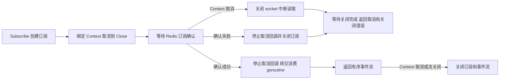
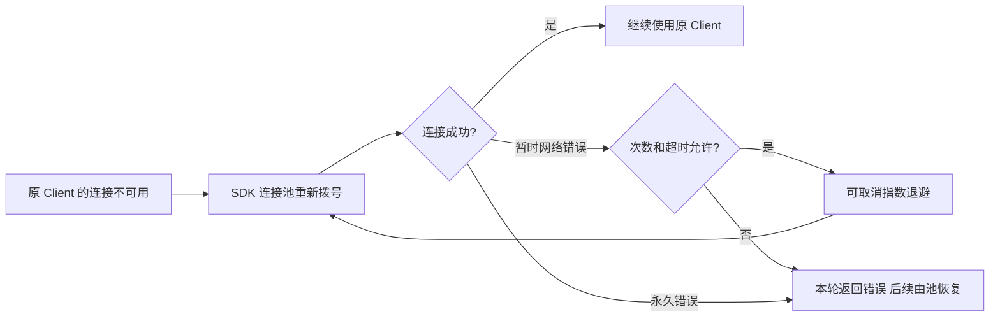

# Redis

`pkg/redis` 提供业务与 Wire 使用的公共 `Manager`、具名连接查询和订阅辅助函数。一个 Manager 通过同一套 go-redis SDK 管理多份连接，因此这里不使用 Driver Registry。

先向配置 Manager 提供具名连接，例如：

```yaml
redis:
  default: cache
  connections:
    cache:
      addr: 127.0.0.1:6379
    locks:
      addr: 127.0.0.1:6379
      db: 1
```

`default` 必须引用已声明的连接；省略时引用名称 `default`，不会自动选择第一个连接。字段定义见 [redis.proto](../../proto/config_pb/redis.proto)。下面的 `logger`、配置 Manager 和遥测 Provider 由业务 Wire 提供，手工组装时由外层按逆序调用各自 cleanup。

```go
manager, cleanup, err := redis.NewManager(
	logger,
	configManager,
	tracingProvider,
	metricsProvider,
)
if err != nil {
	return err
}
defer cleanup()

client, err := manager.Connection("cache")
if err != nil {
	return err
}
// 使用 client 执行 Redis 操作，并处理各命令返回的错误。
```

连接参数、日志与遥测配置在 `NewManager` 构造时固定为启动快照，不订阅热更新；修改地址、凭据或连接集合后需要重启应用。之后首次解析的具名连接也使用这份旧快照。默认 client 在构造时创建，其他具名 client 按需创建；创建 client 不等于服务端连接验证成功。

配置解析位于同包 `config.go`，连接延迟创建、遥测安装、缓存和幂等关闭状态由 `manager.go` 的非导出实现持有。业务只能借用 `Default` 或 `Connection` 返回的 client，不应单独关闭；统一由 cleanup 释放。

Redis 锁、Job 协调和 Queue 等具体组合位于对应 `contrib` 包，由业务/Wire 显式选择，不根据字符串 driver 分发。

拨号失败时沿用同一个 client 重建连接，不重建 Manager。`dialer_retries` 表示一轮拨号的最大尝试次数（默认 5），`dialer_retry_timeout` 为首次等待间隔（默认 100ms）；后续等待逐次翻倍、封顶 5s，并加入 80%–100% 抖动。拨号成功结束本轮，下一轮重新从初始间隔开始；Context 取消会打断等待。SDK 的固定次数拨号循环设为一次，避免叠加重试。

连接池的一轮拨号仍受 `dial_timeout` 约束（默认 5s），可能在达到配置次数前结束。固定版本 SDK 在最后一次失败后还可能等待一次 `dialer_retry_timeout`，但不会重复执行整轮拨号。命令读写的取消和超时继续遵循 `context_timeout_enabled`、`read_timeout`、`write_timeout` 的配置。

`max_retries`、`min_retry_backoff`、`max_retry_backoff` 仍控制 go-redis 原生的**命令重试**，与拨号恢复分开。已确认的 Pub/Sub 订阅继续使用 SDK 自带的重连与重新订阅机制；首次订阅确认失败仍返回错误，调用方可决定是否重试。Pub/Sub 断线期间的消息不会补发，需要可靠交付时使用 Streams 队列。

`Subscribe` 在 Redis 确认后才返回事件流。确认阶段取消 Context 会主动关闭订阅 socket，中断 SDK 的无限期读取，并返回可用 `errors.Is(err, context.Canceled)` 判断的错误；不依赖命令读超时配置。确认成功后由消费 goroutine 持有并关闭订阅，取消回调会在所有权转交前停止或完成。





## 指标

`redis.metrics.disable` 未开启时，创建 client 会安装 redisotel 指标，使用注入的 Provider。所有池和命令指标增加 `redis_connection`（配置连接名），保留 SDK 的 `pool_name`（地址）；同一地址的不同连接不会混合。新增标签会形成新序列，升级时历史序列没有此标签；查询全部兼容旧样本，按连接名筛选只覆盖升级后的数据。名称不要包含用户或请求 ID。

当前 SDK 的调用耗时包括命令或 pipeline hook，pipeline 按批次而非命令数统计；`redis.Nil` 也记为 status=error。池 hits/misses 是连接复用，不是业务缓存命中率。详见 [组件指标与面板](../../deploy/observability/docs/components.md)。

## 集成测试与边界用法

参见[核心组件集成用例](../INTEGRATION_TESTS.md#扩展模块与常见边界)。根目录 `make test-components` 运行自包含组合；`make test-components-external` 创建隔离 Docker 服务，验证真实 Kafka、Redis 和锁等功能。具体场景、所有权及适用边界见用例说明。
