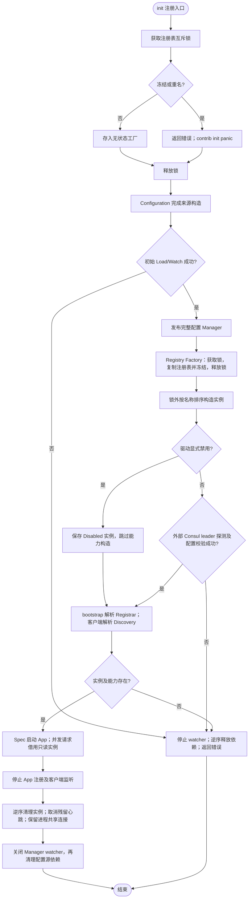
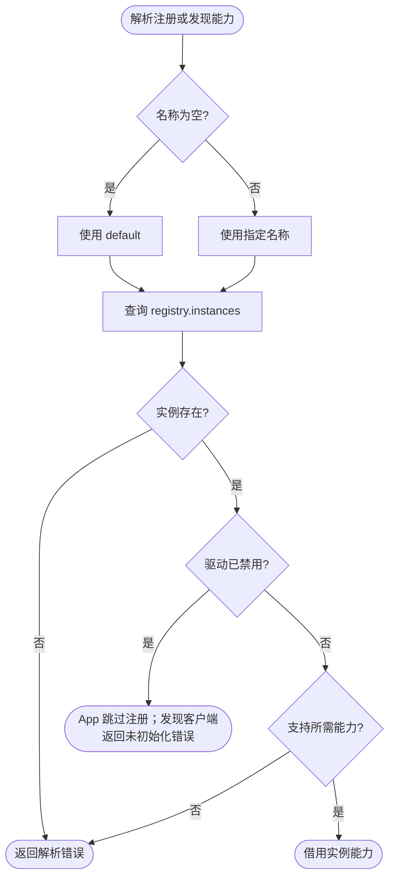

# 具名注册与发现驱动

`Factory` 从 `registry.instances` 创建多个独立实例，提供 `Registrar(name)` 和 `Discovery(name)`。返回对象是借用资源，不能自行释放，也不能在 Factory cleanup 后使用。未知实例、未知驱动、未禁用但缺少请求能力都返回错误。`Resource.Disabled` 表示整个实例禁用，能力解析返回 nil、nil；需要发现能力的客户端自行拒绝不可用的依赖。

业务导入具体驱动，例如 `_ "github.com/jaggerzhuang1994/kratos-foundation/v2/contrib/registry/consul"`。Consul 驱动同时提供注册和发现；其他驱动可只提供其中一项。`init` 仅注册工厂；不读取环境、不执行网络或磁盘 I/O、不启动 goroutine。

```yaml
registry:
  instances:
    default:
      driver: consul
      options:
        registry:
          disable_heartbeat: false
        discovery:
          timeout: 10s
app:
  registry: default
client:
  clients:
    users:
      target: discovery:///users
      discovery: default
```

Consul 客户端由 `CONSUL_*` 环境变量驱动，配置源和所有具名实例共享进程单例。首次使用后固定客户端或初始化错误。`options.connection` 已删除，出现时返回错误（包括空对象或 null）。`options.registry` 和 `options.discovery` 使用现有 Consul 适配器配置及默认值；旧顶层 discovery 及 registry 策略字段已移除，继续使用会被配置校验拒绝。实例集合和驱动选项在启动时读取，不热替换。客户端可以热更新所选择的已存在实例名称。

## Wire 组装

应用提供已声明 Configuration 的 `*bootstrap.Spec`、`appinfo.AppInfo` 和 Boot，使用 `bootstrap.BaseProviderSet`。旧基础/Consul 组装集合已删除。配置文件源和 Consul 源显式排列，后者覆盖前者；远程配置连接来自启动环境，不从最终 Manager 反向读取。

配置源使用普通导入，通过 `spec.Configuration(file.AddConfigSource(...), consul.AddConfigSource(...))` 显式声明；env 默认在首位。配置阶段的可编译组装示例和执行顺序见 [Bootstrap Configuration](../bootstrap/README.md#configuration-配置阶段)。不再提供配置源驱动注册表或进程级默认路径。

`app.registry` 与 `client.clients.<name>.discovery` 省略或为空时均使用 `default`，必须配置 `registry.instances.default` 及对应驱动；显式名称选择其他实例。App 组装时由 `app.NewRegistrar` 解析实例，再注入 Registrar；缺少实例返回错误。空名称不再禁用注册，驱动返回 Disabled 时才跳过注册。直连客户端不解析发现实例。App 不访问工厂。客户端注入 `DiscoveryResolver`，由 Wire 将 `*registry.Factory` 绑定到该接口。

## 生命周期与并发

注册表的互斥锁保护注册、快照与冻结这个复合状态；快照复制后释放锁，再调用工厂及外部服务。首次构造后拒绝新增驱动，后续应用可复用注册表构造独立实例。具名实例 map 构造后只读，不支持运行时增删。Factory 不拥有调用方的业务执行生命周期，调用方必须先停止使用者再执行 cleanup。



Consul 连接构造使用 `newClient` 的初始化日志及 10 秒 leader 探测预算；错误交给调用方的启动边界处理。cleanup 正常先注销、停止监听，客户端始终归进程所有；心跳取消沿用 Registrar 的操作 channel 串行化策略，不增加新的业务锁。该 channel 获取超时会记录 `newDriver.cleanup` 错误。配置源与注册发现共享 SDK 客户端，驱动 cleanup 不关闭它。详见[单例生命周期](../../internal/consul/README.md)。

## 迁移

1. 将注册/发现设置迁入每个实例的 `options.registry` / `options.discovery`。
2. 配置 `registry.instances.default`，或显式设置 `app.registry` 与发现目标的 `client.clients.<name>.discovery` 选择其他已配置实例。
3. 用有序 Configuration 声明替代旧的本地/远程环境选择 provider；远程连接先配置启动环境。
4. Wire 使用 BaseProviderSet 后重新生成，按依赖逆序 cleanup。

注册/发现旧显式构造函数与旧 Discovery 包已经删除；客户端统一使用 `client.NewFactory` 接收 `DiscoveryResolver`。可执行的组装与 cleanup 用例位于 `pkg/bootstrap/testdata/wireassembly`，由根 `make test-business` 在临时模块生成并运行。

默认名称解析：


