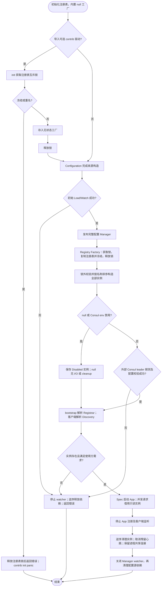
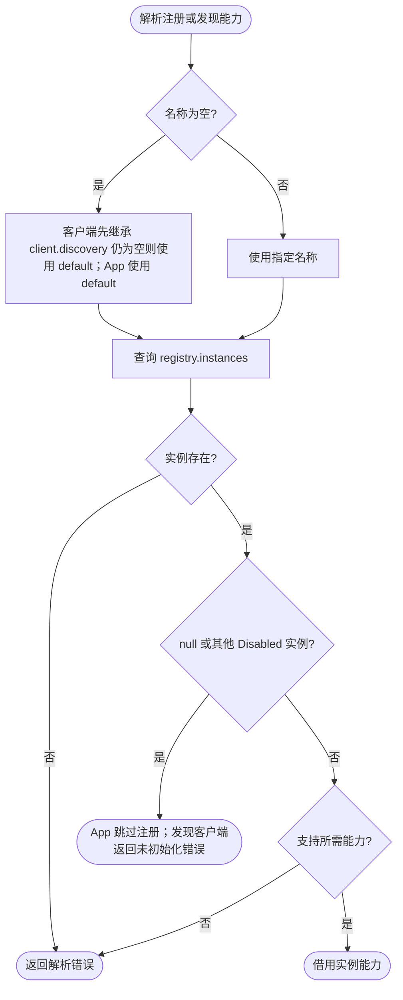

# 具名注册与发现驱动

`Factory` 从 `registry.instances` 创建多个独立实例，提供 `Registrar(name)` 和 `Discovery(name)`。返回对象是借用资源，不能自行释放，也不能在 Factory cleanup 后使用。未知实例、未知驱动、未禁用但缺少请求能力都返回错误。`Resource.Disabled` 表示整个实例禁用，能力解析返回 nil、nil；需要发现能力的客户端自行拒绝不可用的依赖。

`null` 是内置驱动，无需额外导入。业务使用 Consul 等可选驱动时空导入对应包，例如 `_ "github.com/jaggerzhuang1994/kratos-foundation/v2/contrib/registry/consul"`。Consul 驱动同时提供注册和发现；其他驱动可只提供其中一项。可选驱动的 `init` 仅注册工厂；不读取环境、不执行网络或磁盘 I/O、不启动 goroutine。

```yaml
registry:
  instances:
    default:
      driver: consul
      options:
        registry:
          disable_heartbeat: false
        discovery:
          timeout: 10s
app:
  registry: default
client:
  clients:
    users:
      target: discovery:///users
      discovery: default
```

Consul 客户端由 `CONSUL_*` 环境变量驱动，配置源和所有具名实例共享进程单例。首次使用后固定客户端或初始化错误。`options.connection` 已删除，出现时返回错误（包括空对象或 null）。`options.registry` 和 `options.discovery` 使用现有 Consul 适配器配置及默认值；旧顶层 discovery 及 registry 策略字段已移除，继续使用会被配置校验拒绝。实例集合和驱动选项在启动时读取，不热替换。客户端可以热更新所选择的已存在实例名称。

## 通过配置关闭服务注册

将 `app.registry` 指向 `driver: "null"` 的具名实例，可通过配置关闭本应用的服务注册与注销。内置 `null` 工厂返回 `Resource{Disabled: true}`，不提供 Registrar 或 Discovery，不读取 `options`，不执行 I/O、创建 goroutine 或提供 cleanup。YAML 中必须给 `"null"` 加引号；裸 `null` 表示空值，不能选择该驱动。

以下示例使用默认 `bootstrap.BaseProviderSet` 组装，已空导入 Consul 驱动，并通过启动环境配置可用的 Consul（未禁用共享客户端）；配置源及应用身份等依赖仍按 [Wire 组装](#wire-组装) 提供。App 选择 `disabled`，客户端继续借用 `default` 的 Consul 发现能力：

```yaml
app:
  registry: disabled
registry:
  instances:
    disabled:
      driver: "null"
    default:
      driver: consul
client:
  discovery: default
  clients:
    users:
      target: discovery:///users
```

`null` 仅禁用所选择的实例，不影响 Consul 配置源或其他实例。Factory 仍在启动时构造全部已配置实例，示例中的 `default` 仍会获取进程共享客户端，首次启用时初始化并探测 Consul；不能同时使用 `DISABLE_CONSUL=true` 保留 Consul 发现能力。实例驱动和 `app.registry` 在启动时读取，修改后须重启。`discovery://` 客户端若选择 `disabled`，会因发现能力为 nil 返回 `client.ErrDiscoveryNotInitialized`；直连客户端不解析发现实例。

## Wire 组装

应用提供已声明 Configuration 的 `*bootstrap.Spec`、`appinfo.AppInfo` 和 Boot，使用 `bootstrap.BaseProviderSet`。旧基础/Consul 组装集合已删除。配置文件源和 Consul 源显式排列，后者覆盖前者；远程配置连接来自启动环境，不从最终 Manager 反向读取。

配置源使用普通导入，通过 `spec.Configuration(file.AddConfigSource(...), consul.AddConfigSource(...))` 显式声明；env 默认在首位。配置阶段的可编译组装示例和执行顺序见 [Bootstrap Configuration](../bootstrap/README.md#configuration-配置阶段)。不再提供配置源驱动注册表或进程级默认路径。

`app.registry` 省略或为空时使用 `default`；`client.clients.<name>.discovery` 省略或为空时继承 `client.discovery`，根配置也省略或为空时使用 `default`，必须配置 `registry.instances.default` 及对应驱动；显式名称选择其他实例。App 组装时由 `app.NewRegistrar` 解析实例，再注入 Registrar；缺少实例返回错误。空名称不再禁用注册，驱动返回 Disabled 时才跳过注册。直连客户端不解析发现实例。App 不访问工厂。客户端注入 `DiscoveryResolver`，由 Wire 将 `*registry.Factory` 绑定到该接口。

## 生命周期与并发

注册表的互斥锁保护注册、快照与冻结这个复合状态；快照复制后释放锁，再调用工厂及外部服务。首次构造后拒绝新增驱动，后续应用可复用注册表构造独立实例。具名实例 map 构造后只读，不支持运行时增删。Factory 不拥有调用方的业务执行生命周期，调用方必须先停止使用者再执行 cleanup。


```mermaid
flowchart TD
 A([初始化注册表，内置 null 工厂]) --> A1{导入可选 contrib 驱动?}
 A1 -- 是 --> B[init 获取注册表互斥锁]
 A1 -- 否 --> G
 B --> C{冻结或重名?}
 C -- 是 --> E[释放注册表锁后返回错误；contrib init panic]
 C -- 否 --> D[存入无状态工厂]
 D --> U[释放锁]
 E --> R
 U --> G[Configuration 完成来源构造]
 G --> H{初始 Load/Watch 成功?}
 H -- 否 --> X[停止 watcher；逆序释放依赖；返回错误]
 H -- 是 --> I[发布完整配置 Manager]
 I --> F[Registry Factory：获取锁，复制注册表并冻结，释放锁]
 F --> J[锁外校验并按名称排序构造全部实例]
 J --> Z{null 或 Consul env 禁用?}
 Z -- 是 --> V[保存 Disabled 实例；null 无 I/O 或 cleanup]
 V --> L
 Z -- 否 --> K{外部 Consul leader 探测及配置校验成功?}
 K -- 否 --> X
 K -- 是 --> L[bootstrap 解析 Registrar；客户端解析 Discovery]
 L --> M{实例存在且满足使用方需求?}
 M -- 否 --> X
 M -- 是 --> N[Spec 启动 App；并发请求借用只读实例]
 N --> O[停止 App 注册及客户端监听]
 O --> P[逆序清理实例；取消残留心跳；保留进程共享连接]
 P --> Q[关闭 Manager watcher，再清理配置源依赖]
 Q --> R([结束])
 X --> R
```

Consul 连接构造使用 `newClient` 的初始化日志及 10 秒 leader 探测预算；错误交给调用方的启动边界处理。cleanup 正常先注销、停止监听，客户端始终归进程所有；心跳取消沿用 Registrar 的操作 channel 串行化策略，不增加新的业务锁。该 channel 获取超时会记录 ERROR `registry.consul.cleanup.failed`（`error`）。配置源与注册发现共享 SDK 客户端，驱动 cleanup 不关闭它。详见[单例生命周期](../../internal/consul/README.md)。

## 迁移

1. 将注册/发现设置迁入每个实例的 `options.registry` / `options.discovery`。
2. 配置 `registry.instances.default`，或显式设置 `app.registry` 与发现目标的 `client.clients.<name>.discovery` 选择其他已配置实例。
3. 用有序 Configuration 声明替代旧的本地/远程环境选择 provider；远程连接先配置启动环境。
4. Wire 使用 BaseProviderSet 后重新生成，按依赖逆序 cleanup。

注册/发现旧显式构造函数与旧 Discovery 包已经删除；客户端统一使用 `client.NewFactory` 接收 `DiscoveryResolver`。可执行的组装与 cleanup 用例位于 `pkg/bootstrap/testdata/wireassembly`，由根 `make test-business` 在临时模块生成并运行。

默认名称解析：


```mermaid
flowchart TD
 A([解析注册或发现能力]) --> B{名称为空?}
 B -- 是 --> C[客户端先继承 client.discovery 仍为空则使用 default；App 使用 default]
 B -- 否 --> D[使用指定名称]
 C --> E[查询 registry.instances]
 D --> E
 E --> F{实例存在?}
 F -- 否 --> G([返回解析错误])
 F -- 是 --> H{null 或其他 Disabled 实例?}
 H -- 否 --> K{支持所需能力?}
 K -- 是 --> I([借用实例能力])
 K -- 否 --> G
 H -- 是 --> J([App 跳过注册；发现客户端返回未初始化错误])
```
