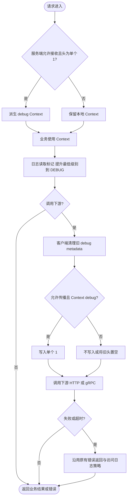
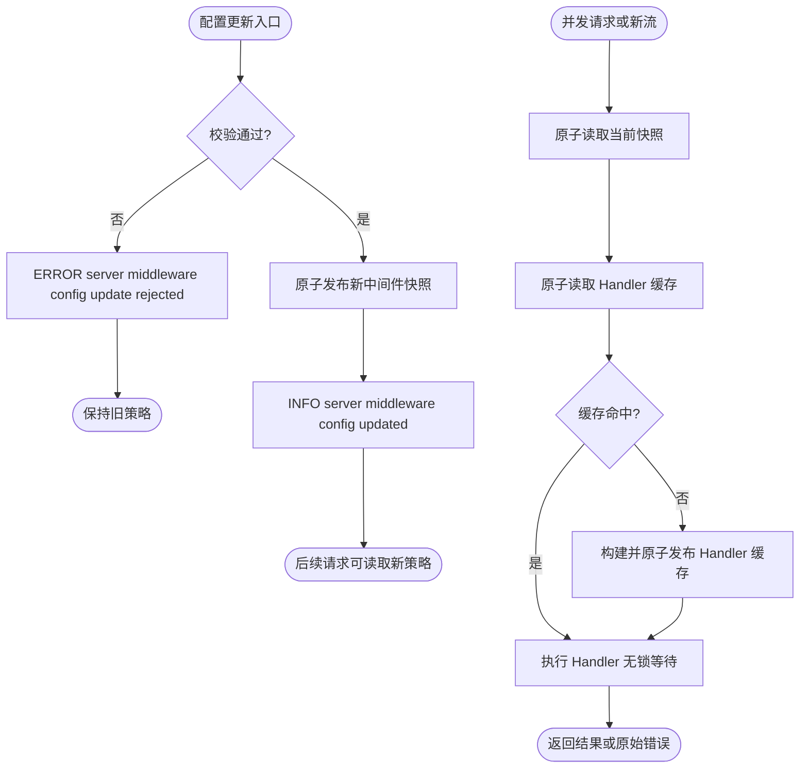

# 应用级请求状态

`request` 保存应用级请求状态，供日志及其他业务能力读取。它不依赖 log、server、client 或 bootstrap，不拥有资源，无需 cleanup。

```go
// 前置条件：ctx 是当前请求上下文，logger 是注入的 log.Logger。
// 入口完成应用授权后启用；导入 Foundation 的 pkg/request。
ctx = request.WithDebug(ctx)
logger.WithContext(ctx).Debug("request details")
// 向 Foundation client 发起调用时继续传递 ctx。
```

`WithDebug` 返回子 Context，父 Context 不变；取消、截止时间及其他值仍继承。`IsDebug(ctx)` 读取状态，未设置返回 false。不要传入 nil Context。异步任务只有继承该上下文才继承标记；同一进程中不需要额外 metadata API。

## 跨服务传播

与截止时间一样，状态属于 Context，由传输适配层负责跨服务编码和恢复。Foundation server/client 自动安装独立的 `request_debug` 中间件，无需把键加入通用 metadata 前缀。

| 配置 | 默认与作用 |
| --- | --- |
| `server.middleware.request_debug.accept_incoming` | true；默认接受传入标记，显式 false 关闭；支持热更新 |
| `client.clients.<name>.middleware.request_debug.propagate` | true；false 时停止向该下游传递；随 clients 配置更新重建客户端 |

两端共享配置消息，但 `accept_incoming` 只在服务端生效，`propagate` 只在客户端生效。省略值使用默认值；配置源更新删除键是否生效遵循 Config 的默认合并规则。服务端关闭接收不会清除业务已在本地写入的标记；客户端关闭传播也不会改变本地 Context。新租用的客户端应用新配置，已有租约沿用原客户端策略。

HTTP Header 与 gRPC metadata 共用保留键 `x-foundation-debug`，只有单个值 `1` 表示开启。空值、多值、其他字符串均忽略，继续处理请求，不返回错误或额外记录日志。原始头不是授权凭据：公网入口应由网关清理外部标记并在鉴权后设置，无需接收的入口可显式关闭 accept_incoming；调用外部服务可将 propagate 设为 false。

通用 metadata 的 prefix、constants、Context metadata，以及 WebSocket query/subprotocol 均不能注入这个保留键。客户端按 Context 重新生成标记，并清理原生 gRPC outgoing metadata 中的旧值。HTTP/通用 transport Header 接口不支持删除，已有头在不传播时置空；原来没有头的普通请求不新增头。

HTTP、gRPC unary 与 gRPC stream 均支持。流在建立时传递并恢复状态，配置更新影响之后建立的流；已经建立的流沿用其 Context。WebSocket 仅在 HTTP 握手入口接受头，连接上下文继承握手标记，不提供消息级或 query/subprotocol 开关。



日志的覆盖顺序为 **请求 debug > log.modules 首项命中级别 > 实例显式级别 > log.level > LOG_LEVEL 启动级别**。请求 debug 只调整最低级别，不解除禁用、敏感字段过滤或输出端级别限制（包括继承的 log.level）。详细规则见 [log](../log/README.md)。

服务端策略复用现有动态中间件的原子发布与原子缓存，不新增锁或后台任务；非法配置整次拒绝，保留原策略。


