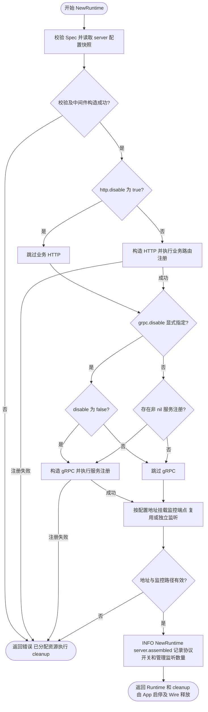
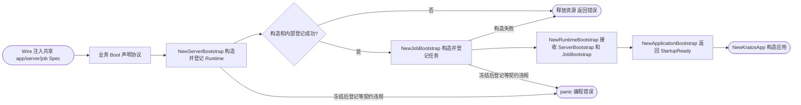
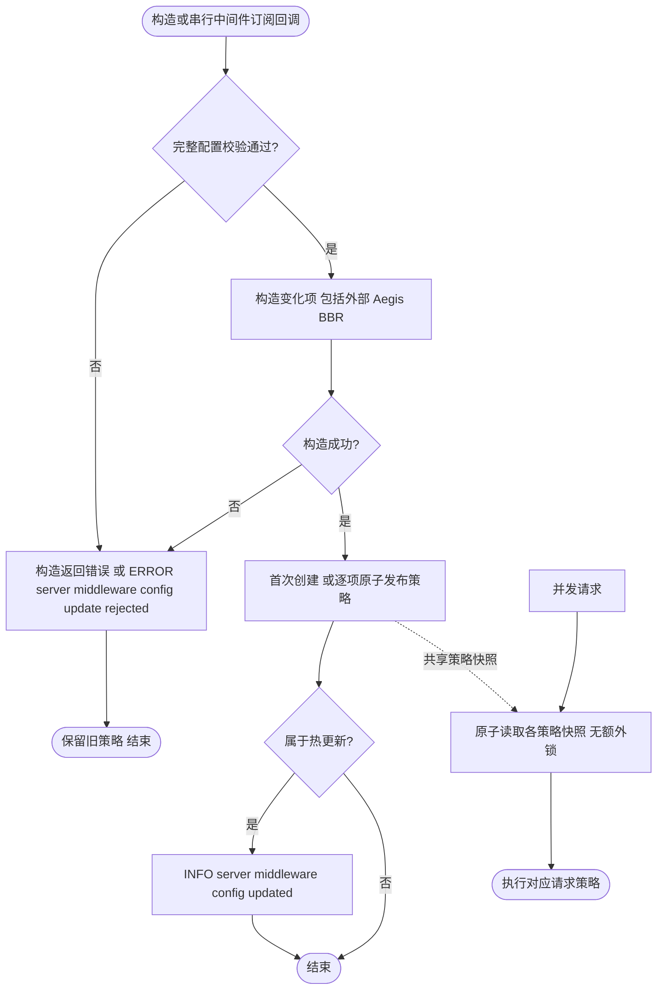
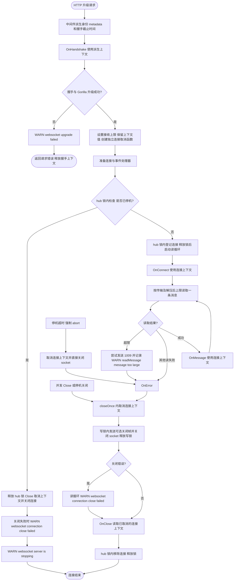
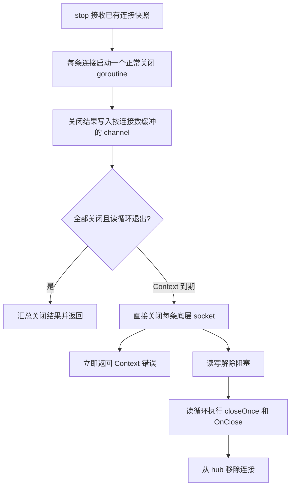
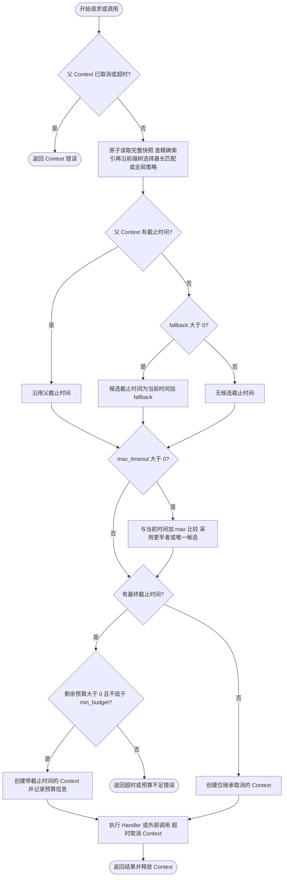
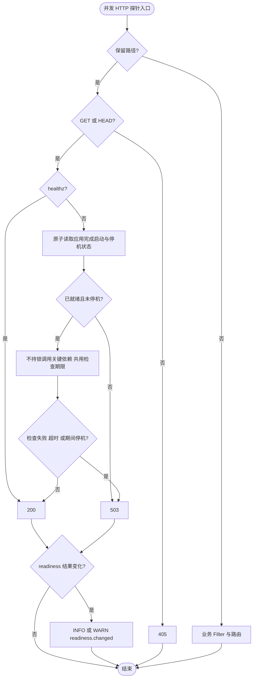
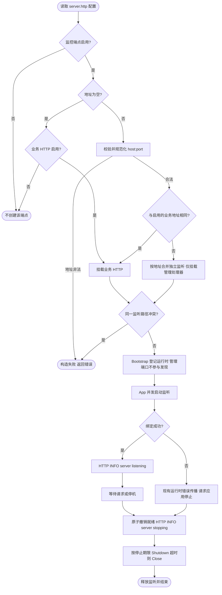
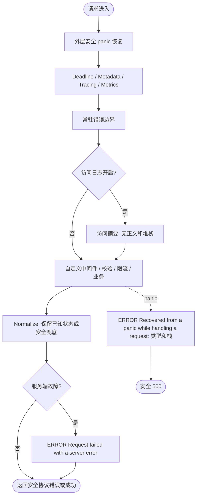

# Server

默认访问日志、错误边界和中间件配置更新归属 `module=server`，健康状态变化为 `server/health`，WebSocket 为 `server/websocket`。通过 Foundation 全局绑定的 Kratos HTTP/gRPC 启停日志归属 `kratos`。

`pkg/server` 是业务与 Wire 声明 HTTP、gRPC 和 WebSocket 服务并构造服务器运行时的公共入口。业务只依赖 `Spec`、Builder、协议契约、`NewRuntime`；服务器构造和应用登记由 `bootstrap.NewServerBootstrap` 完成；不应导入 `pkg/server/internal/*`。

业务 HTTP 默认开启，`server.http.disable: true` 仅关闭业务监听，不是所有 HTTP 监听的总开关。
gRPC 未注册业务服务时默认关闭；至少一个非 nil `GRPC().Register(...)` 回调触发默认开启。
`server.grpc.disable` 省略时采用该默认规则，显式 `false` 强制开启（允许没有业务服务），显式 `true` 关闭。
仅获取 Builder、设置 Middleware/Option 或 Register(nil) 不启用 gRPC。bootstrap 与直接 NewRuntime 使用相同规则。
HTTPBuilder/GRPCBuilder 不提供 Enable/Disable；端口开关和管理端点配置在构造时读取，需要重启生效。



业务通过统一 Spec 声明协议，下面假设 registerHTTP/registerGRPC 是业务提供的注册回调：

```go
func Boot(spec *bootstrap.Spec) bootstrap.Bootstrap {
    spec.Http().Register(registerHTTP)
    spec.Grpc().Register(registerGRPC)
    return bootstrap.Bootstrap{}
}
```

Wire 通过 `app.NewSpec`、`server.NewSpec`、`job.NewSpec` 创建共享声明，注入 `bootstrap.NewSpec`；`NewServerBootstrap` 直接接收同一 app.Spec/server.Spec，并将 Boot 纳入前置依赖。`NewServerBootstrap` 在 Boot 完成后构造服务器，内部登记启用的业务 HTTP/gRPC Runtime 和独立管理监听；不启动服务。成功返回的 cleanup 由 Wire 在应用停止后逆序执行，构造失败会回滚。完整示例见 [bootstrap](../bootstrap/README.md)。它返回的 ServerBootstrap 标记注入 NewRuntimeBootstrap，保证服务器登记先完成。



手工调用 `server.NewRuntime` 时，调用方负责 `SetReadinessSource`，将 `Servers()` 中的非 nil 业务 Runtime 和 `ManagementServers()` 登记到应用 Spec；冻结后登记会 panic；Runtime 的 Start/Stop 由 App 监督，构造 cleanup 由调用方在应用停止后释放。

协议契约、Spec、配置加载、动态中间件、协议实例、WebSocket hub 和停机生命周期直接定义在 `pkg/server`，并按职责拆分在对应源码文件中。server 专属的 validator 与 ratelimit 位于 `pkg/server/internal/middleware`；只有 client/server 共同使用的 deadline、requestdebug、logging、metadata、metrics、tracing 和 HTTP transport 辅助能力保留在仓库根 `internal`。

启用 BBR 时，`bucket` 必须为正数，`window` 必须是可精确表示为 Go `time.Duration` 的正时长，整除后的每桶时长必须在 1ns–1s 内。`cpu_threshold` 必须为正数；`cpu_quota` 必须是有限非负数，零值沿用默认 CPU 采样。缺失字段沿用 Aegis 默认值（10s、100 桶、阈值 800），仍参与组合校验。禁用 BBR 时忽略其参数。`NewRuntime` 和中间件热更新使用相同校验；非法更新保留全部旧策略。更新先完成变化项的构造，再沿用逐项原子替换，不重建未变化的统计窗口；并发请求仍可能短暂读到新旧策略组合。



WebSocket 默认对**传输载荷和解压后消息**分别施加 **1 MiB** 上限；旧的 `HTTP().WebSocket(...)` 注册入口也采用此默认值。上限针对整条消息，分片不能绕过；开启消息压缩时，两种大小都须满足上限，所以接近边界的不可压缩数据需要为压缩格式开销留余量。它不是连接数或进程总内存上限，也不是读取超时。

通过 Spec 的端点配置覆盖（`spec` 为已创建的 `*server.Spec`，`handler` 实现至少一种 WebSocket 事件接口）：

```go
spec.HTTP().WebSocketWithConfig("/ws", handler, server.WebSocketConfig{
    MaxMessageBytes: 4 << 20,
    Upgrader: server.Upgrader{EnableCompression: true},
})
```

`MaxMessageBytes=0` 使用默认值，`-1` 显式恢复不限制消息大小的旧行为，小于 `-1` 在 Spec 校验时拒绝。这是端点构造期配置，不来自 YAML，也不热更新。超限数据不会交给 `OnMessage`；框架尝试发送 1009 关闭帧，记录 `WARN readMessage | websocket message too large`，将包含 `websocket.ErrReadLimit` 的错误交给已提供的 `OnError`，随后按原有关闭路径执行 `OnClose`。网络已失效时不保证对端收到关闭帧。大文件建议通过上传接口或应用层分片传输。

WebSocket 的 `OnHandshake` 接收中间件派生的上下文，包含身份、metadata 和握手截止时间。升级成功后，`WebSocketConn.Request().Context()` 保留这些上下文值，同时脱离 HTTP 握手请求的取消和截止时间；连接关闭时取消。`OnConnect`、`OnMessage`、`OnError` 和 `OnClose` 均可通过 `Request()` 读取这些值。正常关闭及停机强制中断会先取消连接上下文，读循环退出时的 `OnClose` 看到已取消状态。应用如需连接最大存活时间，应自行按业务策略调用 `Close()`。



WebSocket 读失败会结束该连接；写失败后也会关闭已不可复用的连接，使阻塞的读循环退出并执行既有 OnClose 与 hub 清理。关闭发生在释放写锁之后，不会自锁。其他连接与服务监听继续运行，重新连接由客户端发起。

服务停机时会并发关闭已有 WebSocket 连接，共享调用方传入的总时间预算。预算耗尽后直接关闭底层 socket，以打断仍在进行的读写；读循环随后仍按原有路径执行一次 OnClose 和 hub 清理。



框架可以用底层连接关闭打断网络读写，但不能强制终止业务实现的 `OnConnect`、`OnMessage`、`OnError` 或 `OnClose`；这些回调必须自行及时返回。缓冲结果 channel 保证停机超时返回后，已启动的关闭 goroutine 不会因上报结果再次阻塞。

## 截止时间

`middleware.deadline.fallback_timeout` 缺失时默认 **10s**，未配置 `middleware` 或 `deadline` 也采用该默认值。只有父 Context 没有截止时间时才使用 fallback；显式 `fallback_timeout: 0s` 关闭回退超时。`max_timeout` 大于零时始终参与计算，并取更早的截止时间，因此关闭 fallback 后仍可能被父 Context 或 `max_timeout` 限制。`max_timeout` 与 `min_budget` 默认 0s，不启用对应限制。

精确 `path` 在配置更新时建立 map，`prefix` 建立按字节匹配的压缩前缀树；查询树的成本取决于 operation 长度，不再逐条扫描全部前缀。两种索引与默认值作为同一个只读快照原子发布，更新校验失败不替换旧快照，读侧不增加锁。空 operation 保留历史行为：存在前缀规则时选择配置顺序中的首条，否则使用全局策略。

非空 operation 按精确 `path`、最长 `prefix`、全局配置的顺序匹配；路由缺失的字段继承全局值，显式 `0s` 关闭对应限制。热更新删除全局 fallback 显式值后恢复默认 10s。`min_budget` 不能超过任何已启用的 fallback 或 max 超时，因此未指定 fallback 时也会按默认 10s 校验。

下图同时适用于服务端处理与客户端调用。HTTP 服务端会先将有效的 `x-request-timeout-ms` 请求头转换为上游截止时间，客户端则将最终剩余预算传播到请求头；gRPC 使用 Context 传播预算。



## 默认健康检查

未指定独立地址时，启用业务 HTTP 默认提供 `GET/HEAD /healthz` 和 `GET/HEAD /readyz`。成功返回 200，未就绪返回
503，其他方法返回 405；不返回内部错误或依赖地址。它们是独立于业务 `PathPrefix` 的保留路径，
优先于业务路由、Filter、鉴权和限流。不要在这些路径注册业务接口；需要复用路径时先关闭健康检查。
同一监听上的健康路径不能与 metrics 路径相同。

`bootstrap.NewServerBootstrap` 自动绑定 `app.Spec.Ready`：全部启动后钩子成功才就绪，收到停机
请求立即不就绪，不等待 `stop_delay`。直接使用 Runtime 时，必须在启动前调用
`runtime.SetReadinessSource(readyFunc)`；未绑定时 `/readyz` 保持 503。Runtime.Stop 或 Wire cleanup
也会关闭就绪状态。`/healthz` 仅证明 HTTP 处理路径仍能响应，不代表所有后台任务正常。

```go
// 前置条件：spec 来自 bootstrap.NewSpec 或 server.NewSpec，sqlDB 由业务存储层提供。
spec.Health().Checks(server.ReadinessCheck{Name: "database", Check: sqlDB.PingContext})
```

省略部署配置时使用默认路径和一秒总检查期限；`server.http.health.disable: true` 关闭端点。Checks 按顺序
执行，只注册接收业务流量必需的依赖。检查函数必须支持 Context、可并发调用、无写入副作用；
超时通知不能强杀不合作的检查函数，框架不另起可能泄漏的 goroutine 包装检查。
配置在组装后固定；不得并发修改 Spec 或 SetReadinessSource。普通探针不逐次记录日志，readiness
结果变化记录 `event=readiness.changed`（成功 INFO、失败 WARN），只包含状态和检查名。



## 监控端点监听地址

监听位置统一由 `server.http` 管理：metrics 领域负责指标数据，app 提供就绪状态，server 负责将
HTTP 处理器挂载到具体地址。`server.http.metrics` 保持现有配置位置，健康检查配置为
`server.http.health`。这些配置需要重启，不属于热更新字段。

```yaml
server:
  http:
    addr: "0.0.0.0:8000"
    metrics:
      disable: false
      path: /metrics
      addr: "127.0.0.1:9001"
    health:
      disable: false
      addr: "127.0.0.1:9001"
      liveness_path: /healthz
      readiness_path: /readyz
      timeout: 1s
```

该示例启动业务端口 8000 和一个管理端口 9001；9001 同时提供 metrics 和健康检查，8000 不再
重复提供它们。省略两个管理 addr 时，三个端点默认都挂载到业务 HTTP。

| 地址与开关 | 行为 |
| --- | --- |
| addr 为空 | 复用业务 HTTP；业务 HTTP 禁用时该端点不启动 |
| addr 与启用的 server.http.addr 相同 | 复用业务监听，不重复绑定 |
| addr 与业务地址不同 | 只在新增监听上提供对应监控端点 |
| metrics.addr 与 health.addr 相同 | 两个端点共享一个新增监听 |
| 两个管理地址不同 | 分别监听，可同时存在三个 HTTP 监听 |
| 业务 HTTP 禁用，但管理 addr 显式指定 | 独立管理监听仍启用，包括地址与原业务配置相同的情况 |
| 某个端点 disable=true | 不挂载该端点，也不会仅为该端点创建监听 |

地址使用 `host:port`，IPv6 使用 `[::1]:9001`，不接受 URL 或服务名端口。比较会规范化数字端口、
IP 表示及 `0.0.0.0`/空 host；不通过 DNS 推断 localhost 与 IP 等价，也不猜测 IPv4/IPv6 的系统
绑定重叠。不同地址因通配绑定或端口占用发生冲突时，启动失败并触发应用统一停止。复用依据是
`server.http.addr` 配置；不要用原生 `HTTP.Option(http.Address(...))` 隐式改写需要参与复用的地址。

端点路径均相对于所选监听的根路径，独立于业务 PathPrefix、Filter 和鉴权。独立监听不继承业务
路由、WebSocket、TLS 或全局 DefaultServeMux，默认使用普通 HTTP；通过绑定地址控制监听范围。
同一监听上的 metrics 和健康路径不能冲突，不同监听可以使用相同路径。

`Health().Checks(...)` 只追加检查函数，不改变文件配置的地址、路径和 disable。
声明时复制检查切片，运行时再次保存独立切片快照；函数及其捕获的依赖仍由业务持有，必须支持并发探针和 Context 取消。
HTTPBuilder 不再提供 Health/HealthChecks，HealthConfig 不再作为公共 API 暴露，部署参数统一由配置管理。

`NewServerBootstrap` 自动登记全部监听。手工组装保留 `Runtime.Servers()` 的业务 HTTP/gRPC
返回值，并额外登记 `Runtime.ManagementServers()` 中的运行时。管理运行时不实现 Endpointer，
避免管理地址进入业务服务发现；不能将它们当作业务服务地址发布。监听在 Start 时创建，错误通过
现有 App 运行时传播；Stop 先撤销就绪，再按现有停机策略释放监听，构造期不打开 socket。



中间件配置订阅在下一轮成功扫描异步回放当前值，内容相同的回放或重复通知不会打印 `server middleware config updated`；
只有配置实际变化且成功应用后才记录更新日志，非法更新仍记录 rejected 并保留旧配置。

## 集成测试与边界用法

参见[核心组件集成用例](../INTEGRATION_TESTS.md#扩展模块与常见边界)。根目录 `make test-components` 运行自包含组合；`make test-components-external` 创建隔离 Docker 服务，验证真实 Kafka、Redis 和锁等功能。具体场景、所有权及适用边界见用例说明。


## 请求错误边界与安全日志

默认 HTTP/gRPC 链在 metrics 后、可选访问日志前安装常驻 `errors` 中间件。它调用 `errors.Normalize`：旧结构化错误保留原始 HTTP 状态和业务码，普通未知错误公开返回安全 500；基础设施错误链中的本地取消/超时按 499/504 处理，明确 4xx 仍保留外层语义。

`Request failed with a server error` 对服务端故障记录一次带请求 context 的诊断；`server.middleware.logging.disable=true` 只关闭访问摘要，不关闭该故障日志。服务端与客户端访问日志不读取请求/响应正文，不输出 cause/stack，只记录操作、状态、耗时及 deadline 字段。业务层应保留错误链，避免重复记录后再返回。SQL 或其他依赖日志仍由各自配置控制。

最外层 `Recovered from a panic while handling a request` 记录 panic 类型与堆栈，并将堆栈保存到服务间错误诊断，不记录原始 panic 值或请求正文。panic 不会再进入内层故障出口，避免重复记录。状态码、业务码、cause 和传输过滤的兼容边界见 [errors](../errors/README.md)。

业务通过 Spec 同名替换 `errors` 或 `recovery` 中间件时，应自行承担等价保护。本说明针对默认 HTTP/gRPC 请求链；WebSocket 异步消息回调需自行处理错误和日志。



服务端与客户端指标使用归一化后的 HTTP 状态计数，保留 422 等非标准 gRPC 映射的状态；指标观察不改变业务调用方收到的原始错误。

## 请求 debug

`server.middleware.request_debug.accept_incoming` 默认 true；可显式设为 false 关闭接收。默认请求链的 `request_debug` 优先级为 250，位于 deadline（200）与 metadata（300）之间，在访问日志前恢复 `request.WithDebug` 状态。关闭通用 metadata 不影响它。gRPC 流在建立时恢复标记，之后配置更新不改变已建立流的 Context。

该配置随 `server.middleware` 热更新，复用现有动态策略；非法更新保留旧配置。`propagate` 字段仅客户端消费。传输协议、信任边界和流程见 [request](../request/README.md)。
