# Server

默认访问日志、错误边界和中间件配置更新归属 `module=server`，健康状态变化为 `server/health`，WebSocket 为 `server/websocket`。通过 Foundation 全局绑定的 Kratos HTTP/gRPC 启停日志归属 `kratos`。

`pkg/server` 是业务与 Wire 声明 HTTP、gRPC 和 WebSocket 服务并构造服务器运行时的公共入口。业务只依赖 `Spec`、Builder、协议契约、`NewRuntime`；服务器构造和应用登记由 `bootstrap.NewServerBootstrap` 完成；不应导入 `pkg/server/internal/*`。

业务 HTTP 默认开启，`server.http.disable: true` 仅关闭业务监听，不是所有 HTTP 监听的总开关。
gRPC 未注册业务服务时默认关闭；至少一个非 nil `GRPC().Register(...)` 回调触发默认开启。
`server.grpc.disable` 省略时采用该默认规则，显式 `false` 强制开启（允许没有业务服务），显式 `true` 关闭。
仅获取 Builder、设置 Middleware/Option 或 Register(nil) 不启用 gRPC。bootstrap 与直接 NewRuntime 使用相同规则。
HTTPBuilder/GRPCBuilder 不提供 Enable/Disable；端口开关和管理端点配置在构造时读取，需要重启生效。

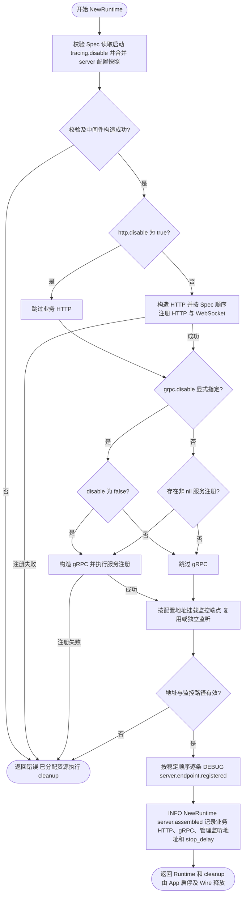
```mermaid
flowchart TD
    A([开始 NewRuntime]) --> B[校验 Spec 读取启动 tracing.disable 并合并 server 配置快照]
    B --> C{校验及中间件构造成功?}
    C -- 否 --> X([返回错误 已分配资源执行 cleanup])
    C -- 是 --> D{http.disable 为 true?}
    D -- 是 --> E[跳过业务 HTTP]
    D -- 否 --> F[构造 HTTP 并按 Spec 顺序注册 HTTP 与 WebSocket]
    E --> G{grpc.disable 显式指定?}
    F -- 注册失败 --> X
    F -- 成功 --> G
    G -- 是 --> H{disable 为 false?}
    G -- 否 --> I{存在非 nil 服务注册?}
    H -- 是 --> J[构造 gRPC 并执行服务注册]
    I -- 是 --> J
    H -- 否 --> K[跳过 gRPC]
    I -- 否 --> K
    J -- 注册失败 --> X
    J -- 成功 --> L[按配置地址挂载监控端点 复用或独立监听]
    K --> L
    L --> M{地址与监控路径有效?}
    M -- 否 --> X
    M -- 是 --> JK[按稳定顺序逐条 DEBUG server.endpoint.registered]
    JK --> N[INFO NewRuntime server.assembled 记录业务 HTTP、gRPC、管理监听地址和 stop_delay]
    N --> O([返回 Runtime 和 cleanup 由 App 启停及 Wire 释放])
```

业务通过统一 Spec 声明协议，下面假设 registerHTTP/registerGRPC 是业务提供的注册回调：

```go
func Boot(spec *bootstrap.Spec) bootstrap.Bootstrap {
    spec.Http().Register(registerHTTP)
    spec.Grpc().Register(registerGRPC)
    return bootstrap.Bootstrap{}
}
```

`HTTP().Register(...)`、`HTTP().WebSocket(...)` 和 `HTTP().WebSocketWithConfig(...)` 共享同一条有序声明流，底层服务器严格按照 Spec 调用顺序注册。路由发生重叠时，仍采用 Kratos 底层路由器的先注册优先语义；调用方不应依赖旧版“先注册全部 HTTP、再注册全部 WebSocket”的分组行为。启动阶段的 `server.endpoint.registered` 日志为了稳定对比仍按路径和方法排序，不表示实际注册顺序。

Wire 通过 `app.NewSpec`、`server.NewSpec`、`job.NewSpec` 创建共享声明，注入 `bootstrap.NewSpec`；`NewServerBootstrap` 直接接收同一 app.Spec/server.Spec，并将 Boot 纳入前置依赖。`NewServerBootstrap` 在 Boot 完成后构造服务器，内部登记启用的业务 HTTP/gRPC Runtime 和独立管理监听；不启动服务。成功返回的 cleanup 由 Wire 在应用停止后逆序执行，构造失败会回滚。完整示例见 [bootstrap](../bootstrap/README.md)。它返回的 ServerBootstrap 标记注入 NewRuntimeBootstrap，保证服务器登记先完成。

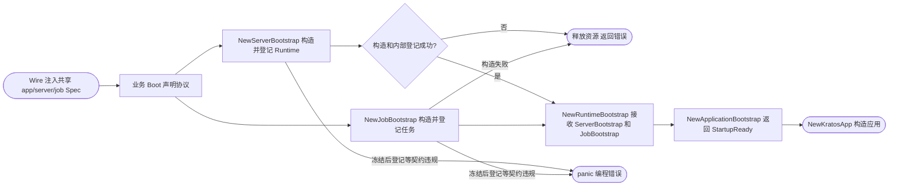
```mermaid
flowchart LR
 A([Wire 注入共享 app/server/job Spec]) --> A1[业务 Boot 声明协议]
 A1 --> B[NewServerBootstrap 构造并登记 Runtime]
 B --> C{构造和内部登记成功?}
 C -- 否 --> D([释放资源 返回错误])
 A1 --> J[NewJobBootstrap 构造并登记任务]
 C -- 是 --> G
 J -- 构造失败 --> D
 J --> G[NewRuntimeBootstrap 接收 ServerBootstrap 和 JobBootstrap]
 B -- 冻结后登记等契约违规 --> P([panic 编程错误])
 J -- 冻结后登记等契约违规 --> P
 G --> E[NewApplicationBootstrap 返回 StartupReady]
 E --> F([NewKratosApp 构造应用])
```

手工调用 `server.NewRuntime` 时，调用方负责 `SetReadinessSource`，将 `Servers()` 中的非 nil 业务 Runtime 和 `ManagementServers()` 登记到应用 Spec；冻结后登记会 panic；Runtime 的 Start/Stop 由 App 监督，构造 cleanup 由调用方在应用停止后释放。

## HTTP 监听所有权与启动回滚

业务及独立管理 HTTP 的监听由 Foundation 持有，通过 Kratos 的 `http.Listener` 注入；路由注册回调仍接收原生 `*http.Server`，生成接口、中间件、编码器和 TLS 能力继续由 Kratos 提供。`NewRuntime` 不打开 socket：业务 HTTP 在应用解析 Endpoint 时准备监听，管理 HTTP 在 Start 时准备。手工使用时，启停和端点查询必须经过 `Runtime.Servers()` / `ManagementServers()` 返回的运行时；路由注册回调只登记路由，不直接调用原生 Server 的 Endpoint、Start 或 Stop。应用就绪后可从 `App.Endpoint()` 读取发现地址。

`server.http.network` 与 `server.http.addr` 在构造期读取，省略时分别使用 `tcp` 与 `0.0.0.0:8000`；显式空地址回落到 `:0`，显式空 network 不通过配置校验。原生 `HTTPBuilder.Option(http.Network/Address/Listener(...))` **不再决定监听**，会被 Foundation 的最终监听设置覆盖；地址和网络迁移到配置，自定义监听迁移到 `HTTP().Listener(listener)`。未提供 Listener 时按配置绑定，已提供时使用其实际监听。`http.Endpoint`、TLS、PathPrefix、编码器及其他协议选项继续按原有顺序应用。监听地址需重启生效。

```go
// 在业务 Boot 中声明；listener 来自业务显式构造。
spec.HTTP().Listener(listener).Register(registerHTTP)
```

自定义 Listener 在启用 HTTP 并进入服务器构造后转交 Runtime，后续构造失败会关闭它；构造前校验或配置失败、HTTP 被禁用、或声明被替换时，监听仍归调用方。Runtime 已接管后，调用方不得继续 Accept 或关闭它。SDK Stop、启动失败回滚和 provider cleanup 共享同一次底层 Close；cleanup 幂等，必须在 App 退出后调用，释放后须创建新的 Runtime，不能重新启动旧实例。

SDK Endpoint 自身解析失败、后续 Endpoint 失败或 BeforeStart 失败时，应用通过可选 `AbortStartup(ctx)` 逆序回滚已准备的监听，再执行 AfterStop；回滚绕过 stop_delay，原始错误和回收错误均保留。正常 Stop 先执行原有 HTTP Shutdown 排空，再确保监听释放；TLS 等 Serve 前置失败也会关闭监听。此保证针对 Foundation 管理的 HTTP，原生或自定义 Runtime 的资源由其自身生命周期契约负责。

每个监听的互斥锁只保护创建状态、监听发布和关闭状态；绑定、Accept、底层 Close 及回调在锁外执行。并发准备共享同一次结果；回收开始后先标记关闭并取消未完成的绑定，准备调用方负责回收未发布的监听。Start 准备与回收等待支持传入 Context 取消；Kratos 的 Endpoint 接口不接收 Context，自动端点准备使用 Background，父 Context 取消须待该查询返回后进入启动前回滚。`net.Listener.Close` 没有 Context 参数，业务提供的阻塞 Close 无法被强制中断。请求处理不获取这些状态锁。provider cleanup 无法返回错误时，仅一次记录 `ERROR server.listener.cleanup.failed`；其他错误交由调用方处理。

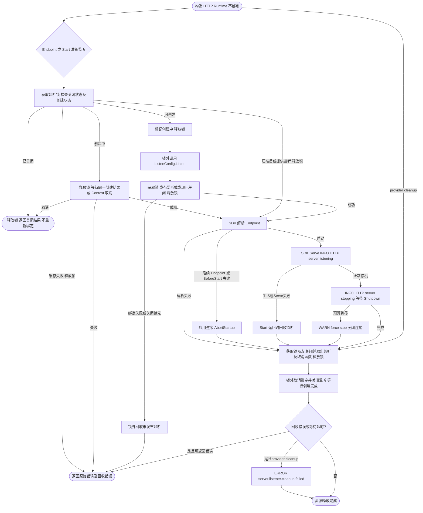
```mermaid
flowchart TD
    A([构造 HTTP Runtime 不绑定]) --> B{Endpoint 或 Start 准备监听}
    B --> C[获取监听锁 检查关闭状态及创建状态]
    C -- 已关闭 --> X([释放锁 返回关闭结果 不重新绑定])
    C -- 缓存失败 释放锁 --> Z
    C -- 创建中 --> W[释放锁 等待同一创建结果或 Context 取消]
    W -- 取消 --> X
    W -- 成功 --> G
    W -- 失败 --> Z
    C -- 已准备或提供监听 释放锁 --> G
    C -- 可创建 --> D[标记创建中 释放锁]
    D --> E[锁外调用 ListenConfig.Listen]
    E --> F[获取锁 发布监听或发现已关闭 释放锁]
    F -- 绑定失败或关闭抢先 --> R[锁外回收未发布监听]
    R --> Z([返回原始错误及回收错误])
    F -- 成功 --> G[SDK 解析 Endpoint]
    G -- 解析失败 --> L
    G -- 后续 Endpoint 或 BeforeStart 失败 --> H[应用逆序 AbortStartup]
    H --> L
    G -- 启动 --> I[SDK Serve INFO HTTP server listening]
    I -- TLS或Serve失败 --> S[Start 返回时回收监听]
    S --> L
    I -- 正常停机 --> J[INFO HTTP server stopping 等待 Shutdown]
    J -- 预算耗尽 --> K[WARN force stop 关闭连接]
    K --> L
    J -- 完成 --> L
    A -- provider cleanup --> L[获取锁 标记关闭并取出监听及取消函数 释放锁]
    L --> M[锁外取消绑定并关闭监听 等待创建完成]
    M --> N{回收错误或等待超时?}
    N -- 是且provider cleanup --> O[ERROR server.listener.cleanup.failed]
    N -- 是且可返回错误 --> Z
    O --> P([资源释放完成])
    N -- 否 --> P
```

协议契约、Spec、配置加载、动态中间件、协议实例、WebSocket hub 和停机生命周期直接定义在 `pkg/server`，并按职责拆分在对应源码文件中。server 专属的 validator 与 ratelimit 位于 `pkg/server/internal/middleware`；只有 client/server 共同使用的 deadline、requestdebug、logging、metadata、metrics、tracing 和 HTTP transport 辅助能力保留在仓库根 `internal`。

`server.tracing.disable` 省略或 `server.tracing` 为空消息时，继承构造时读取的全局 `tracing.disable`；局部显式 `false` 或 `true` 覆盖该默认值。全局字段省略时，local 环境默认 `true`，其他环境默认 `false`。全局开关需要重启生效，局部开关支持热更新；有效配置快照移除局部覆盖时恢复启动时的全局值，不重新读取运行期的全局配置。默认配置源合并会保留省略字段，仅删除源字段不保证移除有效值。默认模板是独立副本，不修改共享的 server 默认配置。

`server.tracing.disable: true` 或构造期全局 tracing Provider 被禁用时，会停止服务端 Span 的记录、采样和导出；常驻 tracing 中间件仍使用非采样 Provider 创建或延续请求 SpanContext。因此访问日志和业务日志仍能读取 `trace.id`、`span.id`，下游客户端也可继续传播同一条 TraceID。局部关闭只隔离已注入的真实 Provider，不销毁它；全局 Provider 禁用时不创建 exporter。运行期重新启用 server tracing 时恢复使用构造期注入的真实 Provider；若全局 Provider 在构造期已禁用，局部显式 `false` 仍只能保留关联 ID，需重启并启用全局 Provider 才能恢复记录和导出。

`NewRuntime` 在业务 HTTP、WebSocket、gRPC 和监控处理器组装完成后、服务启动前，按 HTTP 路径/方法及 gRPC 完整方法名的稳定顺序逐条记录 `DEBUG event=server.endpoint.registered`。HTTP 字段为 `transport=http, method, path, service, listener`；metrics/health 的 `service` 分别为对应能力，`listener` 为 `business` 或独立管理地址。gRPC 还包含实际服务名，`path` 采用 `/<service>/<method>`。业务路由来自底层 Server 的最终注册表，业务 HTTP/gRPC 的 `listener=business`，监控处理器由 Foundation 在挂载成功后补入；禁用的协议或监控能力不输出对应端点。默认 Info 级别仅保留 `event=server.assembled` 组装摘要和 SDK 启停日志；摘要字段为 `http`、`grpc`（配置地址，禁用为 `disabled`）、`management`（独立管理监听地址列表）和 `stop_delay`，`:0` 等动态端口以 SDK 的 listening 日志为准；需要核对逐路由详情时启用 Debug。

访问日志中的 `deadline.source` 和 `deadline.remaining` 使用 `log.DebugOnly`：普通 Info 请求日志默认省略；请求 Context 启用 debug 时，即使访问日志事件仍是 Info，也会展开这些字段。默认 `filter_empty=true` 会移除未展开的整组键值。

启用 BBR 时，`bucket` 必须为正数，`window` 必须是可精确表示为 Go `time.Duration` 的正时长，整除后的每桶时长必须在 1ns–1s 内。`cpu_threshold` 必须为正数；`cpu_quota` 必须是有限非负数，零值沿用默认 CPU 采样。缺失字段沿用 Aegis 默认值（10s、100 桶、阈值 800），仍参与组合校验。禁用 BBR 时忽略其参数。`NewRuntime` 和中间件热更新使用相同校验；非法更新保留全部旧策略。更新先完成变化项的构造，再沿用逐项原子替换，不重建未变化的统计窗口；并发请求仍可能短暂读到新旧策略组合。

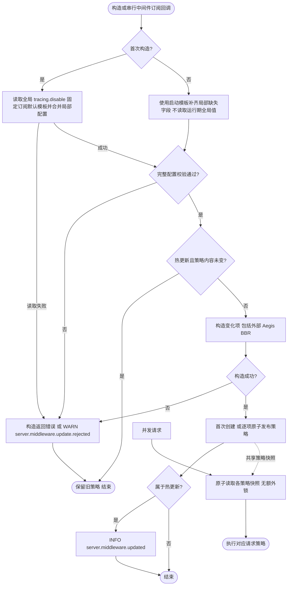
```mermaid
flowchart TD
    A([构造或串行中间件订阅回调]) --> A1{首次构造?}
    A1 -- 是 --> A2[读取全局 tracing.disable 固定订阅默认模板并合并局部配置]
    A1 -- 否 --> A3[使用启动模板补齐局部缺失字段 不读取运行期全局值]
    A2 -- 读取失败 --> C
    A2 -- 成功 --> B{完整配置校验通过?}
    A3 --> B
    B -- 否 --> C[构造返回错误 或 WARN server.middleware.update.rejected]
    C --> D([保留旧策略 结束])
    B -- 是 --> R{热更新且策略内容未变?}
    R -- 是 --> D
    R -- 否 --> E[构造变化项 包括外部 Aegis BBR]
    E --> F{构造成功?}
    F -- 否 --> C
    F -- 是 --> G[首次创建 或逐项原子发布策略]
    G --> H{属于热更新?}
    H -- 是 --> M[INFO server.middleware.updated]
    H -- 否 --> I([结束])
    M --> I
    J[并发请求] --> K[原子读取各策略快照 无额外锁]
    G -. 共享策略快照 .-> K
    K --> L([执行对应请求策略])
```

### 自定义 HTTP 端点

回调接收或其他不适合 Protocol Buffers 绑定的 HTTP 接口通过 `HandleHTTP` 声明，再交给现有 `HTTP().Register`。handler 返回 `(reply, error)`：成功 reply 使用当前 HTTP Server 配置的 ResponseEncoder，错误经过服务端错误边界后使用当前 ErrorEncoder。Foundation 默认 ErrorEncoder 会统一输出业务错误并隐藏未知服务端错误；业务通过 HTTP ServerOption 覆盖编码器后，以覆盖后的配置为准。`nil, nil` 由 ResponseEncoder 处理，Kratos 默认实现产生 `200` 空响应。

需要自行设置状态码、Header、流式输出、文件下载，或像上传限流一样必须向 `http.MaxBytesReader` 传入 ResponseWriter 时，使用 `HandleHTTPWriter`。该模式在 handler 成功返回后不会再次调用 ResponseEncoder；如果 handler 返回错误且尚未发送响应，错误仍进入相同的 ErrorEncoder。handler 一旦写入响应，后续错误编码通常无法替换已发送的状态或正文，因此应在首次写响应前完成所有可能失败的操作。

两个入口都会设置模板路径作为 operation，并执行与生成式 HTTP 接口相同的服务端中间件链；handler 接收中间件替换后的 Request 及派生 Context，中间件也可提前返回 reply 或 error。与 Kratos 生成式路由一致，ResponseEncoder 和 ErrorEncoder 接收路由层原始 Request，而不是 middleware 传给下一层的替代 Request；需要影响内容协商等编码行为时，应原地更新原 Request 的 Header，而不能只传入 Clone。它们不扩展 `HTTPBuilder` 接口，已有 mock、装饰器和替代实现无需增加方法。nil handler 得到 nil 注册回调，由 `Register` 按既有规则忽略。端点声明在构造期生效，不支持热更新。

ResponseEncoder 在 middleware 链完成后执行；若它已经写入部分响应再返回错误，路由层会直接调用 ErrorEncoder，无法重新经过错误规范化或访问日志，也可能产生重复写响应。自定义编码器应先完成可能失败的序列化，再发送状态和正文。

常规 JSON 响应只需返回 reply：

```go
spec.HTTP().Register(server.HandleHTTP(http.MethodGet, "/files/{id}", func(request *http.Request) (any, error) {
    // Request Context 已包含身份、metadata、Trace 与截止时间；路径变量来自中间件派生后的 Request。
    return map[string]any{"id": mux.Vars(request)["id"]}, nil
}))
```

文件上传使用 Writer 模式直接控制读取上限和成功状态：

```go
spec.HTTP().Register(server.HandleHTTPWriter(http.MethodPost, "/files/upload", func(w http.ResponseWriter, request *http.Request) error {
    // Request Context 已包含身份、metadata、Trace 与截止时间；中间件替换 Request 时这里同步更新。
    request.Body = http.MaxBytesReader(w, request.Body, 20<<20)
    if err := request.ParseMultipartForm(8 << 20); err != nil {
        var maxBytesErr *http.MaxBytesError
        if errors.As(err, &maxBytesErr) {
            return foundationerrors.New(http.StatusRequestEntityTooLarge, "FILE_TOO_LARGE", "file too large").WithCause(err)
        }
        return foundationerrors.New(http.StatusBadRequest, "INVALID_UPLOAD", "invalid upload").WithCause(err)
    }
    defer request.MultipartForm.RemoveAll()
    file, header, err := request.FormFile("file")
    if err != nil {
        return foundationerrors.New(http.StatusBadRequest, "FILE_REQUIRED", "file is required").WithCause(err)
    }
    defer file.Close()

    // 外部存储调用继续传入 request.Context()，以传播身份、Trace 与截止时间。
    // if err := storage.Save(request.Context(), header.Filename, file); err != nil { return err }
    body, err := json.Marshal(map[string]any{"name": header.Filename})
    if err != nil {
        return err
    }
    w.Header().Set("Content-Type", "application/json")
    w.WriteHeader(http.StatusCreated)
    _, err = w.Write(body)
    return err
}))
```

示例所需的 `encoding/json`、`errors`、`net/http`、Gorilla mux、Foundation errors 与 server 包由调用方显式导入。上传大小、允许的媒体类型和文件名等外部输入仍由业务在 handler 内校验；框架不会自动读取或缓存正文。

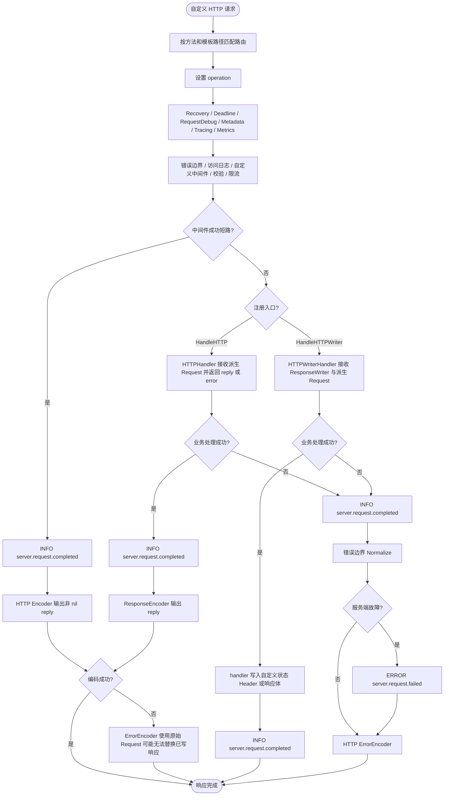
```mermaid
flowchart TD
    A([自定义 HTTP 请求]) --> B[按方法和模板路径匹配路由]
    B --> C[设置 operation]
    C --> D[Recovery / Deadline / RequestDebug / Metadata / Tracing / Metrics]
    D --> E[错误边界 / 访问日志 / 自定义中间件 / 校验 / 限流]
    E --> P{中间件成功短路?}
    P -- 是 --> Q[INFO server.request.completed]
    Q --> R[HTTP Encoder 输出非 nil reply]
    R --> Z{编码成功?}
    Z -- 是 --> J
    Z -- 否 --> Y[ErrorEncoder 使用原始 Request 可能无法替换已写响应]
    Y --> J
    P -- 否 --> F{注册入口?}
    F -- HandleHTTP --> G[HTTPHandler 接收派生 Request 并返回 reply 或 error]
    G --> H{业务处理成功?}
    H -- 是 --> I[INFO server.request.completed]
    I --> S[ResponseEncoder 输出 reply]
    S --> Z
    F -- HandleHTTPWriter --> T[HTTPWriterHandler 接收 ResponseWriter 与派生 Request]
    T --> U{业务处理成功?}
    U -- 是 --> V[handler 写入自定义状态 Header 或响应体]
    V --> W[INFO server.request.completed]
    W --> J([响应完成])
    H -- 否 --> K[INFO server.request.completed]
    U -- 否 --> K
    K --> L[错误边界 Normalize]
    L --> O{服务端故障?}
    O -- 是 --> M[ERROR server.request.failed]
    O -- 否 --> N[HTTP ErrorEncoder]
    M --> N
    N --> J
```

WebSocket 默认对**传输载荷和解压后消息**分别施加 **1 MiB** 上限；旧的 `HTTP().WebSocket(...)` 注册入口也采用此默认值。上限针对整条消息，分片不能绕过；开启消息压缩时，两种大小都须满足上限，所以接近边界的不可压缩数据需要为压缩格式开销留余量。它不是连接数或进程总内存上限，也不是读取超时。

通过 Spec 的端点配置覆盖（`spec` 为已创建的 `*server.Spec`，`handler` 实现至少一种 WebSocket 事件接口）：

```go
spec.HTTP().WebSocketWithConfig("/ws", handler, server.WebSocketConfig{
    MaxMessageBytes:      4 << 20,
    MaxInFlightMessages: 4,
    Upgrader:             server.Upgrader{EnableCompression: true},
})
```

`MaxMessageBytes=0` 使用默认值，`-1` 显式恢复不限制消息大小的旧行为，小于 `-1` 在 Spec 校验时拒绝。这是端点构造期配置，不来自 YAML，也不热更新。超限数据不会交给 `OnMessage`；框架尝试发送 1009 关闭帧，记录 `WARN event=server.websocket.message.rejected, reason=size_limit`，将包含 `websocket.ErrReadLimit` 的错误交给已提供的 `OnError`，随后按原有关闭路径执行 `OnClose`。网络已失效时不保证对端收到关闭帧。大文件建议通过上传接口或应用层分片传输。

`MaxInFlightMessages=0` 使用默认值 **1**，因此旧注册入口和未显式配置的端点仍按接收顺序串行执行 `OnMessage`；负数在 Spec 校验时拒绝。大于 1 时，同一连接最多并发执行对应数量的消息处理任务，不同连接仍各自独立。达到上限后读循环暂停读取，依靠 TCP/WebSocket 背压限制继续进入进程的消息，不额外维护无界业务队列。并行模式只保证消息按线路顺序读取，不保证 `OnMessage` 完成或响应写入顺序；handler、其共享依赖及连接级业务状态必须支持并发访问，需要严格顺序的协议应保持默认值 1。框架继续用连接写锁串行写帧，但锁获取顺序不等于消息接收顺序。

连接结束会先取消 `WebSocketConn.Request().Context()` 并关闭底层连接，再等待已经进入 `OnMessage` 的任务退出，最后调用 `OnClose`。业务回调必须监听连接 Context 或具有自己的有限超时；若回调永久阻塞，框架无法强制终止 goroutine，停机预算到期后虽然会强制关闭 socket 并返回错误，但该连接的 `OnClose` 和 hub 移除仍要等回调实际结束。

WebSocket 的 `OnHandshake` 接收中间件派生的上下文，包含身份、metadata 和握手截止时间。升级成功后，`WebSocketConn.Request().Context()` 保留这些上下文值，同时脱离 HTTP 握手请求的取消和截止时间；连接关闭时取消。`OnConnect`、`OnMessage`、`OnError` 和 `OnClose` 均可通过 `Request()` 读取这些值。正常关闭及停机强制中断会先取消连接上下文，读循环退出时的 `OnClose` 看到已取消状态。应用如需连接最大存活时间，应自行按业务策略调用 `Close()`。

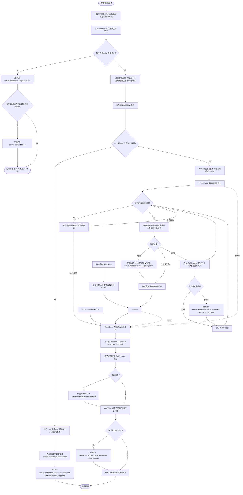
```mermaid
flowchart TD
    A([HTTP 升级请求]) --> B[中间件派生身份 metadata 和握手截止时间]
    B --> C[OnHandshake 使用派生上下文]
    C --> D{握手与 Gorilla 升级成功?}
    D -- 否 --> E[DEBUG server.websocket.upgrade.failed]
    E --> EF{请求错误边界判定为服务端故障?}
    EF -- 是 --> EG[ERROR server.request.failed]
    EF -- 否 --> F([返回请求错误 释放握手上下文])
    EG --> F
    D -- 是 --> Z[设置接收上限 保留上下文值 创建独立连接取消函数]
    Z --> G[准备连接与事件处理器]
    G --> V{hub 锁内检查 是否已停机?}
    V -- 是 --> W[释放 hub 锁 Close 取消上下文并关闭连接]
    W --> X[关闭失败时 ERROR server.websocket.close.failed]
    X --> Y[DEBUG server.websocket.connection.rejected reason=server_stopping]
    Y --> S
    V -- 否 --> H[hub 锁内登记连接 释放锁后启动读循环]
    H --> I[OnConnect 使用连接上下文]
    I --> AD{有可用消息处理槽?}
    I -. panic .-> L
    AD -- 否 --> AE[暂停读取 等待槽位或连接取消]
    AE -- 槽位释放 --> AD
    AE -- 连接取消 --> L
    AD -- 是 --> AA[占用槽位并按传输及解压后上限读取一条消息]
    AA --> J{读取结果?}
    J -- 超限 --> AB[尝试发送 1009 并记录 WARN server.websocket.message.rejected]
    AB --> AJ[释放本次读取占用的槽位]
    J -- 其他读失败 --> AJ
    AJ --> K[OnError]
    J -- 成功 --> AC[启动 OnMessage 并发任务 使用连接上下文]
    AC --> AD
    AC --> AF{任务执行结果?}
    AF -- 完成 --> AG[释放消息处理槽]
    AF -- panic --> AH[ERROR server.websocket.panic.recovered stage=on_message]
    AH --> AG
    AG --> AD
    K --> L[closeOnce 内取消连接上下文]
    K -. panic .-> L
    M[并发 Close 或停机关闭] --> L
    L --> N[写锁内发送可选关闭帧并关闭 socket 释放写锁]
    N --> AI[等待所有在途 OnMessage 退出]
    AI --> O{关闭错误?}
    O -- 是 --> P[读循环 ERROR server.websocket.close.failed]
    O -- 否 --> Q[OnClose 读取已取消的连接上下文]
    P --> Q
    Q --> AP{清理后仍有 panic?}
    AP -- 是 --> AQ[ERROR server.websocket.panic.recovered stage=resolve]
    AP -- 否 --> R[hub 锁内移除连接 释放锁]
    AQ --> R
    R --> S([连接结束])
    T[停机超时 强制 abort] --> U[取消连接上下文并直接关闭 socket]
    U --> K
```

WebSocket 读失败会结束该连接；写失败后也会关闭已不可复用的连接，使阻塞的读循环退出并执行既有 OnClose 与 hub 清理。关闭发生在释放写锁之后，不会自锁。其他连接与服务监听继续运行，重新连接由客户端发起。

服务停机时会并发关闭已有 WebSocket 连接，共享调用方传入的总时间预算。预算耗尽后直接关闭底层 socket，以打断仍在进行的读写；读循环随后仍按原有路径执行一次 OnClose 和 hub 清理。

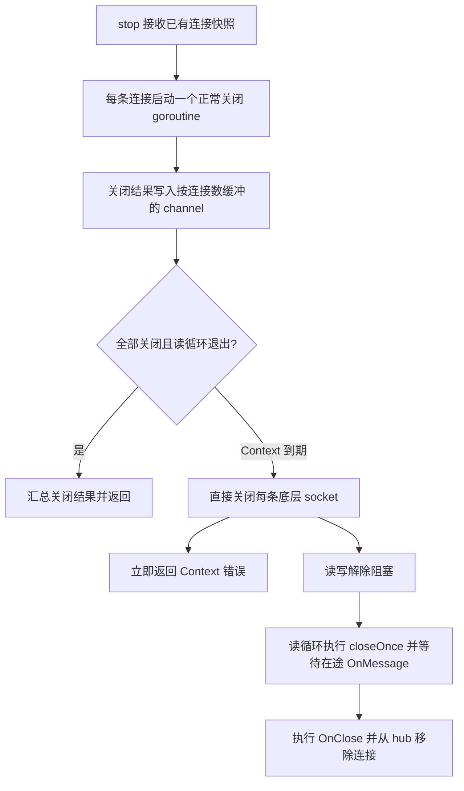
```mermaid
flowchart TD
    A[stop 接收已有连接快照] --> B[每条连接启动一个正常关闭 goroutine]
    B --> C[关闭结果写入按连接数缓冲的 channel]
    C --> D{全部关闭且读循环退出?}
    D -->|是| E[汇总关闭结果并返回]
    D -->|Context 到期| F[直接关闭每条底层 socket]
    F --> G[立即返回 Context 错误]
    F --> H[读写解除阻塞]
    H --> I[读循环执行 closeOnce 并等待在途 OnMessage]
    I --> J[执行 OnClose 并从 hub 移除连接]
```

框架可以用底层连接关闭打断网络读写，但不能强制终止业务实现的 `OnConnect`、`OnMessage`、`OnError` 或 `OnClose`；这些回调必须自行及时返回。并行端点的在途 `OnMessage` 会观察到连接 Context 取消，全部退出后才执行 `OnClose`。缓冲结果 channel 保证停机超时返回后，已启动的关闭 goroutine 不会因上报结果再次阻塞。

## 截止时间

`server.deadline.fallback_timeout` 缺失时默认 **10s**，未配置 `deadline` 也采用该默认值。只有父 Context 没有截止时间时才使用 fallback；显式 `fallback_timeout: 0s` 关闭回退超时。`max_timeout` 大于零时始终参与计算，并取更早的截止时间，因此关闭 fallback 后仍可能被父 Context 或 `max_timeout` 限制。`max_timeout` 与 `min_budget` 默认 0s，不启用对应限制。

精确 `path` 在配置更新时建立 map，`prefix` 建立按字节匹配的压缩前缀树；查询树的成本取决于 operation 长度，不再逐条扫描全部前缀。两种索引与默认值作为同一个只读快照原子发布，更新校验失败不替换旧快照，读侧不增加锁。空 operation 保留历史行为：存在前缀规则时选择配置顺序中的首条，否则使用全局策略。

非空 operation 按精确 `path`、最长 `prefix`、全局配置的顺序匹配；路由缺失的字段继承全局值，显式 `0s` 关闭对应限制。热更新删除全局 fallback 显式值后恢复默认 10s。`min_budget` 不能超过任何已启用的 fallback 或 max 超时，因此未指定 fallback 时也会按默认 10s 校验。

下图同时适用于服务端处理与客户端调用。HTTP 服务端会先将有效的 `x-request-timeout-ms` 请求头转换为上游截止时间，客户端则将最终剩余预算传播到请求头；gRPC 使用 Context 传播预算。

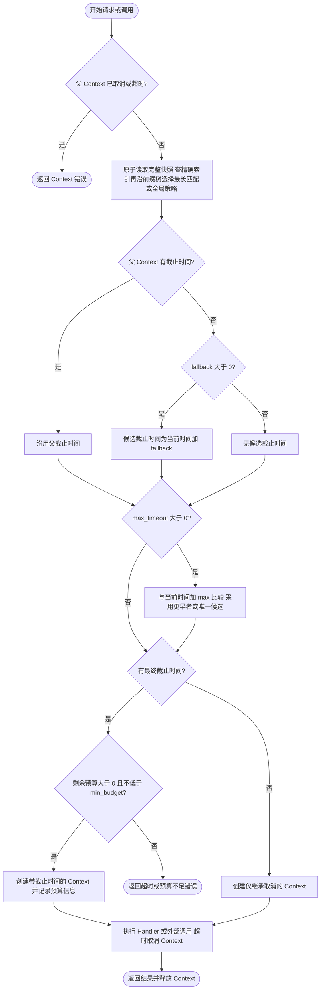
```mermaid
flowchart TD
    A([开始请求或调用]) --> B{父 Context 已取消或超时?}
    B -- 是 --> E([返回 Context 错误])
    B -- 否 --> C[原子读取完整快照 查精确索引再沿前缀树选择最长匹配或全局策略]
    C --> D{父 Context 有截止时间?}
    D -- 是 --> F[沿用父截止时间]
    D -- 否 --> G{fallback 大于 0?}
    G -- 是 --> H[候选截止时间为当前时间加 fallback]
    G -- 否 --> I[无候选截止时间]
    F --> J{max_timeout 大于 0?}
    H --> J
    I --> J
    J -- 是 --> K[与当前时间加 max 比较 采用更早者或唯一候选]
    J -- 否 --> L{有最终截止时间?}
    K --> L
    L -- 否 --> M[创建仅继承取消的 Context]
    L -- 是 --> N{剩余预算大于 0 且不低于 min_budget?}
    N -- 否 --> O([返回超时或预算不足错误])
    N -- 是 --> P[创建带截止时间的 Context 并记录预算信息]
    P --> Q[执行 Handler 或外部调用 超时取消 Context]
    M --> Q
    Q --> R([返回结果并释放 Context])
```

## 默认健康检查

未指定独立地址时，启用业务 HTTP 默认提供 `GET/HEAD /healthz` 和 `GET/HEAD /readyz`。成功返回 200，未就绪返回
503，其他方法返回 405；不返回内部错误或依赖地址。它们是独立于业务 `PathPrefix` 的保留路径，
优先于业务路由、Filter、鉴权和限流。不要在这些路径注册业务接口；需要复用路径时先关闭健康检查。
同一监听上的健康路径不能与 metrics 路径相同。

`bootstrap.NewServerBootstrap` 自动绑定 `app.Spec.Ready`：Kratos 进入 AfterStart 且 Foundation 的 AfterStart hook 全部成功才就绪，收到停机
请求立即不就绪，不等待 `stop_delay`。直接使用 Runtime 时，必须在启动前调用
`runtime.SetReadinessSource(readyFunc)`；未绑定时 `/readyz` 保持 503。Runtime.Stop 或 Wire cleanup
也会关闭就绪状态。`/healthz` 仅证明 HTTP 处理路径仍能响应，不代表所有后台任务正常。

```go
// 前置条件：spec 来自 bootstrap.NewSpec 或 server.NewSpec，sqlDB 由业务存储层提供。
spec.Health().Checks(server.ReadinessCheck{Name: "database", Check: sqlDB.PingContext})
```

省略部署配置时使用默认路径和一秒总检查期限；`server.http.health.disable: true` 关闭端点。Checks 按顺序
执行，只注册接收业务流量必需的依赖。检查函数必须支持 Context、可并发调用、无写入副作用；
超时通知不能强杀不合作的检查函数，框架不另起可能泄漏的 goroutine 包装检查。
配置在组装后固定；不得并发修改 Spec 或 SetReadinessSource。普通探针不逐次记录日志，readiness
HTTP 状态变化记录 `event=server.readiness.changed`：恢复为 INFO，实际依赖失败或探针超时为 WARN，初始化未就绪、主动停机摘流及探针正常取消为 DEBUG。日志绑定探针 Context，并包含 `transport=http`、就绪路径、状态、`reason` 和实际失败检查名，不输出依赖错误原文；应用状态变化不会归因于成功的依赖检查。该服务状态事件使用进程日志绑定，多个监听共享同一份状态。连续 503 即使原因变化也不重复记录，事件用于状态变化诊断，不替代探针状态或逐依赖指标。

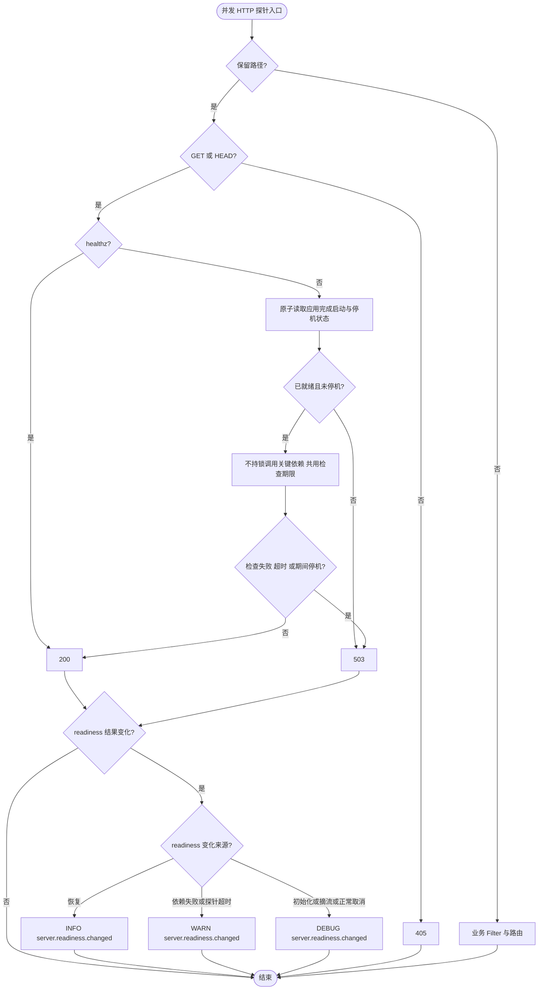
```mermaid
flowchart TD
    A([并发 HTTP 探针入口]) --> B{保留路径?}
    B -- 否 --> C[业务 Filter 与路由]
    B -- 是 --> D{GET 或 HEAD?}
    D -- 否 --> E[405]
    D -- 是 --> F{healthz?}
    F -- 是 --> G[200]
    F -- 否 --> H[原子读取应用完成启动与停机状态]
    H --> I{已就绪且未停机?}
    I -- 否 --> J[503]
    I -- 是 --> K[不持锁调用关键依赖 共用检查期限]
    K --> L{检查失败 超时 或期间停机?}
    L -- 是 --> J
    L -- 否 --> G
    G --> M{readiness 结果变化?}
    J --> M
    M -- 是 --> N{readiness 变化来源?}
    N -- 恢复 --> NP[INFO server.readiness.changed]
    N -- 依赖失败或探针超时 --> NW[WARN server.readiness.changed]
    N -- 初始化或摘流或正常取消 --> ND[DEBUG server.readiness.changed]
    M -- 否 --> O([结束])
    NP --> O
    NW --> O
    ND --> O
    E --> O
    C --> O
```

## 监控端点监听地址

监听位置统一由 `server.http` 管理：metrics 领域负责指标数据，app 提供就绪状态，server 负责将
HTTP 处理器挂载到具体地址。`server.http.metrics` 保持现有配置位置，健康检查配置为
`server.http.health`。这些配置需要重启，不属于热更新字段。

```yaml
server:
  http:
    addr: "0.0.0.0:8000"
    metrics:
      disable: false
      path: /metrics
      addr: "127.0.0.1:9001"
    health:
      disable: false
      addr: "127.0.0.1:9001"
      liveness_path: /healthz
      readiness_path: /readyz
      timeout: 1s
```

该示例启动业务端口 8000 和一个管理端口 9001；9001 同时提供 metrics 和健康检查，8000 不再
重复提供它们。省略两个管理 addr 时，三个端点默认都挂载到业务 HTTP。

| 地址与开关 | 行为 |
| --- | --- |
| addr 为空 | 复用业务 HTTP；业务 HTTP 禁用时该端点不启动 |
| addr 与启用的 server.http.addr 相同 | 复用业务监听，不重复绑定 |
| addr 与业务地址不同 | 只在新增监听上提供对应监控端点 |
| metrics.addr 与 health.addr 相同 | 两个端点共享一个新增监听 |
| 两个管理地址不同 | 分别监听，可同时存在三个 HTTP 监听 |
| 业务 HTTP 禁用，但管理 addr 显式指定 | 独立管理监听仍启用，包括地址与原业务配置相同的情况 |
| 某个端点 disable=true | 不挂载该端点，也不会仅为该端点创建监听 |

地址使用 `host:port`，IPv6 使用 `[::1]:9001`，不接受 URL 或服务名端口。比较会规范化数字端口、
IP 表示及 `0.0.0.0`/空 host；不通过 DNS 推断 localhost 与 IP 等价，也不猜测 IPv4/IPv6 的系统
绑定重叠。不同地址因通配绑定或端口占用发生冲突时，启动失败并触发应用统一停止。复用依据是
`server.http.addr` 配置；原生 `HTTP.Option(http.Address(...))` 不再改写监听地址。使用自定义 Listener 时，配置中的业务地址仍用于监控复用规划，须与实际地址保持一致。

端点路径均相对于所选监听的根路径，独立于业务 PathPrefix、Filter 和鉴权。独立监听不继承业务
路由、WebSocket、业务原生 Option 或全局 DefaultServeMux，默认使用普通 HTTP；TLS/mTLS 由平台网关或 Service Mesh 终止，必须通过绑定地址和网络策略把业务及管理监听限制在受信任网络，禁止直接暴露到不可信网络。业务 HTTP 自定义监听通过 `HTTPBuilder.Listener` 声明，TLS 仍可通过原生 Option 注入；gRPC 原生 Listener/TLS 扩展保持现有契约。不能据此推断独立管理监听也获得相同 TLS，也不属于默认平台责任边界。
同一监听上的 metrics 和健康路径不能冲突，不同监听可以使用相同路径。

`Health().Checks(...)` 只追加检查函数，不改变文件配置的地址、路径和 disable。
声明时复制检查切片，运行时再次保存独立切片快照；函数及其捕获的依赖仍由业务持有，必须支持并发探针和 Context 取消。
HTTPBuilder 不再提供 Health/HealthChecks，HealthConfig 不再作为公共 API 暴露，部署参数统一由配置管理。

`NewServerBootstrap` 自动登记全部监听。手工组装保留 `Runtime.Servers()` 的业务 HTTP/gRPC
返回值，并额外登记 `Runtime.ManagementServers()` 中的运行时。管理运行时不实现 Endpointer，
避免管理地址进入业务服务发现；不能将它们当作业务服务地址发布。监听在 Start 时创建，错误通过
现有 App 运行时传播；Stop 先撤销就绪，再按现有停机策略释放监听，构造期不打开 socket。

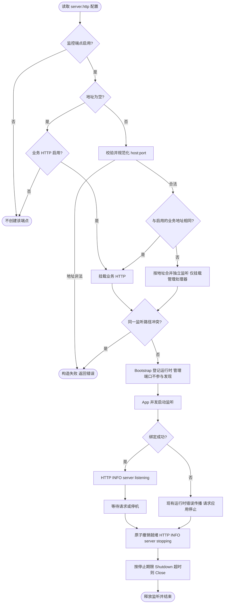
```mermaid
flowchart TD
    A([读取 server.http 配置]) --> B{监控端点启用?}
    B -- 否 --> Z([不创建该端点])
    B -- 是 --> C{地址为空?}
    C -- 是 --> D{业务 HTTP 启用?}
    D -- 否 --> Z
    D -- 是 --> E[挂载业务 HTTP]
    C -- 否 --> F[校验并规范化 host:port]
    F -- 地址非法 --> J
    F -- 合法 --> G{与启用的业务地址相同?}
    G -- 是 --> E
    G -- 否 --> H[按地址合并独立监听 仅挂载管理处理器]
    E --> I{同一监听路径冲突?}
    H --> I
    I -- 是 --> J([构造失败 返回错误])
    I -- 否 --> K[Bootstrap 登记运行时 管理端口不参与发现]
    K --> L[App 并发启动监听]
    L --> M{绑定成功?}
    M -- 否 --> N[现有运行时错误传播 请求应用停止]
    M -- 是 --> O[HTTP INFO server listening]
    O --> P[等待请求或停机]
    P --> Q[原子撤销就绪 HTTP INFO server stopping]
    N --> Q
    Q --> R[按停止期限 Shutdown 超时则 Close]
    R --> S([释放监听并结束])
```

中间件配置订阅在下一轮成功扫描异步回放当前值，内容相同的回放或重复通知不会打印 `server middleware config updated`；
只有配置实际变化且成功应用后才记录 `INFO event=server.middleware.updated`；非法更新记录 `WARN event=server.middleware.update.rejected, config_key=server, error` 并保留旧配置。

## 集成测试与边界用法

参见[核心组件集成用例](../INTEGRATION_TESTS.md#扩展模块与常见边界)。根目录 `make test-components` 运行自包含组合；`make test-components-external` 创建隔离 Docker 服务，验证真实 Kafka、Redis 和锁等功能。具体场景、所有权及适用边界见用例说明。


## 请求错误边界与安全日志

默认 HTTP/gRPC unary 链在 metrics 后、可选访问日志前安装常驻 `errors` 中间件。它调用 `errors.Normalize`：旧结构化错误保留原始 HTTP 状态和业务码，普通未知错误公开返回安全 500；基础设施错误链中的本地取消/超时按 499/504 处理，明确 4xx 仍保留外层语义。

`ERROR event=server.request.failed` 对服务端故障记录一次带请求 context 的诊断；`server.logging.disable=true` 只关闭访问摘要，不关闭该故障日志。传输上下文存在时，故障日志保留 `transport`、`endpoint`、`operation`，并始终记录 `code`、`reason` 和紧凑 `error`，完整 `error.detail` 使用 `log.DebugOnly`。服务端与客户端访问摘要分别使用稳定的 `INFO event=server.request.completed` 与 `event=client.request.completed`，字段为 kind/operation/code/reason/latency，不读取请求/响应正文，不输出 cause/stack，只记录操作、状态和耗时；deadline 诊断仅在请求 debug 中展开。业务层应保留错误链，避免重复记录后再返回。SQL 或其他依赖日志仍由各自配置控制。

最外层 `ERROR event=server.request.panic.recovered` 始终记录 panic 类型，堆栈通过 `log.DebugOnly` 仅在请求 debug 中展开；服务间错误诊断仍保存堆栈，不记录原始 panic 值或请求正文。panic 不会再进入内层故障出口，避免重复记录。状态码、业务码、cause 和传输过滤的兼容边界见 [errors](../errors/README.md)。

业务通过 Spec 同名替换 `errors` 或 `recovery` 中间件时，应自行承担等价保护。本说明针对默认 HTTP/gRPC unary 请求链。WebSocket 升级错误在本层只记录 `DEBUG event=server.websocket.upgrade.failed`，仍返回给请求错误边界按现有规则处理；普通未分类的握手错误可能被归为 500，业务拒绝应返回明确的结构化 4xx。WebSocket 读循环及异步消息 panic 由连接边界记录一次 `ERROR event=server.websocket.panic.recovered`，包含连接 Context、`transport=websocket`、`path`、`stage` 和 `panic_type`，不记录原始 panic 值或消息正文；纯堆栈仍仅在连接 Context 启用 debug 时展开。正常断开与停机拒绝不额外告警；超限消息为 Warn，框架无法向调用方返回的关闭失败为 Error。业务回调返回/消费的错误仍由业务处理。

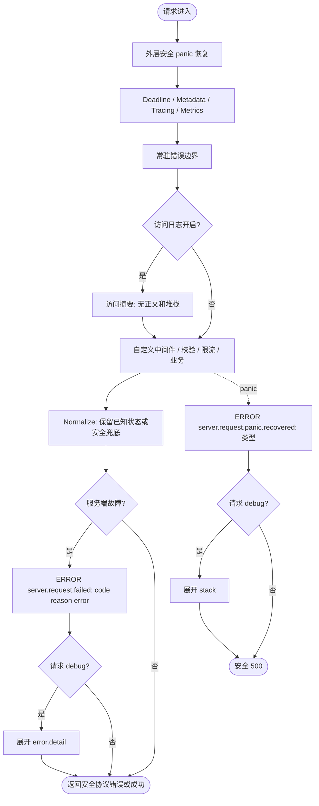
```mermaid
flowchart TD
    A([请求进入]) --> B[外层安全 panic 恢复]
    B --> C[Deadline / Metadata / Tracing / Metrics]
    C --> D[常驻错误边界]
    D --> E{访问日志开启?}
    E -- 是 --> F[访问摘要: 无正文和堆栈]
    E -- 否 --> G[自定义中间件 / 校验 / 限流 / 业务]
    F --> G
    G --> H[Normalize: 保留已知状态或安全兜底]
    H --> I{服务端故障?}
    I -- 是 --> J[ERROR server.request.failed: code reason error]
    I -- 否 --> K([返回安全协议错误或成功])
    J --> N{请求 debug?}
    N -- 是 --> O[展开 error.detail]
    N -- 否 --> K
    O --> K
    G -. panic .-> L[ERROR server.request.panic.recovered: 类型]
    L --> P{请求 debug?}
    P -- 是 --> Q[展开 stack]
    P -- 否 --> M
    Q --> M
    M([安全 500])
```

Kratos `grpc.Middleware` 只应用于 unary 调用；本包额外在 gRPC 流建立时恢复 `request_debug`，没有将整条 unary 中间件链扩展到流。通过 `GRPC().Option(grpc.StreamInterceptor(...))` 登记的业务 stream interceptor 须自行提供需要的鉴权、panic 恢复、截止时间及观测边界。

服务端与客户端指标使用归一化后的 HTTP 状态计数，保留 422 等非标准 gRPC 映射的状态；指标观察不改变业务调用方收到的原始错误。

## 请求 debug

`server.request_debug.accept_incoming` 默认 true；可显式设为 false 关闭接收。默认请求链的 `request_debug` 优先级为 250，位于 deadline（200）与 metadata（300）之间，在访问日志前恢复 `request.WithDebug` 状态。关闭通用 metadata 不影响它。gRPC 流在建立时恢复标记，之后配置更新不改变已建立流的 Context。

该配置随 `server` 请求策略热更新，复用现有动态策略；监听地址等需重启字段变化不会重建中间件。非法更新保留旧配置。`propagate` 字段仅客户端消费。传输协议、信任边界和流程见 [request](../request/README.md)。
