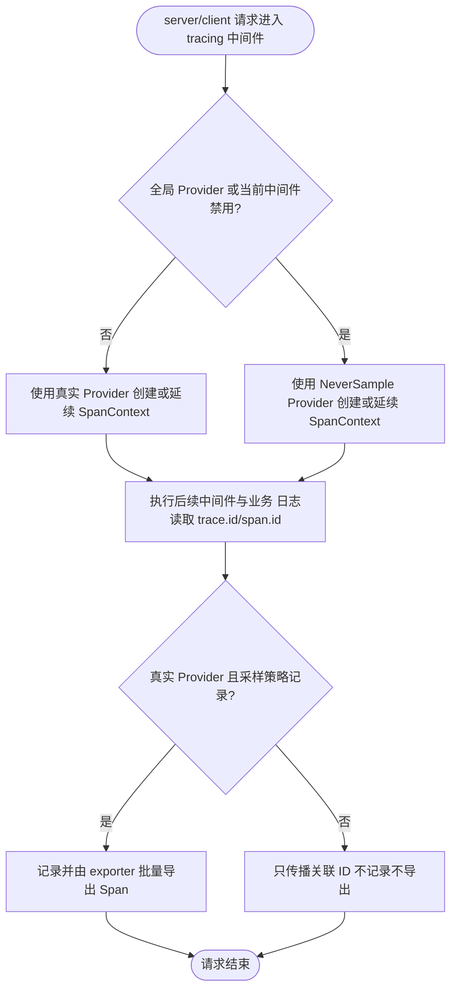
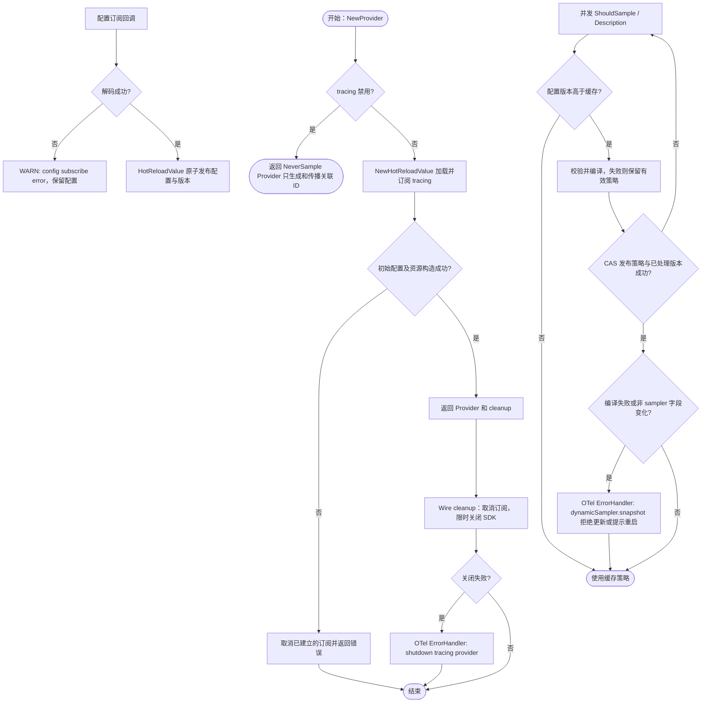

# Tracing

`tracing` 统一组装应用私有的 OpenTelemetry `TracerProvider`，并为框架组件和业务代码提供独立的 instrumentation scope。

## 默认业务 Tracer

`NewTracing` 使用 `appinfo.Name()` 作为 scope name，返回可注入业务层的默认 `Tracing`：

```go
var ProviderSet = wire.NewSet(
	tracing.NewProvider,
	tracing.NewTracing,
)
```

业务服务可以直接创建自定义 Span：

```go
type Service struct {
	tracer tracing.Tracing
}

func NewService(tracer tracing.Tracing) *Service {
	return &Service{tracer: tracer}
}

func (s *Service) CreateOrder(ctx context.Context) error {
	ctx, span := s.tracer.Start(ctx, "order.create")
	defer span.End()

	return createOrder(ctx)
}
```

需要统一记录回调错误和关闭 Span 时，可以使用 `Trace`：

```go
func (s *Service) CreateOrder(ctx context.Context) error {
	return tracing.Trace(ctx, s.tracer, "order.create", func(ctx context.Context, span trace.Span) error {
		span.SetAttributes(attribute.String("order.channel", "api"))
		return createOrder(ctx)
	})
}
```

`tracing.disable` 显式配置优先；省略时 local 环境默认禁用，其他环境默认启用。环境取值见 [env](../env/README.md)。显式禁用示例：

```yaml
tracing:
  disable: true
```

`NewProvider` 读取到禁用配置后会返回内部 `NeverSample` Provider。它不记录、不采样、不导出 Span，也不创建 exporter 或后台批处理资源，但仍生成有效的 TraceID/SpanID；`NewTracing` 和业务代码无需增加分支。server/client 的 tracing 中间件开关关闭时采用同样的仅关联模式，因此请求日志中的 `trace.id`、`span.id` 仍可用，跨服务调用也会继续传播上下文。关闭开关不是隐私边界：若不希望向下游发送 trace 上下文，需要在传输边界另行配置传播策略。

启用并连接 OTLP HTTP 接收端的最小配置如下；接收端需要由部署环境另行提供：

```yaml
tracing:
  disable: false
  exporter:
    endpoint_url: "http://localhost:4318/v1/traces"
  sampler:
    sample: RATIO
    ratio: 0.05
```

默认导出地址为上述 localhost 地址，导出超时为 10s，不压缩；默认启用导出重试，初始间隔 5s、最大间隔 30s、最大累计重试时间 1m。默认根 trace 采样策略为 `RATIO`、比例 0.05。`RATIO`（比例范围 `[0,1]`）、`ALWAYS`、`NEVER` 都优先继承有效父 Span 的采样决定，只对根 trace 使用所选策略；`ALWAYS` 不会覆盖上游未采样决定。`disable` 和 exporter 配置修改需重启，启动时禁用的 Provider 不订阅更新。

## 组件 Tracer

框架或可复用组件不应使用默认业务 scope。组件应通过 `Provider.Tracer` 使用稳定的完整包路径：

```go
tracer := provider.Tracer(
	"github.com/example/component",
	trace.WithInstrumentationVersion("v1.2.3"),
)
```

`service.name`、`service.version` 和 `service.instance.id` 由 Provider 作为 Resource 属性统一设置，不应重复添加到 instrumentation scope。

## 实现边界

业务和 Wire 只需要依赖本包的 `Provider`、`NewProvider`、`Tracing`、`NewTracing` 与 `Trace`，并负责调用 `NewProvider` 返回的幂等 cleanup。公共契约和业务 Span 辅助函数位于 `tracing.go`；`provider.go` 管理 OpenTelemetry SDK Resource、实例和关闭状态；`config.go`、`sampler.go` 分别负责配置和动态采样，导出器构造也位于 `provider.go`。实现与契约位于同包，具体 Provider、Sampler 类型和组装辅助函数不导出。构造、生命周期和热更新测试随实现放在同一包内。

组装期调用 `bootstrap.NewTracingBootstrap()` 会同步通过 `log.RegisterFields` 加入进程共享的 Kratos TraceID 和 SpanID 的动态字段，键固定为 `trace.id` 和 `span.id`。启用或关闭 tracing 都从当前请求 SpanContext 读取；请求外没有有效上下文时字段为空，并由日志 `filter_empty` 规则处理：

```go
contribution, err := bootstrap.NewTracingBootstrap()
```

它不创建 Runtime 或资源，也不返回 cleanup；TracerProvider 的 cleanup 仍由 `NewProvider` 的调用方/Wire 持有。



## 动态采样配置

启用追踪时，`NewProvider` 使用 `config.HotReloadValue[config_pb.Tracing]` 订阅整个 `tracing` 段。`ShouldSample` 和 `Description` 读取当前版本，仅在版本变化时编译 OTel 采样策略；无需重建 Provider 或 exporter。

无效配置保留上一份有效策略。同一个已处理的无效版本只向 OTel ErrorHandler 报告一次；订阅解码错误由 `HotReloadValue` 记录 WARN 并保留原配置。`disable` 或 exporter 的有效变更仍提示需要重启，只有 sampler 在运行期生效。这些校验与提示在配置更新后的首次采样或描述读取时发生，连续更新可能合并为最新版本。

配置快照由 `HotReloadValue` 原子发布，编译策略通过 CAS 发布；并发读取不会使缓存退回旧版本。CAS 冲突时重新读取当前配置与缓存，不持锁、不在发布边界内调用 exporter。Provider 构造失败会取消已建立的订阅；成功返回的幂等 cleanup 先取消订阅，再限时关闭 SDK Provider。


