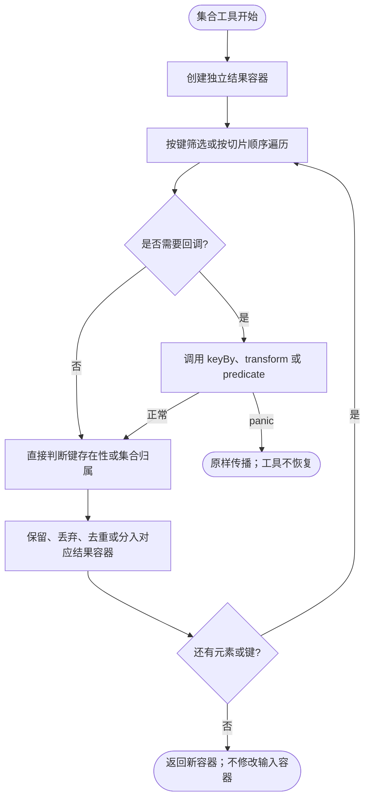
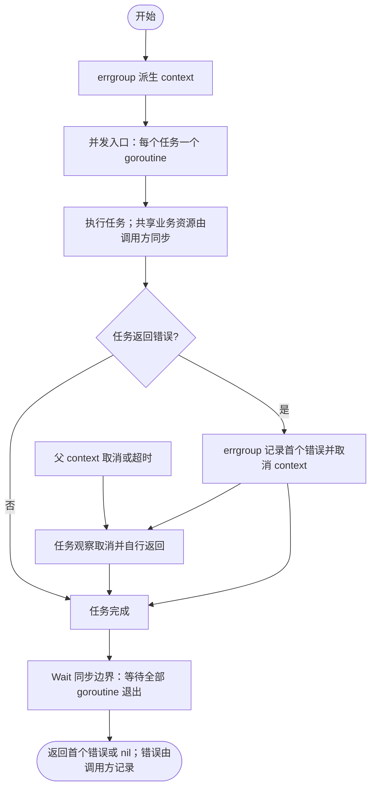
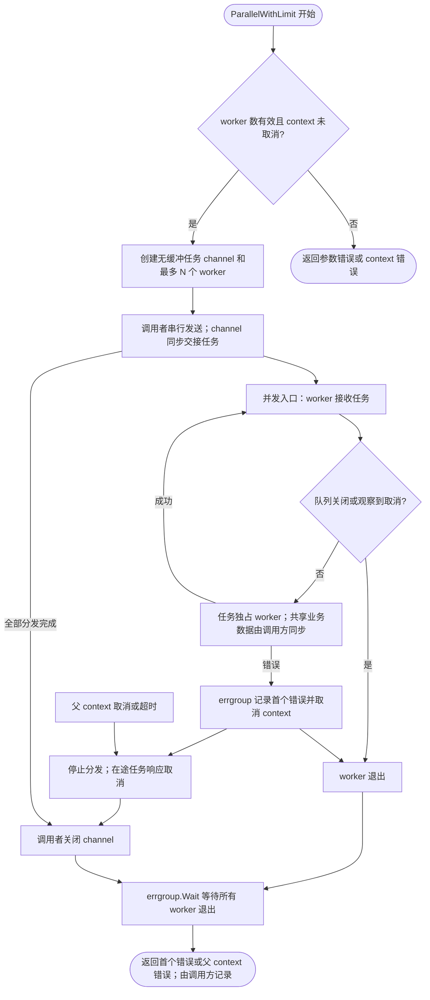
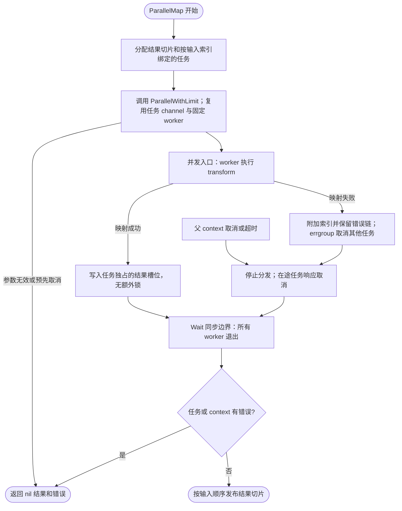

# utils

集合转换与并行任务工具，不拥有连接或全局资源。原迁入工具已按职责拆分：Trace 辅助见 [tracing](../tracing/README.md)，输入校验见 [validation](../validation/README.md)。Gob 与 HTTP 类型辅助已移除，不提供转发兼容层。

## 优先使用 Go 标准库

模块要求 Go 1.25。原 `Max/Min` 已删除：固定参数使用 Go 1.21 起的内置 `max/min`；切片使用 `slices.Max/Min`。内置函数不接受 `values...` 展开；切片版本对空切片 panic。标准库版本会传播 NaN，且有明确的正负零规则，与旧循环比较不完全相同。

| 已标记 Deprecated 的函数 | 替代方案 | 差异 |
| --- | --- | --- |
| `MKeys` / `MValues` | `maps.Keys/Values`；需要切片时用 `slices.Collect` | maps 返回迭代器，Collect 空结果为 nil；旧函数返回非 nil 空切片 |
| `Clone` | `maps.Clone` | 标准库保留 nil；旧函数把 nil 转成非 nil 空 map |
| `Includes` | `slices.Contains` | 相同查找语义 |
| `Find` | `slices.IndexFunc` | 相同首个索引和 -1 语义 |

弃用函数暂时保留实现和测试，避免修改原有返回值。Map、GroupBy、Intersect 等没有 Go 1.25 的直接等价函数。
`slices.Compact` 只去除相邻重复项，不能替代保序的 Unique；`slices.DeleteFunc` 与 `maps.DeleteFunc` 原地修改容器，不能直接替代返回新容器的 Filter/MFilter。

标准库参考：[min/max](https://go.dev/ref/spec#Min_and_max)、[maps](https://pkg.go.dev/maps@go1.25.0)、[slices](https://pkg.go.dev/slices@go1.25.0)。

## 集合操作

| API | 行为与边界 |
| --- | --- |
| `Unique` | 去重并保留首次出现顺序 |
| `Map` / `MapTo` / `MapToAny` | 按输入顺序映射、填充值或转换为 any |
| `Filter` / `FilterZero` | 按输入顺序保留匹配项或非零项 |
| `Each` | 按顺序调用回调，返回原切片 |
| `Includes` / `Find` / `FindItem` | 查找值或首个匹配项；未找到分别返回 false、-1、元素零值 |
| `GroupBy` / `GroupItems.ToMap` | 分组按键首次出现排序，组内保留输入顺序；ToMap 与分组共享值切片，分组指针必须非 nil |
| `Pluck` / `KeyBy` | 按回调生成键值映射；重复键由后一个输入元素覆盖 |
| `Intersect` | 按第二个切片的顺序返回去重交集；无交集返回 nil |
| `MKeys` / `MValues` | 返回键或值的新切片，顺序不确定 |
| `MMap` / `MMapTo` / `MMapToAny` | 保留键，映射、填充或转换值 |
| `MFilter` / `MFilterZero` | 返回匹配项或非零项的新 map |
| `MEach` | 遍历各值，返回原 map |
| `MIncludes` / `MFind` | 判断包含或返回任意匹配值的键；未找到时为 false 和键零值 |
| `MKeyBy` | 由值生成新键；重复键的最终值取决于不确定的 map 遍历顺序 |
| `Clone` | 浅复制 map；nil 输入返回非 nil 空 map |
| `MPick` / `MOmit` | 按键保留或排除条目，返回新的浅复制 map；缺失键忽略，存在的零值保留 |
| `UniqueBy` | 按业务键去重，保留第一次出现的元素和输入顺序 |
| `FilterMap` | 单次遍历同时转换和筛选；回调返回映射值与是否保留 |
| `Partition` | 一次遍历返回匹配项与其余项，两个切片各自保序 |
| `Difference` | 返回 a 相对 b 的去重差集，保留 a 中首次出现的顺序 |

除 Each/MEach 外，映射、过滤和 Clone 返回新的容器，但不会深复制元素中的指针、
map 或切片。调用方负责元素所有权及并发同步。切片映射、过滤、Unique 和 map
工具的 nil 输入通常返回已分配的空容器；GroupBy 与 Intersect 的空结果为 nil。
回调须非 nil；这些函数不恢复回调 panic。

### 新增集合工具的边界

新增方法均返回新的容器，nil 输入或无匹配项返回非 nil 空容器。
MPick/MOmit 的重复键无额外影响；不提供键时分别返回空 map 和输入的浅副本。
UniqueBy/FilterMap/Partition 的回调按输入顺序执行，每个元素恰好一次；
UniqueBy 保留同键的第一个元素，FilterMap 的 false 会丢弃该映射结果，包括它的非零值。
Partition 的第一个返回值是匹配项，第二个是其余项。
Difference 将输入当作集合处理，会去重；与旧 Intersect 的 nil 空结果不同，它返回非 nil 空切片。
相等判断沿用 Go 的 comparable 语义，例如 NaN 不与自身相等。

这些方法只复制容器和元素值，不深复制元素引用的对象；不会记录元素或键值日志。



## 并行任务

Parallel 使用 context.Background；ParallelWithContext 接受调用方 context。
这两个原有入口每个任务启动一个 goroutine，没有并发数限制。需要固定 worker 池时使用下文的 ParallelWithLimit。首个非 nil 错误取消派生 context，
Wait 等所有任务返回后才返回该错误。父 context 取消本身不保证函数返回取消错误，
任务需要观察 context 并自行返回错误；没有任务时返回 nil。任务 panic 不恢复。

调用方拥有任务和其数据，必须限制任务数量、为外部调用设置超时，并让任务响应取消。
任务若忽略取消或永久阻塞，整个调用也会阻塞。多个任务写共享数据可能产生竞态、
丢失更新或状态不一致，应由调用方同步，或像测试一样让任务各自独占输出位置。
本包沿用 errgroup 的同步机制，不添加共享业务状态或额外锁，也不自行记录任务错误。




### 单次调用的固定 worker 池

`ParallelWithLimit(ctx, workers, tasks...)` 最多创建 `min(workers, len(tasks))` 个 worker，
每个 worker 顺序复用执行多个任务。workers 必须大于零，任务必须非 nil。
零任务且 context 有效时返回 nil；调用前已取消时不执行任何任务并返回 context 错误。
上限只针对单次调用，不限制其他调用或任务内部另建的 goroutine。

无缓冲 channel 是本次调用内的共享任务队列和同步边界，没有额外排队缓存。
调用者串行发送并独占关闭权，worker 只接收；errgroup 保存首个任务错误并取消派生 context。
首个错误、父 context 取消或超时后停止分发；worker 在调用任务前再次检查取消。
取消与开始执行之间仍有竞态窗口，在途任务必须响应 context 并自行退出。
函数始终等待所有 worker 退出后返回，优先返回 errgroup 记录的首个错误，否则返回父 context 错误。

不引入业务锁，不持锁执行任务；任务共享数据仍由调用方同步。
背压限制任务并发，可能增加批次总耗时；不保证任务开始或完成的顺序及 worker 调度公平性。
任务若等待同一批次中尚未执行的其他任务，可能耗尽 worker 而死锁，应避免此类依赖。
工具层只返回错误，由调用方决定记录位置，不重复记录任务失败日志。

以下完整示例无需外部依赖服务，每个任务独占一个输出元素：

```go
package main

import (
    "context"
    "fmt"

    "github.com/jaggerzhuang1994/kratos-foundation/v2/pkg/utils"
)

func main() {
    results := make([]int, 3)
    tasks := make([]func(context.Context) error, len(results))
    for i := range tasks {
        tasks[i] = func(context.Context) error {
            results[i] = i * 2
            return nil
        }
    }
    if err := utils.ParallelWithLimit(context.Background(), 2, tasks...); err != nil {
        panic(err)
    }
    fmt.Println(results) // [0 2 4]
}
```



仓库根目录运行 `go test -race ./pkg/utils` 可单独验证任务数量上限、取消、首错和等待退出边界。


### 按输入顺序返回并行映射结果

`ParallelMap(ctx, workers, input, transform)` 复用 ParallelWithLimit：
固定 worker 数、首错取消、等待全部任务退出的规则不变。transform 接收派生 context，
返回映射值和错误；结果顺序与 input 一致，不受任务完成顺序影响。

每个任务独占一个输出索引，Wait 完成后才返回整个切片，因此无须对结果写入加锁。
不要在任务执行期间并发修改输入切片或回调共享的引用对象。
成功时返回新切片，空输入返回非 nil 空切片；无效上限、取消或任一映射错误均返回 nil 结果。
映射错误附带输入索引并通过 `%w` 保留错误链，可用 errors.Is/As 判断原始原因。
丢弃结果不回滚已完成的外部调用或业务副作用，也不保证能报告所有并发错误。
准备输出和任务列表需要 O(n) 内存，不是流式接口；回调错误交给调用方记录。

以下完整示例展示新集合入口和并行映射：

```go
package main

import (
    "context"
    "fmt"

    "github.com/jaggerzhuang1994/kratos-foundation/v2/pkg/utils"
)

func main() {
    fields := utils.MPick(map[string]int{"count": 0, "total": 3}, "count", "missing")
    fmt.Println(fields) // map[count:0]

    values := utils.UniqueBy([]int{3, 1, 3, 2}, func(v int) int { return v })
    even, odd := utils.Partition(values, func(v int) bool { return v%2 == 0 })
    fmt.Println(even, odd) // [2] [3 1]

    result, err := utils.ParallelMap(context.Background(), 2, values,
        func(ctx context.Context, v int) (int, error) {
            if err := ctx.Err(); err != nil {
                return 0, err
            }
            return v * 10, nil
        })
    if err != nil {
        panic(err)
    }
    fmt.Println(result) // [30 10 20]
}
```


