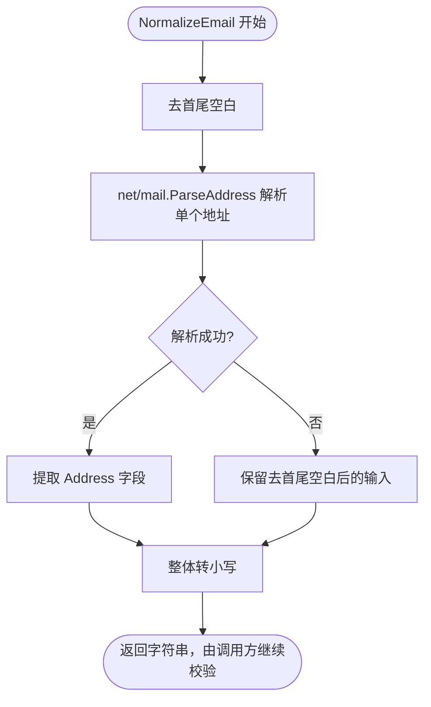
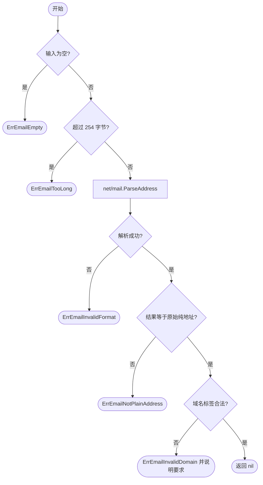
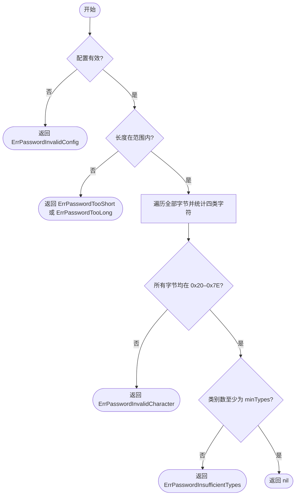
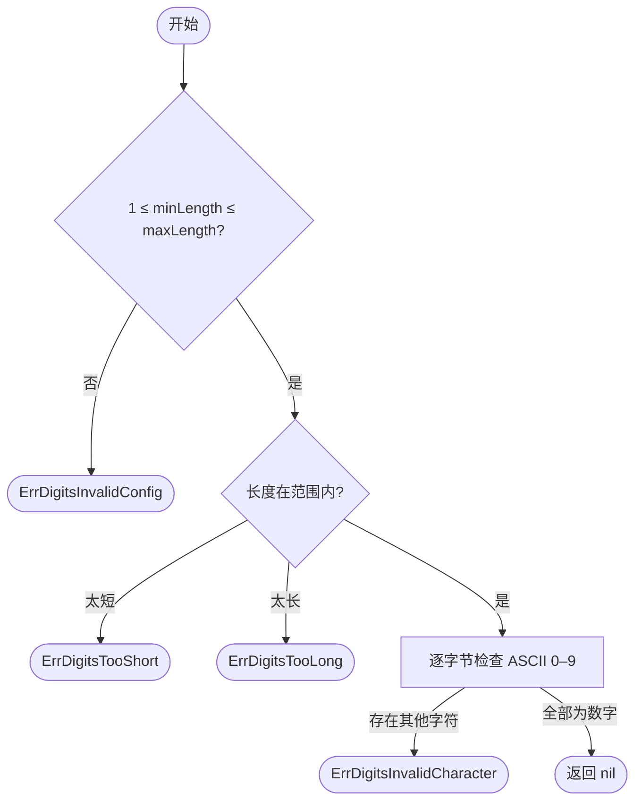
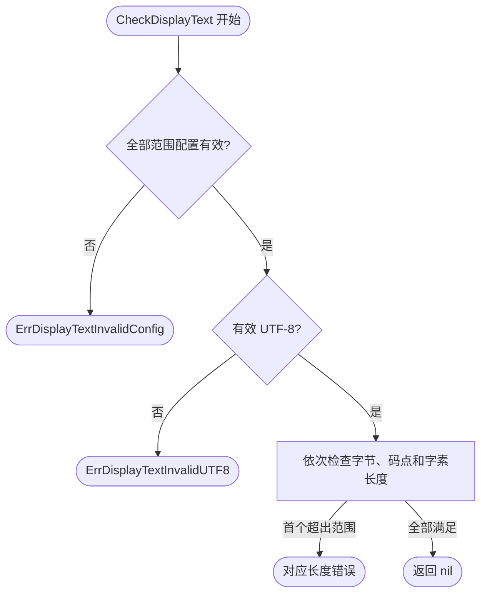
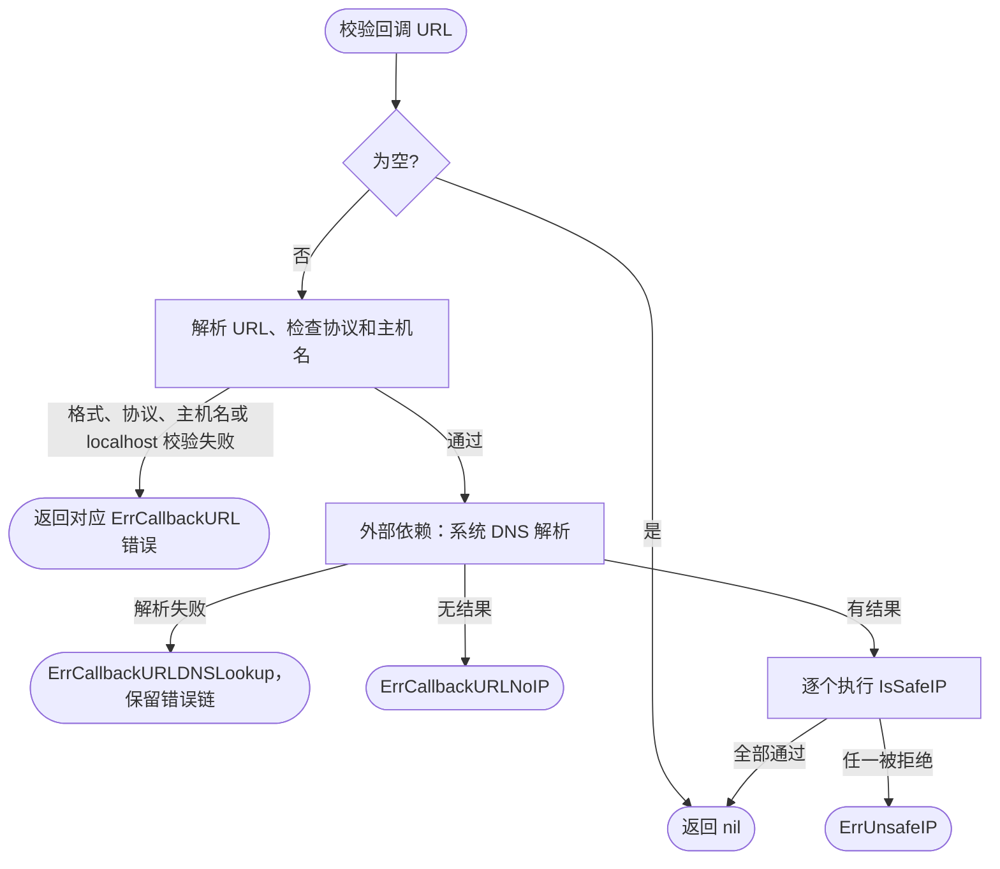

# validation

提供邮箱、纯数字输入、密码与回调地址校验。来源于 Cyberkite utils；纯数字长度由调用方指定，邮箱增加语法、长度与域名检查，其他校验保留迁入的业务规则，不代表适用于所有业务的统一策略。无常驻资源，无需 cleanup。

```go
import "github.com/jaggerzhuang1994/kratos-foundation/v2/pkg/validation"
```

调用示例：

```go
email := validation.NormalizeEmail("Alice <User@Example.COM>")
err := validation.IsValidEmail(email) // nil 表示通过；非 nil 时由调用方处理
```

展示文本通过 [displaytext.Preprocess](displaytext/README.md) 预处理，再由本包 `CheckDisplayText` 检查 UTF-8 与长度。

## 文件组织

所有文件属于 `validation` 包，导入路径统一，测试与实现同名对应。纯数字校验的 API 迁移方式见下文。

| 文件 | 校验对象 |
| --- | --- |
| [email.go](email.go) | 邮箱标准化与格式 |
| [password.go](password.go) | 登录密码与交易密码 |
| [address.go](address.go) | IP 与回调 URL |
| [digits.go](digits.go) | 纯数字及长度范围 |
| [displaytext.go](displaytext.go) | 展示文本 UTF-8 及字节、码点、字素长度检查 |

## 输入校验

| API | 校验规则 |
| --- | --- |
| `NormalizeEmail` | 去首尾空白、提取单个邮件头地址并转小写；解析失败仅去空白和转小写；其余校验方法不会自动调用它 |
| `IsValidEmail` | 纯地址，允许 Unicode 本地部分；net/mail 语法解析、长度与域名标签校验，不验证邮箱存在或域名可达 |
| `IsValidDigits(input, minLength, maxLength)` | 仅 ASCII 数字，长度在闭区间内；允许前导零，不裁剪空白；要求 1 ≤ minLength ≤ maxLength，成功返回 nil，失败返回可识别错误 |
| `IsValidPassword(password, minLength, maxLength, minTypes)` | 仅 ASCII 0x20–0x7E，长度在闭区间内；大写、小写、数字、特殊字符各算一类，空格属于特殊字符；成功返回 nil，失败返回具体原因 |
| `CheckDisplayText` | 检查 UTF-8 和可配置的三种长度，不修改输入；失败返回可识别错误 |
| `IsSafeIP` | 拒绝未指定、回环、私网和链路本地地址；调用方须传有效 net.IP，并非完整的公网范围分类 |
| `IsSafeCallbackURL` | 空字符串允许；非空仅允许 HTTP(S)，拒绝无主机名、localhost 和解析结果中的上述 IP |

### 邮箱格式

IsValidEmail 面向常规业务输入，使用标准库 [net/mail.ParseAddress](https://pkg.go.dev/net/mail#ParseAddress)
解析语法，并对地址施加以下限制；它不是完整 RFC 邮箱格式的接受器：

- 本地部分允许 Unicode，字符语法由 net/mail 解析；不裁剪空白；拒绝显示名、尖括号、注释、地址列表及引号包裹的本地部分。
- 地址总长最多 254 字节，超长输入直接拒绝；本地部分（@ 前）不单独限制长度。
- 本地部分允许合法的单引号、加号等 atom 字符，拒绝开头、结尾及连续点。
- 域名允许单段，每段 1–63 字节，只允许 ASCII 字母、数字和连字符，连字符不能位于段首或段尾。
- 不限制域名后缀的长度或要求包含字母，不维护服务商或 TLD 白名单；拒绝方括号包裹的 IP 字面量。
- 接受满足上述标签规则的 ASCII Punycode 形式，不执行 Unicode 域名转换或验证 Punycode 编码本身。

长度边界参考 [RFC 5321](https://www.rfc-editor.org/rfc/rfc5321.html#section-4.5.3.1)；
不支持引号地址属于本包业务策略。此函数不查询 DNS、TLD 名单或邮件服务，
通过校验不等于邮箱存在或大多数服务商都能接收；单段域名、数字域名也可能通过。
Unicode 本地部分的接收取决于邮件链路支持，实际收信能力需通过验证邮件确认。
成功返回 nil；失败按空输入、总长度、语法、纯地址、域名标签的顺序返回首个错误，不包含邮箱原文。
使用 `errors.Is(err, validation.ErrEmailInvalidDomain)` 等识别原因，上层通过 `%w` 包装后仍可识别。

| 错误 | 原因 |
| --- | --- |
| `ErrEmailEmpty` | 输入为空 |
| `ErrEmailTooLong` | 超过 254 字节 |
| `ErrEmailInvalidFormat` | net/mail 语法解析失败 |
| `ErrEmailNotPlainAddress` | 解析成功但含显示名、注释、引号或额外空白等非纯地址内容 |
| `ErrEmailInvalidDomain` | 域名标签长度、字符或连字符位置不合法；错误文本补充具体要求 |

域名中的连续点等语法问题会先返回 ErrEmailInvalidFormat，只有解析成功后才检查域名标签。

与旧正则相比，`o'hara@example.com` 现在通过，
`a..b@example.com`、`a@-example.com` 及超长地址不再通过。
NormalizeEmail 使用 net/mail 提取单个邮件头地址，例如 `Alice <User@Example.COM>`、
`<User@Example.COM>`、`User@Example.COM (Alice)` 均转换为 `user@example.com`。
解析失败时保留去首尾空白和整体转小写后的输入；不从地址列表中挑选一个地址，
也不处理 `From:` 等完整邮件头字段。标准化不等于校验通过，应继续调用 IsValidEmail；
IsValidEmail 不会自动调用 NormalizeEmail。




```go
validation.IsValidEmail("o'hara@example.com") // nil
validation.IsValidEmail("a..b@example.com")  // ErrEmailInvalidFormat
validation.IsValidEmail("a@-example.com")    // 包装 ErrEmailInvalidDomain
```



### 密码

原 IsValidTradePassword 与 IsValidPassword 合并为一个可配置入口：

```go
validation.IsValidPassword("Abc123", 6, 25, 2) // nil：至少两类
validation.IsValidPassword("Abc12 ", 6, 25, 4) // nil：空格算特殊字符
validation.IsValidPassword("123456", 6, 6, 1)  // nil：固定长度、至少一类
```

要求 `1 <= minLength <= maxLength`、`1 <= minTypes <= 4`，无效配置返回错误。
按配置、长度、字符范围、类别数的顺序返回首个错误，说明具体要求，不包含密码原文。
调用方通过 `errors.Is(err, validation.ErrPasswordTooShort)` 等识别原因，不匹配错误文本；上层通过 `%w` 包装后仍可识别。

| 错误 | 原因 |
| --- | --- |
| `ErrPasswordInvalidConfig` | 长度范围或最少类别数配置无效 |
| `ErrPasswordTooShort` | 长度低于最小值 |
| `ErrPasswordTooLong` | 长度超过最大值 |
| `ErrPasswordInvalidCharacter` | 包含 ASCII 0x20–0x7E 以外的字符 |
| `ErrPasswordInsufficientTypes` | 字符类别数不足 |

长度按字节计算，允许的 ASCII 字符均为单字节；不裁剪空白，不接受 Unicode 或控制字符。
旧登录密码调用可改为 `IsValidPassword(password, 6, 25, 2)`，现在额外允许空格。
旧交易密码调用需明确最大长度并选择类别数，不再接受 Unicode，也不再无上限。



### 纯数字输入

原 `IsValidEmailCode`、`IsValidGACode` 和 `IsValidCode` 已合并为 `IsValidDigits`。
需要原来的 4–8 位范围时，改用 `IsValidDigits(input, 4, 8)`；固定 6 位使用
`IsValidDigits(input, 6, 6)`。该函数只校验格式，不验证验证码正确性、过期时间或 TOTP。
空字符串、空白、符号、小数、全角及其他 Unicode 数字均不接受；不做数值解析，不受整数溢出限制。

```go
validation.IsValidDigits("001234", 6, 6) // nil
validation.IsValidDigits("12345", 4, 8)  // nil
validation.IsValidDigits("12.34", 4, 8)  // ErrDigitsInvalidCharacter
```

失败按配置、长度、字符的顺序返回首个原因，不包含输入原文。
使用 `errors.Is(err, validation.ErrDigitsTooShort)` 等识别，上层 `%w` 包装后仍有效。

| 错误 | 原因 |
| --- | --- |
| `ErrDigitsInvalidConfig` | 长度范围配置无效 |
| `ErrDigitsTooShort` | 输入低于最小长度，错误说明最小值 |
| `ErrDigitsTooLong` | 输入超过最大长度，错误说明最大值 |
| `ErrDigitsInvalidCharacter` | 包含 ASCII 0–9 以外的字符 |



### 展示文本检查

`CheckDisplayText(input string, options DisplayTextOptions) error` 不做文本清洗，允许有效 UTF-8 中的控制字符。
若需要清洗，应先调用 displaytext.Preprocess，再将 Output 传入 CheckDisplayText。
Preprocess 会修复非法 UTF-8，因此若要拒绝原始非法编码，应先对原文调用 CheckDisplayText。

ByteLength、UnicodeLength、GraphemeLength 分别限制字节数、码点数和扩展字素簇数。
每项使用 LengthRange：Min、Max 非负，闭区间；Max=0 不设上限，非零 Max 必须不小于 Min。
零值 DisplayTextOptions 只检查有效 UTF-8，允许空文本；要拒绝空文本，可设置 GraphemeLength.Min=1。
这些长度不等于终端宽度，不校验业务字符白名单或内容安全。

按配置、UTF-8、字节数、码点数、字素数顺序返回首个错误，支持 errors.Is 和上层 %w 包装。

| 错误 | 原因 |
| --- | --- |
| ErrDisplayTextInvalidConfig | 长度范围配置无效 |
| ErrDisplayTextInvalidUTF8 | 输入不是有效 UTF-8 |
| ErrDisplayTextByteLength | 字节数不在范围内 |
| ErrDisplayTextUnicodeLength | 码点数不在范围内 |
| ErrDisplayTextGraphemeLength | 字素数不在范围内 |

长度错误包含实际长度和约束，不包含文本内容；包内不记录日志。



旧 `CheckRuleInput` 已移除。先调用 displaytext.Preprocess，再调用 CheckDisplayText；
原长度要求可设置 `GraphemeLength: LengthRange{Min: 1, Max: 20}` 和
`UnicodeLength: LengthRange{Min: 1, Max: 255}`。
预处理需显式选择 Options；新实现的固定 Unicode 属性、非法 UTF-8 修复、整簇 trim 和稳定迭代
与旧入口有差异。完整组合示例见 [预处理文档](displaytext/README.md)，对应可运行 ExampleCheckDisplayText。

### 地址检查

地址校验失败可通过 `errors.Is` 判断，成功返回 nil：

| 错误 | 原因 |
| --- | --- |
| `ErrUnsafeIP` | 未指定、回环、私网或链路本地 IP；两个入口均可能返回 |
| `ErrCallbackURLInvalidFormat` | URL 解析失败，不透传可能包含凭据的原始解析错误 |
| `ErrCallbackURLInvalidScheme` | 协议不是 HTTP(S) |
| `ErrCallbackURLMissingHost` | 缺少主机名 |
| `ErrCallbackURLLocalhost` | 目标为 localhost |
| `ErrCallbackURLDNSLookup` | DNS 解析失败；保留底层错误链，可用 errors.As 获取 net.DNSError |
| `ErrCallbackURLNoIP` | 解析结果为空 |

例如 `errors.Is(err, validation.ErrUnsafeIP)`；通过 `%w` 包装后仍可识别。
校验顺序和允许范围不变，返回首个失败原因。

IsSafeCallbackURL 使用 net.LookupIP 和系统解析配置，不提供调用方 context 或独立超时参数。
它只检查解析时的地址，不执行 HTTP 请求，也不保证后续连接、DNS 重绑定、重定向或代理安全；
调用方的实际网络访问仍需在连接与重定向边界校验目标并设置超时。
此处保留源项目语义，没有把该函数提升为完整的 SSRF 防护组件。



## 依赖与验证

沿用源项目的 uniseg v0.4.7（MIT），用于保留字素规则。工具层返回结果或错误，由调用方决定日志与响应，不记录输入内容。

仓库根目录可运行 `go test -race ./pkg/validation`。测试不依赖真实 DNS 或 HTTP 服务；不代表实际出口策略已验证。
