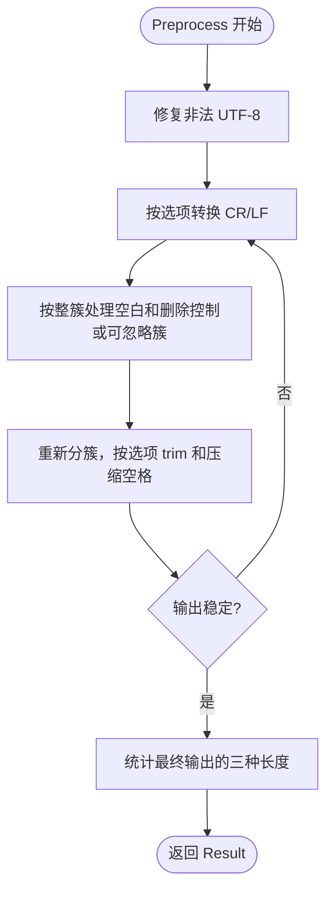

# displaytext

提供展示文本预处理；长度检查由父包 validation.CheckDisplayText 提供，源自用户提供的 displaytext/preprocess.go。
使用根模块已有的 uniseg v0.4.7，不建立独立模块。无常驻资源，无需 cleanup。

```go
import (
    "github.com/jaggerzhuang1994/kratos-foundation/v2/pkg/validation/displaytext"
    "github.com/jaggerzhuang1994/kratos-foundation/v2/pkg/validation"
)

result := displaytext.Preprocess(" 你好\r\n👩‍💻 ", displaytext.Options{
    TrimWhitespace: true,
    NewlinesToSpace: true,
})
err := validation.CheckDisplayText(result.Output, validation.DisplayTextOptions{
    GraphemeLength: validation.LengthRange{Min: 1, Max: 20},
    UnicodeLength: validation.LengthRange{Min: 1, Max: 255},
})
if err != nil {
    // 由调用方处理，可使用 errors.Is 判断父包的 ErrDisplayText 系列错误。
    return err
}
// 使用 result.Output："你好 👩‍💻"
```

以上片段用于可返回 error 的调用函数中；等价可运行示例见 ../displaytext_test.go 的 ExampleCheckDisplayText。
Result 是本次调用的值，字符串不可变；调用方可修改自己的字段，不影响其他调用。
[CheckDisplayText](../README.md#展示文本检查) 直接测量传入字符串，不信任或使用调用方修改后的 Result 长度字段。

## 选项

- `TrimWhitespace`：删除首尾完全由 Unicode White_Space 码点组成的字素簇，包括空格、制表符、CR/LF、不换行空格、全角空格、行/段分隔符等；false 时不裁剪首尾。执行于转换和整簇删除之后，因此即使关闭换行/空白转换，开启 trim 仍会裁剪首尾空白。混合了组合符或变体选择符的簇完整保留。
- `CollapseSpaces`：压缩连续、独立的普通空格簇 U+0020。不会跨越其他字符。
- `NewlinesToSpace`：连续 CR/LF 转成一个普通空格；false 时不转换；首尾换行仍可被 TrimWhitespace 裁剪。这里换行仅指原始需求的 CR/LF。
- `WhitespaceToSpace`：全为 Unicode White_Space 的字素簇转成一个普通空格；false 时保留。CR/LF 优先由 NewlinesToSpace 控制。NEL、行分隔符 U+2028、段分隔符 U+2029 属于本选项。
- 选项零值全部 false，仍执行符合条件的整簇删除，但不做首尾 trim。

## 处理契约

1. 保留原始输入字节；处理副本中连续非法 UTF-8 字节替换为一个 U+FFFD。
2. 按选项处理连续 CR/LF。
3. 按扩展字素簇处理：优先保留关闭转换的 CR/LF；全空白簇按选项转换或保留；否则，仅当簇内每个码点均属于 Default_Ignorable_Code_Point 或 Cc 时删除整簇；其余簇不修改。
4. 重新分簇，按 TrimWhitespace 去除首尾**全为空白的簇**，按 CollapseSpaces 压缩连续独立普通空格簇（包括未被 trim 的首尾空格）。不逐码点 trim，避免拆开正常簇。
5. 重复至稳定，保证同一配置下输出幂等。每次变化只会减少字节长度，或将非 ASCII 空白改成普通空格，不会产生循环。极端构造输入可能触发多轮扫描，因此不承诺整体 O(n)。
6. 在最终输出上重新统计长度：UTF-8 字节数、Unicode 码点数、EGC 数。不是 UTF-16 长度或终端显示宽度。

`Original` 在二次调用时自然变成此次输入；幂等仅指输出及其长度。

保留正常簇内的 ZWJ、ZWNJ、变体选择符和组合附加符，包括 `❤️`、`👩‍💻`。例如 `a\u200Db` 原样保留，而 `a\u200Bb` 变成 `ab`。

为保护完整簇，`" \uFE0Fa"` 会原样保留（前面的空格与 VS16 同簇）；`"a\u00A0\u0301b"` 的不换行空格也不会被替换。此行为是保留原始“全部码点满足条件”的语义，并非遗漏。不会执行 NFC/NFKC。

固定 Unicode 15.0.0 和 uniseg v0.4.7，属性表不依赖 Go 标准库所采用的 Unicode 版本。若升级 Unicode，需同步更新分段库、属性表及测试。此实现未声称支持后续版本新增的分段规则。

## 返回值

```go
type Result struct {
    Original       string
    Output         string
    ByteLength     int
    UnicodeLength  int
    GraphemeLength int
}
```



## 验证

在仓库根目录运行：

```sh
make test vet lint GO_MODULE_DIRS=./pkg/validation
go test ./pkg/validation/displaytext -run '^$' -fuzz=FuzzPreprocess -fuzztime=10s -parallel=1
```

本包测试覆盖所有选项组合、整簇保留、非法 UTF-8、幂等及可运行示例；长度检查及错误识别测试位于父包。

## 网页复制与内容保留

以尽量保留内容为优先时，建议仅启用 `Options{TrimWhitespace: true}`。
这会清理首尾全空白簇，同时保留正文换行、缩进和连续空格；单行名称字段再按需开启其余转换。

回归测试覆盖可见前后缀（项目符号、星号、引号、括号）、中日韩及其他语言、组合附加符、
波斯文 ZWNJ、文字中的 ZWJ、emoji 家庭/肤色/旗帜/键帽/标签序列，以及 URL、邮箱、代码符号。
这些样本在全部 16 种选项组合下保持原文。另覆盖复制带入的 BOM、零宽空格、软连字符、
方向控制符、各种换行、非法 UTF-8、纯不可见输入和混合字素边界。

不自动删除可见符号，不解码 HTML 实体，也不去掉 HTML 标签；不会进行 NFC/NFKC 转换。
当前规则仍会删除独立的零宽空格、软连字符和方向控制符；这些字符也可能有排版意义，
因此该方法适合展示字段清理，不承诺保留富文本排版或任意文本的全部语义。
测试覆盖具体场景与不变量，不能穷尽所有 Unicode 输入或推断用户意图。
